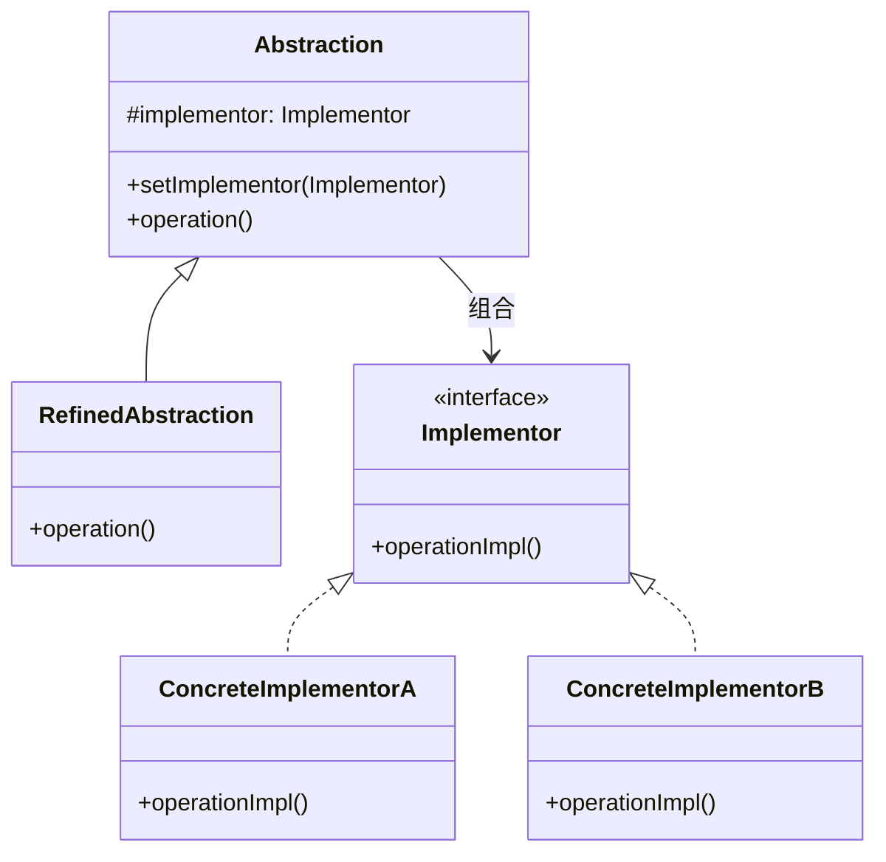

# 桥接模式（Bridge Pattern）

> 将抽象部分与实现部分分离，使它们可以独立变化

---

## 📋 基本信息

- **类型**: 结构型模式
- **难度**: ⭐⭐⭐⭐
- **使用频率**: ⭐⭐⭐
- **关键词**: 抽象与实现分离、多维度变化

---

## 🎯 模式意图

**核心思想**：将抽象部分与实现部分分离，使它们可以独立变化，从而实现系统的解耦和灵活扩展。

**解决的问题**：
- 当一个类存在两个独立变化的维度，且这两个维度都需要进行扩展时
- 当需要避免抽象部分和实现部分之间的紧耦合关系时
- 当希望通过组合而非继承来扩展系统功能时

**适用场景**：
- 🖨️ **跨平台应用**：如不同操作系统下的图形界面组件
- 📱 **设备驱动程序**：同一功能在不同硬件上的实现
- 🎨 **图形绘制系统**：抽象图形与具体绘制实现的分离
- 🏗️ **业务规则引擎**：抽象规则与具体规则实现的分离
- 🧩 **插件架构**：核心系统与插件实现的分离

## 🏗️ UML类图



**类图说明**：
- `Abstraction`：抽象部分，定义抽象接口并维护一个指向Implementor对象的引用
- `RefinedAbstraction`：扩展Abstraction的接口
- `Implementor`：实现部分的接口，提供基本操作
- `ConcreteImplementor`：实现Implementor接口，给出具体实现

## 💻 代码实现

### 基础实现

```java
// 实现部分接口
public interface Implementor {
    void operationImpl();
}

// 具体实现A
public class ConcreteImplementorA implements Implementor {
    @Override
    public void operationImpl() {
        System.out.println("具体实现A的操作");
    }
}

// 具体实现B
public class ConcreteImplementorB implements Implementor {
    @Override
    public void operationImpl() {
        System.out.println("具体实现B的操作");
    }
}

// 抽象部分
public abstract class Abstraction {
    protected Implementor implementor;

    public Abstraction(Implementor implementor) {
        this.implementor = implementor;
    }

    public void setImplementor(Implementor implementor) {
        this.implementor = implementor;
    }

    public abstract void operation();
}

// 扩展抽象部分
public class RefinedAbstraction extends Abstraction {
    public RefinedAbstraction(Implementor implementor) {
        super(implementor);
    }

    @Override
    public void operation() {
        System.out.println("扩展抽象化操作");
        implementor.operationImpl();
    }
}

// 客户端代码
public class Client {
    public static void main(String[] args) {
        // 创建实现部分
        Implementor implA = new ConcreteImplementorA();
        Implementor implB = new ConcreteImplementorB();

        // 创建抽象部分并设置实现
        Abstraction abstraction = new RefinedAbstraction(implA);
        abstraction.operation();

        // 动态切换实现
        abstraction.setImplementor(implB);
        abstraction.operation();
    }
}
```

### 实际应用示例：图形绘制系统

```java
// 实现部分：颜色接口
public interface Color {
    String getColor();
}

// 具体颜色实现
public class Red implements Color {
    @Override
    public String getColor() {
        return "红色";
    }
}

public class Blue implements Color {
    @Override
    public String getColor() {
        return "蓝色";
    }
}

// 抽象部分：形状
public abstract class Shape {
    protected Color color;

    public Shape(Color color) {
        this.color = color;
    }

    public abstract String draw();
}

// 具体形状
public class Circle extends Shape {
    public Circle(Color color) {
        super(color);
    }

    @Override
    public String draw() {
        return String.format("绘制%s圆形", color.getColor());
    }
}

public class Square extends Shape {
    public Square(Color color) {
        super(color);
    }

    @Override
    public String draw() {
        return String.format("绘制%s正方形", color.getColor());
    }
}

// 客户端使用
public class DrawingClient {
    public static void main(String[] args) {
        Shape redCircle = new Circle(new Red());
        Shape blueSquare = new Square(new Blue());

        System.out.println(redCircle.draw());  // 绘制红色圆形
        System.out.println(blueSquare.draw()); // 绘制蓝色正方形
    }
}
```

## 🔍 源码应用

### Java核心库
- **`java.sql.Driver`**：数据库驱动接口作为Implementor，不同数据库厂商提供具体实现
- **`java.awt.Graphics`**：图形绘制抽象与具体实现的分离
- **`javax.swing.JTable`**：表格组件与数据模型的桥接

### JDBC架构
JDBC是桥接模式的经典应用：
- `Driver`接口：Implementor角色
- 各数据库厂商的Driver实现：ConcreteImplementor
- `Connection`接口：Abstraction角色
- 具体数据库连接：RefinedAbstraction

```java
// JDBC中的桥接模式应用
Class.forName("com.mysql.cj.jdbc.Driver");
Connection conn = DriverManager.getConnection(url, user, password);
Statement stmt = conn.createStatement();
ResultSet rs = stmt.executeQuery("SELECT * FROM users");
```

### Spring框架
- **`org.springframework.jdbc.core.JdbcOperations`**：JDBC操作抽象
- **`org.springframework.jdbc.core.JdbcTemplate`**：具体实现
- **`org.springframework.transaction.PlatformTransactionManager`**：事务管理抽象

## ⚠️ 注意事项

1. **识别变化维度**：正确识别系统中的两个独立变化维度是使用桥接模式的关键

2. **避免过度设计**：如果系统仅有一个变化维度，不需要使用桥接模式

3. **接口稳定性**：Implementor接口应保持相对稳定，频繁修改会影响所有具体实现

4. **组合优于继承**：桥接模式通过组合而非继承实现解耦，符合合成复用原则

5. **抽象层设计**：抽象层应设计得足够稳定，避免频繁修改抽象接口

6. **实现透明性**：客户端不应知道具体实现类，只应通过抽象层访问

## 🎓 最佳实践

1. **设计接口时考虑桥接**：当设计可能有多种实现方式的接口时，预留桥接模式的扩展空间

2. **动态切换实现**：利用桥接模式的特性，可以在运行时动态切换不同的实现

```java
// 动态切换实现示例
Abstraction abstraction = new RefinedAbstraction(new ConcreteImplementorA());
abstraction.operation();

// 运行时切换到另一种实现
abstraction.setImplementor(new ConcreteImplementorB());
abstraction.operation();
```

3. **与依赖注入结合**：在Spring等容器中，可以通过依赖注入配置不同的实现

4. **多层桥接**：复杂系统可以使用多层桥接，每层处理一个独立的变化维度

5. **命名规范**：抽象部分以业务领域命名，实现部分以技术实现命名

## 📚 相关模式

- **抽象工厂模式**：可以与桥接模式结合使用，抽象工厂可以创建和配置桥接模式的实现对象
- **适配器模式**：桥接模式是为了分离抽象与实现以便独立扩展，而适配器模式是为了使接口不兼容的类能够协同工作
- **策略模式**：策略模式关注算法的替换，而桥接模式关注抽象与实现的解耦
- **装饰器模式**：装饰器模式增强对象功能，桥接模式分离抽象与实现
- **组合模式**：可以与桥接模式组合使用，构建复杂的对象结构

