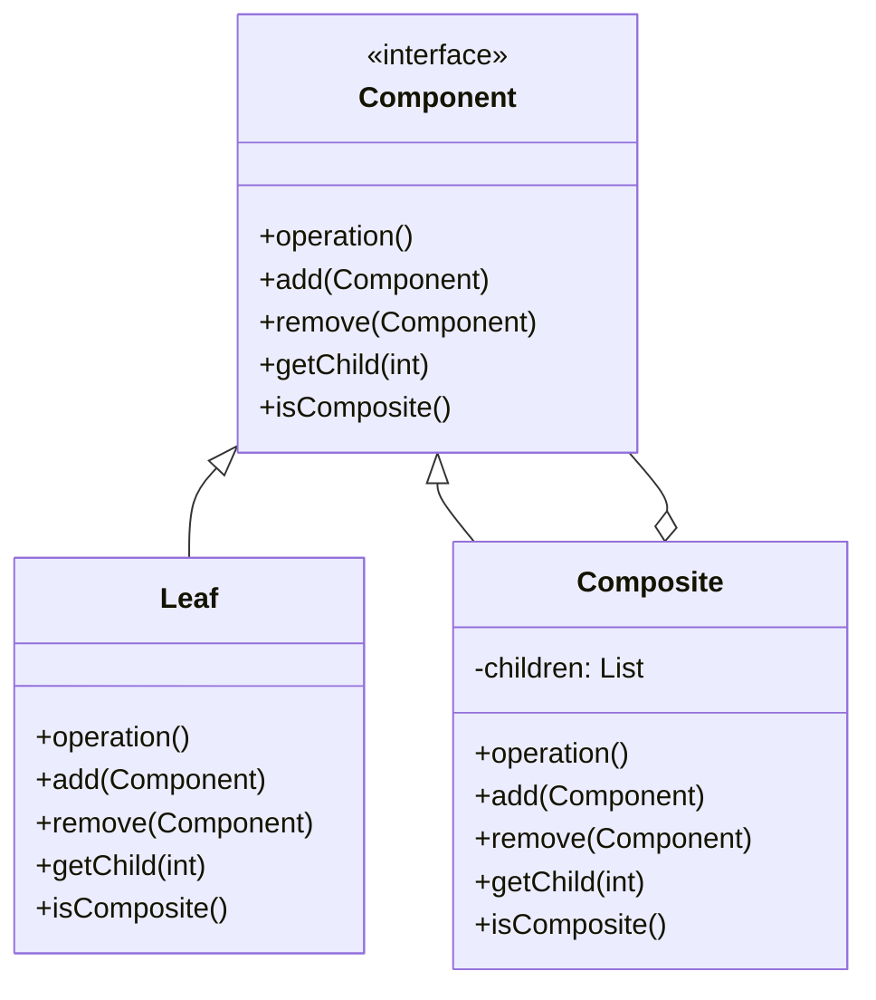

# 组合模式（Composite Pattern）

> 将对象组合成树形结构表示"部分-整体"层次结构

---

## 📋 基本信息

- **类型**: 结构型模式
- **难度**: ⭐⭐⭐
- **使用频率**: ⭐⭐⭐⭐
- **关键词**: 树形结构、递归遍历、统一接口

---

## 🎯 模式意图

**核心思想**：将对象组合成树形结构以表示"部分-整体"的层次结构，使得用户对单个对象和组合对象的使用具有一致性。

**解决的问题**：
- 如何表示对象的部分-整体层次结构
- 如何让客户端统一对待单个对象和组合对象
- 如何简化客户端代码，使其无需区分对象是单个还是组合

**适用场景**：
- 🌳 **树形结构数据**：如文件系统、组织架构、XML/JSON文档结构
- 📊 **层级菜单**：应用程序中的多级菜单系统
- 🧩 **UI组件库**：如Swing中的容器组件和叶子组件
- 📁 **文件系统**：文件夹和文件的层次结构
- 🏢 **组织结构**：公司部门与员工的层次关系
- 📝 **文档编辑器**：段落、句子、单词等组成的文档结构

## 🏗️ UML类图



**类图说明**：
- `Component`：抽象组件接口，定义了叶子节点和组合节点的共同操作
- `Leaf`：叶子节点，没有子节点，实现了Component接口的基本操作
- `Composite`：组合节点，包含子组件，可以是叶子节点或其他组合节点

## 💻 代码实现

### 基础实现

```java
import java.util.ArrayList;
import java.util.List;

// 抽象组件
public abstract class Component {
    protected String name;

    public Component(String name) {
        this.name = name;
    }

    public abstract void operation(int depth);
    public abstract void add(Component component);
    public abstract void remove(Component component);
    public abstract Component getChild(int index);
    public abstract boolean isComposite();
}

// 叶子节点
public class Leaf extends Component {
    public Leaf(String name) {
        super(name);
    }

    @Override
    public void operation(int depth) {
        // 打印深度和节点名称
        StringBuilder sb = new StringBuilder();
        for (int i = 0; i < depth; i++) {
            sb.append("-");
        }
        System.out.println(sb.toString() + name);
    }

    @Override
    public void add(Component component) {
        // 叶子节点不支持添加操作
        throw new UnsupportedOperationException("叶子节点不支持添加操作");
    }

    @Override
    public void remove(Component component) {
        // 叶子节点不支持删除操作
        throw new UnsupportedOperationException("叶子节点不支持删除操作");
    }

    @Override
    public Component getChild(int index) {
        // 叶子节点没有子节点
        throw new UnsupportedOperationException("叶子节点没有子节点");
    }

    @Override
    public boolean isComposite() {
        return false;
    }
}

// 组合节点
public class Composite extends Component {
    private List<Component> children = new ArrayList<>();

    public Composite(String name) {
        super(name);
    }

    @Override
    public void operation(int depth) {
        // 打印深度和节点名称
        StringBuilder sb = new StringBuilder();
        for (int i = 0; i < depth; i++) {
            sb.append("-");
        }
        System.out.println(sb.toString() + name);

        // 递归调用子节点的操作
        for (Component child : children) {
            child.operation(depth + 1);
        }
    }

    @Override
    public void add(Component component) {
        children.add(component);
    }

    @Override
    public void remove(Component component) {
        children.remove(component);
    }

    @Override
    public Component getChild(int index) {
        return children.get(index);
    }

    @Override
    public boolean isComposite() {
        return true;
    }
}

// 客户端代码
public class Client {
    public static void main(String[] args) {
        // 创建根节点
        Component root = new Composite("根节点");

        // 创建子节点
        Component branch1 = new Composite("分支1");
        Component branch2 = new Composite("分支2");

        // 创建叶子节点
        Component leaf1 = new Leaf("叶子1");
        Component leaf2 = new Leaf("叶子2");
        Component leaf3 = new Leaf("叶子3");

        // 构建树形结构
        root.add(branch1);
        root.add(branch2);

        branch1.add(leaf1);
        branch1.add(leaf2);
        branch2.add(leaf3);

        // 遍历树形结构
        System.out.println("树形结构遍历结果：");
        root.operation(1);
    }
}
```

### 实际应用示例：文件系统

```java
import java.util.ArrayList;
import java.util.List;

// 文件系统组件抽象类
public abstract class FileSystemComponent {
    protected String name;

    public FileSystemComponent(String name) {
        this.name = name;
    }

    public abstract void display(int depth);
    public abstract long getSize();
    public abstract void add(FileSystemComponent component);
    public abstract void remove(FileSystemComponent component);
    public abstract FileSystemComponent getChild(int index);
}

// 文件（叶子节点）
public class File extends FileSystemComponent {
    private long size;

    public File(String name, long size) {
        super(name);
        this.size = size;
    }

    @Override
    public void display(int depth) {
        StringBuilder sb = new StringBuilder();
        for (int i = 0; i < depth; i++) {
            sb.append("  ");
        }
        System.out.println(sb.toString() + "📄 " + name + " (" + size + " bytes)");
    }

    @Override
    public long getSize() {
        return size;
    }

    @Override
    public void add(FileSystemComponent component) {
        throw new UnsupportedOperationException("文件不支持添加操作");
    }

    @Override
    public void remove(FileSystemComponent component) {
        throw new UnsupportedOperationException("文件不支持删除操作");
    }

    @Override
    public FileSystemComponent getChild(int index) {
        throw new UnsupportedOperationException("文件没有子节点");
    }
}

// 文件夹（组合节点）
public class Directory extends FileSystemComponent {
    private List<FileSystemComponent> children = new ArrayList<>();

    public Directory(String name) {
        super(name);
    }

    @Override
    public void display(int depth) {
        StringBuilder sb = new StringBuilder();
        for (int i = 0; i < depth; i++) {
            sb.append("  ");
        }
        System.out.println(sb.toString() + "📁 " + name);

        // 递归显示子节点
        for (FileSystemComponent child : children) {
            child.display(depth + 1);
        }
    }

    @Override
    public long getSize() {
        // 计算所有子节点的总大小
        long totalSize = 0;
        for (FileSystemComponent child : children) {
            totalSize += child.getSize();
        }
        return totalSize;
    }

    @Override
    public void add(FileSystemComponent component) {
        children.add(component);
    }

    @Override
    public void remove(FileSystemComponent component) {
        children.remove(component);
    }

    @Override
    public FileSystemComponent getChild(int index) {
        return children.get(index);
    }
}

// 客户端使用
public class FileSystemClient {
    public static void main(String[] args) {
        // 创建文件夹结构
        Directory root = new Directory("根目录");
        Directory docs = new Directory("文档");
        Directory pics = new Directory("图片");

        // 创建文件
        File readme = new File("README.md", 1024);
        File resume = new File("简历.pdf", 204800);
        File photo = new File("照片.jpg", 1536000);

        // 构建文件系统结构
        root.add(docs);
        root.add(pics);
        root.add(readme);

        docs.add(resume);
        pics.add(photo);

        // 显示文件系统结构
        System.out.println("文件系统结构：");
        root.display(0);

        // 计算总大小
        System.out.println("总大小：" + root.getSize() + " bytes");
    }
}
```

## 🔍 源码应用

### Java集合框架
- **`java.util.Collection`**：所有集合的根接口
- **`java.util.List`** 和 **`java.util.Set`**：Composite角色
- **`java.util.ArrayList`** 和 **`java.util.HashSet`**：具体的Composite实现
- 集合中的元素：Leaf角色

### Swing GUI组件
Swing中的组件模型是组合模式的经典实现：
- **`javax.swing.JComponent`**：Component角色
- **`javax.swing.JPanel`**：Composite角色（可以包含其他组件）
- **`javax.swing.JButton`**、**`javax.swing.JLabel`**：Leaf角色

```java
// Swing中的组合模式应用
JFrame frame = new JFrame("组合模式示例");
JPanel panel = new JPanel(); // 组合组件
JButton button1 = new JButton("按钮1"); // 叶子组件
JButton button2 = new JButton("按钮2"); // 叶子组件

panel.add(button1); // 向组合组件添加叶子组件
panel.add(button2);
frame.add(panel);
```

### MyBatis
MyBatis中的SQL节点配置使用了组合模式：
- **`SqlNode`**：Component角色
- **`MixedSqlNode`**：Composite角色
- **`TextSqlNode`**、**`IfSqlNode`**：Leaf角色

### Spring框架
- **`org.springframework.beans.factory.config.BeanDefinition`**：组件抽象
- **`org.springframework.beans.factory.support.AbstractBeanDefinition`**：叶子节点
- **`org.springframework.beans.factory.support.RootBeanDefinition`**：组合节点

## ⚠️ 注意事项

1. **递归操作风险**：组合模式通常涉及递归操作，需注意避免栈溢出

2. **类型检查**：在客户端中可能需要对组合对象和叶子对象进行类型检查

3. **一致性设计**：确保Component接口设计足够通用，能够支持叶子和组合对象的所有必要操作

4. **删除操作谨慎**：删除组合对象会同时删除其所有子对象，需谨慎操作

5. **空迭代处理**：组合对象应妥善处理空集合情况，避免NullPointerException

6. **性能考虑**：对于大型树形结构，递归遍历可能影响性能，可考虑缓存或迭代器模式优化

7. **子节点管理**：明确子节点的所有权关系，避免多个父节点引用同一子节点

## 🎓 最佳实践

1. **透明性优先**：优先考虑接口的透明性，即使某些操作对叶子节点没有意义

2. **安全考虑**：如果安全性更重要，可以在叶子节点中对不支持的操作抛出异常

```java
@Override
public void add(Component component) {
    throw new UnsupportedOperationException("叶子节点不支持添加操作");
}
```

3. **使用迭代器遍历**：结合迭代器模式遍历组合对象的子节点

```java
public Iterator<Component> createIterator() {
    return children.iterator();
}
```

4. **缓存组合结果**：对于频繁访问的组合结构，可以缓存计算结果

5. **提供访问者模式支持**：对于复杂的组合结构，考虑使用访问者模式处理节点操作

6. **使用工厂方法创建组件**：通过工厂方法统一创建叶子和组合对象，确保结构一致性

7. **限制组合深度**：在实际应用中根据需求限制组合结构的最大深度

## 📚 相关模式

- **迭代器模式**：通常与组合模式一起使用，提供对子组件的遍历能力
- **装饰器模式**：可以装饰组合中的单个对象或整个组合
- **访问者模式**：当需要对组合结构进行复杂操作时，可以使用访问者模式
- **享元模式**：可以帮助实现组合模式中的叶子节点共享
- **建造者模式**：可以用于构建复杂的组合对象结构
- **命令模式**：可以用于实现对组合对象的操作撤销/重做功能

