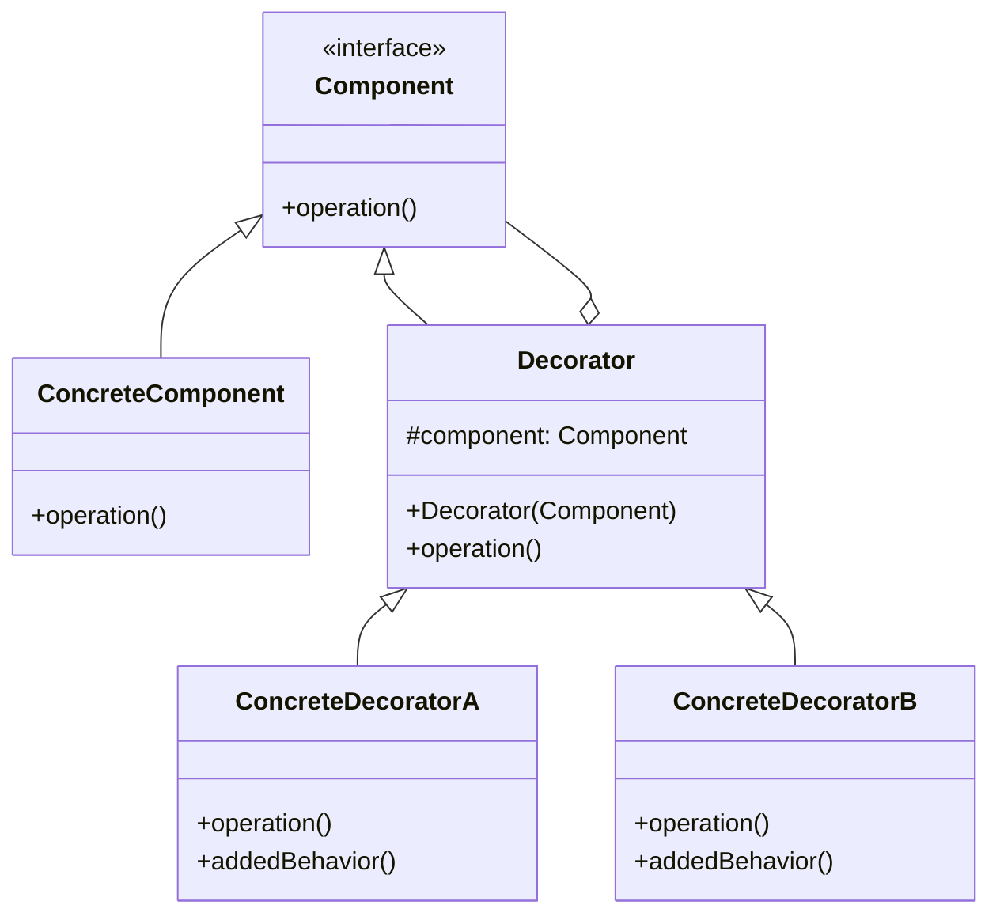

# 装饰器模式（Decorator Pattern）

> 动态地给对象添加额外的职责，比继承更灵活

---

## 📋 基本信息

- **类型**: 结构型模式
- **难度**: ⭐⭐⭐
- **使用频率**: ⭐⭐⭐⭐⭐
- **关键词**: 动态扩展、透明包装、递归组合

---

## 🎯 模式意图

**核心思想**：动态地给一个对象添加一些额外的职责，就增加功能来说，装饰器模式比生成子类更为灵活。

**解决的问题**：
- 如何在不修改现有类结构的情况下，为对象添加新功能
- 如何避免类爆炸问题，当需要多种组合功能时
- 如何实现功能的动态添加和撤销

**适用场景**：
- ✨ **功能增强**：如IO流中的缓冲、加密、压缩功能
- 🎨 **UI组件装饰**：如为按钮添加边框、阴影、颜色等效果
- 🔒 **权限控制**：动态为对象添加不同的访问权限
- 📊 **数据过滤**：对数据进行多层过滤和转换
- 🕵️ **日志记录**：为方法调用添加日志记录功能
- ⏱️ **性能监控**：为方法添加执行时间统计

## 🏗️ UML类图



**类图说明**：
- `Component`：抽象组件接口，定义对象的基本操作
- `ConcreteComponent`：具体组件，实现了Component接口
- `Decorator`：装饰器抽象类，持有一个Component对象的引用
- `ConcreteDecorator`：具体装饰器，为组件添加新功能

## 💻 代码实现

### 基础实现

```java
// 抽象组件
public interface Component {
    void operation();
}

// 具体组件
public class ConcreteComponent implements Component {
    @Override
    public void operation() {
        System.out.println("执行具体组件的操作");
    }
}

// 装饰器抽象类
public abstract class Decorator implements Component {
    protected Component component;

    public Decorator(Component component) {
        this.component = component;
    }

    @Override
    public void operation() {
        component.operation();
    }
}

// 具体装饰器A
public class ConcreteDecoratorA extends Decorator {
    public ConcreteDecoratorA(Component component) {
        super(component);
    }

    @Override
    public void operation() {
        System.out.println("ConcreteDecoratorA 前置操作");
        super.operation();
        System.out.println("ConcreteDecoratorA 后置操作");
        addedBehavior();
    }

    // 新增功能
    public void addedBehavior() {
        System.out.println("ConcreteDecoratorA 新增行为");
    }
}

// 具体装饰器B
public class ConcreteDecoratorB extends Decorator {
    public ConcreteDecoratorB(Component component) {
        super(component);
    }

    @Override
    public void operation() {
        System.out.println("ConcreteDecoratorB 前置操作");
        super.operation();
        System.out.println("ConcreteDecoratorB 后置操作");
        addedBehavior();
    }

    // 新增功能
    public void addedBehavior() {
        System.out.println("ConcreteDecoratorB 新增行为");
    }
}

// 客户端代码
public class Client {
    public static void main(String[] args) {
        // 创建具体组件
        Component component = new ConcreteComponent();
        System.out.println("===== 未装饰的组件 ====");
        component.operation();

        // 用装饰器A装饰组件
        Component decoratorA = new ConcreteDecoratorA(component);
        System.out.println("\n===== 装饰器A装饰后的组件 ====");
        decoratorA.operation();

        // 用装饰器B装饰已被装饰的组件
        Component decoratorB = new ConcreteDecoratorB(decoratorA);
        System.out.println("\n===== 装饰器B装饰后的组件 ====");
        decoratorB.operation();

        // 组合多个装饰器
        Component multiDecorator = new ConcreteDecoratorB(new ConcreteDecoratorA(component));
        System.out.println("\n===== 多个装饰器组合后的组件 ====");
        multiDecorator.operation();
    }
}
```

### 实际应用示例：数据压缩与加密

```java
import java.io.ByteArrayOutputStream;
import java.io.IOException;
import java.util.Base64;

// 数据处理组件接口
public interface DataProcessor {
    byte[] process(byte[] data) throws IOException;
}

// 基础数据处理器
public class BaseDataProcessor implements DataProcessor {
    @Override
    public byte[] process(byte[] data) {
        System.out.println("处理原始数据，长度: " + data.length);
        return data;
    }
}

// 数据处理器装饰器
public abstract class DataProcessorDecorator implements DataProcessor {
    protected DataProcessor processor;

    public DataProcessorDecorator(DataProcessor processor) {
        this.processor = processor;
    }

    @Override
    public byte[] process(byte[] data) throws IOException {
        return processor.process(data);
    }
}

// 压缩装饰器
public class CompressionDecorator extends DataProcessorDecorator {
    public CompressionDecorator(DataProcessor processor) {
        super(processor);
    }

    @Override
    public byte[] process(byte[] data) throws IOException {
        data = super.process(data);
        System.out.println("压缩前数据长度: " + data.length);
        byte[] compressedData = compress(data);
        System.out.println("压缩后数据长度: " + compressedData.length);
        return compressedData;
    }

    // 简单压缩实现（实际应用中会使用GZIP等算法）
    private byte[] compress(byte[] data) {
        // 这里使用简单的模拟压缩
        ByteArrayOutputStream out = new ByteArrayOutputStream();
        // 仅作演示，实际压缩算法会更复杂
        out.write(data);
        return out.toByteArray();
    }
}

// 加密装饰器
public class EncryptionDecorator extends DataProcessorDecorator {
    public EncryptionDecorator(DataProcessor processor) {
        super(processor);
    }

    @Override
    public byte[] process(byte[] data) throws IOException {
        data = super.process(data);
        System.out.println("加密数据，长度: " + data.length);
        return encrypt(data);
    }

    // 使用Base64模拟加密（实际应用中会使用AES等加密算法）
    private byte[] encrypt(byte[] data) {
        return Base64.getEncoder().encode(data);
    }
}

// 客户端使用
public class DataProcessorClient {
    public static void main(String[] args) throws IOException {
        // 创建基础数据处理器
        DataProcessor processor = new BaseDataProcessor();

        // 仅压缩数据
        DataProcessor compressedProcessor = new CompressionDecorator(processor);

        // 先压缩再加密
        DataProcessor secureProcessor = new EncryptionDecorator(
            new CompressionDecorator(processor)
        );

        // 原始数据
        byte[] data = "这是一段需要处理的原始数据，可能包含敏感信息".getBytes();

        System.out.println("===== 仅压缩处理 ====");
        compressedProcessor.process(data);

        System.out.println("\n===== 压缩+加密处理 ====");
        secureProcessor.process(data);
    }
}
```

## 🔍 源码应用

### Java IO流
Java IO中的装饰器模式应用最为经典：
- **`InputStream`/`OutputStream`**：Component角色
- **`FileInputStream`/`FileOutputStream`**：ConcreteComponent角色
- **`FilterInputStream`/`FilterOutputStream`**：Decorator角色
- **`BufferedInputStream`/`BufferedOutputStream`**：具体装饰器（提供缓冲功能）
- **`DataInputStream`/`DataOutputStream`**：具体装饰器（提供数据类型转换功能）
- **`GZIPInputStream`/`GZIPOutputStream`**：具体装饰器（提供压缩功能）

```java
// Java IO中的装饰器模式应用
try (
    InputStream fis = new FileInputStream("data.txt");
    BufferedInputStream bis = new BufferedInputStream(fis); // 添加缓冲功能
    DataInputStream dis = new DataInputStream(bis); // 添加数据类型转换功能
) {
    // 读取数据
    String data = dis.readUTF();
    int number = dis.readInt();
}
```

### Java AWT/Swing
- **`Component`**：抽象组件
- **`JComponent`**：具体组件
- **`Border`**：装饰器接口
- **`LineBorder`**、**`BevelBorder`**、**`CompoundBorder`**：具体装饰器

```java
// Swing中的装饰器模式应用
JButton button = new JButton("点击我");
// 添加边框装饰
button.setBorder(BorderFactory.createCompoundBorder(
    BorderFactory.createLineBorder(Color.RED, 2),
    BorderFactory.createBevelBorder(BevelBorder.RAISED)
));
```

### Spring框架
- **`TransactionAwareCacheDecorator`**：为缓存添加事务支持
- **`HibernateInterceptor`**：为方法调用添加Hibernate会话管理
- **`AsyncAnnotationBeanPostProcessor`**：为方法添加异步执行功能

### MyBatis
- **`org.apache.ibatis.cache.decorators`** 包下的缓存装饰器
- **`LruCache`**：添加LRU缓存淘汰策略
- **`LoggingCache`**：添加缓存日志功能
- **`SynchronizedCache`**：添加缓存同步功能

## ⚠️ 注意事项

1. **接口一致性**：装饰器必须与被装饰的组件实现相同的接口

2. **装饰顺序**：多个装饰器的组合顺序可能会影响最终结果

3. **避免过度装饰**：过多的装饰器组合可能导致系统复杂度增加和性能下降

4. **不要依赖装饰器的具体类型**：客户端代码应针对抽象组件编程，而不是具体装饰器

5. **装饰器可以嵌套**：可以将多个装饰器组合使用，形成装饰链

6. **不要在装饰器中改变原始组件的状态**：装饰器应仅添加新功能，而非修改原有功能

7. **考虑装饰器的性能影响**：某些装饰器（如同步、日志）可能会引入性能开销

## 🎓 最佳实践

1. **保持单一职责**：每个装饰器只添加一种功能

2. **透明装饰**：装饰后的对象应与原始对象具有相同的接口

3. **支持任意组合**：设计装饰器时应允许它们以任意顺序组合

4. **提供合理的默认实现**：在抽象装饰器类中提供默认实现

```java
public abstract class Decorator implements Component {
    protected Component component;

    public Decorator(Component component) {
        this.component = component;
    }

    // 默认实现直接调用组件的operation方法
    @Override
    public void operation() {
        component.operation();
    }
}
```

5. **考虑使用工厂模式创建装饰器组合**：对于复杂的装饰器组合，可以使用工厂模式简化创建过程

```java
public class DataProcessorFactory {
    public static DataProcessor createSecureProcessor() {
        return new EncryptionDecorator(
            new CompressionDecorator(
                new BaseDataProcessor()
            )
        );
    }
}
```

6. **为装饰器提供撤销机制**：在某些场景下，可以为装饰器提供撤销功能

7. **使用装饰器代替子类化**：当需要为类添加多种可选功能时，装饰器比创建多个子类更灵活

## 📚 相关模式

- **适配器模式**：装饰器不改变接口，而适配器会改变接口
- **组合模式**：装饰器是对单个对象的包装，而组合是对对象集合的包装
- **代理模式**：装饰器为对象添加功能，而代理控制对对象的访问
- **策略模式**：装饰器允许动态添加功能，而策略允许动态替换算法
- **享元模式**：两者都可以用于对象功能的增强，但目的不同
- **职责链模式**：装饰器链与职责链类似，但装饰器链中的每个对象都处理请求，而职责链中只有一个对象处理请求

