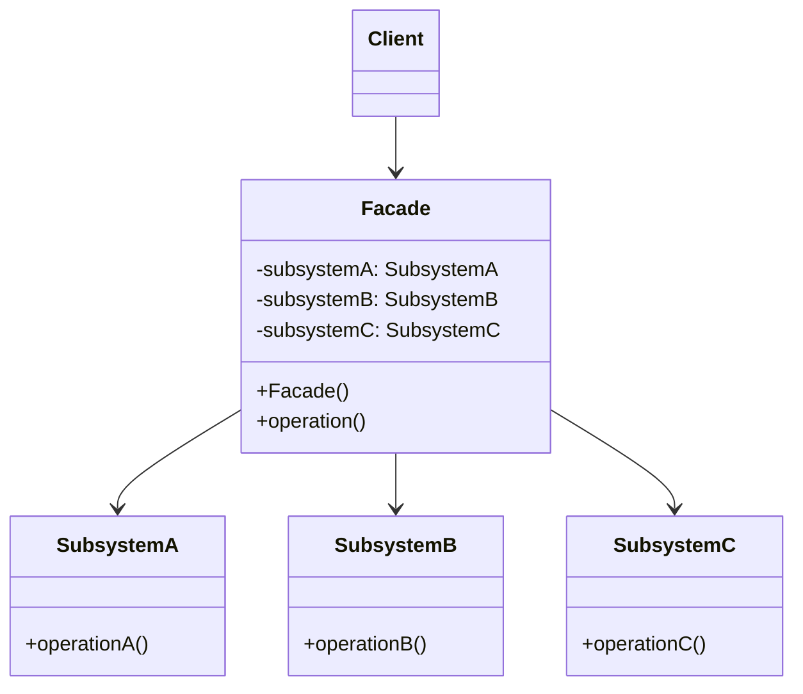

# 外观模式（Facade Pattern）

> 为子系统提供统一的高层接口，简化客户端调用

---

## 📋 基本信息

- **类型**: 结构型模式
- **难度**: ⭐⭐
- **使用频率**: ⭐⭐⭐⭐
- **关键词**: 简化接口、子系统封装、降低耦合

---

## 🎯 模式意图

**核心思想**：为子系统中的一组接口提供一个统一的高层接口，使得子系统更容易使用。外观模式定义了一个高层接口，这个接口使得这一子系统更加容易使用。

**解决的问题**：
- 如何简化复杂子系统的使用难度
- 如何降低客户端与子系统之间的耦合度
- 如何为复杂子系统提供一个统一的访问入口
- 如何隔离客户端与子系统的直接交互

**适用场景**：
- 🏢 **复杂系统**：当系统包含多个子系统，且子系统之间关系复杂时
- 🧩 **API设计**：为库或框架提供简洁易用的API接口
- 🔄 **版本迁移**：在系统升级或重构时，提供兼容旧系统的外观接口
- 🛡️ **分层架构**：在分层架构中，为下层组件提供统一的上层访问接口
- 📱 **客户端应用**：简化客户端与后台服务的交互
- 🌐 **微服务网关**：作为微服务架构的网关，统一对外提供服务

## 🏗️ UML类图



**类图说明**：
- `Facade`：外观类，提供统一的高层接口，知道哪些子系统负责处理请求
- `Subsystem`：子系统类，实现子系统的功能，不知道外观的存在
- `Client`：客户端，通过外观接口与子系统交互

## 💻 代码实现

### 基础实现

```java
// 子系统A
public class SubsystemA {
    public void operationA() {
        System.out.println("执行子系统A的操作");
    }
}

// 子系统B
public class SubsystemB {
    public void operationB() {
        System.out.println("执行子系统B的操作");
    }
}

// 子系统C
public class SubsystemC {
    public void operationC() {
        System.out.println("执行子系统C的操作");
    }
}

// 外观类
public class Facade {
    private SubsystemA subsystemA;
    private SubsystemB subsystemB;
    private SubsystemC subsystemC;

    public Facade() {
        subsystemA = new SubsystemA();
        subsystemB = new SubsystemB();
        subsystemC = new SubsystemC();
    }

    // 提供简化的接口
    public void simpleOperation() {
        System.out.println("外观类协调各子系统操作：");
        subsystemA.operationA();
        subsystemB.operationB();
        subsystemC.operationC();
    }

    // 可以提供多个不同的高层接口
    public void anotherOperation() {
        System.out.println("外观类提供的另一个操作：");
        subsystemB.operationB();
        subsystemC.operationC();
    }
}

// 客户端代码
public class Client {
    public static void main(String[] args) {
        // 不使用外观模式，客户端需要直接与多个子系统交互
        System.out.println("不使用外观模式：");
        SubsystemA subsystemA = new SubsystemA();
        SubsystemB subsystemB = new SubsystemB();
        SubsystemC subsystemC = new SubsystemC();
        subsystemA.operationA();
        subsystemB.operationB();
        subsystemC.operationC();

        // 使用外观模式，客户端只需要与外观交互
        System.out.println("\n使用外观模式：");
        Facade facade = new Facade();
        facade.simpleOperation();
        facade.anotherOperation();
    }
}
```

### 实际应用示例：家庭影院系统

```java
// 子系统：投影仪
public class Projector {
    public void on() {
        System.out.println("投影仪开启");
    }

    public void off() {
        System.out.println("投影仪关闭");
    }

    public void setInput(String input) {
        System.out.println("投影仪输入设置为：" + input);
    }

    public void zoom(int level) {
        System.out.println("投影仪变焦级别：" + level);
    }
}

// 子系统：音响
public class SoundSystem {
    public void on() {
        System.out.println("音响开启");
    }

    public void off() {
        System.out.println("音响关闭");
    }

    public void setVolume(int volume) {
        System.out.println("音响音量设置为：" + volume);
    }

    public void setInput(String input) {
        System.out.println("音响输入设置为：" + input);
    }
}

// 子系统：播放器
public class Player {
    public void on() {
        System.out.println("播放器开启");
    }

    public void off() {
        System.out.println("播放器关闭");
    }

    public void play(String media) {
        System.out.println("播放媒体：" + media);
    }

    public void pause() {
        System.out.println("暂停播放");
    }

    public void stop() {
        System.out.println("停止播放");
    }
}

// 子系统：灯光
public class Lights {
    public void dim(int level) {
        System.out.println("灯光调暗至：" + level + "%");
    }

    public void on() {
        System.out.println("灯光开启");
    }
}

// 外观类：家庭影院遥控器
public class HomeTheaterFacade {
    private Projector projector;
    private SoundSystem soundSystem;
    private Player player;
    private Lights lights;

    public HomeTheaterFacade(Projector projector, SoundSystem soundSystem, Player player, Lights lights) {
        this.projector = projector;
        this.soundSystem = soundSystem;
        this.player = player;
        this.lights = lights;
    }

    // 观看电影模式
    public void watchMovie(String movie) {
        System.out.println("===== 准备观看电影 ====");
        lights.dim(20);
        projector.on();
        projector.setInput("播放器");
        projector.zoom(10);
        soundSystem.on();
        soundSystem.setInput("播放器");
        soundSystem.setVolume(80);
        player.on();
        player.play(movie);
        System.out.println("===== 电影开始播放 ====");
    }

    // 暂停电影
    public void pauseMovie() {
        System.out.println("===== 暂停电影 ====");
        player.pause();
        lights.dim(50);
    }

    // 结束电影
    public void endMovie() {
        System.out.println("===== 结束电影 ====");
        player.stop();
        player.off();
        projector.off();
        soundSystem.off();
        lights.on();
        System.out.println("===== 电影播放结束 ====");
    }

    // 听音乐模式
    public void listenMusic(String music) {
        System.out.println("===== 准备听音乐 ====");
        lights.dim(60);
        soundSystem.on();
        soundSystem.setInput("播放器");
        soundSystem.setVolume(60);
        player.on();
        player.play(music);
        System.out.println("===== 音乐开始播放 ====");
    }
}

// 客户端代码
public class HomeTheaterClient {
    public static void main(String[] args) {
        // 创建子系统对象
        Projector projector = new Projector();
        SoundSystem soundSystem = new SoundSystem();
        Player player = new Player();
        Lights lights = new Lights();

        // 创建外观对象
        HomeTheaterFacade homeTheater = new HomeTheaterFacade(projector, soundSystem, player, lights);

        // 观看电影
        homeTheater.watchMovie("星际穿越");

        // 暂停电影
        homeTheater.pauseMovie();

        // 继续观看后结束
        homeTheater.watchMovie("星际穿越"); // 简化处理，实际应调用resume方法
        homeTheater.endMovie();

        // 听音乐
        homeTheater.listenMusic("经典钢琴曲");
    }
}
```

## 🔍 源码应用

### Java IO
- **`java.io.File`**：作为文件系统的外观，简化了复杂的文件操作
- **`java.nio.file.Paths`** 和 **`java.nio.file.Files`**：作为NIO文件系统的外观接口

### Spring框架
- **`org.springframework.context.ApplicationContext`**：作为Spring容器的外观，提供了对多个Bean管理子系统的统一访问
- **`org.springframework.jdbc.core.JdbcTemplate`**：作为JDBC操作的外观，简化了数据库访问
- **`org.springframework.web.client.RestTemplate`**：作为REST客户端的外观，简化了HTTP请求

```java
// Spring中的外观模式应用
ApplicationContext context = new ClassPathXmlApplicationContext("applicationContext.xml");
UserService userService = context.getBean(UserService.class);
userService.getUserById(1L);
```

### MyBatis
- **`org.apache.ibatis.session.SqlSession`**：作为MyBatis核心功能的外观接口
- **`org.apache.ibatis.session.SqlSessionFactory`**：作为SqlSession创建的外观

### Tomcat
- **`org.apache.catalina.connector.Request`** 和 **`Response`**：作为Servlet API的外观实现
- **`org.apache.catalina.startup.Tomcat`**：作为Tomcat服务器的外观类

### Slf4j
- **`org.slf4j.LoggerFactory`**：作为各种日志框架的外观，提供统一的日志接口

```java
// Slf4j外观模式应用
Logger logger = LoggerFactory.getLogger(MyClass.class);
logger.info("这是一条日志消息");
```

## ⚠️ 注意事项

1. **外观接口膨胀**：避免将所有子系统功能都添加到一个外观类中，导致外观接口过于庞大

2. **过度封装**：不要过度封装子系统，应允许客户端在需要时直接访问子系统

3. **单一职责**：每个外观类应保持单一职责，只封装特定功能或子系统组合

4. **双向依赖**：避免外观类与子系统之间形成双向依赖

5. **外观链**：复杂系统中可以创建多个外观类，形成外观链或外观层次结构

6. **不要在外观中添加业务逻辑**：外观应仅负责协调子系统，而非添加新的业务逻辑

7. **考虑线程安全**：如果多个线程可能同时访问外观，需要考虑线程安全问题

## 🎓 最佳实践

1. **最小知识原则**：客户端应只知道外观对象，而不知道子系统的存在

2. **分层外观**：对于大型系统，可以为不同层次创建不同的外观类

```java
// 数据访问层外观
public class DataAccessFacade { ... }

// 业务逻辑层外观
public class BusinessLogicFacade { ... }

// 表示层外观
public class PresentationFacade { ... }
```

3. **默认外观**：为最常用的子系统组合提供默认外观实现

4. **可配置外观**：允许客户端通过配置选择不同的子系统实现

5. **抽象外观**：为外观类定义抽象接口，以便在需要时替换不同的外观实现

```java
public interface Facade {
    void operation();
}

public class ConcreteFacade1 implements Facade {
    // 实现1
}

public class ConcreteFacade2 implements Facade {
    // 实现2
}
```

6. **延迟初始化**：在外观类中延迟初始化子系统对象，提高性能

```java
public class LazyFacade {
    private Subsystem subsystem;

    public void operation() {
        if (subsystem == null) {
            subsystem = new Subsystem(); // 延迟初始化
        }
        subsystem.operation();
    }
}
```

7. **不要滥用外观**：只有当子系统确实复杂且使用频繁时才使用外观模式

## 📚 相关模式

- **单例模式**：外观类通常设计为单例，确保全局只有一个外观实例
- **中介者模式**：外观模式关注于简化子系统访问，而中介者模式关注于协调子系统之间的通信
- **代理模式**：外观模式为子系统提供统一接口，而代理模式为单个对象提供替代访问
- **适配器模式**：外观模式为简化接口而设计，适配器模式为接口转换而设计
- **抽象工厂模式**：可以与外观模式结合使用，由抽象工厂创建子系统对象
- **组合模式**：外观模式与组合模式都可以简化客户端操作，但层次结构不同

