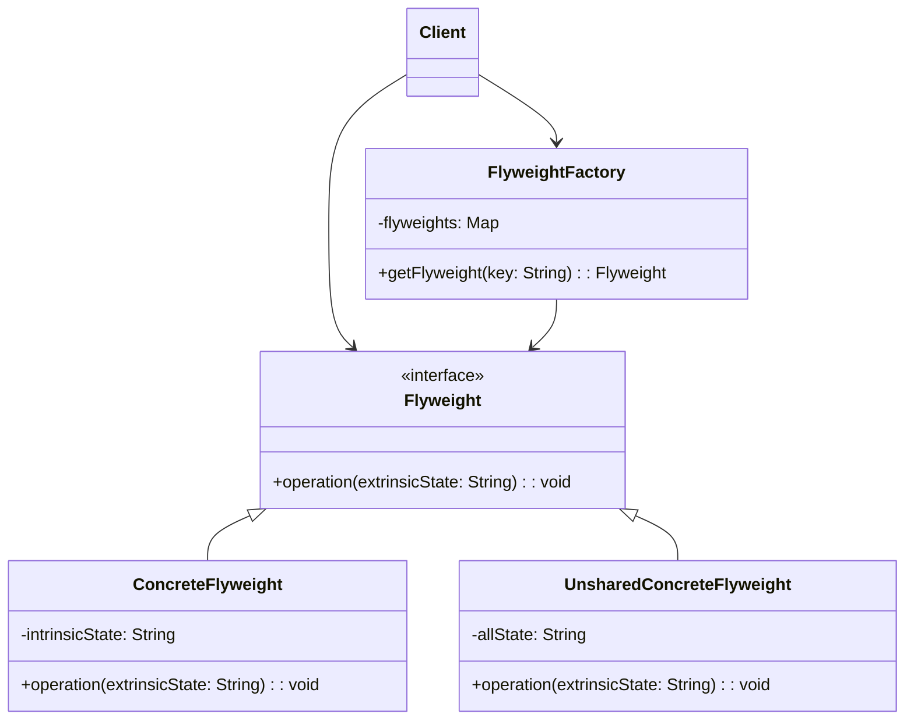

# 享元模式（Flyweight Pattern）

> 运用共享技术有效支持大量细粒度对象的复用

---

## 📋 基本信息

- **类型**: 结构型模式
- **难度**: ⭐⭐⭐⭐
- **使用频率**: ⭐⭐⭐
- **关键词**: 对象池、内部状态、外部状态

---

## 🎯 模式意图

**核心思想**：运用共享技术有效地支持大量细粒度的对象，避免大量相似对象的开销。享元模式通过共享已经存在的对象来大幅度减少需要创建的对象数量，从而降低内存占用和提高性能。

**解决的问题**：
- 如何在有大量相似对象时节省内存空间
- 如何避免对象创建和销毁的性能开销
- 如何管理共享对象的状态
- 如何平衡对象共享与对象独立性

**适用场景**：
- 🔢 **大量相似对象**：系统中存在大量细粒度对象，且这些对象大部分状态可以共享
- 📊 **内存受限**：在内存资源有限的环境中运行，需要优化内存使用
- 🎮 **游戏开发**：如游戏中的粒子系统、树木、建筑物等重复元素
- 📝 **文本编辑器**：字符对象的实现
- 🧩 **UI组件**：如按钮、图标等重复使用的界面元素
- 🌐 **数据库连接池**：共享数据库连接对象
- 🖨️ **打印机队列**：管理打印作业对象
- 📄 **文档处理**：如Word中的格式样式对象

## 🏗️ UML类图



**类图说明**：
- `Flyweight`：享元接口，声明一个接收外部状态并执行操作的方法
- `ConcreteFlyweight`：具体享元类，实现Flyweight接口，存储内部状态，是可共享的
- `UnsharedConcreteFlyweight`：非共享具体享元类，实现Flyweight接口，但不参与共享
- `FlyweightFactory`：享元工厂类，创建并管理享元对象，确保合理共享享元对象
- `Client`：客户端，维护对所有享元对象的引用，计算或存储享元对象的外部状态

**状态分类**：
- **内部状态(Intrinsic State)**：存储在享元对象内部，不会随环境变化而改变，是可以共享的状态
- **外部状态(Extrinsic State)**：随环境变化而改变，不可以共享的状态，由客户端维护

## 💻 代码实现

### 基础实现

```java
import java.util.HashMap;
import java.util.Map;

// 享元接口
interface Flyweight {
    void operation(String extrinsicState);
}

// 具体享元类
class ConcreteFlyweight implements Flyweight {
    private String intrinsicState;

    public ConcreteFlyweight(String intrinsicState) {
        this.intrinsicState = intrinsicState;
        System.out.println("创建具体享元对象，内部状态: " + intrinsicState);
    }

    @Override
    public void operation(String extrinsicState) {
        System.out.println("享元对象操作 - 内部状态: " + intrinsicState + ", 外部状态: " + extrinsicState);
    }
}

// 非共享具体享元类
class UnsharedConcreteFlyweight implements Flyweight {
    private String allState;

    public UnsharedConcreteFlyweight(String allState) {
        this.allState = allState;
        System.out.println("创建非共享享元对象，全部状态: " + allState);
    }

    @Override
    public void operation(String extrinsicState) {
        System.out.println("非共享享元对象操作 - 全部状态: " + allState + ", 外部状态: " + extrinsicState);
    }
}

// 享元工厂类
class FlyweightFactory {
    private Map<String, Flyweight> flyweights = new HashMap<>();

    // 获取享元对象
    public Flyweight getFlyweight(String key) {
        // 如果存在则返回已有的享元对象
        if (flyweights.containsKey(key)) {
            return flyweights.get(key);
        }
        // 如果不存在则创建新的享元对象并存储
        Flyweight flyweight = new ConcreteFlyweight(key);
        flyweights.put(key, flyweight);
        return flyweight;
    }

    // 获取享元对象数量
    public int getFlyweightCount() {
        return flyweights.size();
    }
}

// 客户端代码
public class Client {
    public static void main(String[] args) {
        FlyweightFactory factory = new FlyweightFactory();

        // 获取并使用享元对象
        Flyweight flyweight1 = factory.getFlyweight("A");
        flyweight1.operation("第一次调用");

        Flyweight flyweight2 = factory.getFlyweight("B");
        flyweight2.operation("第一次调用");

        Flyweight flyweight3 = factory.getFlyweight("A");
        flyweight3.operation("第二次调用");

        // 使用非共享享元对象
        Flyweight unsharedFlyweight = new UnsharedConcreteFlyweight("特殊对象");
        unsharedFlyweight.operation("外部状态");

        // 输出享元对象数量
        System.out.println("实际创建的享元对象数量: " + factory.getFlyweightCount());
    }
}
```

### 实际应用示例：字体渲染系统

```java
import java.util.HashMap;
import java.util.Map;

// 字体享元接口
interface Font {
    void render(String text, int size, String color);
}

// 具体字体享元类
class TrueTypeFont implements Font {
    private String fontName;
    private String fontFamily;
    private String version;

    // 加载字体文件（模拟）
    public TrueTypeFont(String fontName, String fontFamily, String version) {
        this.fontName = fontName;
        this.fontFamily = fontFamily;
        this.version = version;
        System.out.println("加载字体文件: " + fontName + " (" + fontFamily + ", v" + version + ")");
        // 模拟加载字体文件的耗时操作
        try {
            Thread.sleep(100);
        } catch (InterruptedException e) {
            e.printStackTrace();
        }
    }

    @Override
    public void render(String text, int size, String color) {
        System.out.printf("渲染文本: '%s' [字体: %s, 大小: %d, 颜色: %s]%n",
                text, fontName, size, color);
    }
}

// 字体工厂类
class FontFactory {
    private Map<String, Font> fontCache = new HashMap<>();

    public Font getFont(String fontName, String fontFamily, String version) {
        String key = fontName + ":" + fontFamily + ":" + version;

        if (!fontCache.containsKey(key)) {
            fontCache.put(key, new TrueTypeFont(fontName, fontFamily, version));
        }

        return fontCache.get(key);
    }

    public int getCachedFontCount() {
        return fontCache.size();
    }
}

// 文本编辑器客户端
public class TextEditor {
    private FontFactory fontFactory;

    public TextEditor() {
        this.fontFactory = new FontFactory();
    }

    public void displayText(String text, String fontName, String fontFamily, String version, int size, String color) {
        Font font = fontFactory.getFont(fontName, fontFamily, version);
        font.render(text, size, color);
    }

    public static void main(String[] args) {
        TextEditor editor = new TextEditor();

        // 渲染多个文本，使用相同和不同的字体
        editor.displayText("Hello World", "Arial", "Sans-serif", "1.0", 12, "black");
        editor.displayText("享元模式示例", "SimSun", "Serif", "2.0", 14, "blue");
        editor.displayText("设计模式学习", "Arial", "Sans-serif", "1.0", 16, "red");
        editor.displayText("Structural Patterns", "Arial", "Sans-serif", "1.0", 14, "green");
        editor.displayText("享元模式应用", "SimHei", "Sans-serif", "1.5", 18, "purple");

        // 显示缓存的字体数量
        System.out.println("缓存的字体数量: " + editor.fontFactory.getCachedFontCount());
    }
}
```

## 🔍 源码应用

### Java中的享元模式
- **`java.lang.Integer`**：Integer类对-128到127之间的整数进行了缓存
- **`java.lang.Boolean`**：Boolean类对true和false两个值进行了缓存
- **`java.lang.Byte`**：Byte类对所有可能的byte值(-128到127)进行了缓存
- **`java.lang.Character`**：Character类对0到127之间的字符进行了缓存

```java
// Java Integer缓存示例
public class IntegerCacheExample {
    public static void main(String[] args) {
        Integer a = 100;
        Integer b = 100;
        Integer c = 200;
        Integer d = 200;

        System.out.println(a == b); // true (缓存命中)
        System.out.println(c == d); // false (缓存未命中)
        System.out.println(a.equals(b)); // true
        System.out.println(c.equals(d)); // true
    }
}
```

### String常量池
- **`java.lang.String`**：字符串常量池实现了享元模式
- 通过`intern()`方法可以将字符串加入常量池实现共享

```java
// String常量池示例
public class StringPoolExample {
    public static void main(String[] args) {
        String s1 = "Hello";
        String s2 = "Hello";
        String s3 = new String("Hello");
        String s4 = s3.intern();

        System.out.println(s1 == s2); // true (常量池中的同一对象)
        System.out.println(s1 == s3); // false (不同对象)
        System.out.println(s1 == s4); // true (intern后指向常量池对象)
    }
}
```

### Java集合框架
- **`java.util.Collections`**：提供了多种不可变集合的享元实现
- **`java.util.EnumSet`**：使用位向量实现，对于小型枚举集非常高效

### Spring框架
- **`org.springframework.beans.factory.support.DefaultSingletonBeanRegistry`**：单例Bean的实现
- **`org.springframework.cache.Cache`**：缓存抽象，实现了对象的缓存和共享

### MyBatis
- **`org.apache.ibatis.cache.impl.PerpetualCache`**：MyBatis的默认缓存实现
- **`org.apache.ibatis.executor.keygen.Jdbc3KeyGenerator`**：主键生成器的共享

### Apache Commons Pool
- **`org.apache.commons.pool2.ObjectPool`**：对象池模式的实现，本质上是享元模式的扩展
- **`org.apache.commons.pool2.impl.GenericObjectPool`**：通用对象池的实现

### 数据库连接池
- 所有数据库连接池实现（如HikariCP, C3P0, Druid等）都应用了享元模式思想
- 共享昂贵的数据库连接对象，避免频繁创建和销毁连接

```java
// 数据库连接池示例（概念）
public class ConnectionPoolExample {
    public static void main(String[] args) {
        // 创建连接池
        DataSource dataSource = new HikariDataSource();

        // 从池中获取连接（共享）
        try (Connection conn1 = dataSource.getConnection();
             Connection conn2 = dataSource.getConnection()) {
            // 使用连接...
        } catch (SQLException e) {
            e.printStackTrace();
        }
        // 连接使用后归还到池中，供其他线程复用
    }
}
```

## ⚠️ 注意事项

1. **状态管理复杂性**：正确划分内部状态和外部状态是实现享元模式的关键

2. **线程安全问题**：如果多个线程同时访问和修改共享的享元对象，需要考虑线程安全

3. **实现复杂度**：引入工厂类和状态管理增加了系统的复杂度

4. **过度共享风险**：不要为了共享而共享，只有当对象数量确实很多时才值得使用

5. **缓存管理**：需要设计合理的缓存策略，包括缓存的创建、销毁和大小限制

6. **对象相等性**：需要正确实现享元对象的equals()和hashCode()方法

7. **内存与性能权衡**：享元模式通过增加一些额外的计算开销来减少内存消耗

8. **外部状态传递**：客户端需要负责维护和传递外部状态，增加了客户端的负担

## 🎓 最佳实践

1. **明确状态划分**：清晰分离内部状态和外部状态
   - 内部状态：不变的、可共享的状态
   - 外部状态：可变的、不可共享的状态

2. **合理设计工厂类**：
   - 使用工厂类统一管理享元对象的创建和共享
   - 在工厂中实现对象缓存机制
   - 提供获取和统计享元对象的方法

3. **缓存策略**：
   - 设置缓存大小上限，避免内存溢出
   - 实现LRU(最近最少使用)等淘汰策略
   - 考虑使用弱引用(WeakReference)管理缓存

4. **结合单例模式**：享元工厂通常设计为单例

```java
public class SingletonFlyweightFactory {
    private static SingletonFlyweightFactory instance;
    private Map<String, Flyweight> flyweights;

    private SingletonFlyweightFactory() {
        flyweights = new HashMap<>();
    }

    public static synchronized SingletonFlyweightFactory getInstance() {
        if (instance == null) {
            instance = new SingletonFlyweightFactory();
        }
        return instance;
    }

    // 其他方法...
}
```

5. **结合组合模式**：复杂的享元对象可以结合组合模式

6. **延迟加载**：在首次使用时才创建享元对象

7. **避免过度设计**：只有在系统确实存在性能问题且原因是对象数量过多时才使用

8. **监控与调优**：实现对享元对象使用情况的监控，以便进行优化

## 📚 相关模式

- **单例模式**：单例是享元的特例，一个类只有一个实例；享元允许多个实例，但通过共享减少数量
- **工厂方法模式**：通常与享元工厂结合使用，负责创建和管理享元对象
- **原型模式**：都用于减少对象创建开销，但原型模式通过复制现有对象，享元模式通过共享对象
- **组合模式**：可以与享元模式结合使用，表示一个由享元和非享元对象组成的复合对象
- **缓存模式**：享元模式是缓存模式的一种具体实现
- **对象池模式**：对象池是享元模式的扩展，不仅共享对象，还管理对象的生命周期
- **代理模式**：可以为享元对象提供代理，处理外部状态或实现懒加载

