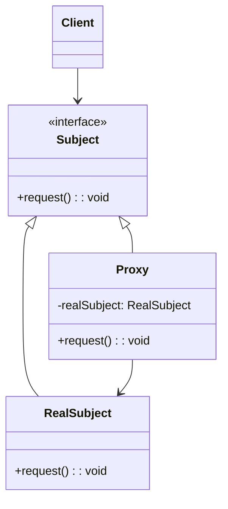

# 代理模式（Proxy Pattern）

> 为其他对象提供代理以控制对这个对象的访问

---

## 📋 基本信息

- **类型**: 结构型模式
- **难度**: ⭐⭐⭐
- **使用频率**: ⭐⭐⭐⭐⭐
- **关键词**: 静态代理、JDK动态代理、CGLIB代理、AOP

---

## 🎯 模式意图

**核心思想**：为其他对象提供一种代理以控制对这个对象的访问。代理模式通过引入一个代理对象作为中间层，来间接访问目标对象，从而可以在不修改目标对象的前提下增强其功能或控制其访问。

**解决的问题**：
- 如何在不修改目标对象的前提下对其进行功能增强
- 如何控制对敏感对象的访问权限
- 如何处理创建成本高的对象（延迟初始化）
- 如何实现远程对象的本地访问
- 如何记录对象的访问日志或统计访问次数

**适用场景**：
- 🔒 **访问控制**：如权限验证、安全检查
- 🚀 **性能优化**：如延迟加载、缓存代理
- 📝 **日志记录**：如请求日志、性能监控
- 🌐 **远程代理**：如RPC调用、分布式服务
- 🧪 **测试替身**：如单元测试中的模拟对象
- 💾 **数据库访问**：如连接池、事务管理
- 🖥️ **UI组件**：如虚拟列表、懒加载组件
- 🔄 **事务管理**：如声明式事务
- 🛡️ **异常处理**：如统一异常捕获

## 🏗️ UML类图



**类图说明**：
- `Subject`：抽象主题接口，定义了RealSubject和Proxy的共同接口
- `RealSubject`：真实主题类，实现了Subject接口，是代理对象所代表的真实对象
- `Proxy`：代理类，实现了Subject接口，包含对RealSubject的引用，可以访问、控制或扩展RealSubject的功能
- `Client`：客户端，通过Subject接口与代理对象交互

**代理模式类型**：
1. **静态代理**：编译期就已经确定代理类和目标类的关系
2. **动态代理**：运行时动态生成代理类（如JDK动态代理、CGLIB代理）
3. **远程代理**：为不同地址空间的对象提供本地代理
4. **虚拟代理**：延迟加载创建成本高的对象
5. **保护代理**：控制对原始对象的访问权限
6. **智能引用**：在访问对象时执行一些附加操作
7. **缓存代理**：为 expensive 操作结果提供临时缓存

## 💻 代码实现

### 1. 静态代理

```java
// 抽象主题接口
public interface Image {
    void display();
}

// 真实主题类
public class RealImage implements Image {
    private String fileName;

    public RealImage(String fileName) {
        this.fileName = fileName;
        loadFromDisk(fileName);
    }

    private void loadFromDisk(String fileName) {
        System.out.println("从磁盘加载图片: " + fileName);
        // 模拟加载图片的耗时操作
        try {
            Thread.sleep(1000);
        } catch (InterruptedException e) {
            e.printStackTrace();
        }
    }

    @Override
    public void display() {
        System.out.println("显示图片: " + fileName);
    }
}

// 代理类
public class ProxyImage implements Image {
    private RealImage realImage;
    private String fileName;
    private static int accessCount = 0;

    public ProxyImage(String fileName) {
        this.fileName = fileName;
    }

    @Override
    public void display() {
        // 延迟初始化：只在需要时才创建真实对象
        if (realImage == null) {
            realImage = new RealImage(fileName);
        }
        // 访问控制：记录访问次数
        accessCount++;
        System.out.println("图片访问次数: " + accessCount);
        // 调用真实对象的方法
        realImage.display();
        // 功能增强：添加额外操作
        logDisplayTime();
    }

    private void logDisplayTime() {
        System.out.println("图片显示时间: " + java.time.LocalTime.now());
    }
}

// 客户端代码
public class Client {
    public static void main(String[] args) {
        Image image = new ProxyImage("design_patterns.jpg");

        // 第一次访问，会加载图片
        System.out.println("=== 第一次访问 ===");
        image.display();

        // 第二次访问，不会重新加载图片
        System.out.println("\n=== 第二次访问 ===");
        image.display();

        // 第三次访问
        System.out.println("\n=== 第三次访问 ===");
        image.display();
    }
}
```

### 2. JDK动态代理

```java
import java.lang.reflect.InvocationHandler;
import java.lang.reflect.Method;
import java.lang.reflect.Proxy;
import java.time.LocalDateTime;

// 业务接口
public interface UserService {
    String getUserById(Long id);
    void updateUser(Long id, String name);
}

// 业务实现类
public class UserServiceImpl implements UserService {
    @Override
    public String getUserById(Long id) {
        System.out.println("查询用户信息，ID: " + id);
        return "User{id=" + id + ", name=\"张三\"}";
    }

    @Override
    public void updateUser(Long id, String name) {
        System.out.println("更新用户信息，ID: " + id + ", 新名称: " + name);
    }
}

// 动态代理处理器
public class LoggingInvocationHandler implements InvocationHandler {
    private Object target;

    public LoggingInvocationHandler(Object target) {
        this.target = target;
    }

    @Override
    public Object invoke(Object proxy, Method method, Object[] args) throws Throwable {
        // 前置增强：记录方法调用前的日志
        System.out.println("===== 方法调用开始 ====");
        System.out.println("调用方法: " + method.getName());
        System.out.println("调用时间: " + LocalDateTime.now());
        System.out.println("参数列表: " + java.util.Arrays.toString(args));

        // 计时开始
        long startTime = System.currentTimeMillis();

        try {
            // 调用目标对象的方法
            Object result = method.invoke(target, args);

            // 后置增强：记录方法调用成功的日志
            System.out.println("返回结果: " + result);
            return result;
        } catch (Exception e) {
            // 异常增强：记录方法调用异常的日志
            System.out.println("方法调用异常: " + e.getMessage());
            throw e;
        } finally {
            // 最终增强：记录方法调用耗时
            long endTime = System.currentTimeMillis();
            System.out.println("方法耗时: " + (endTime - startTime) + "ms");
            System.out.println("===== 方法调用结束 ====\n");
        }
    }
}

// 代理工厂
public class ProxyFactory {
    @SuppressWarnings("unchecked")
    public static <T> T createProxy(T target) {
        return (T) Proxy.newProxyInstance(
            target.getClass().getClassLoader(),
            target.getClass().getInterfaces(),
            new LoggingInvocationHandler(target)
        );
    }
}

// 客户端代码
public class DynamicProxyClient {
    public static void main(String[] args) {
        // 创建目标对象
        UserService userService = new UserServiceImpl();

        // 创建代理对象
        UserService userServiceProxy = ProxyFactory.createProxy(userService);

        // 通过代理对象调用方法
        String user = userServiceProxy.getUserById(1L);
        userServiceProxy.updateUser(1L, "李四");
    }
}
```

### 3. CGLIB动态代理

```java
import net.sf.cglib.proxy.Enhancer;
import net.sf.cglib.proxy.MethodInterceptor;
import net.sf.cglib.proxy.MethodProxy;
import java.lang.reflect.Method;
import java.time.LocalDateTime;

// 没有实现接口的目标类
public class OrderService {
    public void createOrder(String product, int quantity) {
        System.out.println("创建订单 - 商品: " + product + ", 数量: " + quantity);
    }

    public double calculatePrice(String product, int quantity) {
        System.out.println("计算价格 - 商品: " + product + ", 数量: " + quantity);
        return quantity * 99.9;
    }
}

// CGLIB方法拦截器
public class CglibLoggingInterceptor implements MethodInterceptor {
    @Override
    public Object intercept(Object obj, Method method, Object[] args, MethodProxy proxy) throws Throwable {
        // 前置增强
        System.out.println("===== CGLIB代理 - 方法调用开始 ====");
        System.out.println("调用方法: " + method.getName());
        System.out.println("调用时间: " + LocalDateTime.now());
        System.out.println("参数列表: " + java.util.Arrays.toString(args));

        // 计时开始
        long startTime = System.currentTimeMillis();

        try {
            // 调用目标对象的方法
            Object result = proxy.invokeSuper(obj, args);

            // 后置增强
            System.out.println("返回结果: " + result);
            return result;
        } catch (Exception e) {
            // 异常增强
            System.out.println("方法调用异常: " + e.getMessage());
            throw e;
        } finally {
            // 最终增强
            long endTime = System.currentTimeMillis();
            System.out.println("方法耗时: " + (endTime - startTime) + "ms");
            System.out.println("===== CGLIB代理 - 方法调用结束 ====\n");
        }
    }
}

// CGLIB代理工厂
public class CglibProxyFactory {
    @SuppressWarnings("unchecked")
    public static <T> T createProxy(Class<T> targetClass) {
        Enhancer enhancer = new Enhancer();
        enhancer.setSuperclass(targetClass);
        enhancer.setCallback(new CglibLoggingInterceptor());
        return (T) enhancer.create();
    }
}

// 客户端代码
public class CglibProxyClient {
    public static void main(String[] args) {
        // 创建CGLIB代理对象（无需目标类实现接口）
        OrderService orderServiceProxy = CglibProxyFactory.createProxy(OrderService.class);

        // 通过代理对象调用方法
        orderServiceProxy.createOrder("笔记本电脑", 2);
        double price = orderServiceProxy.calculatePrice("笔记本电脑", 2);
    }
}
```

## 🔍 源码应用

### JDK中的代理模式
- **`java.lang.reflect.Proxy`**：JDK动态代理的核心类
- **`java.lang.reflect.InvocationHandler`**：JDK动态代理的回调接口
- **`java.rmi.*`**：远程方法调用中的远程代理实现
- **`javax.ejb.EJBProxy`**：EJB中的远程代理

### Spring框架中的代理模式
- **`org.springframework.aop.framework.ProxyFactoryBean`**：AOP代理工厂
- **`org.springframework.aop.framework.JdkDynamicAopProxy`**：JDK动态代理实现
- **`org.springframework.aop.framework.CglibAopProxy`**：CGLIB动态代理实现
- **`org.springframework.transaction.interceptor.TransactionInterceptor`**：事务代理
- **`org.springframework.cache.interceptor.CacheInterceptor`**：缓存代理
- **`org.springframework.security.access.intercept.aopalliance.MethodSecurityInterceptor`**：安全代理

```java
// Spring AOP配置示例
@Configuration
@EnableAspectJAutoProxy
public class AopConfig {
    @Bean
    public LoggingAspect loggingAspect() {
        return new LoggingAspect();
    }
}

// Spring声明式事务（基于代理模式）
@Service
public class UserServiceImpl implements UserService {
    @Transactional
    public void transferMoney(Long fromId, Long toId, double amount) {
        // 业务逻辑...
    }
}
```

### MyBatis中的代理模式
- **`org.apache.ibatis.binding.MapperProxy`**：Mapper接口的动态代理
- **`org.apache.ibatis.session.defaults.DefaultSqlSession.getMapper()`**：获取Mapper代理对象

```java
// MyBatis Mapper代理
SqlSession session = sqlSessionFactory.openSession();
UserMapper userMapper = session.getMapper(UserMapper.class);
User user = userMapper.selectUser(1);
```

### Hibernate中的代理模式
- **`org.hibernate.proxy.ProxyFactory`**：Hibernate实体代理工厂
- **延迟加载机制**：通过代理对象实现关联对象的延迟加载

### Spring Boot中的代理应用
- **`@Async`**：异步方法调用（基于代理实现）
- **`@Retryable`**：重试机制（基于代理实现）
- **`@Validated`**：参数校验（基于代理实现）

### AspectJ中的代理模式
- AspectJ提供了比Spring AOP更强大的织入能力，支持编译期织入和类加载期织入

### Retrofit中的代理模式
- **`retrofit2.Retrofit.create()`**：为接口创建动态代理对象

```java
// Retrofit代理模式应用
public interface ApiService {
    @GET("users/{id}")
    Call<User> getUser(@Path("id") int id);
}

Retrofit retrofit = new Retrofit.Builder()
    .baseUrl("https://api.example.com/")
    .build();

ApiService apiService = retrofit.create(ApiService.class);
Call<User> call = apiService.getUser(1);
```

### Spring Cloud中的代理模式
- **`org.springframework.cloud.netflix.ribbon.RibbonLoadBalancerClient`**：负载均衡代理
- **`org.springframework.cloud.openfeign.FeignClient`**：声明式REST客户端（基于动态代理）

## ⚠️ 注意事项

1. **性能影响**：代理模式会增加一次方法调用，对性能有轻微影响

2. **调试复杂性**：增加了调用层级，可能使调试变得复杂

3. **静态代理的维护成本**：每一个真实主题类都需要对应一个代理类，增加了代码量

4. **动态代理的局限性**：
   - JDK动态代理只能代理实现了接口的类
   - CGLIB不能代理final类和final方法

5. **事务管理陷阱**：在同一个类中调用事务方法不会触发代理，导致事务失效

6. **代理对象与真实对象的区别**：代理对象是目标对象的增强，不是同一对象

7. **序列化问题**：动态代理对象可能无法正常序列化

8. **异常处理**：代理中的异常处理可能会掩盖原始异常

9. **过度使用**：不要盲目使用代理模式，只有在确实需要增强或控制访问时才使用

## 🎓 最佳实践

1. **接口设计**：为代理对象和真实对象定义共同的接口，遵循里氏替换原则

2. **选择合适的代理方式**：
   - 需要实现接口：优先使用JDK动态代理
   - 无需实现接口：使用CGLIB代理
   - Spring AOP会自动选择合适的代理方式

3. **职责单一**：一个代理类应该只负责一种增强功能

4. **组合使用**：多个代理可以组合使用，形成代理链

```java
// 代理链示例
Object target = new RealSubject();
Object proxy1 = new LoggingProxy(target);
Object proxy2 = new TransactionProxy(proxy1);
Object proxy3 = new SecurityProxy(proxy2);
proxy3.request();
```

5. **使用工厂模式创建代理**：通过工厂统一管理代理对象的创建

6. **AOP替代**：对于横切关注点，优先使用AOP而非手动创建代理

7. **避免在构造函数中使用代理对象**：可能导致未初始化完成的对象被使用

8. **文档说明**：明确标记哪些类是代理类，以及它们的增强功能

9. **测试代理行为**：单独测试代理的增强功能，确保其正确性

10. **使用注解驱动**：在Spring中优先使用注解式AOP配置

## 📚 相关模式

- **装饰器模式**：两者都实现了对目标对象的增强，但装饰器模式关注于动态添加功能，而代理模式关注于控制访问
- **适配器模式**：适配器模式改变接口以匹配客户端需求，代理模式保持原接口不变
- **外观模式**：外观模式为复杂系统提供简化接口，代理模式为单个对象提供控制访问
- **策略模式**：可以与代理模式结合使用，动态改变代理的增强策略
- **工厂方法模式**：通常与代理模式结合使用，创建代理对象
- **单例模式**：可以与代理模式结合，实现延迟初始化的单例
- **观察者模式**：代理对象可以作为观察者，监控目标对象的状态变化
- **模板方法模式**：代理的invoke方法可以实现模板方法模式

