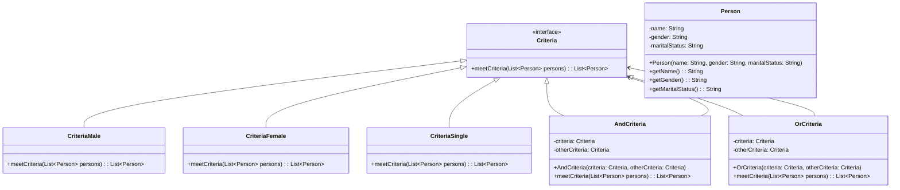

## 过滤器模式 (Filter Pattern)

### 概述
过滤器模式（Filter Pattern）也称为标准模式（Criteria Pattern），它允许开发人员使用不同的标准来过滤一组对象，通过逻辑运算以解耦的方式将它们连接起来。这种模式属于结构型模式，它结合多个标准来获得单一标准。

## 🎯 模式意图

**核心思想**：过滤器模式允许开发人员使用不同的标准来过滤一组对象，通过逻辑运算以解耦的方式把它们连接起来。

**解决问题**：
- 如何根据不同条件过滤一组对象
- 如何组合多个过滤条件
- 如何将过滤逻辑与业务逻辑分离

**适用场景**：
- 数据筛选功能（如电商平台的商品筛选）
- 报表生成系统
- 日志过滤与分析
- 权限控制

## 🏗️ UML类图



## 💻 代码实现

### 1. 基础实现

```java
import java.util.List;
import java.util.ArrayList;

// 被过滤的对象
class Person {
    private String name;
    private String gender;
    private String maritalStatus;

    public Person(String name, String gender, String maritalStatus) {
        this.name = name;
        this.gender = gender;
        this.maritalStatus = maritalStatus;
    }

    // Getters
    public String getName() { return name; }
    public String getGender() { return gender; }
    public String getMaritalStatus() { return maritalStatus; }
}

// 过滤器接口
interface Criteria {
    List<Person> meetCriteria(List<Person> persons);
}

// 具体过滤器：男性
class CriteriaMale implements Criteria {
    @Override
    public List<Person> meetCriteria(List<Person> persons) {
        List<Person> malePersons = new ArrayList<>();
        for (Person person : persons) {
            if (person.getGender().equalsIgnoreCase("MALE")) {
                malePersons.add(person);
            }
        }
        return malePersons;
    }
}

// 具体过滤器：女性
class CriteriaFemale implements Criteria {
    @Override
    public List<Person> meetCriteria(List<Person> persons) {
        List<Person> femalePersons = new ArrayList<>();
        for (Person person : persons) {
            if (person.getGender().equalsIgnoreCase("FEMALE")) {
                femalePersons.add(person);
            }
        }
        return femalePersons;
    }
}

// 具体过滤器：单身
class CriteriaSingle implements Criteria {
    @Override
    public List<Person> meetCriteria(List<Person> persons) {
        List<Person> singlePersons = new ArrayList<>();
        for (Person person : persons) {
            if (person.getMaritalStatus().equalsIgnoreCase("SINGLE")) {
                singlePersons.add(person);
            }
        }
        return singlePersons;
    }
}

// 与条件过滤器
class AndCriteria implements Criteria {
    private Criteria criteria;
    private Criteria otherCriteria;

    public AndCriteria(Criteria criteria, Criteria otherCriteria) {
        this.criteria = criteria;
        this.otherCriteria = otherCriteria;
    }

    @Override
    public List<Person> meetCriteria(List<Person> persons) {
        List<Person> firstCriteriaPersons = criteria.meetCriteria(persons);
        return otherCriteria.meetCriteria(firstCriteriaPersons);
    }
}

// 或条件过滤器
class OrCriteria implements Criteria {
    private Criteria criteria;
    private Criteria otherCriteria;

    public OrCriteria(Criteria criteria, Criteria otherCriteria) {
        this.criteria = criteria;
        this.otherCriteria = otherCriteria;
    }

    @Override
    public List<Person> meetCriteria(List<Person> persons) {
        List<Person> firstCriteriaItems = criteria.meetCriteria(persons);
        List<Person> otherCriteriaItems = otherCriteria.meetCriteria(persons);

        for (Person person : otherCriteriaItems) {
            if (!firstCriteriaItems.contains(person)) {
                firstCriteriaItems.add(person);
            }
        }
        return firstCriteriaItems;
    }
}

// 客户端代码
public class CriteriaPatternDemo {
    public static void main(String[] args) {
        List<Person> persons = new ArrayList<>();

        persons.add(new Person("Robert", "Male", "Single"));
        persons.add(new Person("John", "Male", "Married"));
        persons.add(new Person("Laura", "Female", "Married"));
        persons.add(new Person("Diana", "Female", "Single"));
        persons.add(new Person("Mike", "Male", "Single"));
        persons.add(new Person("Bobby", "Male", "Single"));

        Criteria male = new CriteriaMale();
        Criteria female = new CriteriaFemale();
        Criteria single = new CriteriaSingle();
        Criteria singleMale = new AndCriteria(single, male);
        Criteria singleOrFemale = new OrCriteria(single, female);

        System.out.println("Males:");
        printPersons(male.meetCriteria(persons));

        System.out.println("\nFemales:");
        printPersons(female.meetCriteria(persons));

        System.out.println("\nSingle Males:");
        printPersons(singleMale.meetCriteria(persons));

        System.out.println("\nSingle or Females:");
        printPersons(singleOrFemale.meetCriteria(persons));
    }

    public static void printPersons(List<Person> persons) {
        for (Person person : persons) {
            System.out.println("Person: [ Name : " + person.getName() + ", Gender : " + person.getGender() + ", Marital Status : " + person.getMaritalStatus() + " ]");
        }
    }
}
```

### 2. Java 8 Stream API实现

```java
import java.util.List;
import java.util.ArrayList;
import java.util.stream.Collectors;

public class StreamCriteriaDemo {
    public static void main(String[] args) {
        List<Person> persons = new ArrayList<>();
        // 添加人员数据...

        // 使用Stream API实现过滤
        List<Person> singleMales = persons.stream()
                .filter(p -> p.getGender().equalsIgnoreCase("MALE"))
                .filter(p -> p.getMaritalStatus().equalsIgnoreCase("SINGLE"))
                .collect(Collectors.toList());
    }
}
```

## 🔍 源码应用

### 1. Java中的过滤器模式
- **`java.util.function.Predicate`**：Java 8函数式接口，用于表示一个参数的布尔值函数
- **`java.util.stream.Stream.filter()`**：Stream API中的过滤方法
- **`javax.servlet.Filter`**：Servlet规范中的过滤器接口

```java
// Servlet过滤器示例
public class LoggingFilter implements Filter {
    public void doFilter(ServletRequest request, ServletResponse response, FilterChain chain)
            throws IOException, ServletException {
        // 处理请求
        System.out.println("Request received from: " + request.getRemoteAddr());
        chain.doFilter(request, response); // 将请求传递给下一个过滤器
        // 处理响应
        System.out.println("Response sent to: " + request.getRemoteAddr());
    }
}
```

### 2. Spring框架中的应用
- **`org.springframework.web.filter.OncePerRequestFilter`**：确保过滤器只执行一次
- **`org.springframework.security.web.authentication.UsernamePasswordAuthenticationFilter`**：Spring Security认证过滤器

## ⚠️ 注意事项

1. **性能考虑**：多个过滤器组合可能导致性能问题，特别是处理大量数据时
2. **空指针处理**：过滤条件中应注意处理null值
3. **线程安全**：过滤器应该设计为无状态以确保线程安全
4. **避免过度过滤**：过多的过滤条件组合可能导致结果集为空
5. **结果缓存**：对于频繁使用的过滤结果，考虑进行缓存

## 🎓 最佳实践

1. **使用函数式接口**：Java 8+优先使用Predicate接口
2. **组合优于继承**：通过组合而非继承来创建复杂过滤条件
3. **使用建造者模式**：复杂过滤条件可使用建造者模式构建
4. **返回空集合而非null**：过滤方法应返回空集合而非null
5. **命名规范**：过滤器类名应清晰表达其功能，如`PriceRangeFilter`
6. **单元测试**：为每个过滤器编写单元测试

## 📚 相关模式

- **组合模式**：过滤器模式中的组合过滤器实现使用了组合模式
- **策略模式**：每个过滤器都是一种过滤策略
- **责任链模式**：过滤器链的实现与责任链模式类似
- **迭代器模式**：通常与过滤器模式一起使用来遍历和筛选集合

---

## 📝 总结

过滤器模式通过将过滤逻辑封装在独立的过滤器类中，实现了过滤条件的灵活组合和复用。它特别适合需要多种条件组合筛选数据的场景，如电商平台的商品筛选、数据报表生成等。在Java 8及以上版本中，可以结合Stream API和Predicate接口更简洁地实现过滤功能。