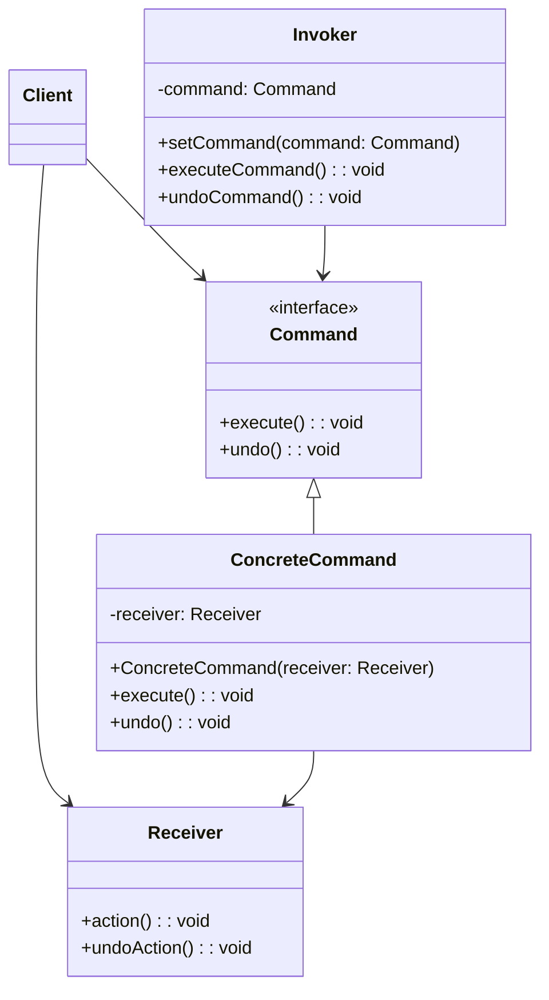

## 命令模式 (Command Pattern)

### 概述
命令模式（Command Pattern）将请求封装为一个对象，从而使您可以用不同的请求对客户进行参数化、对请求排队或记录请求日志，以及支持可撤销的操作。这种模式属于行为型模式，它将请求发送者与接收者解耦。

## 🎯 模式意图

**核心思想**：将请求封装为独立对象，允许参数化客户端操作、队列化请求、记录请求日志，并支持可撤销操作。

**解决的问题**：
- 如何将请求发送者与接收者解耦
- 如何实现请求的参数化处理
- 如何支持请求的排队、记录和撤销
- 如何实现命令的可扩展性

**适用场景**：
- 📝 **操作记录与撤销**：文本编辑器的撤销/重做功能
- 📊 **事务处理**：数据库事务的提交与回滚
- 🎮 **GUI操作**：按钮点击、菜单选择等交互
- 📋 **任务调度**：定时任务执行、延迟操作
- 🚀 **命令队列**：多线程环境下的任务处理
- 🔧 **宏命令**：组合多个命令形成复杂操作

## 🏗️ UML类图



**核心角色**：
- **Command（命令接口）**：声明执行操作的接口
- **ConcreteCommand（具体命令）**：将接收者与动作绑定
- **Receiver（接收者）**：执行请求相关操作
- **Invoker（调用者）**：要求命令执行请求
- **Client（客户端）**：创建命令对象并设定接收者

## 💻 代码实现

### 1. 基础实现

```java
// 命令接口
public interface Command {
    void execute();
    void undo();
}

// 接收者类
public class Receiver {
    private String state;
    private String previousState;

    public Receiver() {
        this.state = "初始状态";
        this.previousState = this.state;
    }

    public void action() {
        this.previousState = this.state;
        this.state = "执行操作后状态";
        System.out.println("接收者执行操作，状态变为: " + state);
    }

    public void undoAction() {
        String temp = this.state;
        this.state = this.previousState;
        this.previousState = temp;
        System.out.println("接收者撤销操作，状态恢复为: " + state);
    }
}

// 具体命令类
public class ConcreteCommand implements Command {
    private Receiver receiver;

    public ConcreteCommand(Receiver receiver) {
        this.receiver = receiver;
    }

    @Override
    public void execute() {
        receiver.action();
    }

    @Override
    public void undo() {
        receiver.undoAction();
    }
}

// 调用者类
public class Invoker {
    private Command command;

    public void setCommand(Command command) {
        this.command = command;
    }

    public void executeCommand() {
        command.execute();
    }

    public void undoCommand() {
        command.undo();
    }
}

// 客户端代码
public class Client {
    public static void main(String[] args) {
        // 创建接收者
        Receiver receiver = new Receiver();
        // 创建命令
        Command command = new ConcreteCommand(receiver);
        // 创建调用者
        Invoker invoker = new Invoker();
        invoker.setCommand(command);

        // 执行命令
        invoker.executeCommand();
        // 撤销命令
        invoker.undoCommand();
    }
}
```

### 2. 宏命令实现

```java
import java.util.ArrayList;
import java.util.List;

// 宏命令类
public class MacroCommand implements Command {
    private List<Command> commands = new ArrayList<>();

    public void addCommand(Command command) {
        commands.add(command);
    }

    public void removeCommand(Command command) {
        commands.remove(command);
    }

    @Override
    public void execute() {
        for (Command command : commands) {
            command.execute();
        }
    }

    @Override
    public void undo() {
        // 逆序撤销
        for (int i = commands.size() - 1; i >= 0; i--) {
            commands.get(i).undo();
        }
    }
}
```

## 🔍 源码应用

### Java中的命令模式
- **`java.lang.Runnable`**：命令模式经典实现
- **`java.util.concurrent.Callable`**：带返回值的命令
- **`javax.servlet.Filter`**：过滤器命令链

### Spring框架应用
- **`org.springframework.transaction.support.TransactionCallback`**：事务命令
- **`org.springframework.jdbc.core.JdbcTemplate`**：数据库操作命令

## ⚠️ 注意事项

1. **避免命令膨胀**：系统中可能出现过多命令类
2. **状态管理**：撤销操作需保存命令执行前状态
3. **使用空命令**：避免空指针异常
4. **线程安全**：命令对象通常非线程安全

## 🎓 最佳实践

1. **组合命令**：使用宏命令组合多个操作
2. **命令队列**：异步处理命令队列
3. **命令日志**：持久化命令用于恢复
4. **参数化命令**：通过构造函数传递参数

## 📚 相关模式

- **备忘录模式**：用于保存状态支持撤销
- **策略模式**：命令关注操作封装，策略关注算法替换
- **组合模式**：宏命令实现使用组合模式