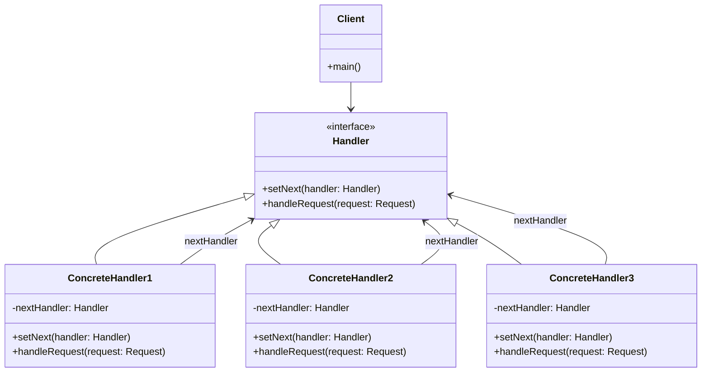

# 责任链模式（Chain of Responsibility Pattern）

> 使多个对象都有机会处理请求，避免请求的发送者和接收者之间的耦合

---

## 📋 基本信息

- **类型**: 行为型模式
- **难度**: ⭐⭐⭐
- **使用频率**: ⭐⭐⭐⭐
- **关键词**: 请求传递、过滤器链、拦截器

---

## 🎯 模式意图

**核心思想**：使多个对象都有机会处理请求，从而避免请求的发送者和接收者之间的耦合关系。将这些对象连成一条链，并沿着这条链传递该请求，直到有一个对象处理它为止。

**解决的问题**：
- 如何将请求的发送者与接收者解耦
- 如何动态指定处理请求的对象集合
- 如何让多个对象都有机会处理同一个请求
- 如何在不明确指定接收者的情况下，向多个对象中的一个提交请求

**适用场景**：
- 当有多个对象可以处理同一个请求，且具体哪个对象处理该请求由运行时刻自动确定时
- 当你想在不明确指定接收者的情况下，向多个对象中的一个提交请求时
- 当需要动态指定一组对象处理请求时
- 在请求处理链中动态插入或删除处理者时
- 常见于拦截器、过滤器、事件处理等场景

## 🏗️ UML类图



**核心角色**：
- **Handler（抽象处理者）**：定义处理请求的接口，包含一个指向下一处理者的引用
- **ConcreteHandler（具体处理者）**：实现Handler接口，判断能否处理本次请求，如果可以处理则处理，否则将请求转发给下一个处理者
- **Client（客户端）**：创建处理链，并向链头的具体处理者提交请求

**工作流程**：
1. 客户端创建处理链
2. 客户端向链中的第一个处理者发送请求
3. 每个处理者判断自己是否能处理该请求
4. 如果可以处理，则处理完毕；如果不能，则将请求转发给下一个处理者
5. 直到某个处理者处理请求或请求到达链尾

## 💻 代码实现

### 1. 基础实现（请假审批流程）

```java
// 请求类
public class LeaveRequest {
    private String employeeName; // 员工姓名
    private int days; // 请假天数
    private String reason; // 请假原因

    public LeaveRequest(String employeeName, int days, String reason) {
        this.employeeName = employeeName;
        this.days = days;
        this.reason = reason;
    }

    // getter方法
    public String getEmployeeName() { return employeeName; }
    public int getDays() { return days; }
    public String getReason() { return reason; }
}

// 抽象处理者
public abstract class Leader {
    protected Leader nextLeader; // 下一个处理者

    // 设置下一个处理者
    public void setNextLeader(Leader nextLeader) {
        this.nextLeader = nextLeader;
    }

    // 处理请求的抽象方法
    public abstract void handleRequest(LeaveRequest leaveRequest);
}

// 具体处理者 - 直属经理
public class Director extends Leader {
    @Override
    public void handleRequest(LeaveRequest leaveRequest) {
        // 直属经理可以处理3天以内的请假
        if (leaveRequest.getDays() <= 3) {
            System.out.println("直属经理批准了" + leaveRequest.getEmployeeName() + "的请假申请，请假" + leaveRequest.getDays() + "天，原因：" + leaveRequest.getReason());
        } else {
            // 超过3天，提交给下一个处理者
            if (nextLeader != null) {
                nextLeader.handleRequest(leaveRequest);
            } else {
                System.out.println("无人处理请假申请");
            }
        }
    }
}

// 具体处理者 - 部门经理
public class Manager extends Leader {
    @Override
    public void handleRequest(LeaveRequest leaveRequest) {
        // 部门经理可以处理3-7天的请假
        if (leaveRequest.getDays() > 3 && leaveRequest.getDays() <= 7) {
            System.out.println("部门经理批准了" + leaveRequest.getEmployeeName() + "的请假申请，请假" + leaveRequest.getDays() + "天，原因：" + leaveRequest.getReason());
        } else {
            // 超过7天，提交给下一个处理者
            if (nextLeader != null) {
                nextLeader.handleRequest(leaveRequest);
            } else {
                System.out.println("无人处理请假申请");
            }
        }
    }
}

// 具体处理者 - 总经理
public class GeneralManager extends Leader {
    @Override
    public void handleRequest(LeaveRequest leaveRequest) {
        // 总经理可以处理7-30天的请假
        if (leaveRequest.getDays() > 7 && leaveRequest.getDays() <= 30) {
            System.out.println("总经理批准了" + leaveRequest.getEmployeeName() + "的请假申请，请假" + leaveRequest.getDays() + "天，原因：" + leaveRequest.getReason());
        } else {
            // 超过30天，无法批准
            if (leaveRequest.getDays() > 30) {
                System.out.println("请假天数过多，无法批准" + leaveRequest.getEmployeeName() + "的请假申请");
            } else if (nextLeader != null) {
                nextLeader.handleRequest(leaveRequest);
            } else {
                System.out.println("无人处理请假申请");
            }
        }
    }
}

// 客户端
public class Client {
    public static void main(String[] args) {
        // 创建处理者
        Leader director = new Director(); // 直属经理
        Leader manager = new Manager(); // 部门经理
        Leader generalManager = new GeneralManager(); // 总经理

        // 设置责任链
        director.setNextLeader(manager);
        manager.setNextLeader(generalManager);

        // 创建请假请求
        LeaveRequest request1 = new LeaveRequest("张三", 2, "感冒发烧");
        LeaveRequest request2 = new LeaveRequest("李四", 5, "家中有事");
        LeaveRequest request3 = new LeaveRequest("王五", 15, "出国旅游");
        LeaveRequest request4 = new LeaveRequest("赵六", 35, "长期休养");

        // 提交请求
        System.out.println("=== 请求1 ===");
        director.handleRequest(request1);

        System.out.println("\n=== 请求2 ===");
        director.handleRequest(request2);

        System.out.println("\n=== 请求3 ===");
        director.handleRequest(request3);

        System.out.println("\n=== 请求4 ===");
        director.handleRequest(request4);
    }
}
```

### 2. 高级实现（过滤器链模式）

```java
import java.util.ArrayList;
import java.util.List;

// 请求类
public class Request {
    private String content; // 请求内容

    public Request(String content) {
        this.content = content;
    }

    public String getContent() { return content; }
    public void setContent(String content) { this.content = content; }
}

// 响应类
public class Response {
    private String result; // 响应结果

    public String getResult() { return result; }
    public void setResult(String result) { this.result = result; }
}

// 过滤器接口
public interface Filter {
    void doFilter(Request request, Response response, FilterChain chain);
}

// 具体过滤器 - HTML转义过滤器
public class HtmlFilter implements Filter {
    @Override
    public void doFilter(Request request, Response response, FilterChain chain) {
        // 处理请求
        String content = request.getContent();
        // 替换HTML特殊字符
        content = content.replace("<", "&lt;").replace(">", "&gt;");
        request.setContent(content);

        // 传递给下一个过滤器
        chain.doFilter(request, response);

        // 处理响应
        String result = response.getResult();
        result += "-HtmlFilter";
        response.setResult(result);
    }
}

// 具体过滤器 - 敏感词过滤器
public class SensitiveFilter implements Filter {
    @Override
    public void doFilter(Request request, Response response, FilterChain chain) {
        // 处理请求
        String content = request.getContent();
        // 替换敏感词
        content = content.replace("色情", "***").replace("暴力", "***");
        request.setContent(content);

        // 传递给下一个过滤器
        chain.doFilter(request, response);

        // 处理响应
        String result = response.getResult();
        result += "-SensitiveFilter";
        response.setResult(result);
    }
}

// 具体过滤器 - URL过滤器
public class UrlFilter implements Filter {
    @Override
    public void doFilter(Request request, Response response, FilterChain chain) {
        // 处理请求
        String content = request.getContent();
        // 将URL转换为链接
        content = content.replaceAll("(http://[^ ]+)", "<a href='$1'>$1</a>");
        request.setContent(content);

        // 传递给下一个过滤器
        chain.doFilter(request, response);

        // 处理响应
        String result = response.getResult();
        result += "-UrlFilter";
        response.setResult(result);
    }
}

// 过滤器链
public class FilterChain {
    private List<Filter> filters = new ArrayList<>();
    private int index = 0; // 当前过滤器索引

    // 添加过滤器
    public FilterChain addFilter(Filter filter) {
        filters.add(filter);
        return this; // 链式调用
    }

    // 执行过滤器链
    public void doFilter(Request request, Response response) {
        if (index == filters.size()) {
            return;
        }

        Filter filter = filters.get(index);
        index++;
        filter.doFilter(request, response, this);
    }
}

// 客户端
public class Client {
    public static void main(String[] args) {
        String msg = "大家好:)<script>, 我想访问 http://example.com, 谈论一些关于色情和暴力的内容";
        Request request = new Request(msg);
        Response response = new Response();
        response.setResult("处理结果:");

        // 创建过滤器链
        FilterChain chain = new FilterChain();
        chain.addFilter(new HtmlFilter())
             .addFilter(new SensitiveFilter())
             .addFilter(new UrlFilter());

        // 执行过滤
        chain.doFilter(request, response);

        System.out.println("原始内容: " + msg);
        System.out.println("过滤后请求: " + request.getContent());
        System.out.println("过滤后响应: " + response.getResult());
    }
}
```

## 🔍 源码应用

### Java中的责任链模式

- **`java.util.logging.Logger`**：日志处理器链

```java
// Java日志系统中的责任链模式
Logger logger = Logger.getLogger("com.example");
logger.setLevel(Level.ALL);

// 创建控制台处理器
ConsoleHandler consoleHandler = new ConsoleHandler();
consoleHandler.setLevel(Level.INFO);

// 创建文件处理器
FileHandler fileHandler;
try {
    fileHandler = new FileHandler("app.log");
    fileHandler.setLevel(Level.WARNING);
    // 添加到日志器
    logger.addHandler(fileHandler);
    logger.addHandler(consoleHandler);
} catch (IOException e) {
    e.printStackTrace();
}

// 日志消息会被传递给所有处理器
logger.severe("严重错误"); // 会被两个处理器处理
logger.warning("警告信息"); // 会被两个处理器处理
logger.info("普通信息"); // 只会被控制台处理器处理
logger.config("配置信息"); // 不会被任何处理器处理
```

- **`javax.servlet.Filter`**：Servlet过滤器链

```java
// Web应用中的过滤器配置
@WebFilter("/*")
public class EncodingFilter implements Filter {
    @Override
    public void doFilter(ServletRequest request, ServletResponse response, FilterChain chain) throws IOException, ServletException {
        request.setCharacterEncoding("UTF-8");
        response.setCharacterEncoding("UTF-8");
        // 传递给下一个过滤器
        chain.doFilter(request, response);
    }
}
```

### Spring框架中的应用

- **`org.springframework.web.filter.DelegatingFilterProxy`**：Spring Web过滤器代理

- **`org.springframework.security.web.FilterChainProxy`**：Spring Security过滤器链

```java
// Spring Security配置中的过滤器链
@Configuration
@EnableWebSecurity
public class SecurityConfig extends WebSecurityConfigurerAdapter {
    @Override
    protected void configure(HttpSecurity http) throws Exception {
        http
            .authorizeRequests()
                .antMatchers("/public/**").permitAll()
                .anyRequest().authenticated()
                .and()
            .formLogin()
                .and()
            .csrf()
                .and()
            .addFilterBefore(new CustomFilter(), UsernamePasswordAuthenticationFilter.class);
    }
}
```

- **`org.springframework.beans.factory.support.AbstractBeanFactory`**：Bean定义处理器链

### 其他框架中的应用

- **Netty**：ChannelPipeline中的ChannelHandler链
- **MyBatis**：插件拦截器链
- **Struts2**：拦截器栈
- **Django**：中间件(Middleware)链
- **Express.js**：中间件(Middleware)链

## ⚠️ 注意事项

1. **链的完整性**：确保链的完整性，避免请求到达链尾未被处理

```java
// 良好实践：在链尾添加默认处理者
public class DefaultHandler extends Leader {
    @Override
    public void handleRequest(LeaveRequest leaveRequest) {
        System.out.println("无人处理" + leaveRequest.getEmployeeName() + "的请假申请");
    }
}

// 使用默认处理者
Leader director = new Director();
Leader manager = new Manager();
Leader generalManager = new GeneralManager();
Leader defaultHandler = new DefaultHandler();

director.setNextLeader(manager);
manager.setNextLeader(generalManager);
generalManager.setNextLeader(defaultHandler); // 添加默认处理者
```

2. **循环引用风险**：避免处理者之间形成循环引用

3. **性能问题**：过长的责任链可能导致性能问题，请求需要经过多个处理者

4. **调试困难**：责任链较长时，调试和追踪请求流程会变得复杂

5. **处理顺序**：责任链的处理顺序很重要，需要合理安排处理者顺序

6. **责任边界**：明确每个处理者的责任边界，避免重叠或空白

7. **异常处理**：需要考虑链中某个处理者抛出异常的情况

```java
@Override
public void handleRequest(LeaveRequest leaveRequest) {
    try {
        // 处理请求
        if (leaveRequest.getDays() <= 3) {
            // 处理逻辑
        } else if (nextLeader != null) {
            nextLeader.handleRequest(leaveRequest);
        }
    } catch (Exception e) {
        System.err.println("处理请求时发生异常: " + e.getMessage());
        // 异常处理策略
    }
}
```

## 🎓 最佳实践

1. **控制链的长度**：避免创建过长的责任链，一般建议不超过5个处理者

2. **使用建造者模式构建责任链**：使链的创建更加清晰

```java
// 使用建造者模式构建责任链
public class HandlerChainBuilder {
    private Leader head;
    private Leader tail;

    public HandlerChainBuilder addHandler(Leader handler) {
        if (head == null) {
            head = handler;
            tail = handler;
        } else {
            tail.setNextLeader(handler);
            tail = handler;
        }
        return this;
    }

    public Leader build() {
        return head;
    }
}

// 使用建造者
Leader chain = new HandlerChainBuilder()
    .addHandler(new Director())
    .addHandler(new Manager())
    .addHandler(new GeneralManager())
    .addHandler(new DefaultHandler())
    .build();
```

3. **使用枚举定义处理者类型**：使处理者类型更加明确

4. **结合工厂模式创建处理者**：根据条件动态创建处理者

5. **使用注解配置责任链**：在Spring等框架中，可以使用注解自动装配责任链

```java
// 使用注解配置责任链
@Component
public class HandlerChainConfig {
    @Autowired
    private Director director;

    @Autowired
    private Manager manager;

    @Autowired
    private GeneralManager generalManager;

    @Bean
    public Leader handlerChain() {
        director.setNextLeader(manager);
        manager.setNextLeader(generalManager);
        return director;
    }
}
```

6. **提供获取链结构的方法**：便于调试和监控

7. **考虑使用命令模式包装请求**：使请求更加灵活

## 📚 相关模式

- **命令模式**：都可以用于解耦发送者和接收者，但责任链模式关注请求的传递，命令模式关注请求的封装
- **装饰器模式**：都涉及对象链，但装饰器模式关注为对象动态添加功能，责任链模式关注请求的传递和处理
- **组合模式**：当责任链中的处理者是组合对象时，可以与组合模式结合使用
- **拦截器模式**：是责任链模式的一种变体，常用于框架设计
- **状态模式**：都涉及对象行为的动态分发，但状态模式关注对象状态的变化，责任链模式关注请求的传递
- **策略模式**：都可以根据条件选择不同的处理方式，但策略模式需要客户端知道具体策略，责任链模式则由链自动选择

