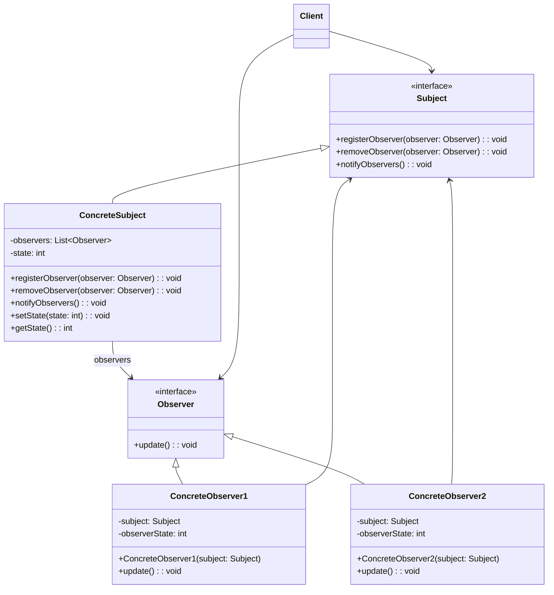

## 观察者模式 (Observer Pattern)

### 概述
观察者模式（Observer Pattern）定义了对象之间的一对多依赖关系，当一个对象状态发生改变时，所有依赖它的对象都会自动收到通知并更新。这种模式属于行为型模式，也称为发布-订阅（Publish-Subscribe）模式。

## 🎯 模式意图

**核心思想**：观察者模式定义了一种一对多的依赖关系，让多个观察者对象同时监听某一个主题对象。当主题对象状态发生变化时，它的所有观察者都会收到通知并自动更新。

**解决的问题**：
- 如何建立对象之间的动态依赖关系
- 如何实现当一个对象状态改变时，自动通知其他对象
- 如何解耦被观察者和观察者
- 如何支持动态添加和移除观察者

**适用场景**：
- 📡 **事件处理系统**：如GUI组件事件监听
- 📰 **消息通知系统**：如邮件订阅、消息推送
- 📊 **数据监控系统**：如股票行情实时更新
- 🔄 **状态同步系统**：多视图同步显示同一数据
- 🚦 **发布-订阅系统**：如消息队列、事件总线
- 📱 **响应式编程**：如RxJava、ReactiveX

## 🏗️ UML类图



**核心角色**：
- **Subject（主题/被观察者）**：定义注册、移除和通知观察者的接口
- **ConcreteSubject（具体主题）**：实现主题接口，维护状态，通知观察者
- **Observer（观察者）**：定义更新接口，在主题状态变化时更新自己
- **ConcreteObserver（具体观察者）**：实现观察者接口，保存与主题的引用，更新自身状态
- **Client（客户端）**：创建主题和观察者对象，建立它们之间的联系

**观察者模式变体**：
1. **推模型**：主题主动向观察者推送详细信息
2. **拉模型**：观察者主动从主题拉取所需信息
3. **事件驱动**：基于事件对象传递通知
4. **分层观察者**：观察者可以同时是主题

## 💻 代码实现

### 1. 基础实现（推模型）

```java
// 观察者接口
public interface Observer {
    void update(int state);
}

// 主题接口
public interface Subject {
    void registerObserver(Observer observer);
    void removeObserver(Observer observer);
    void notifyObservers();
}

// 具体主题
public class ConcreteSubject implements Subject {
    private List<Observer> observers = new ArrayList<>();
    private int state;

    @Override
    public void registerObserver(Observer observer) {
        observers.add(observer);
    }

    @Override
    public void removeObserver(Observer observer) {
        observers.remove(observer);
    }

    @Override
    public void notifyObservers() {
        for (Observer observer : observers) {
            observer.update(state);
        }
    }

    public void setState(int state) {
        this.state = state;
        notifyObservers(); // 状态改变时通知观察者
    }

    public int getState() {
        return state;
    }
}

// 具体观察者1
public class ConcreteObserver1 implements Observer {
    private Subject subject;
    private int observerState;

    public ConcreteObserver1(Subject subject) {
        this.subject = subject;
        this.subject.registerObserver(this);
    }

    @Override
    public void update(int state) {
        observerState = state;
        System.out.println("观察者1收到更新，状态变为: " + observerState);
        display();
    }

    public void display() {
        System.out.println("观察者1当前状态: " + observerState);
    }
}

// 具体观察者2
public class ConcreteObserver2 implements Observer {
    private Subject subject;
    private int observerState;

    public ConcreteObserver2(Subject subject) {
        this.subject = subject;
        this.subject.registerObserver(this);
    }

    @Override
    public void update(int state) {
        observerState = state * 2; // 观察者2对状态进行特殊处理
        System.out.println("观察者2收到更新，状态变为: " + observerState);
        display();
    }

    public void display() {
        System.out.println("观察者2当前状态: " + observerState);
    }
}

// 客户端代码
public class Client {
    public static void main(String[] args) {
        // 创建主题
        ConcreteSubject subject = new ConcreteSubject();

        // 创建观察者并注册
        Observer observer1 = new ConcreteObserver1(subject);
        Observer observer2 = new ConcreteObserver2(subject);

        // 改变主题状态
        System.out.println("----- 设置状态为10 -----\n");
        subject.setState(10);

        // 改变主题状态
        System.out.println("\n----- 设置状态为20 -----\n");
        subject.setState(20);

        // 移除一个观察者
        System.out.println("\n----- 移除观察者2 -----\n");
        subject.removeObserver(observer2);

        // 再次改变主题状态
        System.out.println("\n----- 设置状态为30 -----\n");
        subject.setState(30);
    }
}
```

### 2. 拉模型实现

```java
// 拉模型的观察者接口
public interface ObserverPull {
    void update(SubjectPull subject);
}

// 拉模型的主题接口
public interface SubjectPull {
    void registerObserver(ObserverPull observer);
    void removeObserver(ObserverPull observer);
    void notifyObservers();
}

// 拉模型的具体主题
public class ConcreteSubjectPull implements SubjectPull {
    private List<ObserverPull> observers = new ArrayList<>();
    private int state;
    private String message;

    @Override
    public void registerObserver(ObserverPull observer) {
        observers.add(observer);
    }

    @Override
    public void removeObserver(ObserverPull observer) {
        observers.remove(observer);
    }

    @Override
    public void notifyObservers() {
        for (ObserverPull observer : observers) {
            observer.update(this); // 传递自身引用
        }
    }

    public void setState(int state, String message) {
        this.state = state;
        this.message = message;
        notifyObservers();
    }

    // 提供getter方法供观察者拉取数据
    public int getState() { return state; }
    public String getMessage() { return message; }
}

// 拉模型的具体观察者
public class ConcreteObserverPull implements ObserverPull {
    private int observerState;
    private String observerMessage;

    @Override
    public void update(SubjectPull subject) {
        // 主动拉取所需数据
        ConcreteSubjectPull concreteSubject = (ConcreteSubjectPull) subject;
        this.observerState = concreteSubject.getState();
        this.observerMessage = concreteSubject.getMessage();

        System.out.println("拉模型观察者收到更新 - 状态: " + observerState + ", 消息: " + observerMessage);
    }
}

// 拉模型客户端
public class ClientPull {
    public static void main(String[] args) {
        ConcreteSubjectPull subject = new ConcreteSubjectPull();
        ObserverPull observer = new ConcreteObserverPull();
        subject.registerObserver(observer);

        subject.setState(10, "拉模型测试消息");
    }
}
```

### 3. Java内置观察者模式实现

```java
import java.util.Observable;
import java.util.Observer;

// Java内置Observable实现主题
public class WeatherData extends Observable {
    private float temperature;
    private float humidity;
    private float pressure;

    public WeatherData() {}

    public void measurementsChanged() {
        setChanged(); // 标记状态已改变
        notifyObservers(); // 通知观察者
        // 也可以传递数据对象: notifyObservers(data);
    }

    public void setMeasurements(float temperature, float humidity, float pressure) {
        this.temperature = temperature;
        this.humidity = humidity;
        this.pressure = pressure;
        measurementsChanged();
    }

    // Getter方法供观察者拉取数据
    public float getTemperature() { return temperature; }
    public float getHumidity() { return humidity; }
    public float getPressure() { return pressure; }
}

// 显示接口
public interface DisplayElement {
    void display();
}

// 具体观察者：当前条件显示器
public class CurrentConditionsDisplay implements Observer, DisplayElement {
    private Observable observable;
    private float temperature;
    private float humidity;

    public CurrentConditionsDisplay(Observable observable) {
        this.observable = observable;
        observable.addObserver(this);
    }

    @Override
    public void update(Observable o, Object arg) {
        if (o instanceof WeatherData) {
            WeatherData weatherData = (WeatherData) o;
            this.temperature = weatherData.getTemperature();
            this.humidity = weatherData.getHumidity();
            display();
        }
    }

    @Override
    public void display() {
        System.out.println("当前条件: 温度 " + temperature + "°C, 湿度 " + humidity + "%");
    }
}

// 具体观察者：统计显示器
public class StatisticsDisplay implements Observer, DisplayElement {
    private float maxTemp = 0.0f;
    private float minTemp = 200;
    private float tempSum = 0.0f;
    private int numReadings;

    public StatisticsDisplay(Observable observable) {
        observable.addObserver(this);
    }

    @Override
    public void update(Observable o, Object arg) {
        if (o instanceof WeatherData) {
            WeatherData weatherData = (WeatherData) o;
            float temp = weatherData.getTemperature();
            tempSum += temp;
            numReadings++;

            if (temp > maxTemp) maxTemp = temp;
            if (temp < minTemp) minTemp = temp;

            display();
        }
    }

    @Override
    public void display() {
        System.out.println("温度统计: 平均 " + (tempSum / numReadings) + "°C, 最高 " + maxTemp + "°C, 最低 " + minTemp + "°C");
    }
}

// 气象站客户端
public class WeatherStation {
    public static void main(String[] args) {
        WeatherData weatherData = new WeatherData();

        CurrentConditionsDisplay currentDisplay = new CurrentConditionsDisplay(weatherData);
        StatisticsDisplay statisticsDisplay = new StatisticsDisplay(weatherData);

        weatherData.setMeasurements(22.5f, 65f, 1013.1f);
        weatherData.setMeasurements(24.0f, 70f, 1012.9f);
        weatherData.setMeasurements(21.8f, 60f, 1013.5f);
    }
}
```

## 🔍 源码应用

### Java中的观察者模式
- **`java.util.Observable`**：Java内置的被观察者类
- **`java.util.Observer`**：Java内置的观察者接口
- **`java.beans.PropertyChangeListener`**：JavaBean属性变更监听
- **`java.awt.event.EventListener`**：AWT事件监听体系

```java
// Java Swing中的观察者模式应用
public class SwingObserverExample {
    public static void main(String[] args) {
        JFrame frame = new JFrame("观察者模式示例");
        JButton button = new JButton("点击我");

        // 添加观察者（监听器）
        button.addActionListener(e -> System.out.println("按钮被点击了 - 监听器1"));
        button.addActionListener(e -> System.out.println("按钮被点击了 - 监听器2"));

        frame.add(button);
        frame.setSize(300, 200);
        frame.setDefaultCloseOperation(JFrame.EXIT_ON_CLOSE);
        frame.setVisible(true);
    }
}
```

### Spring框架中的应用
- **`org.springframework.context.ApplicationListener`**：Spring事件监听
- **`org.springframework.context.event.ApplicationEventMulticaster`**：事件广播器
- **`org.springframework.context.event.EventListener`**：事件监听注解
- **`org.springframework.beans.factory.config.BeanPostProcessor`**：Bean后置处理器

```java
// Spring事件监听示例
public class SpringObserverExample {
    // 自定义事件
    public static class MyEvent extends ApplicationEvent {
        private String message;

        public MyEvent(Object source, String message) {
            super(source);
            this.message = message;
        }

        public String getMessage() { return message; }
    }

    // 事件发布者
    @Component
    public static class MyEventPublisher {
        @Autowired
        private ApplicationEventPublisher publisher;

        public void publishEvent(String message) {
            publisher.publishEvent(new MyEvent(this, message));
        }
    }

    // 事件监听者1
    @Component
    public static class MyEventListener1 implements ApplicationListener<MyEvent> {
        @Override
        public void onApplicationEvent(MyEvent event) {
            System.out.println("监听器1收到事件: " + event.getMessage());
        }
    }

    // 事件监听者2（注解方式）
    @Component
    public static class MyEventListener2 {
        @EventListener
        public void handleEvent(MyEvent event) {
            System.out.println("监听器2收到事件: " + event.getMessage());
        }
    }

    // 启动类
    public static void main(String[] args) {
        ApplicationContext context = new AnnotationConfigApplicationContext(
            MyEventPublisher.class, MyEventListener1.class, MyEventListener2.class);

        MyEventPublisher publisher = context.getBean(MyEventPublisher.class);
        publisher.publishEvent("Hello, Spring Observer!");
    }
}
```

### 其他框架中的应用
- **RxJava/RxAndroid**：响应式编程库
- **Google Guava EventBus**：事件总线
- **Apache Camel EventNotifier**：消息路由事件
- **Spring Cloud Stream**：消息驱动微服务
- **Vue.js/React**：前端框架的响应式系统
- **Node.js EventEmitter**：Node.js事件发射器

## ⚠️ 注意事项

1. **内存泄漏风险**：观察者未正确移除可能导致内存泄漏

2. **通知顺序**：默认通知顺序不保证，可能导致依赖顺序的问题

3. **循环依赖**：观察者和主题相互引用可能导致循环依赖

4. **性能问题**：观察者过多或通知过于频繁可能影响性能

5. **线程安全**：多线程环境下需考虑同步问题

6. **过度通知**：避免不必要的通知，优化通知条件

7. **状态一致性**：确保通知时主题状态已稳定

8. **异常处理**：一个观察者的异常不应影响其他观察者

## 🎓 最佳实践

1. **使用接口**：通过接口定义观察者和主题契约

2. **提供注销机制**：确保观察者可以正确注销，防止内存泄漏

3. **选择合适的模型**：推模型适合简单场景，拉模型适合观察者需要自主选择数据的场景

4. **使用事件对象**：通过事件对象封装更多信息

```java
// 事件对象示例
public class Event {
    private Object source;
    private long timestamp;
    private Map<String, Object> data;

    public Event(Object source) {
        this.source = source;
        this.timestamp = System.currentTimeMillis();
        this.data = new HashMap<>();
    }

    // Getters and setters
}
```

5. **支持异步通知**：长时间运行的观察者操作应异步执行

6. **使用弱引用**：对于临时观察者，考虑使用弱引用避免内存泄漏

7. **限制通知范围**：允许观察者订阅特定类型的通知

8. **实现层级通知**：支持事件冒泡或层级通知机制

9. **使用线程池**：处理多个观察者时使用线程池提高性能

10. **添加调试信息**：记录通知过程，便于调试

## 📚 相关模式

- **中介者模式**：都涉及多个对象通信，但中介者模式通过中央控制，观察者模式是分布式的
- **单例模式**：主题通常设计为单例
- **命令模式**：可以将通知封装为命令对象
- **状态模式**：状态变化时通常会通知观察者
- **装饰器模式**：可以动态给观察者添加功能
- **迭代器模式**：主题遍历观察者时使用迭代器
- **代理模式**：远程观察者可以通过代理实现
- **工厂模式**：创建观察者和主题的工厂