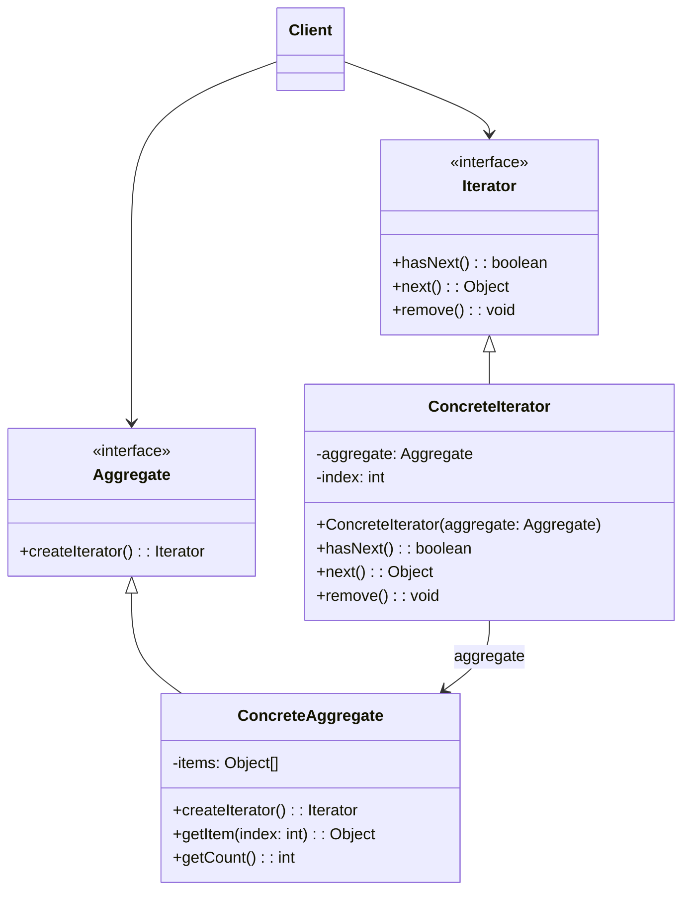

# 迭代器模式（Iterator Pattern）

> 提供一种方法顺序访问聚合对象中的各个元素，而又不需要暴露该对象的内部表示。这种模式属于行为型模式，它将遍历聚合对象的责任交给迭代器，从而简化了聚合类。

---

## 📋 基本信息

- **类型**: 行为型模式
- **难度**: ⭐⭐
- **使用频率**: ⭐⭐⭐⭐⭐
- **关键词**: 遍历集合、统一接口、隐藏内部结构、迭代器接口、聚合对象

---

## 🎯 模式意图

**核心思想**：提供一种方法来访问聚合对象中的元素，而不暴露聚合对象的内部结构，同时支持多种不同的遍历方式。

**解决的问题**：
- 如何不暴露聚合对象的内部结构而遍历其元素
- 如何为不同的聚合结构提供统一的遍历接口
- 如何支持多种遍历方式
- 如何将遍历算法与聚合对象分离

**适用场景**：
- 📚 **集合框架**：如列表、集合、映射等容器的遍历
- 📊 **数据结构**：树、图等复杂数据结构的遍历
- 🔄 **多种遍历方式**：需要为一个聚合对象提供多种遍历方式
- 🧩 **隐藏内部实现**：不希望暴露聚合对象的内部结构
- 📱 **统一接口**：需要为不同的聚合结构提供统一的遍历接口
- 🚀 **遍历算法复用**：希望遍历算法可以独立于聚合而变化

## 🏗️ UML类图



**核心角色**：
- **Iterator（迭代器）**：定义遍历元素的接口，包括hasNext()、next()等方法
- **ConcreteIterator（具体迭代器）**：实现迭代器接口，跟踪遍历位置
- **Aggregate（聚合）**：定义创建迭代器对象的接口
- **ConcreteAggregate（具体聚合）**：实现创建迭代器的接口，返回具体迭代器实例
- **Client（客户端）**：使用迭代器遍历聚合对象

**迭代器模式变体**：
1. **内部迭代器**：由聚合对象控制遍历过程
2. **外部迭代器**：由客户端控制遍历过程
3. **双向迭代器**：支持向前和向后遍历
4. **跳跃迭代器**：支持按指定步长跳跃遍历
5. **过滤迭代器**：支持按条件过滤元素
6. **惰性迭代器**：按需计算和返回元素

## 💻 代码实现

### 1. 基础实现

```java
// 迭代器接口
public interface Iterator {
    boolean hasNext();
    Object next();
    void remove();
}

// 聚合接口
public interface Aggregate {
    Iterator createIterator();
}

// 具体迭代器
public class ConcreteIterator implements Iterator {
    private ConcreteAggregate aggregate;
    private int index;

    public ConcreteIterator(ConcreteAggregate aggregate) {
        this.aggregate = aggregate;
        this.index = 0;
    }

    @Override
    public boolean hasNext() {
        return index < aggregate.getCount();
    }

    @Override
    public Object next() {
        if (this.hasNext()) {
            return aggregate.getItem(index++);
        }
        return null;
    }

    @Override
    public void remove() {
        // 实现删除当前元素的逻辑
        aggregate.removeItem(index - 1);
        index--;
    }
}

// 具体聚合
public class ConcreteAggregate implements Aggregate {
    private Object[] items;
    private int size = 0;
    private static final int DEFAULT_CAPACITY = 10;

    public ConcreteAggregate() {
        items = new Object[DEFAULT_CAPACITY];
    }

    public void addItem(Object item) {
        if (size >= items.length) {
            // 扩容逻辑
            Object[] newItems = new Object[items.length * 2];
            System.arraycopy(items, 0, newItems, 0, items.length);
            items = newItems;
        }
        items[size++] = item;
    }

    public void removeItem(int index) {
        if (index >= 0 && index < size) {
            System.arraycopy(items, index + 1, items, index, size - index - 1);
            items[--size] = null;
        }
    }

    public Object getItem(int index) {
        return items[index];
    }

    public int getCount() {
        return size;
    }

    @Override
    public Iterator createIterator() {
        return new ConcreteIterator(this);
    }
}

// 客户端代码
public class Client {
    public static void main(String[] args) {
        ConcreteAggregate aggregate = new ConcreteAggregate();
        aggregate.addItem("元素1");
        aggregate.addItem("元素2");
        aggregate.addItem("元素3");
        aggregate.addItem("元素4");

        Iterator iterator = aggregate.createIterator();
        System.out.println("遍历聚合元素:");
        while (iterator.hasNext()) {
            System.out.println(iterator.next());
        }

        // 演示删除操作
        iterator = aggregate.createIterator();
        iterator.next(); // 移动到第一个元素
        iterator.next(); // 移动到第二个元素
        iterator.remove(); // 删除第二个元素

        System.out.println("删除第二个元素后遍历:");
        iterator = aggregate.createIterator();
        while (iterator.hasNext()) {
            System.out.println(iterator.next());
        }
    }
}
```

### 2. 泛型迭代器实现

```java
// 泛型迭代器接口
public interface GenericIterator<T> {
    boolean hasNext();
    T next();
    void remove();
}

// 泛型聚合接口
public interface GenericAggregate<T> {
    GenericIterator<T> createIterator();
}

// 泛型具体迭代器
public class ConcreteGenericIterator<T> implements GenericIterator<T> {
    private ConcreteGenericAggregate<T> aggregate;
    private int index;

    public ConcreteGenericIterator(ConcreteGenericAggregate<T> aggregate) {
        this.aggregate = aggregate;
        this.index = 0;
    }

    @Override
    public boolean hasNext() {
        return index < aggregate.getCount();
    }

    @Override
    public T next() {
        if (this.hasNext()) {
            return aggregate.getItem(index++);
        }
        return null;
    }

    @Override
    public void remove() {
        aggregate.removeItem(index - 1);
        index--;
    }
}

// 泛型具体聚合
public class ConcreteGenericAggregate<T> implements GenericAggregate<T> {
    private T[] items;
    private int size = 0;
    private static final int DEFAULT_CAPACITY = 10;

    @SuppressWarnings("unchecked")
    public ConcreteGenericAggregate() {
        items = (T[]) new Object[DEFAULT_CAPACITY];
    }

    public void addItem(T item) {
        if (size >= items.length) {
            @SuppressWarnings("unchecked")
            T[] newItems = (T[]) new Object[items.length * 2];
            System.arraycopy(items, 0, newItems, 0, items.length);
            items = newItems;
        }
        items[size++] = item;
    }

    public void removeItem(int index) {
        if (index >= 0 && index < size) {
            System.arraycopy(items, index + 1, items, index, size - index - 1);
            items[--size] = null;
        }
    }

    public T getItem(int index) {
        return items[index];
    }

    public int getCount() {
        return size;
    }

    @Override
    public GenericIterator<T> createIterator() {
        return new ConcreteGenericIterator<>(this);
    }
}
```

### 3. Java集合框架中的迭代器使用

```java
// Java迭代器使用示例
public class JavaIteratorExample {
    public static void main(String[] args) {
        // ArrayList迭代器
        List<String> list = new ArrayList<>();
        list.add("Apple");
        list.add("Banana");
        list.add("Cherry");

        System.out.println("ArrayList遍历:");
        Iterator<String> listIterator = list.iterator();
        while (listIterator.hasNext()) {
            String fruit = listIterator.next();
            System.out.println(fruit);
            if (fruit.equals("Banana")) {
                listIterator.remove(); // 删除元素
            }
        }

        // LinkedList双向迭代器
        LinkedList<Integer> linkedList = new LinkedList<>();
        linkedList.add(1);
        linkedList.add(2);
        linkedList.add(3);

        System.out.println("LinkedList双向遍历:");
        ListIterator<Integer> linkedListIterator = linkedList.listIterator();

        System.out.println("向前遍历:");
        while (linkedListIterator.hasNext()) {
            System.out.println(linkedListIterator.next());
        }

        System.out.println("向后遍历:");
        while (linkedListIterator.hasPrevious()) {
            System.out.println(linkedListIterator.previous());
        }
    }
}
```

## 🔍 源码应用

### Java集合框架中的迭代器
- **`java.util.Iterator`**：Java集合框架的迭代器接口
- **`java.util.ListIterator`**：列表的双向迭代器接口
- **`java.util.Spliterator`**：支持并行遍历的迭代器
- **`java.util.Collection.iterator()`**：集合的迭代器方法

```java
// Java集合迭代器源码片段示例
public interface Collection<E> extends Iterable<E> {
    // ...
    Iterator<E> iterator();
    // ...
}

// ArrayList的迭代器实现
public class ArrayList<E> extends AbstractList<E> {
    // ...
    public Iterator<E> iterator() {
        return new Itr();
    }

    private class Itr implements Iterator<E> {
        int cursor;       // index of next element to return
        int lastRet = -1; // index of last element returned; -1 if no such
        int expectedModCount = modCount;

        public boolean hasNext() {
            return cursor != size;
        }

        @SuppressWarnings("unchecked")
        public E next() {
            checkForComodification();
            int i = cursor;
            if (i >= size)
                throw new NoSuchElementException();
            Object[] elementData = ArrayList.this.elementData;
            if (i >= elementData.length)
                throw new ConcurrentModificationException();
            cursor = i + 1;
            return (E) elementData[lastRet = i];
        }

        public void remove() {
            if (lastRet < 0)
                throw new IllegalStateException();
            checkForComodification();

            try {
                ArrayList.this.remove(lastRet);
                cursor = lastRet;
                lastRet = -1;
                expectedModCount = modCount;
            } catch (IndexOutOfBoundsException ex) {
                throw new ConcurrentModificationException();
            }
        }
        // ...
    }
    // ...
}
```

### Spring框架中的应用
- **`org.springframework.util.MultiValueMap`**：多值映射的迭代器
- **`org.springframework.core.io.support.ResourcePatternResolver`**：资源迭代器
- **`org.springframework.beans.factory.config.BeanDefinitionIterator`**：Bean定义迭代器

## ⚠️ 注意事项

1. **并发修改异常**：迭代过程中修改聚合对象可能导致`ConcurrentModificationException`

2. **迭代器失效**：聚合结构变化可能导致迭代器失效

3. **空指针异常**：调用`next()`前未检查`hasNext()`

4. **线程安全**：大多数迭代器不是线程安全的

5. **.remove()方法限制**：每次调用`next()`后只能调用一次`remove()`

## 🎓 最佳实践

1. **使用接口编程**：针对Iterator接口编程，而非具体实现

2. **优先使用foreach**：在Java中优先使用foreach循环（内部迭代器）

```java
// 推荐
for (Element element : collection) {
    // 处理元素
}
```

3. **使用Java 8+ Stream API**：对于复杂的集合操作，使用Stream API

```java
collection.stream()
    .filter(e -> e.isValid())
    .map(Element::transform)
    .forEach(System.out::println);
```

4. **支持foreach循环**：实现Iterable接口，支持foreach语法

5. **避免暴露内部结构**：不要在迭代器中暴露聚合内部数据结构

## 📚 相关模式

- **组合模式**：通常与迭代器模式一起使用，遍历组合对象
- **工厂方法模式**：聚合对象使用工厂方法创建迭代器
- **访问者模式**：迭代器遍历对象结构，访问者操作对象
- **策略模式**：不同的迭代算法可以用策略模式实现
- **适配器模式**：可以将枚举或其他遍历接口适配为迭代器

