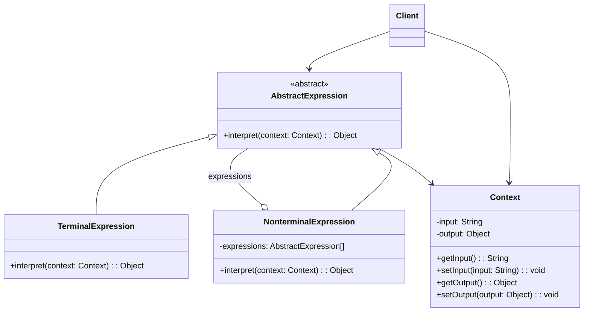

## 解释器模式 (Interpreter Pattern)

### 概述
解释器模式（Interpreter Pattern）提供了一种解释语言的语法或表达式的方式，它属于行为型模式。这种模式实现了一个表达式接口，该接口解释一个特定的上下文。解释器模式通常被用在SQL解析、符号处理引擎等场景。

## 🎯 模式意图

**核心思想**：给定一个语言，定义它的文法的一种表示，并定义一个解释器，这个解释器使用该表示来解释语言中的句子。

**解决的问题**：
- 如何为简单的语言定义语法解释器
- 如何将语法规则表示为对象
- 如何解释句子并执行相应操作
- 如何处理语法规则的组合和嵌套

**适用场景**：
- 📝 **编程语言解释器**：如SQL解析器、表达式计算器
- 🔤 **正则表达式处理**：模式匹配和文本分析
- 🧮 **公式解析**：数学表达式计算
- 📊 **报表生成器**：自定义报表模板解析
- ⚙️ **配置文件解析**：特定格式的配置文件解释
- 📱 **领域特定语言(DSL)**：为特定领域设计的简单语言
- 🚦 **规则引擎**：业务规则的定义和执行

## 🏗️ UML类图



**核心角色**：
- **AbstractExpression（抽象表达式）**：声明一个抽象的解释操作，这个接口为抽象语法树中所有的节点所共享
- **TerminalExpression（终结符表达式）**：实现与文法中的终结符相关联的解释操作
- **NonterminalExpression（非终结符表达式）**：为文法中的非终结符实现解释操作
- **Context（上下文）**：包含解释器之外的一些全局信息
- **Client（客户端）**：构建表示该文法定义的语言中一个特定句子的抽象语法树，调用解释操作

**解释器模式变体**：
1. **语法导向解释器**：基于语法规则的解释器
2. **树状解释器**：使用抽象语法树(AST)进行解释
3. **组合解释器**：结合组合模式的解释器
4. **递归下降解释器**：通过递归实现的解释器
5. **表驱动解释器**：使用表格定义语法规则

## 💻 代码实现

### 1. 基础实现（简单加减表达式）

```java
// 上下文类
public class Context {
    private String input;
    private int output;

    public Context(String input) {
        this.input = input;
    }

    public String getInput() { return input; }
    public void setInput(String input) { this.input = input; }
    public int getOutput() { return output; }
    public void setOutput(int output) { this.output = output; }
}

// 抽象表达式
public abstract class AbstractExpression {
    public abstract void interpret(Context context);
}

// 数字表达式（终结符表达式）
public class NumberExpression extends AbstractExpression {
    @Override
    public void interpret(Context context) {
        String input = context.getInput();
        StringBuilder numBuilder = new StringBuilder();
        
        // 提取数字
        for (int i = 0; i < input.length(); i++) {
            char c = input.charAt(i);
            if (Character.isDigit(c)) {
                numBuilder.append(c);
            } else {
                break;
            }
        }
        
        context.setOutput(Integer.parseInt(numBuilder.toString()));
        context.setInput(input.substring(numBuilder.length()));
    }
}

// 加法表达式（非终结符表达式）
public class AddExpression extends AbstractExpression {
    private AbstractExpression left;
    private AbstractExpression right;

    public AddExpression(AbstractExpression left, AbstractExpression right) {
        this.left = left;
        this.right = right;
    }

    @Override
    public void interpret(Context context) {
        left.interpret(context);
        int leftValue = context.getOutput();
        
        right.interpret(context);
        int rightValue = context.getOutput();
        
        context.setOutput(leftValue + rightValue);
    }
}

// 减法表达式（非终结符表达式）
public class SubtractExpression extends AbstractExpression {
    private AbstractExpression left;
    private AbstractExpression right;

    public SubtractExpression(AbstractExpression left, AbstractExpression right) {
        this.left = left;
        this.right = right;
    }

    @Override
    public void interpret(Context context) {
        left.interpret(context);
        int leftValue = context.getOutput();
        
        right.interpret(context);
        int rightValue = context.getOutput();
        
        context.setOutput(leftValue - rightValue);
    }
}

// 客户端代码
public class Client {
    public static void main(String[] args) {
        // 构建抽象语法树: 1 + 2 - 3
        AbstractExpression expression = new SubtractExpression(
            new AddExpression(
                new NumberExpression(),
                new NumberExpression()
            ),
            new NumberExpression()
        );

        Context context = new Context("1+2-3");
        expression.interpret(context);
        System.out.println("计算结果: " + context.getOutput()); // 输出: 0

        context = new Context("10+20-5");
        expression.interpret(context);
        System.out.println("计算结果: " + context.getOutput()); // 输出: 25
    }
}
```

### 2. 高级实现（算术表达式计算器）

```java
// 表达式接口
public interface Expression {
    int interpret(Context context);
}

// 数字表达式
public class Number implements Expression {
    private int number;

    public Number(int number) {
        this.number = number;
    }

    public Number(String number) {
        this.number = Integer.parseInt(number);
    }

    @Override
    public int interpret(Context context) {
        return number;
    }
}

// 变量表达式
public class Variable implements Expression {
    private String name;

    public Variable(String name) {
        this.name = name;
    }

    @Override
    public int interpret(Context context) {
        return context.lookup(this);
    }

    public String getName() {
        return name;
    }

    @Override
    public boolean equals(Object o) {
        if (this == o) return true;
        if (o == null || getClass() != o.getClass()) return false;
        Variable variable = (Variable) o;
        return Objects.equals(name, variable.name);
    }

    @Override
    public int hashCode() {
        return Objects.hash(name);
    }
}

// 加法表达式
public class Add implements Expression {
    private Expression leftExpression;
    private Expression rightExpression;

    public Add(Expression leftExpression, Expression rightExpression) {
        this.leftExpression = leftExpression;
        this.rightExpression = rightExpression;
    }

    @Override
    public int interpret(Context context) {
        return leftExpression.interpret(context) + rightExpression.interpret(context);
    }
}

// 减法表达式
public class Subtract implements Expression {
    private Expression leftExpression;
    private Expression rightExpression;

    public Subtract(Expression leftExpression, Expression rightExpression) {
        this.leftExpression = leftExpression;
        this.rightExpression = rightExpression;
    }

    @Override
    public int interpret(Context context) {
        return leftExpression.interpret(context) - rightExpression.interpret(context);
    }
}

// 乘法表达式
public class Multiply implements Expression {
    private Expression leftExpression;
    private Expression rightExpression;

    public Multiply(Expression leftExpression, Expression rightExpression) {
        this.leftExpression = leftExpression;
        this.rightExpression = rightExpression;
    }

    @Override
    public int interpret(Context context) {
        return leftExpression.interpret(context) * rightExpression.interpret(context);
    }
}

// 除法表达式
public class Divide implements Expression {
    private Expression leftExpression;
    private Expression rightExpression;

    public Divide(Expression leftExpression, Expression rightExpression) {
        this.leftExpression = leftExpression;
        this.rightExpression = rightExpression;
    }

    @Override
    public int interpret(Context context) {
        int divisor = rightExpression.interpret(context);
        if (divisor == 0) {
            throw new ArithmeticException("Division by zero");
        }
        return leftExpression.interpret(context) / divisor;
    }
}

// 上下文类
public class Context {
    private Map<Variable, Integer> variables = new HashMap<>();

    public int lookup(Variable variable) {
        return variables.getOrDefault(variable, 0);
    }

    public void assign(Variable variable, int value) {
        variables.put(variable, value);
    }
}

// 表达式解析器
public class ExpressionParser {
    private String expression;
    private int index;

    public Expression parse(String expression) {
        this.expression = expression;
        this.index = 0;
        return parseExpression();
    }

    private Expression parseExpression() {
        Expression left = parseTerm();
        while (index < expression.length()) {
            char operator = expression.charAt(index);
            if (operator == '+' || operator == '-') {
                index++;
                Expression right = parseTerm();
                if (operator == '+') {
                    left = new Add(left, right);
                } else {
                    left = new Subtract(left, right);
                }
            } else {
                break;
            }
        }
        return left;
    }

    private Expression parseTerm() {
        Expression left = parseFactor();
        while (index < expression.length()) {
            char operator = expression.charAt(index);
            if (operator == '*' || operator == '/') {
                index++;
                Expression right = parseFactor();
                if (operator == '*') {
                    left = new Multiply(left, right);
                } else {
                    left = new Divide(left, right);
                }
            } else {
                break;
            }
        }
        return left;
    }

    private Expression parseFactor() {
        skipWhitespace();
        if (index >= expression.length()) {
            throw new IllegalArgumentException("Unexpected end of expression");
        }

        char c = expression.charAt(index);
        if (Character.isDigit(c)) {
            return parseNumber();
        } else if (Character.isLetter(c)) {
            return parseVariable();
        } else if (c == '(') {
            index++;
            Expression expr = parseExpression();
            skipWhitespace();
            if (index >= expression.length() || expression.charAt(index) != ')') {
                throw new IllegalArgumentException("Mismatched parentheses");
            }
            index++;
            return expr;
        } else {
            throw new IllegalArgumentException("Unexpected character: " + c);
        }
    }

    private Number parseNumber() {
        int start = index;
        while (index < expression.length() && Character.isDigit(expression.charAt(index))) {
            index++;
        }
        return new Number(expression.substring(start, index));
    }

    private Variable parseVariable() {
        int start = index;
        while (index < expression.length() && Character.isLetter(expression.charAt(index))) {
            index++;
        }
        return new Variable(expression.substring(start, index));
    }

    private void skipWhitespace() {
        while (index < expression.length() && Character.isWhitespace(expression.charAt(index))) {
            index++;
        }
    }
}

// 高级计算器客户端
public class CalculatorClient {
    public static void main(String[] args) {
        // 简单表达式计算
        ExpressionParser parser = new ExpressionParser();
        Expression expr = parser.parse("10 + 20 * 3 - 15");
        System.out.println("10 + 20 * 3 - 15 = " + expr.interpret(new Context())); // 输出: 55

        // 带变量的表达式
        Context context = new Context();
        context.assign(new Variable("x"), 10);
        context.assign(new Variable("y"), 5);

        Expression variableExpr = parser.parse("x * (y + 3)");
        System.out.println("x * (y + 3) = " + variableExpr.interpret(context)); // 输出: 80

        // 复杂表达式
        Expression complexExpr = parser.parse("(100 / 2 + 30) * (5 - 2)");
        System.out.println("(100 / 2 + 30) * (5 - 2) = " + complexExpr.interpret(new Context())); // 输出: 240
    }
}
```

## 🔍 源码应用

### Java中的解释器模式
- **`java.util.Pattern`**：正则表达式解释器
- **`java.text.Format`**：格式化解释器
- **`java.text.SimpleDateFormat`**：日期格式化解释器
- **`javax.el.ELResolver`**：EL表达式解析器

```java
// Java正则表达式示例 (解释器模式应用)
public class JavaRegexExample {
    public static void main(String[] args) {
        String text = "Hello, my email is example@test.com and another is test@example.org";
        String pattern = "[A-Za-z0-9+_.-]+@[A-Za-z0-9.-]+",

        // 创建解释器
        Pattern emailPattern = Pattern.compile(pattern);
        Matcher matcher = emailPattern.matcher(text);

        // 解释并匹配
        System.out.println("找到的邮箱地址:");
        while (matcher.find()) {
            System.out.println(matcher.group());
        }
    }
}
```

### Spring框架中的应用
- **`org.springframework.expression.ExpressionParser`**：Spring表达式语言(SpEL)解析器
- **`org.springframework.expression.spel.standard.SpelExpressionParser`**：SpEL表达式解析实现
- **`org.springframework.expression.EvaluationContext`**：表达式计算上下文

```java
// Spring SpEL示例
public class SpringSpelExample {
    public static void main(String[] args) {
        // 创建SpEL解释器
        ExpressionParser parser = new SpelExpressionParser();
        EvaluationContext context = new StandardEvaluationContext();

        // 简单表达式
        Expression exp = parser.parseExpression("'Hello World'.concat('!')");
        String message = (String) exp.getValue();
        System.out.println(message); // 输出: Hello World!

        // 数学表达式
        exp = parser.parseExpression("100 * 2 + 300");
        int result = (Integer) exp.getValue();
        System.out.println(result); // 输出: 500

        // 设置变量
        context.setVariable("name", "Spring");
        exp = parser.parseExpression("'Hello ' + #name");
        message = (String) exp.getValue(context);
        System.out.println(message); // 输出: Hello Spring

        // 调用方法
        exp = parser.parseExpression("'hello'.toUpperCase()");
        message = (String) exp.getValue();
        System.out.println(message); // 输出: HELLO
    }
}
```

### 其他框架中的应用
- **OGNL**：对象图导航语言，用于Struts2等框架
- **MVEL**：一种表达式语言，用于规则引擎
- **JEXL**：Apache Commons JEXL表达式语言
- **Thymeleaf**：模板引擎中的表达式解析
- **MyBatis**：动态SQL中的表达式解析
- **Elasticsearch**：查询DSL解析

## ⚠️ 注意事项

1. **复杂性问题**：解释器模式容易导致类膨胀，文法规则越多，需要的类就越多

2. **效率问题**：解释器模式通常使用递归调用，效率较低

3. **可维护性**：复杂文法难以维护和调试

4. **适用范围有限**：只适用于简单的文法表示

5. **循环依赖**：可能导致表达式之间的循环依赖

6. **错误处理**：错误定位和处理比较困难

7. **扩展性**：添加新的文法规则需要添加新的类

8. **安全性**：动态解析表达式可能带来安全风险

## 🎓 最佳实践

1. **使用组合模式**：结合组合模式构建抽象语法树

2. **使用工厂方法**：创建表达式对象

```java
public class ExpressionFactory {
    public static Expression createExpression(String type, Expression... expressions) {
        switch (type) {
            case "+": return new Add(expressions[0], expressions[1]);
            case "-": return new Subtract(expressions[0], expressions[1]);
            case "*": return new Multiply(expressions[0], expressions[1]);
            case "/": return new Divide(expressions[0], expressions[1]);
            default: throw new IllegalArgumentException("Unknown operator: " + type);
        }
    }
}
```

3. **使用访问者模式**：为表达式添加新的操作而不修改表达式类

4. **缓存表达式**：对于频繁使用的表达式进行缓存

5. **限制适用范围**：只在简单文法场景下使用

6. **提供良好的错误信息**：解析错误时提供详细的错误位置和原因

7. **使用单元测试**：为每种表达式类型编写单元测试

8. **考虑使用现有解析器**：优先使用成熟的解析器库而非自己实现

9. **使用构建器模式**：构建复杂的表达式对象

10. **实现表达式优化**：对表达式进行语法优化

## 📚 相关模式

- **组合模式**：解释器模式的抽象语法树是组合模式的应用
- **工厂方法模式**：用于创建表达式对象
- **访问者模式**：可以在不改变表达式类的情况下添加新的操作
- **迭代器模式**：遍历抽象语法树
- **备忘录模式**：保存和恢复表达式的状态
- **策略模式**：不同的解释策略
- **模板方法模式**：定义解释的骨架
- **装饰器模式**：为表达式添加额外功能