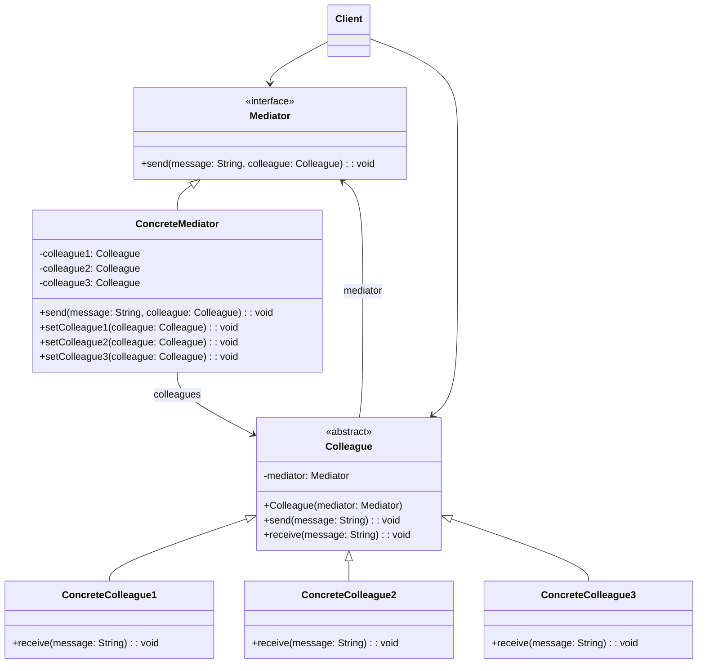

## 中介者模式 (Mediator Pattern)

### 概述
中介者模式（Mediator Pattern）定义了一个中介对象来封装一系列对象之间的交互，使原有对象之间的耦合松散，且可以独立地改变它们之间的交互。中介者模式属于行为型模式，它通过引入中介者对象，将系统中对象之间的多对多关系转变为一对多关系，从而降低系统的复杂性。

## 🎯 模式意图

**核心思想**：用一个中介对象来封装一系列的对象交互，中介者使各对象不需要显式地相互引用，从而使其耦合松散，而且可以独立地改变它们之间的交互。

**解决的问题**：
- 如何解决对象之间复杂的相互依赖关系
- 如何减少对象之间的直接通信
- 如何简化对象之间的交互逻辑
- 如何集中控制对象之间的交互

**适用场景**：
- 🕸️ **对象间存在复杂交互**：系统中对象之间存在复杂的引用关系，产生的相互依赖关系结构混乱且难以理解
- 💻 **GUI组件通信**：如窗口、按钮、文本框等组件之间的交互
- 📱 **聊天系统**：用户之间通过服务器进行消息转发
- 🏦 **银行交易系统**：不同账户之间的转账需要通过银行系统中介
- 🎮 **游戏开发**：游戏对象之间的交互管理
- 🚦 **交通控制系统**：飞机、火车等交通工具的调度
- 🏢 **部门协作**：企业中不同部门之间通过经理进行协调
- 📊 **微服务架构**：服务之间通过API网关进行通信

## 🏗️ UML类图



**核心角色**：
- **Mediator（抽象中介者）**：定义中介者接口，声明了用于与各同事对象通信的方法
- **ConcreteMediator（具体中介者）**：实现抽象中介者接口，协调各个同事对象来实现协作行为，了解并维护它的各个同事
- **Colleague（抽象同事类）**：定义同事类的接口，保存中介者对象，提供同事对象交互的抽象方法
- **ConcreteColleague（具体同事类）**：实现抽象同事类，当需要与其他同事通信时，通过中介者对象进行
- **Client（客户端）**：创建中介者对象并设置同事对象之间的关联

**中介者模式变体**：
1. **Facade-Mediator混合**：兼具外观模式和中介者模式的特点
2. **Mediator-Singleton**：中介者实现为单例模式
3. **Event-Based Mediator**：基于事件的中介者实现
4. **Chat Room Mediator**：聊天室模式，允许多个同事通过中介者交流
5. **Broker Mediator**：经纪人模式，负责协调分布式系统中的对象

## 💻 代码实现

### 1. 基础实现（聊天室中介者）

```java
// 抽象中介者
public interface Mediator {
    void send(String message, Colleague colleague);
}

// 抽象同事类
public abstract class Colleague {
    protected Mediator mediator;
    protected String name;

    public Colleague(Mediator mediator, String name) {
        this.mediator = mediator;
        this.name = name;
    }

    public void send(String message) {
        System.out.println(name + " 发送: " + message);
        mediator.send(message, this);
    }

    public abstract void receive(String message);
}

// 具体中介者 - 聊天室
public class ChatRoomMediator implements Mediator {
    private List<Colleague> colleagues = new ArrayList<>();

    public void addColleague(Colleague colleague) {
        colleagues.add(colleague);
    }

    @Override
    public void send(String message, Colleague sender) {
        for (Colleague colleague : colleagues) {
            // 不发送给自己
            if (colleague != sender) {
                colleague.receive(message);
            }
        }
    }
}

// 具体同事类 - 用户
public class UserColleague extends Colleague {
    public UserColleague(Mediator mediator, String name) {
        super(mediator, name);
    }

    @Override
    public void receive(String message) {
        System.out.println(name + " 接收: " + message);
    }
}

// 客户端代码
public class Client {
    public static void main(String[] args) {
        // 创建中介者
        Mediator chatRoom = new ChatRoomMediator();

        // 创建同事
        Colleague alice = new UserColleague(chatRoom, "Alice");
        Colleague bob = new UserColleague(chatRoom, "Bob");
        Colleague charlie = new UserColleague(chatRoom, "Charlie");

        // 将同事加入中介者
        ((ChatRoomMediator) chatRoom).addColleague(alice);
        ((ChatRoomMediator) chatRoom).addColleague(bob);
        ((ChatRoomMediator) chatRoom).addColleague(charlie);

        // 发送消息
        System.out.println("===== 聊天开始 =====");
        alice.send("大家好!");
        System.out.println();
        bob.send("欢迎加入聊天室!");
        System.out.println();
        charlie.send("很高兴认识大家!");
    }
}
```

### 2. 高级实现（智能家居控制系统）

```java
// 设备类型枚举
public enum DeviceType {
    LIGHT, TV, AIR_CONDITIONER, SPEAKER
}

// 抽象中介者 - 智能家居中心
public interface SmartHomeMediator {
    void registerDevice(Device device);
    void sendCommand(Command command, Device sender);
    void deviceStatusChanged(Device device, boolean status);
}

// 具体中介者 - 智能家居控制中心
public class SmartHomeControlCenter implements SmartHomeMediator {
    private Map<DeviceType, List<Device>> devices = new HashMap<>();
    private Map<String, Device> deviceMap = new HashMap<>();

    @Override
    public void registerDevice(Device device) {
        DeviceType type = device.getType();
        devices.computeIfAbsent(type, k -> new ArrayList<>()).add(device);
        deviceMap.put(device.getId(), device);
        System.out.println("设备注册: " + device.getName() + " (" + type + ")");
    }

    @Override
    public void sendCommand(Command command, Device sender) {
        System.out.println("\n[控制中心] 收到来自 " + sender.getName() + " 的命令: " + command);

        switch (command.getType()) {
            case TURN_ON:
                executeTurnOnCommand(command.getTargetDeviceId());
                break;
            case TURN_OFF:
                executeTurnOffCommand(command.getTargetDeviceId());
                break;
            case ADJUST:
                executeAdjustCommand(command.getTargetDeviceId(), command.getValue());
                break;
            case SCENE:
                executeSceneCommand(command.getValue());
                break;
            default:
                System.out.println("不支持的命令类型: " + command.getType());
        }
    }

    @Override
    public void deviceStatusChanged(Device device, boolean status) {
        System.out.println("\n[控制中心] 设备状态变化: " + device.getName() + " - " + (status ? "开启" : "关闭"));

        // 自动化场景逻辑
        if (device.getType() == DeviceType.LIGHT && !status) {
            // 如果灯光关闭，自动关闭电视和音响
            turnOffDevices(DeviceType.TV);
            turnOffDevices(DeviceType.SPEAKER);
        } else if (device.getType() == DeviceType.TV && status) {
            // 如果电视开启，自动关闭灯光并打开空调
            turnOffDevices(DeviceType.LIGHT);
            turnOnDevices(DeviceType.AIR_CONDITIONER);
        }
    }

    private void executeTurnOnCommand(String deviceId) {
        Device device = deviceMap.get(deviceId);
        if (device != null) {
            device.turnOn();
        } else {
            System.out.println("设备不存在: " + deviceId);
        }
    }

    private void executeTurnOffCommand(String deviceId) {
        Device device = deviceMap.get(deviceId);
        if (device != null) {
            device.turnOff();
        } else {
            System.out.println("设备不存在: " + deviceId);
        }
    }

    private void executeAdjustCommand(String deviceId, String value) {
        Device device = deviceMap.get(deviceId);
        if (device != null && device instanceof AdjustableDevice) {
            ((AdjustableDevice) device).adjust(value);
        } else {
            System.out.println("设备不支持调节或不存在: " + deviceId);
        }
    }

    private void executeSceneCommand(String sceneName) {
        System.out.println("执行场景: " + sceneName);

        switch (sceneName.toLowerCase()) {
            case "电影模式":
                turnOffDevices(DeviceType.LIGHT);
                turnOnDevices(DeviceType.TV);
                turnOnDevices(DeviceType.SPEAKER);
                adjustDevices(DeviceType.AIR_CONDITIONER, "24");
                break;
            case "睡眠模式":
                turnOffDevices(DeviceType.TV);
                turnOffDevices(DeviceType.SPEAKER);
                turnOnDevices(DeviceType.LIGHT);
                adjustDevices(DeviceType.AIR_CONDITIONER, "26");
                break;
            case "离家模式":
                turnOffAllDevices();
                break;
            default:
                System.out.println("不支持的场景: " + sceneName);
        }
    }

    private void turnOnDevices(DeviceType type) {
        List<Device> deviceList = devices.getOrDefault(type, Collections.emptyList());
        deviceList.forEach(Device::turnOn);
    }

    private void turnOffDevices(DeviceType type) {
        List<Device> deviceList = devices.getOrDefault(type, Collections.emptyList());
        deviceList.forEach(Device::turnOff);
    }

    private void adjustDevices(DeviceType type, String value) {
        List<Device> deviceList = devices.getOrDefault(type, Collections.emptyList());
        deviceList.stream()
            .filter(d -> d instanceof AdjustableDevice)
            .forEach(d -> ((AdjustableDevice) d).adjust(value));
    }

    private void turnOffAllDevices() {
        devices.values().forEach(list -> list.forEach(Device::turnOff));
    }
}

// 命令类
public class Command {
    private CommandType type;
    private String targetDeviceId;
    private String value;

    // 构造器、getter和setter
    public Command(CommandType type, String targetDeviceId, String value) {
        this.type = type;
        this.targetDeviceId = targetDeviceId;
        this.value = value;
    }

    // Getters
    public CommandType getType() { return type; }
    public String getTargetDeviceId() { return targetDeviceId; }
    public String getValue() { return value; }
}

// 命令类型枚举
public enum CommandType {
    TURN_ON, TURN_OFF, ADJUST, SCENE
}

// 抽象同事类 - 设备
public abstract class Device {
    protected SmartHomeMediator mediator;
    protected String id;
    protected String name;
    protected DeviceType type;
    protected boolean status;

    public Device(SmartHomeMediator mediator, String id, String name, DeviceType type) {
        this.mediator = mediator;
        this.id = id;
        this.name = name;
        this.type = type;
        this.status = false;
    }

    public void turnOn() {
        if (!status) {
            status = true;
            System.out.println(name + " 已开启");
            mediator.deviceStatusChanged(this, true);
        } else {
            System.out.println(name + " 已经是开启状态");
        }
    }

    public void turnOff() {
        if (status) {
            status = false;
            System.out.println(name + " 已关闭");
            mediator.deviceStatusChanged(this, false);
        } else {
            System.out.println(name + " 已经是关闭状态");
        }
    }

    public void sendCommand(Command command) {
        mediator.sendCommand(command, this);
    }

    // Getters
    public String getId() { return id; }
    public String getName() { return name; }
    public DeviceType getType() { return type; }
    public boolean isStatus() { return status; }
}

// 可调节设备接口
public interface AdjustableDevice {
    void adjust(String value);
}

// 具体设备 - 智能灯
public class SmartLight extends Device {
    private int brightness = 100;
    private String color = "white";

    public SmartLight(SmartHomeMediator mediator, String id, String name) {
        super(mediator, id, name, DeviceType.LIGHT);
    }

    @Override
    public void turnOn() {
        super.turnOn();
        System.out.println("亮度: " + brightness + ", 颜色: " + color);
    }

    public void setBrightness(int brightness) {
        this.brightness = Math.max(0, Math.min(100, brightness));
        if (status) {
            System.out.println(name + " 亮度已调整为: " + this.brightness);
        }
    }

    public void setColor(String color) {
        this.color = color;
        if (status) {
            System.out.println(name + " 颜色已调整为: " + this.color);
        }
    }
}

// 具体设备 - 智能电视
public class SmartTV extends Device implements AdjustableDevice {
    private int volume = 50;
    private String channel = "CCTV-1";

    public SmartTV(SmartHomeMediator mediator, String id, String name) {
        super(mediator, id, name, DeviceType.TV);
    }

    @Override
    public void turnOn() {
        super.turnOn();
        System.out.println("频道: " + channel + ", 音量: " + volume);
    }

    public void changeChannel(String channel) {
        this.channel = channel;
        if (status) {
            System.out.println(name + " 频道已切换为: " + this.channel);
        }
    }

    public void setVolume(int volume) {
        this.volume = Math.max(0, Math.min(100, volume));
        if (status) {
            System.out.println(name + " 音量已调整为: " + this.volume);
        }
    }

    @Override
    public void adjust(String value) {
        try {
            int numValue = Integer.parseInt(value);
            setVolume(numValue);
        } catch (NumberFormatException e) {
            changeChannel(value);
        }
    }
}

// 具体设备 - 智能空调
public class SmartAirConditioner extends Device implements AdjustableDevice {
    private int temperature = 26;
    private String mode = "auto";

    public SmartAirConditioner(SmartHomeMediator mediator, String id, String name) {
        super(mediator, id, name, DeviceType.AIR_CONDITIONER);
    }

    @Override
    public void turnOn() {
        super.turnOn();
        System.out.println("温度: " + temperature + "°C, 模式: " + mode);
    }

    public void setTemperature(int temperature) {
        this.temperature = Math.max(16, Math.min(30, temperature));
        if (status) {
            System.out.println(name + " 温度已调整为: " + this.temperature + "°C");
        }
    }

    public void setMode(String mode) {
        this.mode = mode;
        if (status) {
            System.out.println(name + " 模式已切换为: " + this.mode);
        }
    }

    @Override
    public void adjust(String value) {
        try {
            int temp = Integer.parseInt(value);
            setTemperature(temp);
        } catch (NumberFormatException e) {
            setMode(value);
        }
    }
}

// 智能家居客户端
public class SmartHomeClient {
    public static void main(String[] args) {
        // 创建中介者 - 智能家居控制中心
        SmartHomeMediator mediator = new SmartHomeControlCenter();

        // 创建设备
        Device livingRoomLight = new SmartLight(mediator, "light-001", "客厅灯光");
        Device bedroomLight = new SmartLight(mediator, "light-002", "卧室灯光");
        Device tv = new SmartTV(mediator, "tv-001", "客厅电视");
        Device ac = new SmartAirConditioner(mediator, "ac-001", "客厅空调");

        // 注册设备到中介者
        mediator.registerDevice(livingRoomLight);
        mediator.registerDevice(bedroomLight);
        mediator.registerDevice(tv);
        mediator.registerDevice(ac);

        System.out.println("\n===== 开启电视 =====");
        tv.turnOn();

        System.out.println("\n===== 调整空调温度 =====");
        ac.sendCommand(new Command(CommandType.ADJUST, "ac-001", "24"));

        System.out.println("\n===== 执行电影模式 =====");
        tv.sendCommand(new Command(CommandType.SCENE, null, "电影模式"));

        System.out.println("\n===== 关闭灯光 =====");
        livingRoomLight.turnOff();
    }
}
```

## 🔍 源码应用

### Java中的中介者模式
- **`java.util.Timer`**：调度多个定时任务
- **`java.awt.EventQueue`**：AWT事件分发线程
- **`java.util.concurrent.Executor`**：线程池管理多个任务执行
- **`javax.swing.DefaultButtonModel`**：Swing组件模型
- **`java.beans.PropertyChangeSupport`**：JavaBean属性变更支持

```java
// Java PropertyChangeSupport示例（中介者模式应用）
public class PropertyChangeExample {
    public static class User implements PropertyChangeListener {
        private String name;

        @Override
        public void propertyChange(PropertyChangeEvent evt) {
            System.out.println("用户收到属性变更通知: " + evt.getPropertyName() + ": " + evt.getNewValue());
            this.name = (String) evt.getNewValue();
        }
    }

    public static class UserService {
        private PropertyChangeSupport support = new PropertyChangeSupport(this);
        private String userName;

        public void addPropertyChangeListener(PropertyChangeListener listener) {
            support.addPropertyChangeListener(listener);
        }

        public void setUserName(String userName) {
            String oldValue = this.userName;
            this.userName = userName;
            support.firePropertyChange("userName", oldValue, userName);
        }
    }

    public static void main(String[] args) {
        UserService service = new UserService();
        User user = new User();

        // 注册监听器（中介者模式中的同事注册）
        service.addPropertyChangeListener(user);

        // 设置属性，触发通知
        service.setUserName("张三");
        service.setUserName("李四");
    }
}
```

### Spring框架中的应用
- **`org.springframework.context.ApplicationContext`**：Spring容器作为中介者协调Bean之间的依赖关系
- **`org.springframework.messaging.MessageChannel`**：消息通道作为中介者传递消息
- **`org.springframework.web.servlet.DispatcherServlet`**：Spring MVC中的前端控制器，作为中介者协调请求处理流程
- **`org.springframework.cloud.netflix.zuul.ZuulFilter`**：API网关作为服务之间的中介者
- **`org.springframework.amqp.rabbit.core.RabbitTemplate`**：消息队列模板作为生产者和消费者之间的中介者

```java
// Spring DispatcherServlet工作流程（中介者模式应用）
/*
DispatcherServlet作为前端控制器，协调以下组件：
1. HandlerMapping - 映射请求到处理器
2. HandlerAdapter - 适配处理器执行
3. HandlerExceptionResolver - 处理异常
4. ViewResolver - 解析视图
5. RequestToViewNameTranslator - 转换请求到视图名
6. LocaleResolver - 解析本地化信息
7. ThemeResolver - 解析主题
8. MultipartResolver - 处理文件上传
*/

// Spring Cloud Zuul作为API网关（中介者模式应用）
@SpringBootApplication
@EnableZuulProxy
public class ZuulGatewayApplication {
    public static void main(String[] args) {
        SpringApplication.run(ZuulGatewayApplication.class, args);
    }
}

// 配置文件 application.yml
/*
zuul:
  routes:
    user-service:
      path: /user/**
      serviceId: user-service
    order-service:
      path: /order/**
      serviceId: order-service
    product-service:
      path: /product/**
      serviceId: product-service
*/
```

### 其他框架中的应用
- **Apache Camel**：企业集成模式框架，路由作为中介者
- **Spring Cloud Gateway**：微服务网关
- **Netty**：网络应用框架中的EventLoop
- **RabbitMQ/Kafka**：消息队列作为生产者和消费者的中介
- **Struts2**：ActionServlet作为前端控制器
- **MyBatis**：SqlSession作为中介协调数据库操作
- **Elasticsearch**：协调分布式节点之间的通信
- **Docker Swarm/Kubernetes**：容器编排系统作为容器的中介者

## ⚠️ 注意事项

1. **中介者膨胀风险**：随着同事类增加，中介者可能变得复杂庞大，成为"上帝对象"

2. **性能瓶颈**：中介者可能成为系统的性能瓶颈

3. **单点故障**：中介者故障会影响整个系统

4. **过度耦合**：中介者与同事类之间可能形成过度耦合

5. **并发处理**：多线程环境下需要考虑线程安全

6. **测试复杂度**：中介者的测试可能变得复杂

7. **可扩展性**：添加新的交互逻辑可能需要修改中介者

8. **状态管理**：中介者需要管理大量状态信息

## 🎓 最佳实践

1. **保持中介者简洁**：避免中介者承担过多责任

2. **拆分复杂中介者**：将大型中介者拆分为多个更小的中介者

```java
// 拆分复杂中介者示例
public class OrderMediator {
    private PaymentMediator paymentMediator;
    private InventoryMediator inventoryMediator;
    private ShippingMediator shippingMediator;
    private NotificationMediator notificationMediator;

    // 委托给专门的中介者处理特定功能
    public void processOrder(Order order) {
        // 检查库存
        boolean hasStock = inventoryMediator.checkStock(order);
        if (!hasStock) {
            notificationMediator.sendOutOfStockNotification(order);
            return;
        }

        // 处理支付
        boolean paymentSuccess = paymentMediator.processPayment(order);
        if (!paymentSuccess) {
            notificationMediator.sendPaymentFailedNotification(order);
            return;
        }

        // 安排发货
        shippingMediator.scheduleDelivery(order);

        // 发送通知
        notificationMediator.sendOrderConfirmation(order);
    }
}
```

3. **使用观察者模式**：结合观察者模式处理状态变化通知

4. **中介者接口化**：通过接口定义中介者，便于替换实现

5. **单例中介者**：对于全局中介者考虑使用单例模式

6. **事件驱动设计**：基于事件的中介者实现

7. **状态管理分离**：将状态管理与协调逻辑分离

8. **使用依赖注入**：通过依赖注入管理同事对象

9. **避免双向依赖**：防止中介者与同事类之间的双向依赖

10. **文档化交互规则**：清晰记录中介者与同事类之间的交互规则

## 📚 相关模式

- **外观模式**：都封装了复杂的交互，但外观模式关注简化接口，中介者模式关注协调交互
- **观察者模式**：都涉及对象间通信，但观察者模式是一对多依赖，中介者模式是多对多协调
- **单例模式**：中介者通常实现为单例
- **工厂模式**：创建同事对象
- **命令模式**：将中介者操作封装为命令
- **状态模式**：中介者可以使用状态模式管理自身状态
- **策略模式**：不同的中介策略
- **责任链模式**：请求处理链可以作为中介者的一种实现方式