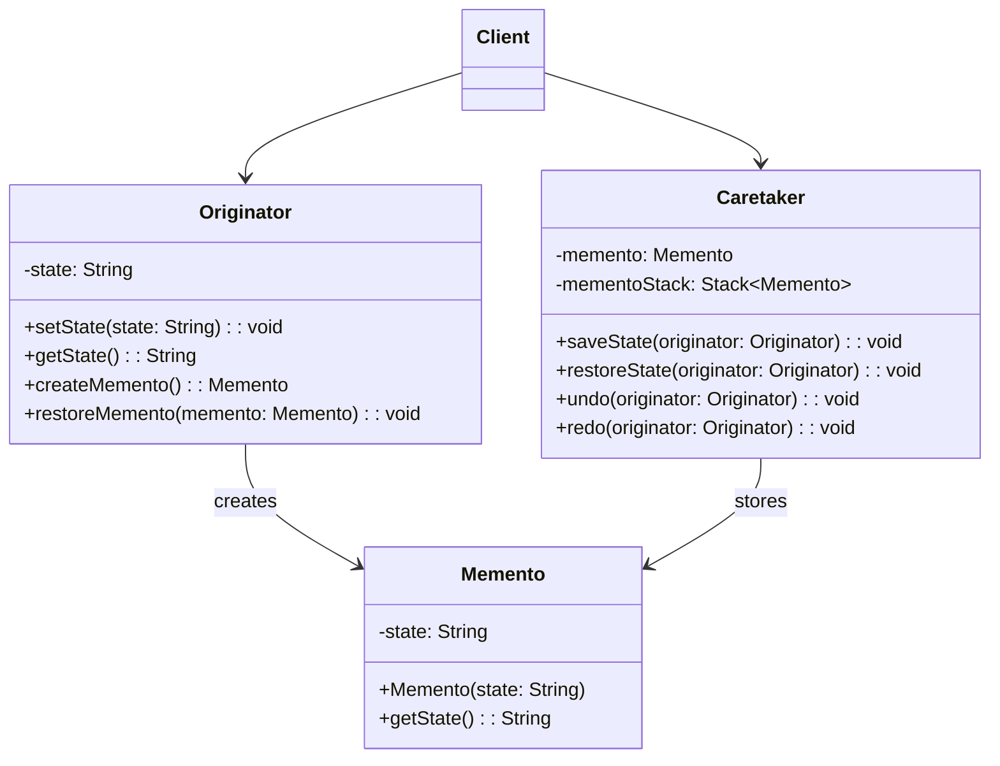

## 备忘录模式 (Memento Pattern)

### 概述
备忘录模式（Memento Pattern）在不破坏封装的前提下，捕获一个对象的内部状态，并在该对象之外保存这个状态，以便在需要时能将该对象恢复到原先保存的状态。它属于行为型模式，也被称为快照模式（Snapshot Pattern）或令牌模式（Token Pattern）。

## 🎯 模式意图

**核心思想**：在不暴露对象实现细节的情况下，捕获并保存对象的内部状态，以便后续可以将对象恢复到先前状态。

**解决的问题**：
- 如何在不破坏封装的前提下保存和恢复对象状态
- 如何实现撤销/重做功能
- 如何避免对象状态的外部暴露
- 如何简化对象状态管理

**适用场景**：
- 🔄 **撤销/重做功能**：文本编辑器、图形设计软件、IDE等
- 💾 **状态保存与恢复**：游戏存档、应用配置备份
- 📋 **事务管理**：数据库事务回滚机制
- 📊 **快照系统**：系统状态监控与恢复
- 📝 **表单填写**：分步表单的状态保存
- 🎮 **游戏开发**：角色状态保存
- 📱 **移动应用**：应用状态保存（如旋转屏幕时）
- 🔒 **权限管理**：临时权限切换
- 📄 **文档编辑**：版本控制
- 🧪 **测试框架**：测试用例状态管理
- ⚙️ **配置管理**：系统配置变更回滚
- 🌐 **浏览器历史**：网页浏览历史记录

## 🏗️ UML类图



**核心角色**：
- **Originator（发起人）**：创建一个备忘录，用以记录当前对象的内部状态，并可使用备忘录恢复内部状态
- **Memento（备忘录）**：存储Originator对象的内部状态，防止Originator以外的对象访问备忘录
- **Caretaker（管理者）**：负责保存好备忘录，不能对备忘录的内容进行操作或检查
- **Client（客户端）**：使用Originator、Caretaker进行状态管理

**备忘录模式变体**：
1. **白箱备忘录**：备忘录对所有对象可见
2. **黑箱备忘录**：备忘录只对发起人可见
3. **多状态备忘录**：存储对象的多个状态
4. **增量式备忘录**：只存储对象状态的变化部分
5. **版本化备忘录**：支持多个版本的状态管理
6. **复合备忘录**：存储复杂对象的状态
7. **加密备忘录**：对存储的状态进行加密保护

## 💻 代码实现

### 1. 基础实现（文本编辑器撤销功能）

```java
// 备忘录类
public class Memento {
    private String text;
    private int cursorPosition;
    private long timestamp;

    public Memento(String text, int cursorPosition) {
        this.text = text;
        this.cursorPosition = cursorPosition;
        this.timestamp = System.currentTimeMillis();
    }

    // 只有Originator可以访问这些方法
    String getText() { return text; }
    int getCursorPosition() { return cursorPosition; }
    long getTimestamp() { return timestamp; }
}

// 发起人 - 文本编辑器
public class TextEditorOriginator {
    private String text = "";
    private int cursorPosition = 0;

    public void type(String words) {
        text = text.substring(0, cursorPosition) + words + text.substring(cursorPosition);
        cursorPosition += words.length();
    }

    public void moveCursor(int position) {
        cursorPosition = Math.max(0, Math.min(position, text.length()));
    }

    public Memento createMemento() {
        return new Memento(text, cursorPosition);
    }

    public void restoreMemento(Memento memento) {
        this.text = memento.getText();
        this.cursorPosition = memento.getCursorPosition();
    }

    @Override
    public String toString() {
        return String.format("文本: '%s', 光标位置: %d", text, cursorPosition);
    }
}

// 管理者 - 历史记录
public class HistoryCaretaker {
    private Stack<Memento> undoStack = new Stack<>();
    private Stack<Memento> redoStack = new Stack<>();
    private static final int MAX_HISTORY_SIZE = 100;

    public void saveState(TextEditorOriginator editor) {
        // 保存当前状态到撤销栈
        undoStack.push(editor.createMemento());
        // 限制历史记录大小
        if (undoStack.size() > MAX_HISTORY_SIZE) {
            undoStack.remove(0);
        }
        // 清空重做栈
        redoStack.clear();
    }

    public void undo(TextEditorOriginator editor) {
        if (!undoStack.isEmpty()) {
            // 将当前状态保存到重做栈
            redoStack.push(editor.createMemento());
            // 从撤销栈恢复上一个状态
            Memento previousState = undoStack.pop();
            editor.restoreMemento(previousState);
        }
    }

    public void redo(TextEditorOriginator editor) {
        if (!redoStack.isEmpty()) {
            // 将当前状态保存到撤销栈
            undoStack.push(editor.createMemento());
            // 从重做栈恢复下一个状态
            Memento nextState = redoStack.pop();
            editor.restoreMemento(nextState);
        }
    }

    public void clearHistory() {
        undoStack.clear();
        redoStack.clear();
    }

    public int getUndoHistorySize() {
        return undoStack.size();
    }

    public int getRedoHistorySize() {
        return redoStack.size();
    }
}

// 客户端
public class Client {
    public static void main(String[] args) {
        TextEditorOriginator editor = new TextEditorOriginator();
        HistoryCaretaker caretaker = new HistoryCaretaker();

        System.out.println("初始状态: " + editor);

        // 输入文本并保存状态
        editor.type("Hello ");
        caretaker.saveState(editor);
        System.out.println("输入后: " + editor);

        // 继续输入并保存状态
        editor.type("World!");
        caretaker.saveState(editor);
        System.out.println("继续输入后: " + editor);

        // 撤销操作
        caretaker.undo(editor);
        System.out.println("撤销后: " + editor);

        // 再次撤销
        caretaker.undo(editor);
        System.out.println("再次撤销后: " + editor);

        // 重做操作
        caretaker.redo(editor);
        System.out.println("重做后: " + editor);

        // 移动光标并输入
        editor.moveCursor(5);
        editor.type("beautiful ");
        caretaker.saveState(editor);
        System.out.println("修改后: " + editor);
    }
}
```

### 2. 高级实现（游戏角色状态保存）

```java
import java.util.Date;
import java.util.HashMap;
import java.util.Map;
import java.util.Stack;

// 角色状态枚举
enum CharacterState {
    NORMAL, POISONED, BURNING, FROZEN, SLEEPING
}

// 装备类
class Equipment {
    private String name;
    private int attackBonus;
    private int defenseBonus;

    public Equipment(String name, int attackBonus, int defenseBonus) {
        this.name = name;
        this.attackBonus = attackBonus;
        this.defenseBonus = defenseBonus;
    }

    // Getters and toString
    public String getName() { return name; }
    public int getAttackBonus() { return attackBonus; }
    public int getDefenseBonus() { return defenseBonus; }

    @Override
    public String toString() {
        return name + "(攻击+" + attackBonus + ",防御+" + defenseBonus + ")";
    }
}

// 备忘录接口
interface Memento {
    long getTimestamp();
    String getSaveName();
}

// 角色状态备忘录
class CharacterMemento implements Memento {
    private final String characterName;
    private final int level;
    private final int hp;
    private final int mp;
    private final int experience;
    private final CharacterState state;
    private final Map<String, Equipment> equipment;
    private final long timestamp;
    private final String saveName;

    // 私有构造器，确保只有Originator可以创建
    private CharacterMemento(GameCharacter character, String saveName) {
        this.characterName = character.getName();
        this.level = character.getLevel();
        this.hp = character.getHp();
        this.mp = character.getMp();
        this.experience = character.getExperience();
        this.state = character.getState();
        this.equipment = new HashMap<>(character.getEquipment());
        this.timestamp = new Date().getTime();
        this.saveName = saveName;
    }

    // Getters
    public String getCharacterName() { return characterName; }
    public int getLevel() { return level; }
    public int getHp() { return hp; }
    public int getMp() { return mp; }
    public int getExperience() { return experience; }
    public CharacterState getState() { return state; }
    public Map<String, Equipment> getEquipment() { return new HashMap<>(equipment); }
    @Override
    public long getTimestamp() { return timestamp; }
    @Override
    public String getSaveName() { return saveName; }

    // 静态内部类，用于构建备忘录
    public static class MementoBuilder {
        private final GameCharacter character;
        private String saveName;

        public MementoBuilder(GameCharacter character) {
            this.character = character;
            this.saveName = "自动保存_" + new Date().getTime();
        }

        public MementoBuilder withSaveName(String saveName) {
            this.saveName = saveName;
            return this;
        }

        public CharacterMemento build() {
            return new CharacterMemento(character, saveName);
        }
    }
}

// 游戏角色（发起人）
class GameCharacter {
    private String name;
    private int level;
    private int hp;
    private int mp;
    private int experience;
    private CharacterState state;
    private Map<String, Equipment> equipment;

    public GameCharacter(String name) {
        this.name = name;
        this.level = 1;
        this.hp = 100;
        this.mp = 50;
        this.experience = 0;
        this.state = CharacterState.NORMAL;
        this.equipment = new HashMap<>();
    }

    // 战斗相关方法
    public void takeDamage(int damage) {
        this.hp = Math.max(0, this.hp - damage);
        if (this.hp == 0) {
            this.state = CharacterState.SLEEPING; // 假设HP为0进入睡眠状态
        }
    }

    public void gainExperience(int exp) {
        this.experience += exp;
        // 简单的升级逻辑
        while (this.experience >= level * 100) {
            levelUp();
        }
    }

    private void levelUp() {
        level++;
        hp = level * 100;
        mp = level * 50;
        experience -= (level - 1) * 100;
        System.out.println(name + "升级到" + level + "级！");
    }

    public void equip(String slot, Equipment equipment) {
        this.equipment.put(slot, equipment);
    }

    public void changeState(CharacterState newState) {
        this.state = newState;
    }

    // 创建备忘录
    public CharacterMemento createMemento() {
        return new CharacterMemento.MementoBuilder(this).build();
    }

    public CharacterMemento createMemento(String saveName) {
        return new CharacterMemento.MementoBuilder(this)
                .withSaveName(saveName)
                .build();
    }

    // 恢复备忘录
    public void restoreMemento(CharacterMemento memento) {
        this.level = memento.getLevel();
        this.hp = memento.getHp();
        this.mp = memento.getMp();
        this.experience = memento.getExperience();
        this.state = memento.getState();
        this.equipment = new HashMap<>(memento.getEquipment());
        System.out.println(name + "已恢复到状态: " + memento.getSaveName());
    }

    // Getters and toString
    public String getName() { return name; }
    public int getLevel() { return level; }
    public int getHp() { return hp; }
    public int getMp() { return mp; }
    public int getExperience() { return experience; }
    public CharacterState getState() { return state; }
    public Map<String, Equipment> getEquipment() { return new HashMap<>(equipment); }

    @Override
    public String toString() {
        StringBuilder sb = new StringBuilder();
        sb.append("角色: ").append(name)
          .append(" Lv").append(level)
          .append(" [HP:").append(hp)
          .append(", MP:").append(mp)
          .append(", EXP:").append(experience)
          .append(", 状态:").append(state).append("\n");
        sb.append("装备: ");
        if (equipment.isEmpty()) {
            sb.append("无");
        } else {
            equipment.forEach((slot, eq) -> sb.append(slot).append(":").append(eq).append(" "));
        }
        return sb.toString();
    }
}

// 游戏存档管理器（管理者）
class GameSaveManager {
    private Map<String, Memento> savedGames = new HashMap<>();
    private Stack<Memento> quickSaves = new Stack<>();
    private static final int MAX_QUICK_SAVES = 5;

    public void saveGame(Memento memento) {
        savedGames.put(memento.getSaveName(), memento);
        System.out.println("游戏已保存: " + memento.getSaveName());
    }

    public void quickSave(Memento memento) {
        if (quickSaves.size() >= MAX_QUICK_SAVES) {
            quickSaves.remove(0); // 移除最早的快速存档
        }
        quickSaves.push(memento);
        System.out.println("快速存档已创建 (" + quickSaves.size() + "/" + MAX_QUICK_SAVES + ")");
    }

    public Memento loadGame(String saveName) {
        return savedGames.get(saveName);
    }

    public Memento loadQuickSave() {
        if (!quickSaves.isEmpty()) {
            return quickSaves.peek();
        }
        return null;
    }

    public Memento undo() {
        if (quickSaves.size() > 1) {
            quickSaves.pop(); // 移除当前状态
            return quickSaves.peek(); // 返回上一个状态
        }
        return null;
    }

    public void listSaves() {
        System.out.println("\n可用存档:");
        savedGames.keySet().forEach(saveName -> System.out.println("- " + saveName));

        System.out.println("\n快速存档 (" + quickSaves.size() + "):");
        quickSaves.forEach(m -> System.out.println("- 快速存档 " + new Date(m.getTimestamp())));
    }
}

// 游戏客户端
public class GameClient {
    public static void main(String[] args) {
        // 创建游戏角色
        GameCharacter hero = new GameCharacter("勇者");
        GameSaveManager saveManager = new GameSaveManager();

        System.out.println("=== 初始状态 ===");
        System.out.println(hero);

        // 装备武器和 armor
        hero.equip("武器", new Equipment("铁剑", 10, 0));
        hero.equip(" armor", new Equipment("皮甲", 0, 5));
        saveManager.quickSave(hero.createMemento());

        System.out.println("\n=== 装备后 ===");
        System.out.println(hero);

        // 战斗获得经验
        hero.gainExperience(150);
        hero.takeDamage(30);
        saveManager.quickSave(hero.createMemento());

        System.out.println("\n=== 战斗后 ===");
        System.out.println(hero);

        // 遇到强大敌人
        hero.changeState(CharacterState.POISONED);
        hero.takeDamage(80);
        System.out.println("\n=== 战斗遇险 ===");
        System.out.println(hero);

        // 加载快速存档
        Memento lastSave = saveManager.loadQuickSave();
        if (lastSave instanceof CharacterMemento) {
            hero.restoreMemento((CharacterMemento) lastSave);
        }

        System.out.println("\n=== 加载存档后 ===");
        System.out.println(hero);

        // 创建命名存档
        saveManager.saveGame(hero.createMemento("准备挑战BOSS"));

        // 继续冒险
        hero.equip("武器", new Equipment("钢剑", 20, 0));
        hero.gainExperience(300);
        saveManager.quickSave(hero.createMemento());

        System.out.println("\n=== 继续冒险后 ===");
        System.out.println(hero);

        // 列出所有存档
        saveManager.listSaves();
    }
}
```

## 🔍 源码应用

### Java中的备忘录模式
- **`java.util.Date`**：`clone()`方法实现了简单的备忘录功能
- **`java.io.Serializable`**：对象序列化本质上是一种备忘录实现
- **`java.util.Stack`**：栈结构常用于实现撤销功能
- **`javax.swing.undo.UndoManager`**：Swing中的撤销管理器
- **`java.beans.XMLEncoder`/`XMLDecoder`**：对象XML序列化

```java
// Java Swing中的UndoManager使用示例
import javax.swing.*;
import javax.swing.undo.UndoManager;
import java.awt.*;
import java.awt.event.ActionEvent;
import java.awt.event.ActionListener;

public class TextEditorWithUndo extends JFrame {
    private JTextArea textArea;
    private UndoManager undoManager;

    public TextEditorWithUndo() {
        super("带撤销功能的文本编辑器");
        setDefaultCloseOperation(JFrame.EXIT_ON_CLOSE);
        setSize(400, 300);

        textArea = new JTextArea();
        undoManager = new UndoManager();
        textArea.getDocument().addUndoableEditListener(undoManager);

        JMenuBar menuBar = new JMenuBar();
        JMenu editMenu = new JMenu("编辑");

        JMenuItem undoItem = new JMenuItem("撤销");
        undoItem.addActionListener(e -> {
            if (undoManager.canUndo()) {
                undoManager.undo();
            }
        });

        JMenuItem redoItem = new JMenuItem("重做");
        redoItem.addActionListener(e -> {
            if (undoManager.canRedo()) {
                undoManager.redo();
            }
        });

        editMenu.add(undoItem);
        editMenu.add(redoItem);
        menuBar.add(editMenu);
        setJMenuBar(menuBar);

        add(new JScrollPane(textArea), BorderLayout.CENTER);
        setVisible(true);
    }

    public static void main(String[] args) {
        new TextEditorWithUndo();
    }
}
```

### Spring框架中的应用
- **`org.springframework.batch.item.ExecutionContext`**：批处理执行上下文
- **`org.springframework.webflow.execution.RequestContext`**：Web流程状态管理
- **`org.springframework.statemachine.StateMachine`**：状态机状态管理
- **`org.springframework.orm.hibernate5.SpringSessionContext`**：Hibernate会话管理
- **`org.springframework.transaction.support.TransactionSynchronizationManager`**：事务同步管理

```java
// Spring Batch ExecutionContext示例
public class OrderItemWriter implements ItemWriter<Order> {
    private ExecutionContext executionContext;

    @BeforeStep
    public void beforeStep(StepExecution stepExecution) {
        // 获取执行上下文（可以理解为一种备忘录）
        this.executionContext = stepExecution.getExecutionContext();
        // 从上下文恢复状态
        if (executionContext.containsKey("lastProcessedOrderId")) {
            Long lastId = executionContext.getLong("lastProcessedOrderId");
            System.out.println("从上次中断处恢复处理: " + lastId);
        }
    }

    @Override
    public void write(List<? extends Order> items) throws Exception {
        for (Order order : items) {
            // 处理订单
            processOrder(order);
            // 保存当前状态到执行上下文
            executionContext.putLong("lastProcessedOrderId", order.getId());
        }
    }

    private void processOrder(Order order) {
        // 订单处理逻辑
        System.out.println("处理订单: " + order.getId());
    }
}
```

### 其他框架中的应用
- **Git版本控制**：提交历史本质上是备忘录的集合
- **Eclipse IDE**：工作区状态保存
- **Android onSaveInstanceState()**：Activity状态保存
- **React状态管理**：Redux的时间旅行调试
- **Vuex**：Vue状态管理的快照功能
- **Underscore.js**：`_.clone()`方法
- **jQuery**：`.data()`方法存储状态
- **Word/Excel**：文档历史记录
- **Photoshop**：图层历史记录
- **IntelliJ IDEA**：本地历史记录功能

```javascript
// Redux中的时间旅行调试（备忘录模式应用）
import { createStore } from 'redux';

// 定义reducer
function counter(state = { value: 0 }, action) {
  switch (action.type) {
    case 'INCREMENT':
      return { value: state.value + 1 };
    case 'DECREMENT':
      return { value: state.value - 1 };
    default:
      return state;
  }
}

// 创建store
let store = createStore(counter);

// 可以通过store.getState()获取当前状态
// Redux DevTools通过保存每次状态变化实现时间旅行调试
// 这本质上就是备忘录模式的应用
```

## ⚠️ 注意事项

1. **内存消耗**：如果频繁创建备忘录或备忘录过大，可能导致内存问题

2. **封装破坏风险**：如果备忘录暴露了内部状态，会破坏封装性

3. **性能开销**：创建和恢复大型对象的备忘录可能影响性能

4. **状态一致性**：需要确保备忘录包含对象的完整状态

5. **深拷贝问题**：对于复杂对象，需要正确实现深拷贝

6. **安全问题**：敏感状态可能通过备忘录泄露

7. **版本兼容性**：不同版本间的备忘录可能不兼容

8. **存储管理**：需要合理管理备忘录的生命周期

## 🎓 最佳实践

1. **最小化备忘录内容**：只存储必要的状态信息

```java
// 优化备忘录大小示例
public Memento createMemento() {
    // 只保存变化的状态，而不是完整对象
    return new Memento(this.id, this.modifiedFields, this.version);
}
```

2. **使用接口隔离**：限制对备忘录内容的访问

```java
// 接口隔离示例
public interface ReadOnlyMemento {
    long getTimestamp();
}

public class ConcreteMemento implements ReadOnlyMemento {
    private String state;
    private long timestamp;

    // 只有Originator可以访问完整状态
    public String getState() { return state; }

    // 公开接口只提供有限信息
    @Override
    public long getTimestamp() { return timestamp; }
}
```

3. **实现深拷贝**：确保备忘录状态的独立性

```java
// 深拷贝实现示例
public class DeepCopyMemento {
    private ComplexObject state;

    public DeepCopyMemento(ComplexObject state) {
        // 实现深拷贝
        this.state = state.deepCopy();
    }
}
```

4. **使用原型模式**：结合原型模式实现高效的备忘录创建

5. **限制备忘录数量**：设置最大备忘录数量，避免内存溢出

6. **提供清理机制**：及时清理不再需要的备忘录

7. **使用序列化**：对于复杂对象，考虑使用序列化保存状态

8. **版本控制**：为备忘录添加版本信息，支持向前/向后兼容

9. **加密敏感信息**：对包含敏感数据的备忘录进行加密

10. **提供元数据**：为备忘录添加时间戳、版本号等元数据

## 📚 相关模式

- **状态模式**：都涉及对象状态管理，但状态模式关注状态变化时的行为改变，备忘录模式关注状态的保存与恢复
- **原型模式**：都涉及对象拷贝，原型模式关注对象复制，备忘录模式关注状态保存
- **命令模式**：都可用于实现撤销功能，命令模式记录操作，备忘录模式记录状态
- **迭代器模式**：可以结合使用来遍历备忘录历史
- **单例模式**：管理者(Caretaker)通常实现为单例
- **组合模式**：用于存储复杂对象的备忘录
- **装饰器模式**：可以为备忘录添加额外功能
- **代理模式**：控制对备忘录的访问
- **策略模式**：不同的备忘录存储策略