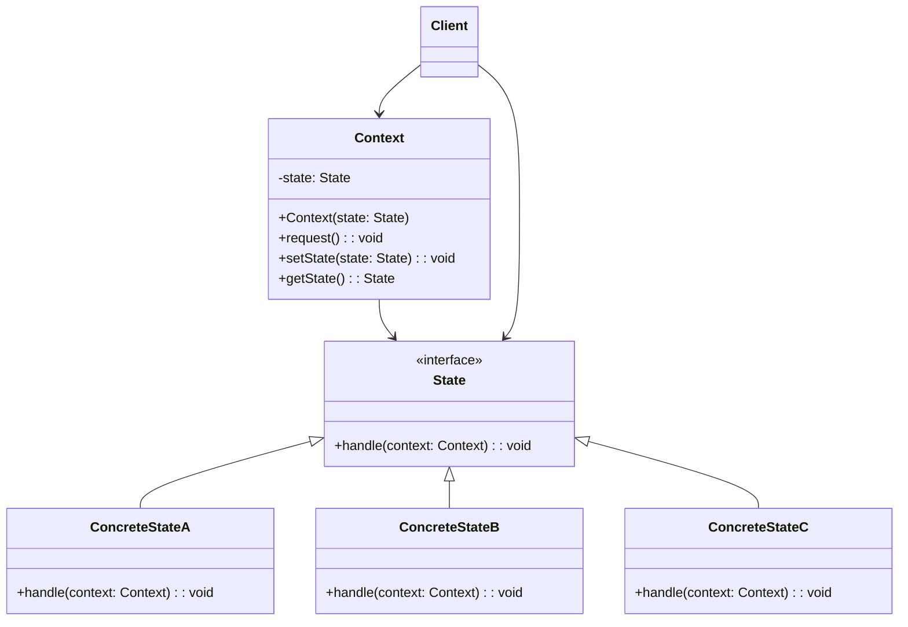

# 状态模式（State Pattern）

> 允许对象在内部状态改变时改变它的行为

---

## 📋 基本信息

- **类型**: 行为型模式
- **难度**: ⭐⭐⭐⭐
- **使用频率**: ⭐⭐⭐
- **关键词**: 状态机、状态转换、行为切换

---

## 🎯 模式意图

**核心思想**：允许对象在内部状态改变时改变它的行为，对象看起来好像修改了它的类。

**解决的问题**：
- 如何处理具有多种状态的对象，且状态转换逻辑复杂
- 如何避免使用大量条件语句（if-else/switch-case）来处理状态相关行为
- 如何将与特定状态相关的行为局部化
- 如何使状态转换更加明确和可维护

**适用场景**：
- 🚦 **状态驱动行为**：对象的行为依赖于其状态，且状态经常变化
- 🎮 **游戏开发**：角色状态（站立、行走、跳跃、攻击）
- 📱 **UI状态管理**：按钮状态（可用、禁用、悬停、点击）
- 📝 **文档编辑器**：文档状态（新建、编辑、保存、只读）
- 🏭 **工作流系统**：审批流程（提交、审核中、通过、拒绝）
- 📦 **订单系统**：订单状态（待支付、已支付、已发货、已完成）
- 📊 **状态机实现**：任何需要状态机的场景
- ⚙️ **设备管理**：设备状态（运行、暂停、故障、维护）
- 🚗 **交通控制系统**：交通信号灯
- 📡 **网络协议**：TCP连接状态（建立、传输、关闭）

## 🏗️ UML类图



**核心角色**：
- **Context（上下文）**：维护一个ConcreteState子类的实例，这个实例定义当前的状态
- **State（状态接口）**：定义一个接口，用以封装与Context的一个特定状态相关的行为
- **ConcreteState（具体状态）**：每一个子类实现一个与Context的一个状态相关的行为
- **Client（客户端）**：创建并配置具体状态对象，将状态对象注入到上下文

**状态模式变体**：
1. **简单状态机**：只有几个状态和简单转换
2. **分层状态机**：状态可以有子状态
3. **并发状态机**：对象可以同时处于多个状态
4. **被动状态机**：状态转换由外部触发
5. **主动状态机**：状态可以自己触发转换
6. **基于表的状态机**：使用状态转换表定义行为

## 💻 代码实现

### 1. 基础实现（交通信号灯）

```java
// 状态接口
public interface State {
    void handle(Context context);
    String getStateName();
}

// 上下文类
public class Context {
    private State state;

    public Context(State initialState) {
        this.state = initialState;
        System.out.println("初始状态: " + state.getStateName());
    }

    public void setState(State state) {
        this.state = state;
        System.out.println("状态转换: " + state.getStateName());
    }

    public void request() {
        state.handle(this);
    }

    public State getState() {
        return state;
    }
}

// 具体状态 - 红灯
public class RedLightState implements State {
    @Override
    public void handle(Context context) {
        System.out.println("红灯亮 - 车辆停止");
        // 3秒后切换到绿灯
        try {
            Thread.sleep(3000);
        } catch (InterruptedException e) {
            Thread.currentThread().interrupt();
        }
        context.setState(new GreenLightState());
    }

    @Override
    public String getStateName() {
        return "红灯";
    }
}

// 具体状态 - 绿灯
public class GreenLightState implements State {
    @Override
    public void handle(Context context) {
        System.out.println("绿灯亮 - 车辆通行");
        // 5秒后切换到黄灯
        try {
            Thread.sleep(5000);
        } catch (InterruptedException e) {
            Thread.currentThread().interrupt();
        }
        context.setState(new YellowLightState());
    }

    @Override
    public String getStateName() {
        return "绿灯";
    }
}

// 具体状态 - 黄灯
public class YellowLightState implements State {
    @Override
    public void handle(Context context) {
        System.out.println("黄灯亮 - 车辆准备停止");
        // 2秒后切换到红灯
        try {
            Thread.sleep(2000);
        } catch (InterruptedException e) {
            Thread.currentThread().interrupt();
        }
        context.setState(new RedLightState());
    }

    @Override
    public String getStateName() {
        return "黄灯";
    }
}

// 客户端
public class TrafficLightClient {
    public static void main(String[] args) {
        System.out.println("交通信号灯系统启动...");
        Context context = new Context(new RedLightState());

        // 模拟交通信号灯工作
        for (int i = 0; i < 6; i++) {
            System.out.println("\n--- 信号灯周期 " + (i + 1) + " ---");
            context.request();
        }
    }
}
```

### 2. 高级实现（订单状态管理）

```java
import java.util.ArrayList;
import java.util.Date;
import java.util.List;

// 订单事件枚举
enum OrderEvent {
    PAY, SHIP, DELIVER, CANCEL, REFUND
}

// 订单状态接口
interface OrderState {
    void handleEvent(OrderContext context, OrderEvent event);
    String getStateName();
}

// 订单上下文
class OrderContext {
    private OrderState currentState;
    private final String orderId;
    private final List<String> orderHistory = new ArrayList<>();
    private Date createTime;
    private Date payTime;
    private Date shipTime;
    private Date deliverTime;
    private Date cancelTime;
    private Date refundTime;

    public OrderContext(String orderId) {
        this.orderId = orderId;
        this.createTime = new Date();
        this.currentState = new PendingPaymentState();
        addHistory("订单创建");
    }

    public void setState(OrderState state) {
        this.currentState = state;
    }

    public void handleEvent(OrderEvent event) {
        currentState.handleEvent(this, event);
    }

    public void addHistory(String action) {
        orderHistory.add(new Date() + " - " + action + " - 当前状态: " + currentState.getStateName());
    }

    public void printHistory() {
        System.out.println("\n订单历史记录 (订单ID: " + orderId + "):");
        orderHistory.forEach(System.out::println);
    }

    // Getters and Setters for dates
    public String getOrderId() { return orderId; }
    public Date getCreateTime() { return createTime; }
    public Date getPayTime() { return payTime; }
    public void setPayTime(Date payTime) { this.payTime = payTime; }
    public Date getShipTime() { return shipTime; }
    public void setShipTime(Date shipTime) { this.shipTime = shipTime; }
    public Date getDeliverTime() { return deliverTime; }
    public void setDeliverTime(Date deliverTime) { this.deliverTime = deliverTime; }
    public Date getCancelTime() { return cancelTime; }
    public void setCancelTime(Date cancelTime) { this.cancelTime = cancelTime; }
    public Date getRefundTime() { return refundTime; }
    public void setRefundTime(Date refundTime) { this.refundTime = refundTime; }
    public String getCurrentStateName() { return currentState.getStateName(); }
}

// 待支付状态
class PendingPaymentState implements OrderState {
    @Override
    public void handleEvent(OrderContext context, OrderEvent event) {
        switch (event) {
            case PAY:
                context.setPayTime(new Date());
                context.setState(new PaidState());
                context.addHistory("订单支付成功");
                break;
            case CANCEL:
                context.setCancelTime(new Date());
                context.setState(new CancelledState());
                context.addHistory("订单已取消");
                break;
            default:
                System.out.println("错误: 待支付订单不能执行" + event + "操作");
        }
    }

    @Override
    public String getStateName() {
        return "待支付";
    }
}

// 已支付状态
class PaidState implements OrderState {
    @Override
    public void handleEvent(OrderContext context, OrderEvent event) {
        switch (event) {
            case SHIP:
                context.setShipTime(new Date());
                context.setState(new ShippedState());
                context.addHistory("订单已发货");
                break;
            case CANCEL:
                context.setCancelTime(new Date());
                context.setState(new CancelledState());
                context.addHistory("订单已取消，等待退款");
                break;
            default:
                System.out.println("错误: 已支付订单不能执行" + event + "操作");
        }
    }

    @Override
    public String getStateName() {
        return "已支付";
    }
}

// 已发货状态
class ShippedState implements OrderState {
    @Override
    public void handleEvent(OrderContext context, OrderEvent event) {
        switch (event) {
            case DELIVER:
                context.setDeliverTime(new Date());
                context.setState(new DeliveredState());
                context.addHistory("订单已送达");
                break;
            default:
                System.out.println("错误: 已发货订单不能执行" + event + "操作");
        }
    }

    @Override
    public String getStateName() {
        return "已发货";
    }
}

// 已送达状态
class DeliveredState implements OrderState {
    @Override
    public void handleEvent(OrderContext context, OrderEvent event) {
        switch (event) {
            case REFUND:
                context.setRefundTime(new Date());
                context.setState(new RefundedState());
                context.addHistory("订单已退款");
                break;
            default:
                System.out.println("错误: 已送达订单不能执行" + event + "操作");
        }
    }

    @Override
    public String getStateName() {
        return "已送达";
    }
}

// 已取消状态
class CancelledState implements OrderState {
    @Override
    public void handleEvent(OrderContext context, OrderEvent event) {
        switch (event) {
            case REFUND:
                context.setRefundTime(new Date());
                context.setState(new RefundedState());
                context.addHistory("订单已退款");
                break;
            default:
                System.out.println("错误: 已取消订单不能执行" + event + "操作");
        }
    }

    @Override
    public String getStateName() {
        return "已取消";
    }
}

// 已退款状态
class RefundedState implements OrderState {
    @Override
    public void handleEvent(OrderContext context, OrderEvent event) {
        System.out.println("错误: 已退款订单不能执行任何操作");
    }

    @Override
    public String getStateName() {
        return "已退款";
    }
}

// 客户端
public class OrderClient {
    public static void main(String[] args) {
        // 创建订单
        OrderContext order = new OrderContext("ORD-20230515-001");
        System.out.println("初始订单状态: " + order.getCurrentStateName());

        // 处理订单事件
        order.handleEvent(OrderEvent.PAY);
        System.out.println("支付后订单状态: " + order.getCurrentStateName());

        order.handleEvent(OrderEvent.SHIP);
        System.out.println("发货后订单状态: " + order.getCurrentStateName());

        // 尝试取消已发货订单（应该失败）
        order.handleEvent(OrderEvent.CANCEL);

        order.handleEvent(OrderEvent.DELIVER);
        System.out.println("确认收货后订单状态: " + order.getCurrentStateName());

        // 打印订单历史
        order.printHistory();

        // 创建另一个订单并取消
        OrderContext order2 = new OrderContext("ORD-20230515-002");
        order2.handleEvent(OrderEvent.CANCEL);
        order2.handleEvent(OrderEvent.REFUND);
        System.out.println("订单2最终状态: " + order2.getCurrentStateName());
        order2.printHistory();
    }
}
```

## 🔍 源码应用

### Java中的状态模式
- **`java.lang.Thread.State`**：线程状态枚举
- **`java.util.Iterator`**：迭代器状态
- **`java.nio.channels.Selector`**：选择器状态
- **`javax.faces.lifecycle.Lifecycle`**：JSF生命周期状态
- **`java.beans.PropertyChangeSupport`**：属性变更支持

```java
// Java线程状态示例
public class ThreadStateExample {
    public static void main(String[] args) throws InterruptedException {
        Thread thread = new Thread(() -> {
            try {
                Thread.sleep(1000); // TIMED_WAITING状态
            } catch (InterruptedException e) {
                Thread.currentThread().interrupt();
            }
        });

        System.out.println("线程创建后状态: " + thread.getState()); // NEW
        thread.start();
        System.out.println("线程启动后状态: " + thread.getState()); // RUNNABLE
        Thread.sleep(200);
        System.out.println("线程运行中状态: " + thread.getState()); // TIMED_WAITING
        thread.join();
        System.out.println("线程结束后状态: " + thread.getState()); // TERMINATED
    }
}
```

### Spring框架中的应用
- **`org.springframework.statemachine.StateMachine`**：状态机框架
- **`org.springframework.batch.core.JobExecution`**：批处理作业状态
- **`org.springframework.webflow.execution.FlowExecution`**：Web流程执行
- **`org.springframework.security.web.authentication.WebAuthenticationDetails`**：认证状态
- **`org.springframework.messaging.MessageChannel`**：消息通道状态

```java
// Spring StateMachine示例
@Configuration
@EnableStateMachineFactory
public class StateMachineConfig extends StateMachineConfigurerAdapter<String, String> {

    @Override
    public void configure(StateMachineStateConfigurer<String, String> states) throws Exception {
        states
            .withStates()
                .initial("PENDING")
                .state("PAID")
                .state("SHIPPED")
                .state("DELIVERED")
                .state("CANCELLED")
                .end("COMPLETED")
                .end("REFUNDED");
    }

    @Override
    public void configure(StateMachineTransitionConfigurer<String, String> transitions) throws Exception {
        transitions
            .withExternal()
                .source("PENDING").target("PAID").event("PAY")
                .and()
            .withExternal()
                .source("PAID").target("SHIPPED").event("SHIP")
                .and()
            .withExternal()
                .source("SHIPPED").target("DELIVERED").event("DELIVER")
                .and()
            .withExternal()
                .source("DELIVERED").target("COMPLETED").event("CONFIRM")
                .and()
            .withExternal()
                .source("PENDING").target("CANCELLED").event("CANCEL")
                .and()
            .withExternal()
                .source("CANCELLED").target("REFUNDED").event("REFUND")
                .and()
            .withExternal()
                .source("PAID").target("CANCELLED").event("CANCEL");
    }
}

// 使用状态机
@Service
public class OrderService {
    private final StateMachineFactory<String, String> stateMachineFactory;

    @Autowired
    public OrderService(StateMachineFactory<String, String> stateMachineFactory) {
        this.stateMachineFactory = stateMachineFactory;
    }

    public void processOrderEvent(String orderId, String event) {
        StateMachine<String, String> stateMachine = stateMachineFactory.getStateMachine(orderId);
        stateMachine.start();
        stateMachine.sendEvent(event);
        System.out.println("订单" + orderId + "状态: " + stateMachine.getState().getId());
    }
}
```

### 其他框架中的应用
- **Apache Commons SCXML**：状态图执行引擎
- **Akka FSM**：有限状态机实现
- **Qt State Machine Framework**：Qt状态机框架
- **Android View状态**：视图状态管理
- **React组件状态**：React组件生命周期
- **Angular状态管理**：NgRx状态管理
- **iOS UIKit**：UI控件状态管理
- **.NET State Pattern**：.NET框架中的状态模式实现
- **游戏引擎**：Unity、Unreal中的动画状态机
- **工作流引擎**：Activiti、Flowable等BPM引擎

## ⚠️ 注意事项

1. **状态爆炸**：过多的状态会导致系统变得复杂难以维护

2. **状态转换复杂性**：状态之间的转换逻辑可能变得复杂

3. **上下文与状态耦合**：上下文和状态之间可能形成紧耦合

4. **测试难度增加**：需要测试所有状态组合和转换路径

5. **性能考虑**：频繁的状态切换可能影响性能

6. **状态一致性**：确保状态转换不会导致数据不一致

7. **状态持久化**：需要考虑状态的持久化和恢复

8. **并发状态处理**：多线程环境下的状态管理需要同步

## 🎓 最佳实践

1. **状态设计原则**：遵循单一职责原则，每个状态类只负责一个状态

```java
// 良好的状态设计
public class OrderPaidState implements OrderState {
    // 只处理已支付状态相关的行为
    @Override
    public void handleEvent(OrderContext context, OrderEvent event) {
        // 只实现与已支付状态相关的事件处理
        if (event == OrderEvent.SHIP) {
            // 处理发货逻辑
        } else if (event == OrderEvent.CANCEL) {
            // 处理取消逻辑
        } else {
            // 拒绝其他事件
        }
    }
}
```

2. **状态转换管理**：集中管理状态转换逻辑

```java
// 状态转换管理器
public class StateTransitionManager {
    private Map<StateTransition, State> transitions = new HashMap<>();

    public void addTransition(State fromState, Event event, State toState) {
        transitions.put(new StateTransition(fromState, event), toState);
    }

    public State getNextState(State currentState, Event event) {
        return transitions.get(new StateTransition(currentState, event));
    }

    private static class StateTransition {
        private State fromState;
        private Event event;

        // 构造函数、equals和hashCode
    }
}
```

3. **使用枚举定义状态**：对于简单状态，使用枚举可以简化代码

4. **状态工厂**：使用工厂模式创建状态对象

5. **状态持久化**：对于需要持久化的状态，实现序列化接口

6. **状态历史记录**：记录状态转换历史，便于调试和审计

7. **状态验证**：在状态转换前验证条件

8. **避免嵌套状态**：除非必要，否则避免使用嵌套状态

9. **状态模式与策略模式**：明确区分状态模式和策略模式的使用场景

10. **状态机框架**：复杂状态管理考虑使用成熟的状态机框架

## 📚 相关模式

- **策略模式**：状态模式与策略模式结构相似，但意图不同。状态模式关注对象状态变化时的行为变化，而策略模式关注算法的选择
- **单例模式**：通常将具体状态实现为单例，因为状态对象不包含可变状态
- **享元模式**：多个上下文可以共享状态对象
- **工厂模式**：用于创建状态对象
- **备忘录模式**：可以保存和恢复状态
- **观察者模式**：状态变化时通知其他对象
- **责任链模式**：可以处理状态转换请求
- **组合模式**：用于实现分层状态机
- **原型模式**：用于复制包含状态的对象
- **迭代器模式**：可以遍历状态集合

