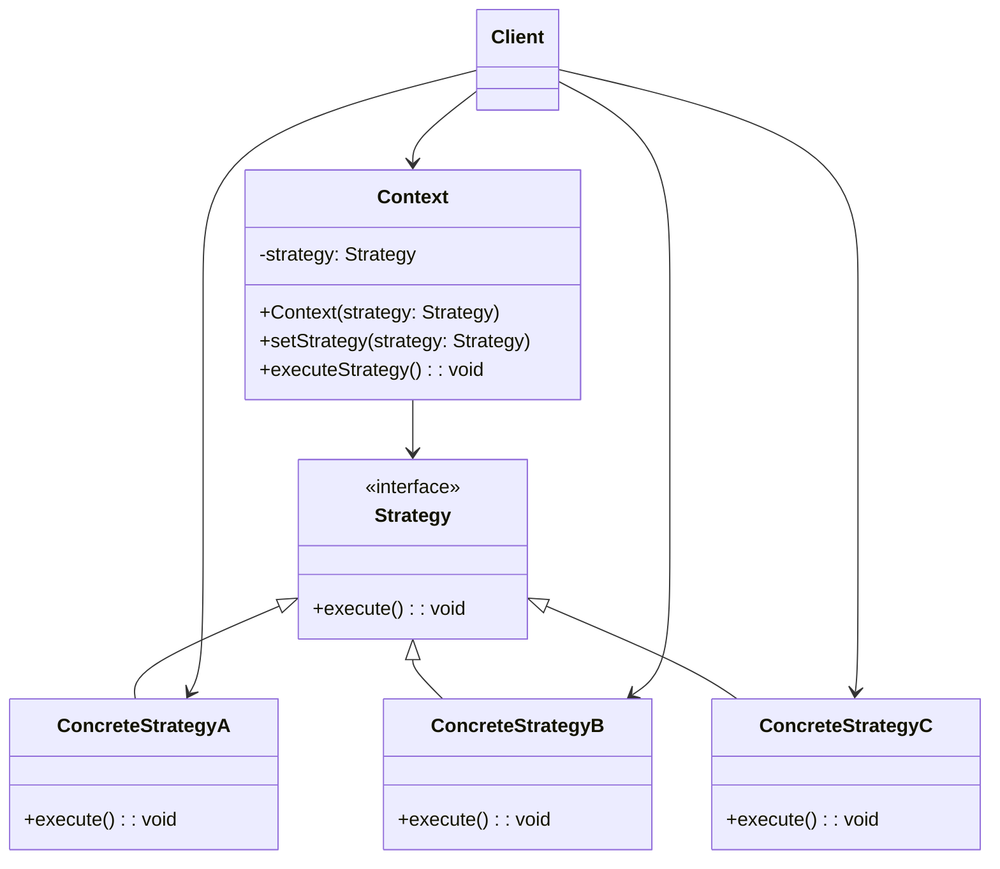

# 策略模式（Strategy Pattern）

> 定义一系列算法，把它们封装起来，并使它们可以相互替换

---

## 📋 基本信息

- **类型**: 行为型模式
- **难度**: ⭐⭐
- **使用频率**: ⭐⭐⭐⭐⭐
- **关键词**: 算法族、动态选择、消除if-else

---

## 🎯 模式意图

**核心思想**：定义一系列算法，将每个算法封装起来，并使它们可以相互替换。 strategy模式让算法可以独立于使用它的客户而变化。

**解决的问题**：
- 如何在运行时动态选择不同的算法或行为
- 如何避免使用大量条件语句（if-else/switch-case）来选择不同行为
- 如何将算法的实现与使用算法的客户端解耦
- 如何方便地扩展新的算法或行为

**适用场景**：
- 🛒 **电商系统**：不同的支付方式（信用卡、支付宝、微信支付）
- 📊 **报表系统**：不同的数据排序和过滤算法
- 🧮 **计算系统**：不同的数值计算方法
- 🎨 **图形系统**：不同的渲染算法
- 📄 **文档处理**：不同的格式转换算法
- 🚚 **物流系统**：不同的路径规划算法
- 🔍 **搜索系统**：不同的搜索算法
- 📱 **UI框架**：不同的布局策略
- 🔒 **安全系统**：不同的加密算法
- 📦 **压缩工具**：不同的压缩算法

## 🏗️ UML类图



**核心角色**：
- **Context（上下文）**：使用策略的对象，维护一个对Strategy对象的引用
- **Strategy（策略接口）**：定义所有支持的算法的公共接口
- **ConcreteStrategy（具体策略）**：实现Strategy接口的具体算法
- **Client（客户端）**：创建并配置具体策略对象，将策略对象传递给上下文

**策略模式变体**：
1. **简单策略模式**：基本实现，一个上下文对应一个策略
2. **策略工厂模式**：使用工厂创建策略对象
3. **元策略模式**：策略选择本身也成为一种策略
4. **策略链模式**：多个策略形成链式调用
5. **策略组合模式**：组合多个策略形成新策略

## 💻 代码实现

### 1. 基础实现（排序策略）

```java
// 策略接口
public interface SortStrategy {
    void sort(int[] array);
    String getStrategyName();
}

// 上下文类
public class SorterContext {
    private SortStrategy strategy;

    public SorterContext(SortStrategy strategy) {
        this.strategy = strategy;
    }

    public void setStrategy(SortStrategy strategy) {
        this.strategy = strategy;
        System.out.println("排序策略已切换为: " + strategy.getStrategyName());
    }

    public void sortArray(int[] array) {
        System.out.print("使用" + strategy.getStrategyName() + "排序前: ");
        printArray(array);

        long startTime = System.currentTimeMillis();
        strategy.sort(array);
        long endTime = System.currentTimeMillis();

        System.out.print("使用" + strategy.getStrategyName() + "排序后: ");
        printArray(array);
        System.out.println("排序耗时: " + (endTime - startTime) + "ms");
    }

    private void printArray(int[] array) {
        for (int num : array) {
            System.out.print(num + " ");
        }
        System.out.println();
    }
}

// 具体策略 - 冒泡排序
public class BubbleSortStrategy implements SortStrategy {
    @Override
    public void sort(int[] array) {
        if (array == null || array.length <= 1) return;

        int n = array.length;
        for (int i = 0; i < n - 1; i++) {
            for (int j = 0; j < n - i - 1; j++) {
                if (array[j] > array[j + 1]) {
                    // 交换元素
                    int temp = array[j];
                    array[j] = array[j + 1];
                    array[j + 1] = temp;
                }
            }
        }
    }

    @Override
    public String getStrategyName() {
        return "冒泡排序";}
}

// 具体策略 - 选择排序
public class SelectionSortStrategy implements SortStrategy {
    @Override
    public void sort(int[] array) {
        if (array == null || array.length <= 1) return;

        int n = array.length;
        for (int i = 0; i < n - 1; i++) {
            int minIndex = i;
            for (int j = i + 1; j < n; j++) {
                if (array[j] < array[minIndex]) {
                    minIndex = j;
                }
            }
            // 交换找到的最小值和当前位置
            int temp = array[minIndex];
            array[minIndex] = array[i];
            array[i] = temp;
        }
    }

    @Override
    public String getStrategyName() {
        return "选择排序";}
}

// 具体策略 - 快速排序
public class QuickSortStrategy implements SortStrategy {
    @Override
    public void sort(int[] array) {
        if (array == null || array.length <= 1) return;
        quickSort(array, 0, array.length - 1);
    }

    private void quickSort(int[] array, int low, int high) {
        if (low < high) {
            int pi = partition(array, low, high);
            quickSort(array, low, pi - 1);
            quickSort(array, pi + 1, high);
        }
    }

    private int partition(int[] array, int low, int high) {
        int pivot = array[high];
        int i = low - 1;
        for (int j = low; j < high; j++) {
            if (array[j] <= pivot) {
                i++;
                // 交换元素
                int temp = array[i];
                array[i] = array[j];
                array[j] = temp;
            }
        }
        // 交换pivot
        int temp = array[i + 1];
        array[i + 1] = array[high];
        array[high] = temp;
        return i + 1;
    }

    @Override
    public String getStrategyName() {
        return "快速排序";}
}

// 客户端
public class SortClient {
    public static void main(String[] args) {
        int[] array = {64, 34, 25, 12, 22, 11, 90};
        int[] arrayCopy1 = Arrays.copyOf(array, array.length);
        int[] arrayCopy2 = Arrays.copyOf(array, array.length);
        int[] arrayCopy3 = Arrays.copyOf(array, array.length);

        // 创建不同策略
        SortStrategy bubbleSort = new BubbleSortStrategy();
        SortStrategy selectionSort = new SelectionSortStrategy();
        SortStrategy quickSort = new QuickSortStrategy();

        // 使用冒泡排序
        SorterContext sorter = new SorterContext(bubbleSort);
        sorter.sortArray(arrayCopy1);

        // 切换到选择排序
        sorter.setStrategy(selectionSort);
        sorter.sortArray(arrayCopy2);

        // 切换到快速排序
        sorter.setStrategy(quickSort);
        sorter.sortArray(arrayCopy3);

        // 测试大数据量下的性能差异
        int[] bigArray = generateRandomArray(10000);
        int[] bigArrayCopy1 = Arrays.copyOf(bigArray, bigArray.length);
        int[] bigArrayCopy2 = Arrays.copyOf(bigArray, bigArray.length);
        int[] bigArrayCopy3 = Arrays.copyOf(bigArray, bigArray.length);

        System.out.println("\n大数据量排序性能测试（10000个元素）:");
        sorter.setStrategy(bubbleSort);
        sorter.sortArray(bigArrayCopy1);

        sorter.setStrategy(selectionSort);
        sorter.sortArray(bigArrayCopy2);

        sorter.setStrategy(quickSort);
        sorter.sortArray(bigArrayCopy3);
    }

    private static int[] generateRandomArray(int size) {
        int[] array = new int[size];
        Random random = new Random();
        for (int i = 0; i < size; i++) {
            array[i] = random.nextInt(100000);
        }
        return array;
    }
}
```

### 2. 高级实现（支付策略）

```java
import java.math.BigDecimal;
import java.util.HashMap;
import java.util.Map;
import java.util.UUID;

// 订单类
public class Order {
    private String orderId;
    private BigDecimal amount;
    private String productName;
    private long timestamp;

    public Order(String productName, BigDecimal amount) {
        this.orderId = UUID.randomUUID().toString();
        this.productName = productName;
        this.amount = amount;
        this.timestamp = System.currentTimeMillis();
    }

    // Getters and Setters
    public String getOrderId() { return orderId; }
    public BigDecimal getAmount() { return amount; }
    public String getProductName() { return productName; }
    public long getTimestamp() { return timestamp; }
}

// 支付结果类
public class PaymentResult {
    private boolean success;
    private String transactionId;
    private String message;
    private BigDecimal amount;
    private long timestamp;

    // 构造函数、Getters和Setters
    public PaymentResult(boolean success, String transactionId, String message, BigDecimal amount) {
        this.success = success;
        this.transactionId = transactionId;
        this.message = message;
        this.amount = amount;
        this.timestamp = System.currentTimeMillis();
    }

    public boolean isSuccess() { return success; }
    public String getTransactionId() { return transactionId; }
    public String getMessage() { return message; }
    public BigDecimal getAmount() { return amount; }
    public long getTimestamp() { return timestamp; }
}

// 支付策略接口
public interface PaymentStrategy {
    PaymentResult pay(Order order);
    String getPaymentMethod();
    boolean supportsRefund();
}

// 上下文类
public class PaymentContext {
    private PaymentStrategy strategy;
    private static final Map<String, PaymentStrategy> strategyCache = new HashMap<>();

    // 策略注册
    public static void registerStrategy(String paymentMethod, PaymentStrategy strategy) {
        strategyCache.put(paymentMethod.toLowerCase(), strategy);
    }

    // 策略工厂方法
    public static PaymentContext createWithStrategy(String paymentMethod) {
        PaymentStrategy strategy = strategyCache.get(paymentMethod.toLowerCase());
        if (strategy == null) {
            throw new IllegalArgumentException("不支持的支付方式: " + paymentMethod);
        }
        return new PaymentContext(strategy);
    }

    public PaymentContext(PaymentStrategy strategy) {
        this.strategy = strategy;
    }

    public void setStrategy(PaymentStrategy strategy) {
        this.strategy = strategy;
    }

    public PaymentResult executePayment(Order order) {
        System.out.println("使用" + strategy.getPaymentMethod() + "支付订单: " + order.getOrderId());
        return strategy.pay(order);
    }

    public String getCurrentPaymentMethod() {
        return strategy.getPaymentMethod();
    }

    public boolean supportsRefund() {
        return strategy.supportsRefund();
    }
}

// 具体策略 - 信用卡支付
public class CreditCardPaymentStrategy implements PaymentStrategy {
    private String cardNumber;
    private String nameOnCard;
    private String expiryDate;
    private String cvv;

    public CreditCardPaymentStrategy(String cardNumber, String nameOnCard, String expiryDate, String cvv) {
        this.cardNumber = maskCardNumber(cardNumber);
        this.nameOnCard = nameOnCard;
        this.expiryDate = expiryDate;
        this.cvv = cvv;
    }

    @Override
    public PaymentResult pay(Order order) {
        // 模拟信用卡支付处理
        try {
            Thread.sleep(1500); // 模拟网络延迟
            // 生成交易ID
            String transactionId = "CC" + System.currentTimeMillis() + UUID.randomUUID().toString().substring(0, 8);
            return new PaymentResult(true, transactionId,
                    "信用卡支付成功", order.getAmount());
        } catch (InterruptedException e) {
            Thread.currentThread().interrupt();
            return new PaymentResult(false, null, "支付处理中断", order.getAmount());
        }
    }

    @Override
    public String getPaymentMethod() {
        return "信用卡支付";}

    @Override
    public boolean supportsRefund() {
        return true;
    }

    private String maskCardNumber(String cardNumber) {
        if (cardNumber == null || cardNumber.length() < 13) {
            return "Invalid Card Number";
        }
        return "XXXX-XXXX-XXXX-" + cardNumber.substring(cardNumber.length() - 4);
    }
}

// 具体策略 - 支付宝支付
public class AlipayStrategy implements PaymentStrategy {
    private String userId;
    private String phoneNumber;

    public AlipayStrategy(String userId, String phoneNumber) {
        this.userId = userId;
        this.phoneNumber = maskPhoneNumber(phoneNumber);
    }

    @Override
    public PaymentResult pay(Order order) {
        // 模拟支付宝支付处理
        try {
            Thread.sleep(1000); // 模拟网络延迟
            // 生成交易ID
            String transactionId = "ALIPAY" + System.currentTimeMillis();
            return new PaymentResult(true, transactionId,
                    "支付宝支付成功", order.getAmount());
        } catch (InterruptedException e) {
            Thread.currentThread().interrupt();
            return new PaymentResult(false, null, "支付处理中断", order.getAmount());
        }
    }

    @Override
    public String getPaymentMethod() {
        return "支付宝支付";}

    @Override
    public boolean supportsRefund() {
        return true;
    }

    private String maskPhoneNumber(String phoneNumber) {
        if (phoneNumber == null || phoneNumber.length() < 11) {
            return phoneNumber;
        }
        return phoneNumber.substring(0, 3) + "****" + phoneNumber.substring(7);
    }
}

// 具体策略 - 微信支付
public class WechatPayStrategy implements PaymentStrategy {
    private String openId;
    private String nickname;

    public WechatPayStrategy(String openId, String nickname) {
        this.openId = openId.substring(0, 8) + "..." + openId.substring(openId.length() - 8);
        this.nickname = nickname;
    }

    @Override
    public PaymentResult pay(Order order) {
        // 模拟微信支付处理
        try {
            Thread.sleep(1200); // 模拟网络延迟
            // 生成交易ID
            String transactionId = "WX" + System.currentTimeMillis();
            return new PaymentResult(true, transactionId,
                    "微信支付成功", order.getAmount());
        } catch (InterruptedException e) {
            Thread.currentThread().interrupt();
            return new PaymentResult(false, null, "支付处理中断", order.getAmount());
        }
    }

    @Override
    public String getPaymentMethod() {
        return "微信支付";}

    @Override
    public boolean supportsRefund() {
        return true;
    }
}

// 具体策略 - 现金支付
public class CashPaymentStrategy implements PaymentStrategy {
    private String cashierName;

    public CashPaymentStrategy(String cashierName) {
        this.cashierName = cashierName;
    }

    @Override
    public PaymentResult pay(Order order) {
        // 模拟现金支付处理
        try {
            Thread.sleep(500); // 模拟处理时间
            // 生成交易ID
            String transactionId = "CASH" + System.currentTimeMillis();
            return new PaymentResult(true, transactionId,
                    "现金支付成功，收银员: " + cashierName, order.getAmount());
        } catch (InterruptedException e) {
            Thread.currentThread().interrupt();
            return new PaymentResult(false, null, "支付处理中断", order.getAmount());
        }
    }

    @Override
    public String getPaymentMethod() {
        return "现金支付";}

    @Override
    public boolean supportsRefund() {
        return false;
    }
}

// 客户端
public class PaymentClient {
    public static void main(String[] args) {
        // 创建订单
        Order order = new Order("高级编程课程", new BigDecimal(199.99));
        System.out.println("创建订单: " + order.getOrderId() + ", 金额: " + order.getAmount() + ", 商品: " + order.getProductName());

        // 注册支付策略
        PaymentContext.registerStrategy("creditcard",
                new CreditCardPaymentStrategy("4111111111111111", "张三", "12/25", "123"));
        PaymentContext.registerStrategy("alipay",
                new AlipayStrategy("zhangsan123", "13800138000"));
        PaymentContext.registerStrategy("wechat",
                new WechatPayStrategy("o6_bmjrPTlm6_2sgVt7hMZOPfL2M", "张三的微信"));

        try {
            // 使用信用卡支付
            PaymentContext creditCardPayment = PaymentContext.createWithStrategy("creditcard");
            PaymentResult result = creditCardPayment.executePayment(order);
            System.out.println(result.isSuccess() ? "支付成功" : "支付失败");
            System.out.println("交易ID: " + result.getTransactionId());
            System.out.println("消息: " + result.getMessage());

            // 创建新订单
            Order order2 = new Order("设计模式书籍", new BigDecimal(59.90));
            System.out.println("\n创建订单: " + order2.getOrderId() + ", 金额: " + order2.getAmount() + ", 商品: " + order2.getProductName());

            // 使用微信支付
            PaymentContext wechatPayment = PaymentContext.createWithStrategy("wechat");
            PaymentResult result2 = wechatPayment.executePayment(order2);
            System.out.println(result2.isSuccess() ? "支付成功" : "支付失败");
            System.out.println("交易ID: " + result2.getTransactionId());
            System.out.println("消息: " + result2.getMessage());

            // 使用现金支付（直接创建，不通过注册）
            PaymentContext cashPayment = new PaymentContext(new CashPaymentStrategy("李四"));
            Order order3 = new Order("咖啡", new BigDecimal(35.00));
            System.out.println("\n创建订单: " + order3.getOrderId() + ", 金额: " + order3.getAmount() + ", 商品: " + order3.getProductName());
            PaymentResult result3 = cashPayment.executePayment(order3);
            System.out.println(result3.isSuccess() ? "支付成功" : "支付失败");
            System.out.println("交易ID: " + result3.getTransactionId());
            System.out.println("消息: " + result3.getMessage());
            System.out.println("是否支持退款: " + cashPayment.supportsRefund());
        } catch (IllegalArgumentException e) {
            System.out.println("支付错误: " + e.getMessage());
        }
    }
}
```

## 🔍 源码应用

### Java中的策略模式
- **`java.util.Comparator`**：比较器接口
- **`java.util.concurrent.Executor`**：执行器接口
- **`java.io.FileFilter`**：文件过滤接口
- **`java.nio.file.PathMatcher`**：路径匹配器
- **`java.security.AuthenticationProvider`**：认证提供者
- **`javax.servlet.Filter`**：过滤器接口
- **`java.awt.LayoutManager`**：布局管理器

```java
// Java Comparator策略模式示例
public class ComparatorExample {
    public static void main(String[] args) {
        List<String> words = Arrays.asList("apple", "Banana", "cherry", "date");

        // 自然排序策略
        Collections.sort(words);
        System.out.println("自然排序: " + words);

        // 自定义排序策略 - 长度排序
        Comparator<String> lengthComparator = Comparator.comparingInt(String::length);
        Collections.sort(words, lengthComparator);
        System.out.println("长度排序: " + words);

        // 自定义排序策略 - 忽略大小写排序
        Comparator<String> ignoreCaseComparator = String::compareToIgnoreCase;
        Collections.sort(words, ignoreCaseComparator);
        System.out.println("忽略大小写排序: " + words);

        // 组合排序策略 - 先长度后字母
        Comparator<String> combinedComparator = lengthComparator.thenComparing(ignoreCaseComparator);
        Collections.sort(words, combinedComparator);
        System.out.println("组合排序: " + words);
    }
}
```

### Spring框架中的应用
- **`org.springframework.beans.factory.support.InstantiationStrategy`**：实例化策略
- **`org.springframework.core.io.ResourceLoader`**：资源加载策略
- **`org.springframework.transaction.PlatformTransactionManager`**：事务管理策略
- **`org.springframework.security.authentication.AuthenticationManager`**：认证策略
- **`org.springframework.web.client.RestTemplate`**：HTTP客户端策略
- **`org.springframework.cache.CacheManager`**：缓存策略
- **`org.springframework.scheduling.TaskScheduler`**：任务调度策略

```java
// Spring缓存策略示例
@Configuration
@EnableCaching
public class CacheConfig {
    // 配置不同的缓存策略
    @Bean
    public CacheManager concurrentMapCacheManager() {
        return new ConcurrentMapCacheManager("users", "products");
    }

    // 或者使用Redis缓存策略
    @Bean
    public CacheManager redisCacheManager(RedisConnectionFactory connectionFactory) {
        RedisCacheConfiguration config = RedisCacheConfiguration.defaultCacheConfig()
            .entryTtl(Duration.ofMinutes(10))
            .serializeKeysWith(RedisSerializationContext.SerializationPair
                .fromSerializer(new StringRedisSerializer()))
            .serializeValuesWith(RedisSerializationContext.SerializationPair
                .fromSerializer(new GenericJackson2JsonRedisSerializer()));

        return RedisCacheManager.builder(connectionFactory)
            .cacheDefaults(config)
            .withCacheConfiguration("users", 
                RedisCacheConfiguration.defaultCacheConfig().entryTtl(Duration.ofHours(1)))
            .withCacheConfiguration("products", 
                RedisCacheConfiguration.defaultCacheConfig().entryTtl(Duration.ofMinutes(5)))
            .build();
    }
}

// 使用缓存策略
@Service
public class ProductService {
    private final ProductRepository repository;

    @Autowired
    public ProductService(ProductRepository repository) {
        this.repository = repository;
    }

    // 使用缓存策略
    @Cacheable("products")
    public Product getProduct(Long id) {
        System.out.println("从数据库获取产品: " + id);
        return repository.findById(id)
            .orElseThrow(() -> new ProductNotFoundException(id));
    }

    @CacheEvict("products")
    public void updateProduct(Product product) {
        repository.save(product);
    }

    @Caching(evict = {
        @CacheEvict(value = "products", key = "#id"),
        @CacheEvict(value = "products", allEntries = true)
    })
    public void deleteProduct(Long id) {
        repository.deleteById(id);
    }
}
```

### 其他框架中的应用
- **Apache Struts2**：拦截器策略
- **Hibernate**：查询策略
- **MyBatis**：执行器策略
- **Logback/Log4j**：日志输出策略
- **Elasticsearch**：搜索策略
- **Spring Boot**：自动配置策略
- **React**：渲染策略
- **Vue.js**：组件渲染策略
- **Android**：布局策略
- **iOS**：动画策略

## ⚠️ 注意事项

1. **策略过多问题**：如果策略数量过多，会导致类爆炸

2. **策略选择复杂性**：客户端需要了解不同策略的差异才能选择合适的策略

3. **状态维护**：无状态策略可以共享，但有状态策略需要每次创建新实例

4. **上下文与策略通信**：上下文需要向策略传递足够的信息

5. **策略切换开销**：某些策略切换可能涉及较大的开销

6. **策略一致性**：确保所有策略实现遵循相同的契约

7. **测试复杂度**：需要为每个策略编写测试用例

8. **过度设计**：简单场景下使用策略模式可能导致过度设计

## 🎓 最佳实践

1. **策略接口设计**：保持策略接口简洁，专注于单一功能

```java
// 良好的策略接口设计
public interface PaymentStrategy {
    // 单一抽象方法
    PaymentResult processPayment(Order order);
    
    // 默认方法提供共同功能
    default String getPaymentMethod() {
        return this.getClass().getSimpleName().replace("PaymentStrategy", "");
    }
}
```

2. **策略工厂**：使用工厂模式管理策略创建

```java
// 策略工厂
public class PaymentStrategyFactory {
    private static final Map<String, Supplier<PaymentStrategy>> strategies = new HashMap<>();

    static {
        // 注册策略
        strategies.put("creditcard", CreditCardPayment::new);
        strategies.put("alipay", AlipayPayment::new);
        strategies.put("wechat", WechatPayment::new);
    }

    public static PaymentStrategy getStrategy(String paymentMethod) {
        Supplier<PaymentStrategy> strategySupplier = strategies.get(paymentMethod.toLowerCase());
        if (strategySupplier == null) {
            throw new IllegalArgumentException("不支持的支付方式: " + paymentMethod);
        }
        return strategySupplier.get();
    }

    public static PaymentStrategy getStrategy(String paymentMethod, Map<String, Object> config) {
        // 根据配置创建策略
        PaymentStrategy strategy = getStrategy(paymentMethod);
        // 配置策略
        configureStrategy(strategy, config);
        return strategy;
    }

    private static void configureStrategy(PaymentStrategy strategy, Map<String, Object> config) {
        // 使用反射或策略接口中的配置方法配置策略
    }
}
```

3. **策略缓存**：缓存无状态策略实例以提高性能

4. **策略组合**：组合多个策略形成复合策略

5. **策略元数据**：为策略提供元数据，辅助策略选择

6. **默认策略**：提供默认策略，确保系统可用性

7. **策略验证**：在使用策略前验证其适用性

8. **策略文档**：为每个策略提供清晰的文档说明

9. **策略选择器**：创建策略选择器，封装策略选择逻辑

10. **注解驱动策略**：使用注解标记和发现策略

## 📚 相关模式

- **状态模式**：状态模式封装对象内部状态，而策略模式封装算法
- **工厂模式**：通常与策略模式一起使用，创建策略对象
- **模板方法模式**：模板方法定义算法骨架，策略模式提供完整算法
- **命令模式**：命令模式封装请求，策略模式封装算法
- **装饰器模式**：装饰器模式动态添加功能，策略模式动态选择算法
- **享元模式**：可以与策略模式结合，共享无状态策略对象
- **代理模式**：代理模式控制访问，策略模式提供算法选择
- **组合模式**：可以组合多个策略形成复合策略
- **依赖注入**：通常用于注入策略对象到上下文中
- **服务定位器模式**：可以用于定位策略实现

