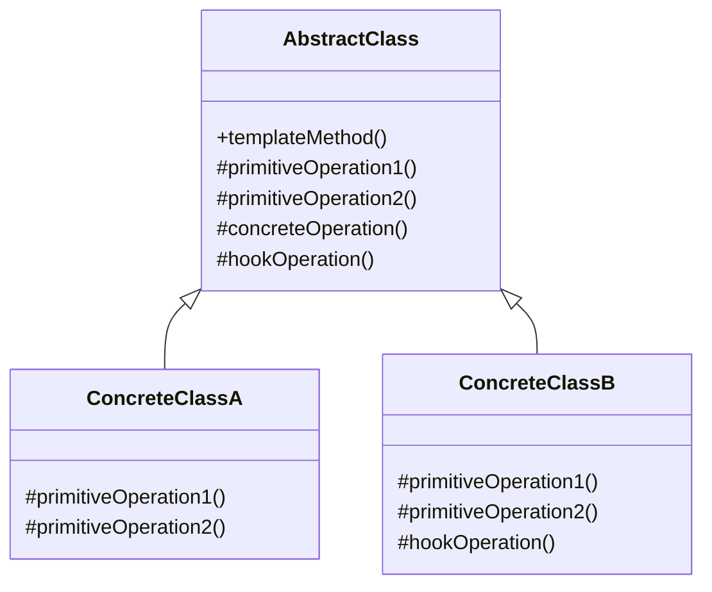

# 模板方法模式（Template Method Pattern）

> 定义算法骨架，将某些步骤延迟到子类中实现

---

## 📋 基本信息

- **类型**: 行为型模式
- **难度**: ⭐⭐
- **使用频率**: ⭐⭐⭐⭐⭐
- **关键词**: 算法框架、Hook方法、代码复用

---

## 🎯 模式意图

**核心思想**：定义一个操作中的算法骨架，将某些步骤延迟到子类中实现。模板方法使得子类可以不改变算法的结构即可重定义该算法的某些特定步骤。

**解决的问题**：
- 如何在保持算法整体结构不变的前提下，允许子类定制算法中的特定步骤
- 如何提取类库中公共的行为，避免代码重复
- 如何控制子类扩展，只允许特定方法被重写
- 如何实现"好莱坞原则"（Don't call us, we'll call you）

**适用场景**：
- 当多个类的算法具有相同的结构，但某些具体步骤实现不同时
- 当需要控制子类扩展，只允许特定方法被重写时
- 当需要在类库中提供一个标准算法框架，同时允许用户自定义部分步骤时
- 当需要实现反向控制（IoC），由父类调用子类的操作时

## 🏗️ UML类图



**核心角色**：
- **AbstractClass（抽象类）**：定义算法骨架，包含模板方法和原语操作
  - **模板方法（Template Method）**：定义算法的步骤和顺序
  - **原语操作（Primitive Operations）**：抽象方法，由子类实现
  - **具体操作（Concrete Operations）**：父类实现的固定步骤
  - **钩子操作（Hook Operations）**：可选的扩展点，子类可重写
- **ConcreteClass（具体子类）**：实现抽象类中的原语操作，定制算法的特定步骤

## 💻 代码实现

### 1. 基础实现（饮料制作流程）

```java
// 抽象类 - 定义模板方法和基本步骤
public abstract class BeverageMakingTemplate {
    /**
     * 模板方法 - 定义算法骨架
     */
    public final void makeBeverage() {
        boilWater();          // 公共步骤：煮水
        brew();               // 抽象步骤：冲泡
        pourInCup();          // 公共步骤：倒入杯中
        if (customerWantsCondiments()) { // 钩子方法：判断是否需要调料
            addCondiments();  // 抽象步骤：添加调料
        }
       	System.out.println("饮料制作完成！");
    }

    /**
     * 原语操作 - 冲泡
     */
    protected abstract void brew();

    /**
     * 原语操作 - 添加调料
     */
    protected abstract void addCondiments();

    /**
     * 具体操作 - 煮水
     */
    private void boilWater() {
        System.out.println("煮水至100°C");
    }

    /**
     * 具体操作 - 倒入杯中
     */
    private void pourInCup() {
        System.out.println("将饮料倒入杯中");
    }

    /**
     * 钩子方法 - 是否需要调料
     * 默认返回true
     */
    protected boolean customerWantsCondiments() {
        return true;
    }
}

// 具体子类 - 咖啡
public class Coffee extends BeverageMakingTemplate {
    @Override
    protected void brew() {
        System.out.println("用沸水冲泡咖啡粉");
    }

    @Override
    protected void addCondiments() {
        System.out.println("添加糖和牛奶");
    }

    /**
     * 重写钩子方法 - 询问用户是否需要调料
     */
    @Override
    protected boolean customerWantsCondiments() {
        String answer = getUserInput();
        return answer.toLowerCase().startsWith("y");
    }

    private String getUserInput() {
        System.out.print("请问需要添加糖和牛奶吗？(y/n): ");
        Scanner scanner = new Scanner(System.in);
        return scanner.nextLine();
    }
}

// 具体子类 - 茶
public class Tea extends BeverageMakingTemplate {
    @Override
    protected void brew() {
        System.out.println("用沸水浸泡茶叶");
    }

    @Override
    protected void addCondiments() {
        System.out.println("添加柠檬");
    }

    /**
     * 重写钩子方法 - 默认不需要调料
     */
    @Override
    protected boolean customerWantsCondiments() {
        return false; // 默认不加柠檬
    }
}

// 客户端
public class BeverageClient {
    public static void main(String[] args) {
        BeverageMakingTemplate coffee = new Coffee();
        BeverageMakingTemplate tea = new Tea();

        System.out.println("制作咖啡:");
        coffee.makeBeverage();

        System.out.println("\n制作茶:");
        tea.makeBeverage();
    }
}
```

### 2. 高级实现（数据处理框架）

```java
import java.util.List;
import java.util.function.Predicate;

// 抽象数据处理器
public abstract class DataProcessorTemplate<T> {
    /**
     * 模板方法 - 数据处理流程
     */
    public final void processData() {
        List<T> rawData = readData();
        validateData(rawData);
        List<T> filteredData = filterData(rawData);
        List<T> processedData = transformData(filteredData);
        writeData(processedData);
        postProcessing();
    }

    /**
     * 读取数据 - 抽象方法
     */
    protected abstract List<T> readData();

    /**
     * 转换数据 - 抽象方法
     */
    protected abstract List<T> transformData(List<T> data);

    /**
     * 写入数据 - 抽象方法
     */
    protected abstract void writeData(List<T> data);

    /**
     * 验证数据 - 具体方法
     */
    private void validateData(List<T> data) {
        if (data == null || data.isEmpty()) {
            throw new IllegalArgumentException("输入数据不能为空");
        }
        System.out.println("数据验证通过，共" + data.size() + "条记录");
    }

    /**
     * 过滤数据 - 钩子方法
     */
    protected List<T> filterData(List<T> data) {
        // 默认不过滤
        return data;
    }

    /**
     * 后处理 - 钩子方法
     */
    protected void postProcessing() {
        // 默认无操作
    }
}

// 具体实现 - CSV数据处理器
public class CsvDataProcessor extends DataProcessorTemplate<String> {
    private String filePath;
    private Predicate<String> filter;

    public CsvDataProcessor(String filePath) {
        this.filePath = filePath;
    }

    public void setFilter(Predicate<String> filter) {
        this.filter = filter;
    }

    @Override
    protected List<String> readData() {
        System.out.println("从CSV文件读取数据: " + filePath);
        // 实际实现中会读取文件内容
        return List.of("记录1,数据1,有效", "记录2,数据2,无效", "记录3,数据3,有效");
    }

    @Override
    protected List<String> transformData(List<String> data) {
        System.out.println("转换CSV数据");
        return data.stream()
            .map(record -> record.toUpperCase())
            .toList();
    }

    @Override
    protected void writeData(List<String> data) {
        System.out.println("将处理后的数据写入目标系统");
        data.forEach(System.out::println);
    }

    /**
     * 重写钩子方法 - 实现数据过滤
     */
    @Override
    protected List<String> filterData(List<String> data) {
        if (filter != null) {
            return data.stream()
                .filter(filter)
                .toList();
        }
        return super.filterData(data);
    }

    /**
     * 重写钩子方法 - 实现后处理
     */
    @Override
    protected void postProcessing() {
        System.out.println("CSV数据处理完成，清理临时资源");
    }
}

// 客户端
public class DataProcessorClient {
    public static void main(String[] args) {
        CsvDataProcessor processor = new CsvDataProcessor("data.csv");
        // 设置过滤器：只保留包含"有效"的记录
        processor.setFilter(record -> record.contains("有效"));
        processor.processData();
    }
}
```

## 🔍 源码应用

### Java中的模板方法模式
- **`java.io.InputStream`/`OutputStream`/`Reader`/`Writer`**：
  这些I/O类提供了模板方法`read()`/`write()`，具体实现由子类完成

- **`java.util.AbstractList`/`AbstractSet`/`AbstractMap`**：
  集合框架中的抽象类提供了基础实现，子类只需实现关键方法

```java
// Java集合框架中的模板方法模式
List<String> list = new AbstractList<>() {
    private String[] elements = {"A", "B", "C"};

    @Override
    public String get(int index) {
        return elements[index];
    }

    @Override
    public int size() {
        return elements.length;
    }
};

// AbstractList提供了大部分列表操作的实现
// 如contains(), indexOf(), subList()等
System.out.println(list.contains("B")); // true
System.out.println(list.indexOf("C")); // 2
```

- **`javax.servlet.http.HttpServlet`**：
  Servlet生命周期方法提供了模板，`doGet()`/`doPost()`等方法由子类实现

```java
// HttpServlet中的模板方法
public class MyServlet extends HttpServlet {
    @Override
    protected void doGet(HttpServletRequest req, HttpServletResponse resp) {
        // 实现GET请求处理
    }

    @Override
    protected void doPost(HttpServletRequest req, HttpServletResponse resp) {
        // 实现POST请求处理
    }
}
// HttpServlet的service()方法会根据请求类型调用对应的doXxx()方法
```

### Spring框架中的应用
- **`org.springframework.web.servlet.mvc.AbstractController`**：
  Spring MVC控制器抽象类，子类实现`handleRequestInternal()`方法

- **`org.springframework.jdbc.core.JdbcTemplate`**：
  JDBC模板类，提供了数据库操作的标准流程

```java
// Spring JdbcTemplate使用示例
JdbcTemplate jdbcTemplate = new JdbcTemplate(dataSource);
List<User> users = jdbcTemplate.query(
    "SELECT id, name FROM users",
    (rs, rowNum) -> new User(
        rs.getLong("id"),
        rs.getString("name")
    )
);
// JdbcTemplate封装了获取连接、创建语句、处理异常、关闭资源等固定步骤
// 用户只需提供SQL和结果映射器
```

- **`org.springframework.transaction.support.AbstractPlatformTransactionManager`**：
  事务管理器抽象类，实现了事务管理的标准流程

## ⚠️ 注意事项

1. **模板方法声明为final**：确保算法结构不被子类修改

```java
// 正确做法
public final void templateMethod() {
    // 算法步骤
}

// 错误做法 - 允许子类修改算法结构
public void templateMethod() {
    // 算法步骤
}
```

2. **合理规划抽象方法和钩子方法**：
   - 必须实现的步骤声明为抽象方法
   - 可选的扩展点使用钩子方法
   - 固定不变的步骤实现为私有具体方法

3. **避免滥用钩子方法**：过多钩子会导致算法结构混乱

4. **文档化模板方法**：清晰说明算法步骤和钩子的作用

5. **注意继承层次**：避免创建过深的继承树

6. **考虑开闭原则**：通过扩展而非修改来增加新行为

7. **警惕Liskov替换原则**：确保子类扩展不改变父类算法的正确性

8. **避免在模板方法中加入复杂逻辑**：保持算法骨架清晰

## 🎓 最佳实践

1. **最小化抽象方法**：仅将必须由子类实现的步骤声明为抽象方法

2. **提供默认实现**：为钩子方法提供合理的默认实现

```java
// 良好的钩子方法设计
protected boolean shouldValidate() {
    return true; // 默认验证
}
```

3. **命名规范**：使用一致的命名区分不同类型的方法
   - 模板方法：`process()`, `execute()`, `perform()`
   - 抽象方法：`doXxx()`, `calculateXxx()`, `connectXxx()`
   - 钩子方法：`shouldXxx()`, `onXxx()`, `postXxx()`

4. **参数化行为**：结合策略模式，允许通过参数调整行为

5. **使用组合替代部分继承**：复杂场景下考虑组合方式

6. **测试策略**：测试抽象类的默认行为和子类的特定实现

7. **渐进式设计**：先实现具体类，再提取公共部分形成模板

8. **限制钩子方法可见性**：通常使用protected修饰符

## 📚 相关模式

- **策略模式**：模板方法使用继承改变算法的特定步骤，策略模式使用组合改变整个算法

- **工厂方法模式**：工厂方法是模板方法的一种特殊形式，用于对象创建

- **建造者模式**：都关注对象构建过程，但建造者更注重复杂对象的分步构建

- **模板方法模式**：定义算法骨架，子类实现具体步骤

- **钩子方法**：与回调机制类似，允许子类在特定点插入自定义逻辑

- **好莱坞原则**："不要调用我们，我们会调用你"，模板方法模式是这一原则的典型应用

