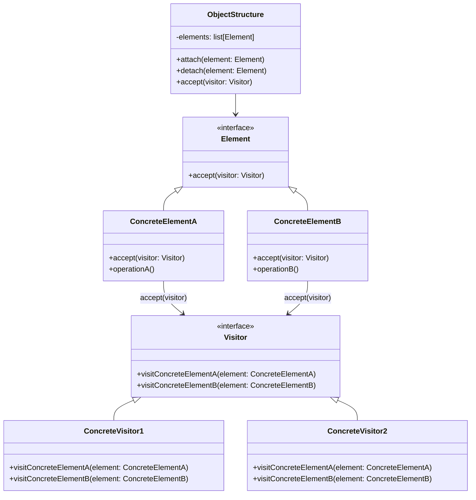

# 访问者模式（Visitor Pattern）

> 表示作用于某对象结构中的各元素的操作，在不改变元素类的前提下定义新操作

---

## 📋 基本信息

- **类型**: 行为型模式
- **难度**: ⭐⭐⭐⭐⭐
- **使用频率**: ⭐⭐
- **关键词**: 双重分派、数据与操作分离、AST遍历

---

## 🎯 模式意图

**核心思想**：表示一个作用于某对象结构中的各元素的操作。它使你可以在不改变各元素的类的前提下定义作用于这些元素的新操作。

**解决的问题**：
- 如何在不修改现有类的情况下，为现有类添加新的操作
- 如何将相关操作集中到一个类中，而不是分散到多个类中
- 如何处理具有固定结构但需要灵活扩展操作的对象集合
- 如何实现双重分派（double dispatch）以动态确定要执行的操作

**适用场景**：
- 当一个对象结构包含多个类型的对象，且需要对这些对象实施不相关的操作时
- 当需要对一个对象结构中的对象进行很多不同且不相关的操作，而你想避免让这些操作污染这些对象的类时
- 当对象结构相对稳定，但经常需要在此结构上定义新的操作时
- 当需要对复杂对象结构（如组合模式）中的所有元素执行某种操作时
- 在编译器的抽象语法树（AST）处理、文档解析、配置文件处理等场景

## 🏗️ UML类图



**核心角色**：
- **Visitor（访问者）**：为对象结构中的每个具体元素声明一个访问操作
- **ConcreteVisitor（具体访问者）**：实现Visitor声明的操作，每个操作实现算法的一部分
- **Element（元素）**：定义一个accept操作，接收一个访问者对象作为参数
- **ConcreteElement（具体元素）**：实现accept操作，调用访问者对应的访问方法
- **ObjectStructure（对象结构）**：能枚举它的元素，可以提供一个高层接口以允许访问者访问它的元素

**双重分派机制**：
1. 客户端调用Element的accept方法，传入Visitor对象（第一次分派）
2. Element的accept方法调用Visitor的visit方法，传入自身（第二次分派）
3. JVM根据Visitor和Element的实际类型，调用对应的具体方法

## 💻 代码实现

### 1. 基础实现（文档元素处理）

```java
// 访问者接口
public interface DocumentVisitor {
    void visit(TextElement text);
    void visit(ImageElement image);
    void visit(TableElement table);
}

// 具体访问者 - 渲染访问者
public class RenderVisitor implements DocumentVisitor {
    @Override
    public void visit(TextElement text) {
        System.out.println("渲染文本: " + text.getContent());
    }

    @Override
    public void visit(ImageElement image) {
        System.out.println("渲染图片: [" + image.getUrl() + "] 尺寸: " + image.getWidth() + "x" + image.getHeight());
    }

    @Override
    public void visit(TableElement table) {
        System.out.println("渲染表格: 行数=" + table.getRows() + ", 列数=" + table.getCols());
        for (int i = 0; i < Math.min(3, table.getRows()); i++) {
            System.out.println("  行" + (i+1) + ": " + Arrays.toString(table.getRowData(i)));
        }
        if (table.getRows() > 3) {
            System.out.println("  ... 还有" + (table.getRows() - 3) + "行未显示");
        }
    }
}

// 具体访问者 - 导出访问者
public class ExportVisitor implements DocumentVisitor {
    private StringBuilder exportContent = new StringBuilder();

    @Override
    public void visit(TextElement text) {
        exportContent.append("[TEXT] ").append(text.getContent()).append("\n");
    }

    @Override
    public void visit(ImageElement image) {
        exportContent.append("[IMAGE] URL=").append(image.getUrl()).append(", SIZE=").append(image.getWidth()).append("x").append(image.getHeight()).append("\n");
    }

    @Override
    public void visit(TableElement table) {
        exportContent.append("[TABLE] ROWS=").append(table.getRows()).append(", COLS=").append(table.getCols()).append("\n");
    }

    public String getExportContent() {
        return exportContent.toString();
    }
}

// 元素接口
public interface DocumentElement {
    void accept(DocumentVisitor visitor);
}

// 具体元素 - 文本元素
public class TextElement implements DocumentElement {
    private String content;

    public TextElement(String content) {
        this.content = content;
    }

    public String getContent() {
        return content;
    }

    @Override
    public void accept(DocumentVisitor visitor) {
        visitor.visit(this);
    }
}

// 具体元素 - 图片元素
public class ImageElement implements DocumentElement {
    private String url;
    private int width;
    private int height;

    public ImageElement(String url, int width, int height) {
        this.url = url;
        this.width = width;
        this.height = height;
    }

    public String getUrl() { return url; }
    public int getWidth() { return width; }
    public int getHeight() { return height; }

    @Override
    public void accept(DocumentVisitor visitor) {
        visitor.visit(this);
    }
}

// 具体元素 - 表格元素
public class TableElement implements DocumentElement {
    private int rows;
    private int cols;
    private String[][] data;

    public TableElement(int rows, int cols) {
        this.rows = rows;
        this.cols = cols;
        this.data = new String[rows][cols];
        // 初始化一些示例数据
        for (int i = 0; i < rows; i++) {
            for (int j = 0; j < cols; j++) {
                data[i][j] = "单元格(" + (i+1) + "," + (j+1) + ")";
            }
        }
    }

    public int getRows() { return rows; }
    public int getCols() { return cols; }
    public String[] getRowData(int row) { return data[row]; }

    @Override
    public void accept(DocumentVisitor visitor) {
        visitor.visit(this);
    }
}

// 对象结构 - 文档
public class Document implements DocumentElement {
    private List<DocumentElement> elements = new ArrayList<>();

    public void addElement(DocumentElement element) {
        elements.add(element);
    }

    public void removeElement(DocumentElement element) {
        elements.remove(element);
    }

    @Override
    public void accept(DocumentVisitor visitor) {
        for (DocumentElement element : elements) {
            element.accept(visitor);
        }
    }
}

// 客户端
public class DocumentClient {
    public static void main(String[] args) {
        // 创建文档元素
        DocumentElement title = new TextElement("访问者模式示例文档");
        DocumentElement paragraph = new TextElement("这是一个使用访问者模式处理文档元素的示例。");
        DocumentElement image = new ImageElement("https://example.com/logo.png", 800, 600);
        DocumentElement table = new TableElement(10, 4);

        // 创建文档并添加元素
        Document document = new Document();
        document.addElement(title);
        document.addElement(paragraph);
        document.addElement(image);
        document.addElement(table);

        // 创建访问者
        DocumentVisitor renderVisitor = new RenderVisitor();
        DocumentVisitor exportVisitor = new ExportVisitor();

        System.out.println("=== 使用渲染访问者 ===");
        document.accept(renderVisitor);

        System.out.println("\n=== 使用导出访问者 ===");
        document.accept(exportVisitor);
        System.out.println(((ExportVisitor) exportVisitor).getExportContent());
    }
}
```

### 2. 高级实现（表达式解析器）

```java
import java.util.HashMap;
import java.util.Map;

// 访问者接口
public interface ExpressionVisitor {
    int visit(NumberExpression expr);
    int visit(AddExpression expr);
    int visit(SubtractExpression expr);
    int visit(MultiplyExpression expr);
    int visit(DivideExpression expr);
    int visit(VariableExpression expr);
}

// 评估访问者
public class EvaluationVisitor implements ExpressionVisitor {
    private Map<String, Integer> variables;

    public EvaluationVisitor(Map<String, Integer> variables) {
        this.variables = new HashMap<>(variables);
    }

    @Override
    public int visit(NumberExpression expr) {
        return expr.getValue();
    }

    @Override
    public int visit(AddExpression expr) {
        return expr.getLeft().accept(this) + expr.getRight().accept(this);
    }

    @Override
    public int visit(SubtractExpression expr) {
        return expr.getLeft().accept(this) - expr.getRight().accept(this);
    }

    @Override
    public int visit(MultiplyExpression expr) {
        return expr.getLeft().accept(this) * expr.getRight().accept(this);
    }

    @Override
    public int visit(DivideExpression expr) {
        int left = expr.getLeft().accept(this);
        int right = expr.getRight().accept(this);
        if (right == 0) {
            throw new ArithmeticException("除零错误");
        }
        return left / right;
    }

    @Override
    public int visit(VariableExpression expr) {
        Integer value = variables.get(expr.getName());
        if (value == null) {
            throw new IllegalArgumentException("未定义的变量: " + expr.getName());
        }
        return value;
    }
}

// 表达式格式化访问者
public class FormattingVisitor implements ExpressionVisitor {
    @Override
    public int visit(NumberExpression expr) {
        System.out.print(expr.getValue());
        return 0; // 对于格式化访问者，返回值无意义
    }

    @Override
    public int visit(AddExpression expr) {
        System.out.print("(");
        expr.getLeft().accept(this);
        System.out.print(" + ");
        expr.getRight().accept(this);
        System.out.print(")");
        return 0;
    }

    @Override
    public int visit(SubtractExpression expr) {
        System.out.print("(");
        expr.getLeft().accept(this);
        System.out.print(" - ");
        expr.getRight().accept(this);
        System.out.print(")");
        return 0;
    }

    @Override
    public int visit(MultiplyExpression expr) {
        System.out.print("(");
        expr.getLeft().accept(this);
        System.out.print(" * ");
        expr.getRight().accept(this);
        System.out.print(")");
        return 0;
    }

    @Override
    public int visit(DivideExpression expr) {
        System.out.print("(");
        expr.getLeft().accept(this);
        System.out.print(" / ");
        expr.getRight().accept(this);
        System.out.print(")");
        return 0;
    }

    @Override
    public int visit(VariableExpression expr) {
        System.out.print(expr.getName());
        return 0;
    }
}

// 表达式接口
public interface Expression {
    int accept(ExpressionVisitor visitor);
}

// 具体表达式实现
public class NumberExpression implements Expression {
    private int value;

    public NumberExpression(int value) { this.value = value; }
    public int getValue() { return value; }

    @Override
    public int accept(ExpressionVisitor visitor) {
        return visitor.visit(this);
    }
}

public class VariableExpression implements Expression {
    private String name;

    public VariableExpression(String name) { this.name = name; }
    public String getName() { return name; }

    @Override
    public int accept(ExpressionVisitor visitor) {
        return visitor.visit(this);
    }
}

public class AddExpression implements Expression {
    private Expression left;
    private Expression right;

    public AddExpression(Expression left, Expression right) {
        this.left = left;
        this.right = right;
    }

    public Expression getLeft() { return left; }
    public Expression getRight() { return right; }

    @Override
    public int accept(ExpressionVisitor visitor) {
        return visitor.visit(this);
    }
}

// 其他运算表达式类(SubtractExpression, MultiplyExpression, DivideExpression)实现类似

// 客户端
public class ExpressionClient {
    public static void main(String[] args) {
        // 构建表达式: (a + 5) * (b - 3)
        Expression expr = new MultiplyExpression(
            new AddExpression(
                new VariableExpression("a"),
                new NumberExpression(5)
            ),
            new SubtractExpression(
                new VariableExpression("b"),
                new NumberExpression(3)
            )
        );

        // 创建变量映射
        Map<String, Integer> variables = new HashMap<>();
        variables.put("a", 10);
        variables.put("b", 8);

        // 创建访问者
        ExpressionVisitor formatter = new FormattingVisitor();
        ExpressionVisitor evaluator = new EvaluationVisitor(variables);

        System.out.print("表达式: ");
        expr.accept(formatter);

        int result = expr.accept(evaluator);
        System.out.println(" = " + result);
    }
}
```

## 🔍 源码应用

### Java中的访问者模式
- **`javax.lang.model.element.ElementVisitor`**：Java编译器API中的元素访问者

```java
// Java编译器API中的访问者模式应用
Elements elements = processingEnv.getElementUtils();
elements.getTypeElement("com.example.MyClass").accept(new SimpleElementVisitor8<Void, Void>() {
    @Override
    public Void visitType(TypeElement e, Void p) {
        System.out.println("类名: " + e.getSimpleName());
        return super.visitType(e, p);
    }

    @Override
    public Void visitVariable(VariableElement e, Void p) {
        System.out.println("变量: " + e.getSimpleName());
        return super.visitVariable(e, p);
    }
}, null);
```

- **`java.nio.file.FileVisitor`**：文件系统遍历访问者

```java
// 文件遍历访问者示例
Files.walkFileTree(Paths.get("/path/to/directory"), new SimpleFileVisitor<Path>() {
    @Override
    public FileVisitResult visitFile(Path file, BasicFileAttributes attrs) {
        if (file.toString().endsWith(".java")) {
            System.out.println("Java文件: " + file);
        }
        return FileVisitResult.CONTINUE;
    }

    @Override
    public FileVisitResult visitFileFailed(Path file, IOException exc) {
        System.err.println("访问文件失败: " + file);
        return FileVisitResult.CONTINUE;
    }
});
```

- **`javax.xml.stream.XMLStreamReader`**：XML解析中的事件访问

### Spring框架中的应用
- **`org.springframework.asm.ClassVisitor`**：Spring内部使用ASM库进行类字节码操作

- **`org.springframework.beans.factory.parsing.BeanDefinitionVisitor`**：Bean定义解析访问者

```java
// Spring中的Bean定义访问者
BeanDefinitionVisitor visitor = new BeanDefinitionVisitor(new StandardBeanExpressionResolver());
visitor.visitBeanDefinition(beanDefinition);
```

- **`org.springframework.web.servlet.handler.HandlerMappingIntrospector`**：请求映射处理

### 其他框架中的应用
- **Apache Ant**：构建文件处理中的任务访问者
- **JUnit**：测试用例执行器中的访问者模式
- **Eclipse JDT**：Java开发工具中的AST访问者
- **MyBatis**：SQL节点解析器中的访问者
- **Jackson**：JSON序列化/反序列化中的访问者

## ⚠️ 注意事项

1. **开放-封闭原则的权衡**：
   - 对新增操作开放：可以通过添加新的访问者来实现
   - 对新增元素关闭：添加新元素需要修改所有访问者接口和实现

2. **元素类的稳定性要求**：
   如果元素类经常变化（添加新元素），访问者模式会导致大量修改

3. **封装性问题**：
   为了让访问者能够操作元素，元素可能需要暴露内部状态或操作

```java
// 不良实践：为了访问者而暴露内部实现
public class BadElement implements Element {
    private int internalState;
    
    // 为了让访问者访问而暴露内部状态
    public int getInternalState() { return internalState; }
    
    // 为了让访问者修改而暴露内部方法
    public void setInternalState(int state) { this.internalState = state; }
    
    @Override
    public void accept(Visitor visitor) {
        visitor.visit(this);
    }
}
```

4. **循环依赖风险**：访问者和元素可能形成循环依赖

5. **复杂性增加**：
   引入访问者模式会增加系统的类数量和复杂性，简单场景可能不适用

6. **双重分派理解难度**：
   开发人员需要理解双重分派机制才能正确使用访问者模式

7. **并行处理挑战**：
   在并发环境下使用访问者模式需要额外考虑线程安全

## 🎓 最佳实践

1. **合理设计访问者接口**：
   接口粒度要适中，避免过多方法导致维护困难

```java
// 良好的访问者接口设计
public interface DocumentVisitor {
    // 分组相关方法
    void visitText(TextElement text);
    void visitImage(ImageElement image);
    void visitTable(TableElement table);
    
    // 提供默认实现，便于扩展
    default void visitVideo(VideoElement video) {
        // 默认实现或抛出不支持的异常
    }
}
```

2. **使用默认方法增强扩展性**：
   在Java 8+中，可以为访问者接口添加默认方法，减少对现有实现的影响

3. **结合组合模式使用**：
   访问者模式常与组合模式一起使用，处理树形结构

4. **使用访问者集合**：
   创建访问者集合，一次性应用多个访问者

```java
public class VisitorCollection implements DocumentVisitor {
    private List<DocumentVisitor> visitors = new ArrayList<>();
    
    public void addVisitor(DocumentVisitor visitor) {
        visitors.add(visitor);
    }
    
    @Override
    public void visit(TextElement text) {
        for (DocumentVisitor visitor : visitors) {
            visitor.visit(text);
        }
    }
    
    // 其他visit方法...
}
```

5. **使用空访问者作为基础**：
   提供一个空实现的访问者类，减少具体访问者的实现工作量

```java
public class AbstractDocumentVisitor implements DocumentVisitor {
    @Override
    public void visit(TextElement text) {}
    
    @Override
    public void visit(ImageElement image) {}
    
    @Override
    public void visit(TableElement table) {}
}

// 具体访问者只需重写需要的方法
public class WordCountVisitor extends AbstractDocumentVisitor {
    private int wordCount = 0;
    
    @Override
    public void visit(TextElement text) {
        wordCount += text.getContent().split("\\s+").length;
    }
    
    public int getWordCount() { return wordCount; }
}
```

6. **限制访问者权限**：
   通过接口或包可见性控制访问者对元素的访问权限

7. **文档化访问者协议**：
   清晰说明访问者与元素之间的交互协议

8. **考虑使用函数式接口替代简单访问者**：
   Java 8+中，可以使用函数式接口简化简单访问者的实现

## 📚 相关模式

- **组合模式**：访问者常与组合模式一起使用，遍历组合结构
- **迭代器模式**：都用于遍历对象集合，但迭代器侧重于遍历，访问者侧重于操作
- **命令模式**：都封装操作，但命令模式关注对象上的请求，访问者关注对象结构上的操作
- **策略模式**：都封装算法，但策略模式封装的是单一算法，访问者封装的是对对象结构的多元素操作
- **解释器模式**：访问者可用于解释器模式中的抽象语法树遍历
- **装饰器模式**：都可以为对象添加新功能，但装饰器通过包装对象实现，访问者通过外部操作实现
- **观察者模式**：都涉及对象间的通知机制，但观察者是被动通知，访问者是主动访问
- **状态模式**：都可以根据对象类型执行不同操作，但状态模式关注对象自身状态变化

