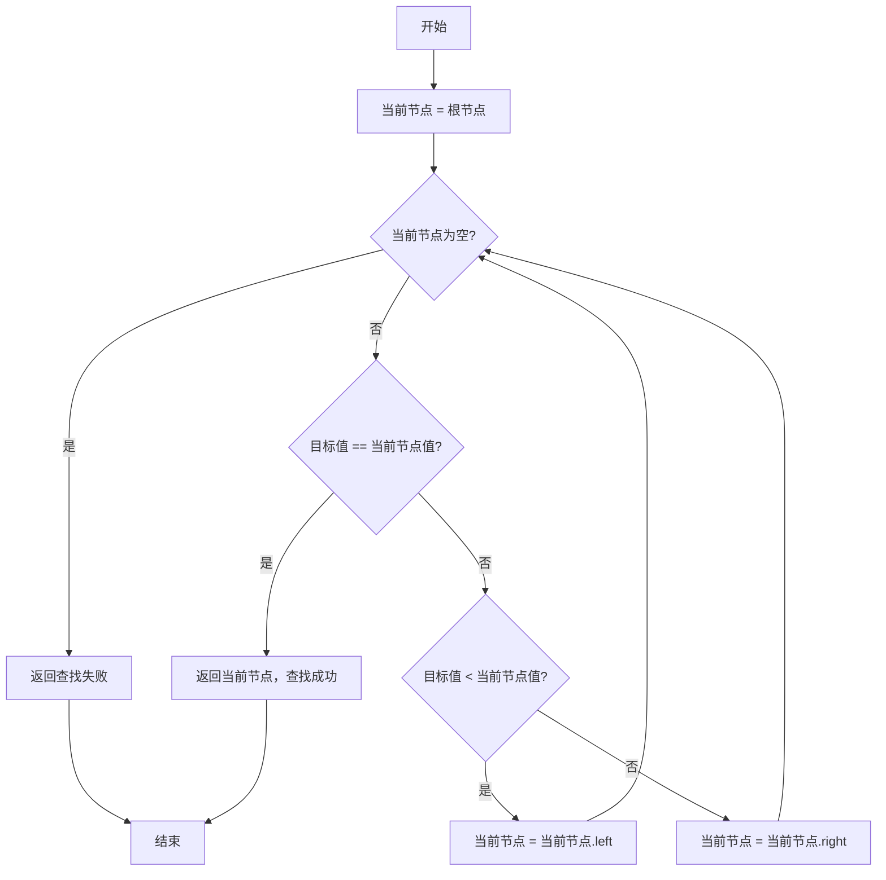

# 二叉搜索树查找

> 二叉搜索树查找是一种基于二叉搜索树数据结构的高效查找算法，利用树的有序性实现快速查找

---

## 📋 基本信息

- **类型**: 树形查找算法
- **时间复杂度**: O(log n) - 平均情况，O(n) - 最坏情况
- **空间复杂度**: O(log n) - 递归实现，O(1) - 迭代实现
- **适用条件**: 
  - ✅ 动态数据集合
  - ✅ 需要频繁插入删除的场景
  - ✅ 有序数据的查找
- **核心思想**: 利用二叉搜索树的特性（左子树所有节点值小于根节点，右子树所有节点值大于根节点）进行递归或迭代查找

---

## 🎯 算法原理

### 1. 基本思路
1. 从二叉搜索树的根节点开始
2. 将目标值与当前节点值进行比较
3. 如果相等，则查找成功，返回当前节点
4. 如果目标值小于当前节点值，则在左子树中继续查找
5. 如果目标值大于当前节点值，则在右子树中继续查找
6. 重复步骤2-5，直到找到目标节点或到达空节点
7. 如果到达空节点，则查找失败

### 2. 核心流程图


### 3. 二叉搜索树特性
- 左子树所有节点值 < 根节点值
- 右子树所有节点值 > 根节点值
- 左右子树也分别为二叉搜索树
- 中序遍历可得到有序序列

---

## 💻 代码实现

### 1. 二叉搜索树节点定义
```java
/**
 * 二叉搜索树节点
 */
class TreeNode {
    int val;
    TreeNode left;
    TreeNode right;
    TreeNode(int x) {
        val = x;
        left = null;
        right = null;
    }
}
```

### 2. 递归实现
```java
/**
 * 二叉搜索树查找（递归实现）
 * @param root 根节点
 * @param target 目标值
 * @return 包含目标值的节点，未找到返回null
 */
public TreeNode bstSearchRecursive(TreeNode root, int target) {
    // 基本情况：节点为空或找到目标
    if (root == null || root.val == target) {
        return root;
    }
    
    // 目标值小于当前节点值，在左子树中查找
    if (target < root.val) {
        return bstSearchRecursive(root.left, target);
    }
    // 目标值大于当前节点值，在右子树中查找
    else {
        return bstSearchRecursive(root.right, target);
    }
}
```

### 3. 迭代实现
```java
/**
 * 二叉搜索树查找（迭代实现）
 * @param root 根节点
 * @param target 目标值
 * @return 包含目标值的节点，未找到返回null
 */
public TreeNode bstSearchIterative(TreeNode root, int target) {
    TreeNode current = root;
    
    // 遍历树直到找到目标或到达叶节点
    while (current != null && current.val != target) {
        if (target < current.val) {
            current = current.left;  // 向左子树移动
        } else {
            current = current.right; // 向右子树移动
        }
    }
    
    return current;  // 如果找到返回节点，否则返回null
}
```

### 4. 查找最小值和最大值
```java
/**
 * 查找二叉搜索树中的最小值
 * @param root 根节点
 * @return 最小值节点
 */
public TreeNode findMin(TreeNode root) {
    if (root == null) return null;
    while (root.left != null) {
        root = root.left; // 最小值在最左节点
    }
    return root;
}

/**
 * 查找二叉搜索树中的最大值
 * @param root 根节点
 * @return 最大值节点
 */
public TreeNode findMax(TreeNode root) {
    if (root == null) return null;
    while (root.right != null) {
        root = root.right; // 最大值在最右节点
    }
    return root;
}
```

---

## 📊 复杂度分析

| 情况 | 时间复杂度 | 空间复杂度 | 说明 |
|------|------------|------------|------|
| 平均情况 | O(log n) | O(log n) | 平衡二叉搜索树，递归调用栈深度 |
| 最坏情况 | O(n) | O(n) | 退化为链表的二叉搜索树 |
| 迭代实现 | O(log n) | O(1) | 不使用额外空间 |

### 复杂度分析要点
- 时间复杂度取决于树的高度，平衡树时为O(log n)，不平衡时退化为O(n)
- 空间复杂度主要来自递归调用栈，迭代实现可达到O(1)
- 与二分查找相比，二叉搜索树查找支持动态数据集合的高效插入删除
- 在平衡二叉搜索树（如AVL树、红黑树）中可保证最坏情况下的O(log n)复杂度

---

## 🔍 应用场景

### 典型应用
- 动态数据集合的查找
- 数据库索引结构
- 有序数据的快速检索
- 实现关联数组（如Java中的TreeMap）

### 实际案例
- 编译器中的符号表实现
- 数据库查询优化
- 文件系统中的目录结构
- 路由表查找

---

## ⚠️ 注意事项

### 1. 树的平衡性
- 非平衡二叉搜索树可能退化为链表，导致查找效率下降
- 实际应用中通常使用平衡二叉搜索树（AVL树、红黑树）
- 平衡树通过旋转操作维持树的高度平衡

### 2. 重复元素处理
- 标准二叉搜索树不允许重复元素
- 处理重复元素的方法：
  - 每个节点存储重复计数
  - 左子树包含小于等于当前节点的元素
  - 单独维护重复元素链表

### 3. 空树处理
- 必须处理根节点为空的边界情况
- 查找不存在的元素时应返回明确标识

---

## 🎓 最佳实践

### 使用建议
1. **平衡树优先**: 优先使用平衡二叉搜索树实现（如TreeSet/TreeMap）
2. **迭代优于递归**: 大规模数据时，迭代实现可避免栈溢出
3. **复合场景考虑**: 静态数据考虑二分查找，动态数据考虑二叉搜索树
4. **有序遍历**: 利用中序遍历可获得有序序列

### 实现技巧
- 添加节点值验证，确保树的搜索特性
- 实现时考虑空树和单节点树的边界情况
- 复杂场景下可添加父指针简化操作
- 结合实际需求选择合适的平衡策略

---

> **学习建议**：二叉搜索树是理解高级树结构（如红黑树、B树）的基础，掌握其查找原理对理解数据库索引等高级应用至关重要