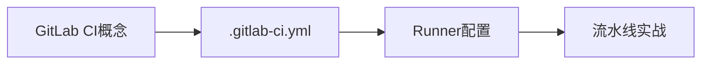
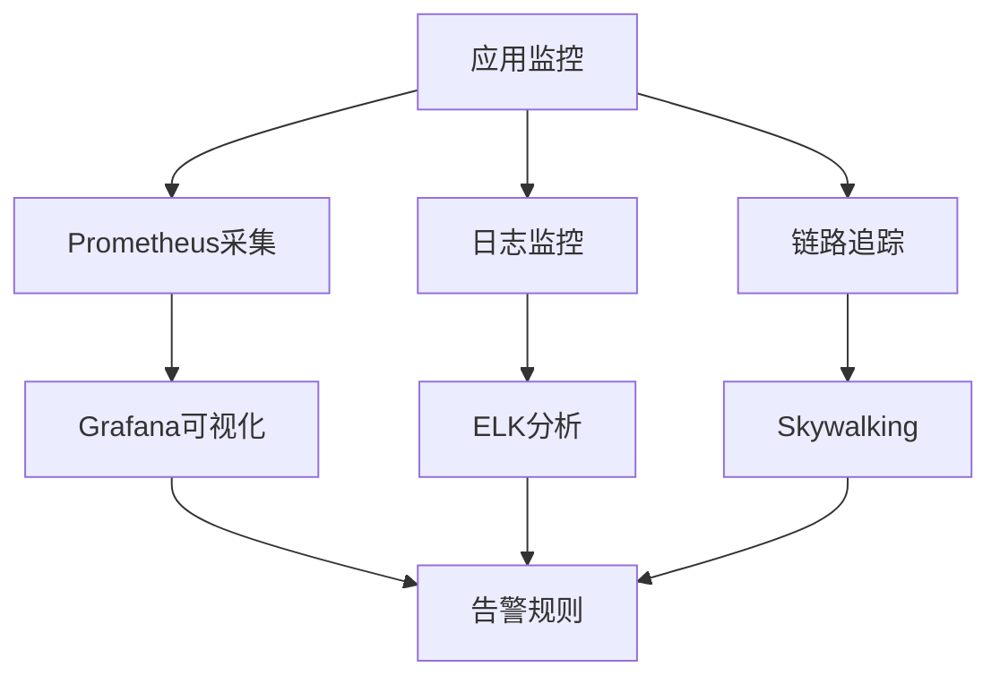

# 19_DevOps与CI/CD

> 现代软件工程必备技能：自动化部署、持续集成与持续交付

---

## 📚 目录概览

| 文档 | 核心内容 | 重要度 | 状态 |
|------|---------|--------|------|
| **Jenkins流水线实战.md** | Jenkins Pipeline、自动化构建部署 | ⭐⭐⭐⭐⭐ | 📋 框架 |
| **GitLab CICD配置.md** | GitLab CI/CD、.gitlab-ci.yml配置 | ⭐⭐⭐⭐⭐ | 📋 框架 |
| **自动化测试体系.md** | 单元测试、集成测试、测试覆盖率 | ⭐⭐⭐⭐ | 📋 框架 |
| **监控告警体系.md** | Prometheus+Grafana、ELK、Skywalking | ⭐⭐⭐⭐⭐ | 📋 框架 |
| **日志收集与分析.md** | 日志规范、ELK Stack、日志分析 | ⭐⭐⭐⭐ | 📋 框架 |

---

## 🎯 学习路径

### 阶段一：CI/CD基础（1-2周）


**核心技能**：
- ✅ Git分支管理与工作流
- ✅ Jenkins安装配置
- ✅ Pipeline DSL语法
- ✅ Docker镜像构建
- ✅ K8s应用部署

**学习建议**：
1. 先学习 `Jenkins流水线实战.md`
2. 实践搭建一个完整的CI/CD流水线
3. 掌握Jenkinsfile编写技巧

---

### 阶段二：GitLab CI/CD（1周）


**核心技能**：
- ✅ GitLab CI/CD架构
- ✅ .gitlab-ci.yml配置
- ✅ GitLab Runner部署
- ✅ 多环境部署策略

**学习建议**：
1. 阅读 `GitLab CICD配置.md`
2. 对比Jenkins和GitLab CI的优劣
3. 实践配置GitLab自动化流水线

---

### 阶段三：自动化测试（1周）


**核心技能**：
- ✅ JUnit单元测试
- ✅ Spring Test集成测试
- ✅ Selenium自动化测试
- ✅ Jacoco代码覆盖率
- ✅ 测试金字塔理念

**学习建议**：
1. 学习 `自动化测试体系.md`
2. 在CI/CD流水线中集成自动化测试
3. 设置测试覆盖率阈值

---

### 阶段四：监控告警体系（2-3周）⭐⭐⭐⭐⭐


**核心技能**：
- ✅ Prometheus指标采集
- ✅ Grafana Dashboard配置
- ✅ ELK日志收集分析
- ✅ Skywalking链路追踪
- ✅ 告警规则配置

**学习建议**：
1. 重点学习 `监控告警体系.md`（最重要）
2. 搭建完整的监控系统
3. 配置应用性能监控（APM）

---

### 阶段五：日志体系（1周）


**核心技能**：
- ✅ 日志规范与最佳实践
- ✅ ELK Stack部署
- ✅ Filebeat日志采集
- ✅ Kibana日志查询
- ✅ 日志告警配置

**学习建议**：
1. 学习 `日志收集与分析.md`
2. 建立统一的日志收集平台
3. 掌握日志查询与问题排查

---

## 🔥 核心概念速览

### 1. DevOps理念

**定义**：开发（Development）与运维（Operations）的融合

**核心价值**：
- 🚀 快速交付：缩短开发到上线的周期
- 🔄 持续改进：频繁迭代，快速反馈
- 🤝 团队协作：打破开发与运维的壁垒
- 📊 数据驱动：基于监控数据优化系统

**关键实践**：
```
持续集成(CI) → 持续交付(CD) → 持续部署(CD) → 持续监控
```

---

### 2. CI/CD流水线

**持续集成（Continuous Integration）**：
- 代码提交 → 自动构建 → 自动测试 → 反馈结果
- 目标：尽早发现问题

**持续交付（Continuous Delivery）**：
- 构建 → 测试 → 制品 → 手动部署
- 目标：随时可发布

**持续部署（Continuous Deployment）**：
- 构建 → 测试 → 自动部署 → 监控
- 目标：全自动上线

**典型流水线**：
```
代码提交 → 代码检查 → 编译构建 → 单元测试 
→ 集成测试 → 镜像构建 → 推送仓库 
→ 部署测试环境 → 自动化测试 → 部署生产环境 
→ 监控告警
```

---

### 3. 监控体系

**四个黄金指标**：
1. **延迟（Latency）**：请求响应时间
2. **流量（Traffic）**：系统吞吐量
3. **错误（Errors）**：错误率
4. **饱和度（Saturation）**：资源利用率

**监控层次**：
```
基础设施监控（CPU、内存、磁盘、网络）
    ↓
应用监控（QPS、响应时间、错误率）
    ↓
业务监控（订单量、GMV、转化率）
    ↓
用户体验监控（页面加载、交互延迟）
```

---

## 🛠 核心工具栈

### CI/CD工具
| 工具 | 类型 | 特点 | 适用场景 |
|------|------|------|---------|
| **Jenkins** | 开源CI/CD | 插件丰富、自由度高 | 大型项目、复杂流程 |
| **GitLab CI** | 集成CI/CD | 与Git深度集成 | GitLab用户 |
| **GitHub Actions** | 云原生CI/CD | 配置简单、社区丰富 | GitHub项目 |
| **Travis CI** | 云端CI | 开源项目友好 | 开源项目 |
| **CircleCI** | 云端CI | 性能优秀 | 商业项目 |

### 监控工具
| 工具 | 类型 | 特点 |
|------|------|------|
| **Prometheus** | 指标监控 | 时序数据库、PromQL查询 |
| **Grafana** | 可视化 | 强大的Dashboard |
| **ELK Stack** | 日志监控 | Elasticsearch+Logstash+Kibana |
| **Skywalking** | APM | 链路追踪、性能分析 |
| **Zipkin** | 链路追踪 | 轻量级分布式追踪 |

### 容器与编排
| 工具 | 用途 |
|------|------|
| **Docker** | 容器化 |
| **Kubernetes** | 容器编排 |
| **Helm** | K8s包管理 |
| **Harbor** | 镜像仓库 |

---

## 💡 最佳实践

### 1. CI/CD最佳实践
✅ **分支策略**：
- 采用Git Flow或Trunk Based Development
- 保护主分支，强制Code Review
- 使用语义化版本号

✅ **流水线设计**：
- 快速反馈：单元测试控制在5分钟内
- 阶段划分：Build → Test → Deploy
- 失败快速：尽早发现问题

✅ **环境管理**：
- 开发环境（Dev）
- 测试环境（Test）
- 预发环境（Staging）
- 生产环境（Production）

✅ **回滚策略**：
- 快速回滚能力
- 蓝绿部署或金丝雀发布
- 保留历史版本

---

### 2. 监控告警最佳实践
✅ **监控指标**：
- 系统指标：CPU、内存、磁盘、网络
- 应用指标：QPS、RT、错误率
- 业务指标：订单量、支付成功率

✅ **告警规则**：
- 分级告警：P0/P1/P2/P3
- 避免告警疲劳：合理设置阈值
- 告警收敛：避免重复告警

✅ **日志规范**：
- 统一日志格式：时间、级别、TraceID、内容
- 日志级别：ERROR > WARN > INFO > DEBUG
- 敏感信息脱敏

---

### 3. 自动化测试最佳实践
✅ **测试金字塔**：
```
       /\
      /E2E\        10%  - 端到端测试
     /------\
    /集成测试\     20%  - 集成测试
   /----------\
  /  单元测试  \   70%  - 单元测试
 /--------------\
```

✅ **测试覆盖率**：
- 核心代码：80%+
- 工具类：60%+
- Controller：50%+

✅ **测试数据**：
- 使用测试数据库
- 数据隔离与清理
- Mock外部依赖

---

## 📊 DevOps成熟度模型

### Level 1：手工部署
- ❌ 手动构建打包
- ❌ 手动部署上线
- ❌ 缺少自动化测试

### Level 2：基础自动化
- ✅ 自动化构建
- ✅ 部分自动化测试
- ⚠️ 手动部署

### Level 3：持续集成
- ✅ 完整CI流水线
- ✅ 自动化测试覆盖
- ✅ 代码质量检查

### Level 4：持续交付
- ✅ 完整CD流水线
- ✅ 一键部署到测试环境
- ⚠️ 生产环境手动发布

### Level 5：持续部署 🎯
- ✅ 全自动化流水线
- ✅ 自动部署到生产环境
- ✅ 完善的监控告警
- ✅ 快速回滚能力

---

## 🎯 学习建议

### 初学者（0-6个月）
1. 学习Git版本控制
2. 掌握Jenkins基础操作
3. 编写简单的Pipeline脚本
4. 了解Docker基础

### 进阶者（6-12个月）
1. 掌握Jenkins高级特性
2. 学习GitLab CI/CD
3. 搭建监控告警系统
4. 掌握K8s部署

### 高级工程师（1年+）
1. 设计企业级CI/CD方案
2. 优化流水线性能
3. 建立完整的监控体系
4. DevOps文化推广

---

## 🔗 相关章节

- **09_容器化与编排**：Docker和K8s基础
- **13_性能优化**：应用性能监控
- **22_系统设计与面试**：高可用系统设计

---

## 📚 推荐资源

### 书籍
- 《持续交付》- Jez Humble
- 《DevOps实践指南》
- 《凤凰项目》（小说形式）
- 《Prometheus监控实战》

### 在线资源
- Jenkins官方文档：https://www.jenkins.io/doc/
- GitLab CI文档：https://docs.gitlab.com/ee/ci/
- Prometheus文档：https://prometheus.io/docs/
- Kubernetes文档：https://kubernetes.io/docs/

---

**说明**：本章节重点关注DevOps理念和CI/CD实践，帮助你建立现代化的软件交付体系。所有文档均为框架版本，后续将逐步完善详细内容。

