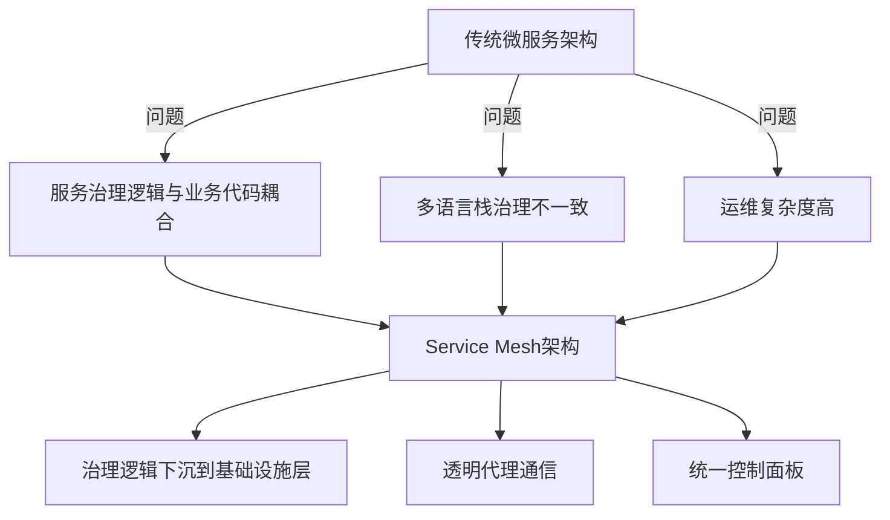
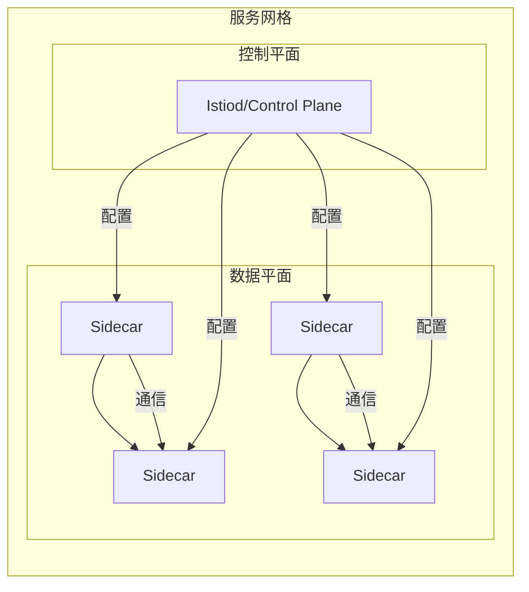

# Service Mesh核心概念与实践

> 云原生架构下的微服务通信与治理解决方案

## 📋 目录

1. [Service Mesh概述](#1-servicemesh概述)
2. [架构组成](#2-架构组成)
3. [核心功能](#3-核心功能)
4. [主流实现对比](#4-主流实现对比)
5. [Istio实战](#5-istio实战)
6. [性能优化](#6-性能优化)
7. [部署策略](#7-部署策略)
8. [未来趋势](#8-未来趋势)

---

## 1. Service Mesh概述

### 1.1 定义与演进

Service Mesh（服务网格）是一个专门处理服务间通信的基础设施层，负责在云原生应用的微服务之间可靠地传递请求。

**演进历程**：
- 单体架构 → 分布式架构 → 微服务架构 → Service Mesh架构
- 从代码侵入式框架（如Spring Cloud）到透明代理层

### 1.2 解决的核心问题

- 服务发现与负载均衡
- 流量管理与控制
- 安全通信（加密、认证、授权）
- 可观测性（监控、追踪、日志）
- 故障恢复与弹性能力



---

## 2. 架构组成

### 2.1 双层架构

| 平面 | 组件 | 功能 |
|------|------|------|
| **数据平面** | 代理（Sidecar） | 处理服务间通信，执行流量策略，收集遥测数据 |
| **控制平面** | 管理节点 | 提供配置、策略和服务发现，不直接处理数据流量 |

### 2.2 典型部署模式

**Sidecar模式**：
- 每个服务实例旁部署一个代理容器
- 服务间通信通过Sidecar转发
- 对应用完全透明，无需修改代码



---

## 3. 核心功能

### 3.1 流量管理

- **动态路由**：基于权重、Header、路径的流量分配
- **流量控制**：超时、重试、熔断、限流
- **灰度发布**：金丝雀、蓝绿部署、A/B测试

```yaml
# Istio虚拟服务示例
apiVersion: networking.istio.io/v1alpha3
kind: VirtualService
metadata:
  name: payment-service
spec:
  hosts:
  - payment-service
  http:
  - route:
    - destination:
        host: payment-service
        subset: v1
      weight: 90
    - destination:
        host: payment-service
        subset: v2
      weight: 10
```

### 3.2 安全通信

- **mTLS**：服务间通信加密
- **身份认证**：基于SPIFFE的服务身份标识
- **授权策略**：细粒度访问控制
- **密钥管理**：自动证书轮换

### 3.3 可观测性

- **遥测数据**：指标、日志、追踪
- **分布式追踪**：请求流经所有服务的完整路径
- **服务网格监控**：数据平面和控制平面监控

### 3.4 服务发现与负载均衡

- 与Kubernetes等容器编排平台集成
- 高级负载均衡算法（轮询、最小连接、一致性哈希）
- 健康检查与实例剔除

---

## 4. 主流实现对比

| 特性 | Istio | Linkerd | Consul Connect | Traefik Mesh |
|------|-------|---------|----------------|--------------|
| **数据平面** | Envoy | Linkerd Proxy | Envoy | Traefik |
| **控制平面** | Istiod | Controller | Consul Server | Traefik Pilot |
| **语言** | Go | Rust/Go | Go | Go |
| **成熟度** | 高 | 中 | 中 | 中 |
| **性能开销** | 中高 | 低 | 中 | 中 |
| **功能丰富度** | 丰富 | 精简 | 中等 | 中等 |
| **易用性** | 中等 | 高 | 高 | 高 |
| **社区活跃度** | 高 | 中 | 中 | 中 |

---

## 5. Istio实战

### 5.1 环境部署

```bash
# 使用Istioctl安装
istioctl install --set profile=demo -y

# 部署示例应用（Bookinfo）
kubectl label namespace default istio-injection=enabled
kubectl apply -f samples/bookinfo/platform/kube/bookinfo.yaml

# 配置网关
kubectl apply -f samples/bookinfo/networking/bookinfo-gateway.yaml
```

### 5.2 流量管理示例

**1. 故障注入**：
```yaml
apiVersion: networking.istio.io/v1alpha3
kind: VirtualService
metadata:
  name: ratings
spec:
  hosts:
  - ratings
  http:
  - fault:
      delay:
        percentage:
          value: 50
        fixedDelay: 7s
    route:
    - destination:
        host: ratings
        subset: v1
```

**2. 熔断配置**：
```yaml
apiVersion: networking.istio.io/v1alpha3
kind: DestinationRule
metadata:
  name: reviews
spec:
  host: reviews
  trafficPolicy:
    connectionPool:
      tcp:
        maxConnections: 100
      http:
        http1MaxPendingRequests: 100
        maxRequestsPerConnection: 10
    outlierDetection:
      consecutiveErrors: 5
      interval: 30s
      baseEjectionTime: 30s
  subsets:
  - name: v1
    labels:
      version: v1
```

### 5.3 监控配置

```yaml
apiVersion: monitoring.coreos.com/v1
kind: ServiceMonitor
metadata:
  name: istio-proxies
  namespace: istio-system
spec:
  selector:
    matchLabels:
      istio.io/rev: default
  endpoints:
  - port: http-monitoring
    interval: 15s
```

---

## 6. 性能优化

### 6.1 关键优化方向

- **资源配置**：合理设置Sidecar CPU/内存限制
- **连接复用**：启用HTTP/2长连接
- **协议选择**：优先使用gRPC而非REST
- **缓存策略**：优化控制平面配置推送
- **流量采样**：合理设置分布式追踪采样率

### 6.2 性能测试指标

- 延迟（P50/P90/P99）
- 吞吐量（每秒请求数）
- 资源占用（CPU/内存）
- 连接数

---

## 7. 部署策略

### 7.1 渐进式部署

1. **试点阶段**：选择非关键服务部署
2. **扩展阶段**：逐步扩展到核心服务
3. **全面部署**：所有服务接入Service Mesh

### 7.2 迁移策略

- **增量迁移**：按服务逐步迁移
- **金丝雀迁移**：新旧系统并行运行
- **流量切换**：通过权重逐步切换流量

---

## 8. 未来趋势

### 8.1 技术发展方向

- **轻量级化**：降低性能开销
- **eBPF技术**：替代Sidecar模式
- **Serverless集成**：无服务器架构适配
- **AI辅助运维**：智能流量管理与故障预测

### 8.2 标准化进展

- Service Mesh Interface (SMI)规范
- 多平台适配能力增强
- 与云厂商服务深度集成

---

## 📚 参考资源

- [Istio官方文档](https://istio.io/latest/docs/)
- [Linkerd官方文档](https://linkerd.io/2.12/docs/)
- [Service Mesh Patterns](https://servicemeshpatterns.io/)
- [云原生服务网格技术白皮书](https://www.cncf.io/reports/service-mesh/)