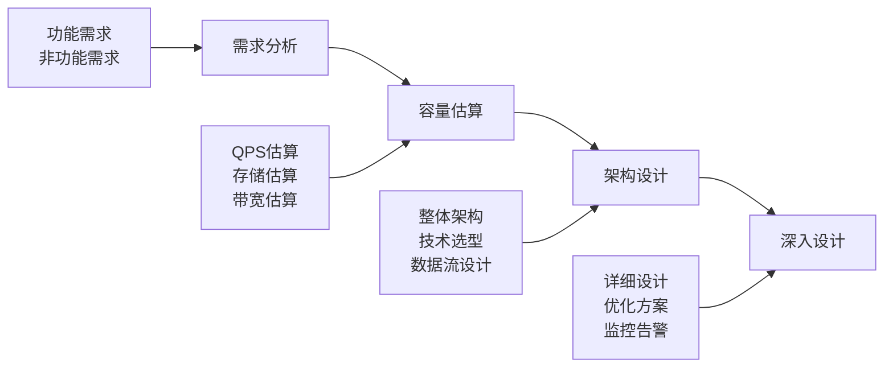

# 系统设计方法论

> 💡 系统化的设计思维与方法，从需求到架构的完整流程

---

## 📋 目录

- [1. 系统设计四步法](#1-系统设计四步法)
- [2. 需求分析](#2-需求分析)
- [3. 容量估算](#3-容量估算)
- [4. 架构设计](#4-架构设计)
- [5. 深入设计](#5-深入设计)
- [6. 技术选型框架](#6-技术选型框架)
- [7. 架构图绘制规范](#7-架构图绘制规范)
- [8. 实战案例](#8-实战案例)

---

## 1. 系统设计四步法

### 🎯 设计流程概览



### 📝 四步法详解

#### 第一步：需求分析（Requirements Analysis）
- **功能需求**：系统要实现什么功能
- **非功能需求**：性能、可用性、一致性、扩展性
- **约束条件**：技术栈限制、成本预算、时间要求

#### 第二步：容量估算（Capacity Estimation）
- **用户规模**：DAU、MAU、峰值并发
- **数据规模**：存储容量、增长速度
- **性能指标**：QPS、延迟、吞吐量

#### 第三步：架构设计（Architecture Design）
- **整体架构**：分层架构、微服务架构
- **技术选型**：数据库、缓存、消息队列
- **数据流设计**：读写流程、数据同步

#### 第四步：深入设计（Detailed Design）
- **核心模块设计**：API设计、数据模型
- **性能优化**：缓存策略、异步处理
- **可靠性保障**：容错机制、监控告警

---

## 2. 需求分析

### 2.1 功能需求分析

#### 🔍 需求收集方法
```
1. 用户故事（User Story）
   - 作为[用户角色]，我希望[功能描述]，以便[业务价值]
   
2. 用例图（Use Case Diagram）
   - 识别主要参与者
   - 梳理核心用例
   - 分析用例关系

3. 功能清单
   - 核心功能（MVP）
   - 重要功能
   - 可选功能
```

#### 📋 功能需求模板
```markdown
## 功能需求

### 核心功能（P0）
- [ ] 用户注册登录
- [ ] 核心业务功能1
- [ ] 核心业务功能2

### 重要功能（P1）
- [ ] 数据统计分析
- [ ] 消息通知
- [ ] 权限管理

### 可选功能（P2）
- [ ] 个性化推荐
- [ ] 社交功能
- [ ] 第三方集成
```

### 2.2 非功能需求分析

#### ⚡ 性能需求（Performance）
```
响应时间：
- 页面加载：< 2秒
- API响应：< 500ms
- 数据库查询：< 100ms

吞吐量：
- 并发用户：10,000
- QPS峰值：50,000
- 数据处理：1TB/天
```

#### 🔒 可用性需求（Availability）
```
可用性指标：
- 系统可用性：99.9%（8.76小时/年）
- 核心服务：99.99%（52.56分钟/年）
- 数据可靠性：99.999%

容灾要求：
- RTO（恢复时间目标）：< 1小时
- RPO（恢复点目标）：< 15分钟
- 异地容灾：支持
```

#### 📈 扩展性需求（Scalability）
```
水平扩展：
- 支持服务实例动态扩缩容
- 支持数据库分库分表
- 支持缓存集群扩展

垂直扩展：
- 支持硬件资源升级
- 支持性能参数调优
```

#### 🔐 安全性需求（Security）
```
认证授权：
- 用户身份认证
- 权限控制（RBAC）
- API访问控制

数据安全：
- 数据加密（传输+存储）
- 敏感信息脱敏
- 审计日志

网络安全：
- HTTPS通信
- 防SQL注入
- 防XSS攻击
```

---

## 3. 容量估算

### 3.1 用户规模估算

#### 👥 用户指标计算
```
基础指标：
- MAU（月活用户）：1000万
- DAU（日活用户）：MAU × 30% = 300万
- 峰值DAU：DAU × 3 = 900万

并发指标：
- 平均并发：DAU × 10% = 30万
- 峰值并发：平均并发 × 5 = 150万
- 极值并发：峰值并发 × 2 = 300万
```

#### 📊 时间分布模型
```
日访问分布（80/20原则）：
- 80%的访问集中在20%的时间（4.8小时）
- 峰值时段：19:00-23:00

QPS计算：
- 日均QPS：DAU × 平均请求数 / 86400
- 峰值QPS：日均QPS × 5-10倍
```

### 3.2 存储容量估算

#### 💾 数据存储计算
```
用户数据：
- 用户基础信息：1KB/用户
- 用户行为数据：10KB/用户/天
- 用户生成内容：100KB/用户/天

业务数据：
- 订单数据：2KB/订单
- 商品数据：5KB/商品
- 日志数据：1KB/请求

总存储量：
- 日增量：用户数 × 单用户日增量
- 年增量：日增量 × 365
- 总容量：历史数据 + 年增量 × 预期年数
```

#### 🗄️ 数据库容量规划
```
MySQL容量规划：
- 单表建议：< 1000万行
- 单库建议：< 100GB
- 分库分表：按业务垂直拆分 + 按数据量水平拆分

Redis容量规划：
- 热点数据：20%的数据产生80%的访问
- 缓存容量：热点数据量 × 1.5倍
- 集群规划：单节点 < 20GB
```

### 3.3 带宽估算

#### 🌐 网络带宽计算
```
上行带宽：
- 用户上传：平均文件大小 × 上传QPS
- API请求：平均请求大小 × 请求QPS

下行带宽：
- 内容分发：平均响应大小 × 响应QPS
- 文件下载：平均文件大小 × 下载QPS

CDN规划：
- 静态资源：图片、CSS、JS
- 动态内容：API响应缓存
- 全球分发：就近访问
```

---

## 4. 架构设计

### 4.1 架构模式选择

#### 🏗️ 分层架构（Layered Architecture）
```
适用场景：
- 中小型应用
- 团队规模较小
- 业务相对简单

架构层次：
┌─────────────────┐
│   表现层（Web）   │ ← 用户界面、API
├─────────────────┤
│   业务层（BLL）   │ ← 业务逻辑、服务
├─────────────────┤
│   数据层（DAL）   │ ← 数据访问、持久化
└─────────────────┘

优点：
- 结构清晰，易于理解
- 职责分离，便于维护
- 技术栈相对简单

缺点：
- 扩展性有限
- 性能瓶颈集中
- 技术债务积累
```

#### 🔧 微服务架构（Microservices Architecture）
```
适用场景：
- 大型复杂应用
- 团队规模较大
- 业务快速发展

架构特点：
┌─────────┐  ┌─────────┐  ┌─────────┐
│ 用户服务  │  │ 订单服务  │  │ 商品服务  │
└─────────┘  └─────────┘  └─────────┘
     │            │            │
┌─────────────────────────────────────┐
│           API网关（Gateway）          │
└─────────────────────────────────────┘
     │            │            │
┌─────────┐  ┌─────────┐  ┌─────────┐
│ 用户DB   │  │ 订单DB   │  │ 商品DB   │
└─────────┘  └─────────┘  └─────────┘

优点：
- 独立部署和扩展
- 技术栈多样化
- 故障隔离

缺点：
- 复杂度增加
- 分布式事务
- 运维成本高
```

#### 🎯 事件驱动架构（Event-Driven Architecture）
```
适用场景：
- 高并发系统
- 异步处理需求
- 松耦合要求

架构模式：
生产者 → 消息队列 → 消费者

事件类型：
- 领域事件：业务状态变化
- 集成事件：系统间通信
- 通知事件：状态通知

优点：
- 高度解耦
- 异步处理
- 可扩展性强

缺点：
- 调试困难
- 事件顺序
- 数据一致性
```

### 4.2 技术选型决策

#### 🗄️ 数据库选型
```
关系型数据库（RDBMS）：
适用场景：
- 强一致性要求
- 复杂查询需求
- 事务处理

选型对比：
┌─────────┬─────────┬─────────┬─────────┐
│  数据库  │  性能   │  功能   │  生态   │
├─────────┼─────────┼─────────┼─────────┤
│  MySQL  │   ⭐⭐⭐  │  ⭐⭐⭐⭐ │  ⭐⭐⭐⭐⭐│
│PostgreSQL│  ⭐⭐⭐⭐ │  ⭐⭐⭐⭐⭐│  ⭐⭐⭐  │
│ Oracle  │  ⭐⭐⭐⭐⭐│  ⭐⭐⭐⭐⭐│  ⭐⭐⭐⭐ │
└─────────┴─────────┴─────────┴─────────┘

NoSQL数据库：
适用场景：
- 高并发读写
- 海量数据存储
- 灵活数据模型

类型选择：
- 文档型：MongoDB（复杂查询）
- 键值型：Redis（高性能缓存）
- 列族型：HBase（大数据分析）
- 图型：Neo4j（关系分析）
```

#### 🔴 缓存选型
```
本地缓存：
- Caffeine：高性能本地缓存
- Guava Cache：Google开源缓存
- EhCache：企业级缓存

分布式缓存：
- Redis：高性能键值存储
- Memcached：简单分布式缓存
- Hazelcast：内存数据网格

缓存策略：
- Cache-Aside：旁路缓存
- Write-Through：写穿透
- Write-Behind：写回
```

#### 📨 消息队列选型
```
消息队列对比：
┌─────────────┬─────────┬─────────┬─────────┐
│   消息队列   │  性能   │  功能   │  运维   │
├─────────────┼─────────┼─────────┼─────────┤
│  RocketMQ   │  ⭐⭐⭐⭐ │  ⭐⭐⭐⭐⭐│  ⭐⭐⭐  │
│   Kafka     │  ⭐⭐⭐⭐⭐│  ⭐⭐⭐⭐ │  ⭐⭐   │
│  RabbitMQ   │  ⭐⭐⭐  │  ⭐⭐⭐⭐⭐│  ⭐⭐⭐⭐ │
│   Pulsar    │  ⭐⭐⭐⭐ │  ⭐⭐⭐⭐⭐│  ⭐⭐   │
└─────────────┴─────────┴─────────┴─────────┘

选型建议：
- 高吞吐量：Kafka
- 功能丰富：RocketMQ、RabbitMQ
- 云原生：Pulsar
```

---

## 5. 深入设计

### 5.1 API设计

#### 🔌 RESTful API设计
```
设计原则：
1. 资源导向：URL表示资源，HTTP方法表示操作
2. 无状态：每个请求包含完整信息
3. 统一接口：标准HTTP方法和状态码
4. 分层系统：支持缓存和负载均衡

URL设计规范：
GET    /api/v1/users          # 获取用户列表
GET    /api/v1/users/{id}     # 获取指定用户
POST   /api/v1/users          # 创建用户
PUT    /api/v1/users/{id}     # 更新用户
DELETE /api/v1/users/{id}     # 删除用户

响应格式：
{
  "code": 200,
  "message": "success",
  "data": {
    "id": 1,
    "name": "张三",
    "email": "zhangsan@example.com"
  },
  "timestamp": "2025-12-26T10:00:00Z"
}
```

#### 📊 GraphQL API设计
```
适用场景：
- 客户端多样化
- 数据获取灵活性
- 减少网络请求

Schema设计：
type User {
  id: ID!
  name: String!
  email: String!
  posts: [Post!]!
}

type Post {
  id: ID!
  title: String!
  content: String!
  author: User!
}

type Query {
  user(id: ID!): User
  users(limit: Int, offset: Int): [User!]!
}

查询示例：
query {
  user(id: "1") {
    name
    email
    posts {
      title
    }
  }
}
```

### 5.2 数据模型设计

#### 🗃️ 数据库设计原则
```
范式设计：
- 第一范式（1NF）：原子性，不可再分
- 第二范式（2NF）：完全依赖，消除部分依赖
- 第三范式（3NF）：消除传递依赖

反范式设计：
- 适度冗余：提高查询性能
- 预计算：存储计算结果
- 宽表设计：减少JOIN操作

索引设计：
- 主键索引：聚簇索引，数据存储顺序
- 唯一索引：保证数据唯一性
- 普通索引：提高查询性能
- 复合索引：多字段组合索引
```

#### 📋 数据模型示例
```sql
-- 用户表
CREATE TABLE users (
    id BIGINT PRIMARY KEY AUTO_INCREMENT,
    username VARCHAR(50) NOT NULL UNIQUE,
    email VARCHAR(100) NOT NULL UNIQUE,
    password_hash VARCHAR(255) NOT NULL,
    status TINYINT DEFAULT 1,
    created_at TIMESTAMP DEFAULT CURRENT_TIMESTAMP,
    updated_at TIMESTAMP DEFAULT CURRENT_TIMESTAMP ON UPDATE CURRENT_TIMESTAMP,
    
    INDEX idx_username (username),
    INDEX idx_email (email),
    INDEX idx_status_created (status, created_at)
);

-- 订单表
CREATE TABLE orders (
    id BIGINT PRIMARY KEY AUTO_INCREMENT,
    user_id BIGINT NOT NULL,
    order_no VARCHAR(32) NOT NULL UNIQUE,
    total_amount DECIMAL(10,2) NOT NULL,
    status TINYINT DEFAULT 1,
    created_at TIMESTAMP DEFAULT CURRENT_TIMESTAMP,
    
    INDEX idx_user_id (user_id),
    INDEX idx_order_no (order_no),
    INDEX idx_status_created (status, created_at),
    
    FOREIGN KEY (user_id) REFERENCES users(id)
);
```

### 5.3 缓存策略设计

#### 🔄 缓存模式
```
Cache-Aside（旁路缓存）：
读取流程：
1. 应用先查缓存
2. 缓存命中返回数据
3. 缓存未命中查数据库
4. 将数据写入缓存

更新流程：
1. 更新数据库
2. 删除缓存（推荐）
3. 或更新缓存（可能不一致）

Write-Through（写穿透）：
1. 应用写缓存
2. 缓存同步写数据库
3. 保证数据一致性

Write-Behind（写回）：
1. 应用写缓存
2. 缓存异步写数据库
3. 提高写性能，但可能丢数据
```

#### 🎯 缓存设计实践
```java
@Service
public class UserService {
    
    @Autowired
    private UserRepository userRepository;
    
    @Autowired
    private RedisTemplate<String, Object> redisTemplate;
    
    private static final String USER_CACHE_KEY = "user:";
    private static final int CACHE_EXPIRE_SECONDS = 3600;
    
    public User getUserById(Long id) {
        // 1. 查缓存
        String cacheKey = USER_CACHE_KEY + id;
        User user = (User) redisTemplate.opsForValue().get(cacheKey);
        
        if (user != null) {
            return user;
        }
        
        // 2. 查数据库
        user = userRepository.findById(id);
        if (user != null) {
            // 3. 写缓存（设置过期时间）
            redisTemplate.opsForValue().set(cacheKey, user, 
                CACHE_EXPIRE_SECONDS, TimeUnit.SECONDS);
        }
        
        return user;
    }
    
    public void updateUser(User user) {
        // 1. 更新数据库
        userRepository.save(user);
        
        // 2. 删除缓存
        String cacheKey = USER_CACHE_KEY + user.getId();
        redisTemplate.delete(cacheKey);
    }
}
```

---

## 6. 技术选型框架

### 6.1 PCTS决策模型

#### 📊 PCTS评估维度
```
P - Performance（性能）
- 响应时间
- 吞吐量
- 并发能力
- 资源消耗

C - Cost（成本）
- 开发成本
- 运维成本
- 许可成本
- 硬件成本

T - Team（团队）
- 技术熟悉度
- 学习成本
- 人员储备
- 培训成本

S - Scale（规模）
- 用户规模
- 数据规模
- 业务复杂度
- 扩展需求
```

#### 🎯 决策矩阵示例
```
数据库选型决策矩阵：

┌─────────────┬─────────┬─────────┬─────────┬─────────┬─────────┐
│    方案     │ 性能(P) │ 成本(C) │ 团队(T) │ 规模(S) │ 总分    │
├─────────────┼─────────┼─────────┼─────────┼─────────┼─────────┤
│   MySQL     │    7    │    9    │    9    │    7    │   32    │
│ PostgreSQL  │    8    │    9    │    6    │    8    │   31    │
│   MongoDB   │    8    │    8    │    5    │    9    │   30    │
│   Oracle    │    9    │    4    │    7    │    9    │   29    │
└─────────────┴─────────┴─────────┴─────────┴─────────┴─────────┘

评分标准：1-10分，10分最优
权重设置：可根据项目重要性调整各维度权重
```

### 6.2 技术选型检查清单

#### ✅ 选型检查清单
```markdown
## 技术选型检查清单

### 基础评估
- [ ] 技术成熟度：是否经过生产环境验证
- [ ] 社区活跃度：GitHub Star、Issue响应速度
- [ ] 文档完整性：官方文档、最佳实践
- [ ] 版本稳定性：发布频率、向后兼容性

### 性能评估
- [ ] 基准测试：TPS、QPS、延迟
- [ ] 扩展性：水平扩展、垂直扩展
- [ ] 资源消耗：CPU、内存、磁盘、网络
- [ ] 性能调优：参数配置、监控指标

### 成本评估
- [ ] 许可成本：开源 vs 商业许可
- [ ] 开发成本：学习曲线、开发效率
- [ ] 运维成本：部署复杂度、维护工作量
- [ ] 硬件成本：服务器、存储、网络

### 团队评估
- [ ] 技术储备：团队熟悉程度
- [ ] 学习成本：培训时间、学习资料
- [ ] 招聘难度：人才市场供给
- [ ] 技术支持：厂商支持、社区支持

### 业务评估
- [ ] 功能匹配：是否满足业务需求
- [ ] 扩展性：未来业务发展适应性
- [ ] 集成性：与现有系统集成难度
- [ ] 迁移成本：从现有方案迁移成本
```

---

## 7. 架构图绘制规范

### 7.1 架构图类型

#### 🏗️ 系统架构图
```
目的：展示系统整体架构和组件关系
内容：
- 系统边界
- 主要组件
- 组件关系
- 数据流向

绘制工具：
- Draw.io（免费）
- Lucidchart（在线）
- Visio（微软）
- PlantUML（代码生成）
```

#### 🔄 部署架构图
```
目的：展示系统部署拓扑和基础设施
内容：
- 服务器节点
- 网络拓扑
- 负载均衡
- 安全边界

示例：
┌─────────────────────────────────────────┐
│                 CDN                     │
└─────────────────┬───────────────────────┘
                  │
┌─────────────────┴───────────────────────┐
│            负载均衡器（LB）               │
└─────────┬───────────────┬───────────────┘
          │               │
┌─────────┴─────┐ ┌───────┴───────┐
│   Web服务器1   │ │   Web服务器2   │
└─────────┬─────┘ └───────┬───────┘
          │               │
┌─────────┴───────────────┴───────┐
│          应用服务器集群           │
└─────────┬───────────────────────┘
          │
┌─────────┴─────┐ ┌─────────────┐
│   数据库主库   │ │  数据库从库  │
└───────────────┘ └─────────────┘
```

#### 📊 数据流图
```
目的：展示数据在系统中的流转过程
内容：
- 数据源
- 处理过程
- 数据存储
- 数据输出

符号规范：
○ 外部实体
□ 处理过程
⚬ 数据存储
→ 数据流
```

### 7.2 绘制规范

#### 🎨 视觉规范
```
颜色使用：
- 蓝色：核心业务组件
- 绿色：数据存储组件
- 橙色：外部系统接口
- 红色：安全相关组件
- 灰色：基础设施组件

形状使用：
- 矩形：服务/组件
- 圆柱：数据库
- 云形：外部服务
- 菱形：决策点
- 圆形：开始/结束

线条使用：
- 实线：同步调用
- 虚线：异步调用
- 粗线：主要数据流
- 细线：次要数据流
```

#### 📝 标注规范
```
组件标注：
- 组件名称
- 技术栈
- 关键参数

连接标注：
- 协议类型（HTTP、TCP、MQ）
- 数据格式（JSON、XML、Binary）
- 调用频率（QPS）

图例说明：
- 颜色含义
- 形状含义
- 线条含义
- 特殊符号
```

---

## 8. 实战案例

### 8.1 短链接系统设计

#### 📋 需求分析
```
功能需求：
- 长链接转短链接
- 短链接跳转到长链接
- 链接访问统计
- 自定义短链接

非功能需求：
- QPS：100万
- 延迟：< 100ms
- 可用性：99.9%
- 数据保存：永久
```

#### 📊 容量估算
```
用户规模：
- 日活用户：100万
- 每用户生成链接：10个
- 日生成链接：1000万

存储估算：
- 链接数据：500字节/条
- 日存储增量：1000万 × 500字节 = 5GB
- 年存储增量：5GB × 365 = 1.8TB
- 5年总存储：9TB

QPS估算：
- 写QPS：1000万 / 86400 = 116
- 读写比：100:1
- 读QPS：116 × 100 = 11,600
- 峰值QPS：11,600 × 10 = 116,000
```

#### 🏗️ 架构设计
```
整体架构：
┌─────────┐    ┌─────────────┐    ┌─────────────┐
│  客户端  │───▶│   API网关    │───▶│  短链服务    │
└─────────┘    └─────────────┘    └─────────────┘
                       │                   │
                       ▼                   ▼
               ┌─────────────┐    ┌─────────────┐
               │   统计服务   │    │   缓存层     │
               └─────────────┘    └─────────────┘
                       │                   │
                       ▼                   ▼
               ┌─────────────┐    ┌─────────────┐
               │   数据库     │    │   数据库     │
               │  (统计数据)  │    │  (链接数据)  │
               └─────────────┘    └─────────────┘

技术选型：
- API网关：Nginx + Lua
- 应用服务：Spring Boot
- 缓存：Redis Cluster
- 数据库：MySQL分库分表
- 消息队列：RocketMQ（异步统计）
```

#### 🔧 核心算法
```java
// Base62编码算法
public class Base62Encoder {
    private static final String ALPHABET = 
        "abcdefghijklmnopqrstuvwxyzABCDEFGHIJKLMNOPQRSTUVWXYZ0123456789";
    private static final int BASE = ALPHABET.length();
    
    public static String encode(long num) {
        StringBuilder sb = new StringBuilder();
        while (num > 0) {
            sb.append(ALPHABET.charAt((int)(num % BASE)));
            num /= BASE;
        }
        return sb.reverse().toString();
    }
    
    public static long decode(String str) {
        long num = 0;
        for (char c : str.toCharArray()) {
            num = num * BASE + ALPHABET.indexOf(c);
        }
        return num;
    }
}

// 短链生成服务
@Service
public class ShortUrlService {
    
    @Autowired
    private RedisTemplate<String, String> redisTemplate;
    
    @Autowired
    private UrlRepository urlRepository;
    
    public String generateShortUrl(String longUrl) {
        // 1. 检查是否已存在
        String existingShortUrl = getExistingShortUrl(longUrl);
        if (existingShortUrl != null) {
            return existingShortUrl;
        }
        
        // 2. 生成唯一ID
        long id = generateUniqueId();
        
        // 3. Base62编码
        String shortCode = Base62Encoder.encode(id);
        
        // 4. 存储映射关系
        saveUrlMapping(shortCode, longUrl);
        
        return "https://short.ly/" + shortCode;
    }
    
    public String getLongUrl(String shortCode) {
        // 1. 先查缓存
        String longUrl = redisTemplate.opsForValue().get(shortCode);
        if (longUrl != null) {
            return longUrl;
        }
        
        // 2. 查数据库
        longUrl = urlRepository.findLongUrlByShortCode(shortCode);
        if (longUrl != null) {
            // 3. 写入缓存
            redisTemplate.opsForValue().set(shortCode, longUrl, 
                Duration.ofHours(24));
        }
        
        return longUrl;
    }
}
```

### 8.2 设计总结

#### ✅ 设计要点
```
1. 需求驱动设计
   - 明确功能和性能需求
   - 基于需求进行容量估算
   - 根据估算结果选择架构

2. 分层设计思维
   - 接入层：负载均衡、限流
   - 应用层：业务逻辑、服务治理
   - 数据层：缓存、数据库、消息队列

3. 性能优化策略
   - 缓存：减少数据库访问
   - 异步：提高响应速度
   - 分片：提高并发能力

4. 可靠性保障
   - 冗余：避免单点故障
   - 监控：及时发现问题
   - 降级：保证核心功能
```

#### 🎯 设计原则
```
1. 简单性（Simplicity）
   - 优先选择简单方案
   - 避免过度设计
   - 保持架构清晰

2. 可扩展性（Scalability）
   - 水平扩展优于垂直扩展
   - 无状态设计
   - 分层解耦

3. 可靠性（Reliability）
   - 故障隔离
   - 优雅降级
   - 快速恢复

4. 性能（Performance）
   - 缓存策略
   - 异步处理
   - 资源优化

5. 安全性（Security）
   - 认证授权
   - 数据加密
   - 访问控制
```

---

## 📚 参考资料

### 推荐书籍
- 📘 《大型网站技术架构》- 李智慧
- 📘 《亿级流量网站架构核心技术》- 张开涛
- 📘 《系统设计面试指南》- Alex Xu
- 📘 《凤凰架构》- 周志明
- 📘 《微服务架构设计模式》- Chris Richardson

### 在线资源
- 🌐 [系统设计入门](https://github.com/donnemartin/system-design-primer)
- 🌐 [高并发架构设计](https://github.com/doocs/advanced-java)
- 🌐 [架构师技能图谱](https://github.com/toutiaoio/awesome-architecture)

### 工具推荐
- 🛠️ **架构图工具**：Draw.io、Lucidchart、PlantUML
- 🛠️ **性能测试**：JMeter、Gatling、wrk
- 🛠️ **监控工具**：Prometheus、Grafana、ELK
- 🛠️ **压测工具**：Apache Bench、Siege、Artillery

---

**掌握系统设计方法论，成为优秀的架构师！** 🚀

*最后更新：2025-12-26*