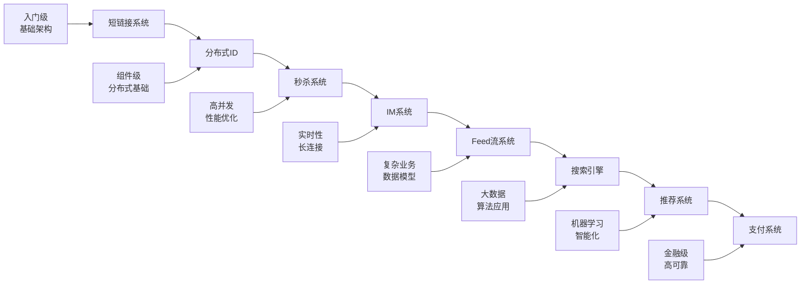

# 经典系统设计案例

> 💡 通过8个经典案例掌握系统设计精髓，从简单到复杂循序渐进

---

## 📚 案例目录

```
经典系统设计案例/
├── README.md                    # 本文档
├── 01_设计短链接系统.md          # 入门级：URL缩短服务
├── 02_设计秒杀系统.md            # 高并发：电商秒杀
├── 03_设计IM系统.md              # 实时通信：即时消息
├── 04_设计feed流系统.md          # 社交网络：信息流
├── 05_设计分布式ID.md            # 基础组件：全局ID
├── 06_设计搜索引擎.md            # 信息检索：全文搜索
├── 07_设计推荐系统.md            # 算法应用：个性化推荐
└── 08_设计支付系统.md            # 金融级：在线支付
```

---

## 🎯 学习路径

### 📈 难度递进



### 🎓 推荐学习顺序

#### 第一阶段：基础入门（1-2周）
**目标**：掌握基本的系统设计思路

1. **短链接系统** ⭐⭐⭐
   - 难度：入门级
   - 核心技能：基础架构、数据库设计、缓存应用
   - 学习重点：需求分析、容量估算、技术选型

2. **分布式ID** ⭐⭐⭐
   - 难度：基础级
   - 核心技能：分布式系统基础、算法设计
   - 学习重点：分布式理论、ID生成算法、高可用设计

#### 第二阶段：性能优化（2-3周）
**目标**：掌握高并发系统设计

3. **秒杀系统** ⭐⭐⭐⭐
   - 难度：中级
   - 核心技能：高并发处理、缓存设计、限流降级
   - 学习重点：性能优化、流量控制、数据一致性

4. **IM系统** ⭐⭐⭐⭐
   - 难度：中级
   - 核心技能：实时通信、长连接管理、消息可靠性
   - 学习重点：WebSocket、消息队列、在线状态管理

#### 第三阶段：复杂业务（3-4周）
**目标**：掌握复杂业务系统设计

5. **Feed流系统** ⭐⭐⭐⭐⭐
   - 难度：中高级
   - 核心技能：社交网络、推拉模式、海量数据处理
   - 学习重点：数据模型设计、推送策略、性能优化

6. **搜索引擎** ⭐⭐⭐⭐⭐
   - 难度：高级
   - 核心技能：信息检索、倒排索引、分布式计算
   - 学习重点：搜索算法、索引设计、相关性排序

#### 第四阶段：高级应用（4-6周）
**目标**：掌握智能化和金融级系统设计

7. **推荐系统** ⭐⭐⭐⭐⭐
   - 难度：高级
   - 核心技能：机器学习、个性化算法、实时计算
   - 学习重点：推荐算法、特征工程、A/B测试

8. **支付系统** ⭐⭐⭐⭐⭐
   - 难度：专家级
   - 核心技能：金融业务、数据一致性、安全设计
   - 学习重点：事务处理、风控系统、合规要求

---

## 📊 案例对比分析

### 🔍 技术维度对比

| 案例 | 并发量 | 数据量 | 一致性 | 实时性 | 复杂度 |
|------|--------|--------|--------|--------|--------|
| 短链接系统 | 10万QPS | TB级 | 最终一致 | 低 | ⭐⭐⭐ |
| 分布式ID | 100万QPS | - | 强一致 | 高 | ⭐⭐⭐ |
| 秒杀系统 | 100万QPS | GB级 | 强一致 | 高 | ⭐⭐⭐⭐ |
| IM系统 | 10万并发 | TB级 | 最终一致 | 极高 | ⭐⭐⭐⭐ |
| Feed流系统 | 50万QPS | PB级 | 最终一致 | 中 | ⭐⭐⭐⭐⭐ |
| 搜索引擎 | 10万QPS | PB级 | 最终一致 | 中 | ⭐⭐⭐⭐⭐ |
| 推荐系统 | 50万QPS | PB级 | 最终一致 | 中 | ⭐⭐⭐⭐⭐ |
| 支付系统 | 10万QPS | TB级 | 强一致 | 高 | ⭐⭐⭐⭐⭐ |

### 🎯 核心技术栈

| 案例 | 核心技术 | 关键组件 | 主要挑战 |
|------|----------|----------|----------|
| 短链接 | 编码算法、缓存 | Redis、MySQL | 存储优化、查询性能 |
| 分布式ID | 雪花算法、时钟同步 | ZooKeeper、Redis | 全局唯一、高可用 |
| 秒杀 | 限流、缓存、异步 | Redis、MQ、CDN | 瞬时高并发、超卖 |
| IM | WebSocket、消息队列 | Netty、Kafka | 长连接、消息可靠性 |
| Feed流 | 推拉模式、缓存 | Redis、Kafka | 海量数据、个性化 |
| 搜索 | 倒排索引、分词 | ES、Lucene | 相关性、实时索引 |
| 推荐 | 机器学习、实时计算 | Spark、Flink | 冷启动、实时性 |
| 支付 | 分布式事务、风控 | Seata、规则引擎 | 数据一致性、安全 |

---

## 🛠️ 通用设计模式

### 1️⃣ 高并发处理模式

#### 🚀 缓存模式
```
应用场景：
- 短链接系统：URL映射缓存
- 秒杀系统：商品信息缓存
- Feed流系统：热点内容缓存

设计要点：
- 多级缓存：浏览器 → CDN → 应用缓存 → 数据库
- 缓存策略：LRU、LFU、TTL
- 缓存一致性：Cache-Aside、Write-Through
- 缓存穿透：布隆过滤器、空值缓存
```

#### ⚡ 异步处理模式
```
应用场景：
- 秒杀系统：订单异步处理
- IM系统：消息异步投递
- 推荐系统：模型异步训练

设计要点：
- 消息队列：削峰填谷、解耦
- 事件驱动：发布订阅模式
- 异步回调：提高响应速度
- 补偿机制：处理失败情况
```

#### 🔒 限流降级模式
```
应用场景：
- 秒杀系统：防止系统过载
- 搜索引擎：保护后端服务
- 支付系统：风险控制

设计要点：
- 限流算法：令牌桶、漏桶、滑动窗口
- 熔断器：快速失败、自动恢复
- 降级策略：功能降级、服务降级
- 监控告警：实时监控、自动处理
```

### 2️⃣ 数据处理模式

#### 📊 读写分离模式
```
应用场景：
- Feed流系统：读多写少
- 搜索引擎：查询与索引分离
- 推荐系统：训练与预测分离

设计要点：
- 主从复制：数据同步
- 读写路由：智能分发
- 数据一致性：最终一致性
- 故障切换：自动failover
```

#### 🗂️ 分库分表模式
```
应用场景：
- 短链接系统：海量URL存储
- IM系统：消息历史存储
- 支付系统：交易记录存储

设计要点：
- 分片策略：范围分片、哈希分片
- 路由规则：分片键选择
- 跨分片查询：聚合查询
- 数据迁移：在线扩容
```

### 3️⃣ 实时处理模式

#### 🔄 流式处理模式
```
应用场景：
- IM系统：实时消息处理
- 推荐系统：实时特征计算
- 支付系统：实时风控

设计要点：
- 流式计算：Kafka Streams、Flink
- 窗口函数：时间窗口、计数窗口
- 状态管理：有状态计算
- 容错机制：Checkpoint、重启恢复
```

#### 📡 推送模式
```
应用场景：
- IM系统：消息推送
- Feed流系统：内容推送
- 秒杀系统：状态推送

设计要点：
- 长连接：WebSocket、Server-Sent Events
- 连接管理：连接池、心跳检测
- 推送策略：单播、广播、组播
- 离线处理：消息存储、重连推送
```

---

## 🎓 学习方法建议

### 1️⃣ 理论学习
```
学习步骤：
1. 理解业务需求
   - 功能需求分析
   - 非功能需求分析
   - 约束条件识别

2. 掌握设计方法
   - 需求分析方法
   - 容量估算方法
   - 架构设计原则

3. 学习技术方案
   - 技术选型依据
   - 架构模式应用
   - 性能优化策略
```

### 2️⃣ 实践练习
```
练习方法：
1. 独立设计
   - 按照四步法独立设计
   - 绘制架构图
   - 编写设计文档

2. 对比分析
   - 与标准方案对比
   - 分析差异和原因
   - 总结改进点

3. 深入实现
   - 选择关键模块实现
   - 验证设计可行性
   - 优化实现方案
```

### 3️⃣ 面试准备
```
准备策略：
1. 熟练掌握设计流程
   - 需求澄清（5分钟）
   - 容量估算（5分钟）
   - 架构设计（15分钟）
   - 深入讨论（15分钟）

2. 准备常见问题
   - 如何处理热点数据？
   - 如何保证数据一致性？
   - 如何应对流量突增？
   - 如何监控系统健康？

3. 练习表达能力
   - 清晰的逻辑思路
   - 准确的技术术语
   - 合理的权衡分析
   - 开放的讨论态度
```

---

## 📚 扩展阅读

### 推荐资源
- 📘 **书籍**：《系统设计面试指南》、《大型网站技术架构》
- 🌐 **网站**：High Scalability、AWS Architecture Center
- 📺 **视频**：System Design Interview、Grokking System Design
- 💻 **实践**：GitHub开源项目、技术博客案例

### 相关工具
- 🛠️ **设计工具**：Draw.io、Lucidchart、Whimsical
- 📊 **监控工具**：Prometheus、Grafana、ELK Stack
- 🧪 **测试工具**：JMeter、Gatling、K6
- ☁️ **云服务**：AWS、阿里云、腾讯云

---

**通过经典案例学习，掌握系统设计精髓！** 🚀

*最后更新：2025-12-26*