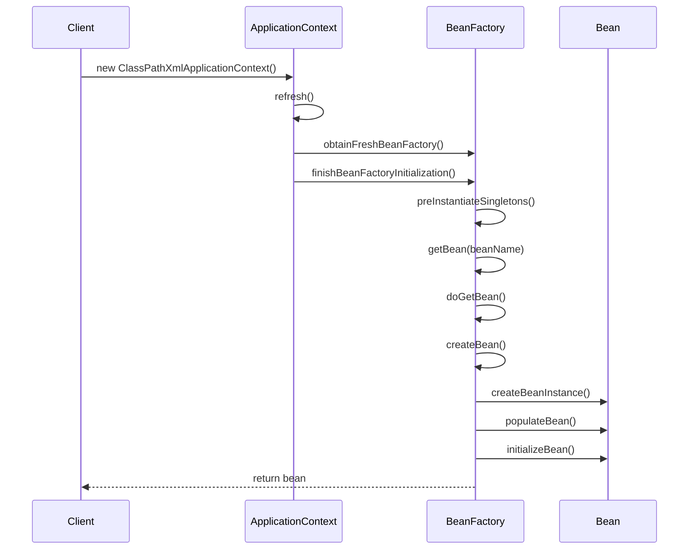

# 源码阅读方法论

> 💡 系统化的源码阅读方法，从入门到精通的完整指南

---

## 📋 目录

- [1. 为什么要读源码](#1-为什么要读源码)
- [2. 阅读前准备](#2-阅读前准备)
- [3. 源码阅读方法](#3-源码阅读方法)
- [4. 调试技巧](#4-调试技巧)
- [5. 笔记与总结](#5-笔记与总结)
- [6. 常见问题](#6-常见问题)

---

## 1. 为什么要读源码

### 1.1 读源码的价值

#### 🎯 技术深度提升
```
1. 理解底层原理
   - 知其然更知其所以然
   - 理解框架设计思想
   - 掌握核心算法实现

2. 学习优秀代码
   - 代码风格和规范
   - 设计模式应用
   - 性能优化技巧

3. 解决实际问题
   - 快速定位Bug
   - 性能调优有据可依
   - 扩展定制更灵活
```

#### 💼 职业发展价值
```
1. 面试加分项
   - 展示技术深度
   - 体现学习能力
   - 增强竞争力

2. 工作能力提升
   - 解决疑难问题
   - 技术方案设计
   - 代码质量提升

3. 技术影响力
   - 技术分享和博客
   - 开源社区贡献
   - 技术领导力
```

### 1.2 应该读哪些源码

#### 📊 优先级排序
```
第一优先级（必读）：
- Java集合框架：HashMap、ArrayList、ConcurrentHashMap
- Java并发包：AQS、ReentrantLock、ThreadPoolExecutor
- Spring核心：IoC容器、AOP、事务管理

第二优先级（推荐）：
- MyBatis：SQL解析、缓存机制
- Spring Boot：自动配置原理
- Netty：Reactor模型、Pipeline

第三优先级（进阶）：
- Dubbo：SPI机制、服务治理
- RocketMQ：消息存储、高可用
- Nacos：服务发现、配置管理
```

---

## 2. 阅读前准备

### 2.1 知识储备

#### 📚 必备知识
```java
// 1. Java基础
- 面向对象：封装、继承、多态
- 集合框架：List、Map、Set
- 异常处理：try-catch、自定义异常
- IO操作：字节流、字符流、NIO
- 反射机制：Class、Method、Field
- 注解：自定义注解、元注解
- 泛型：类型参数、通配符

// 2. 设计模式（重要！）
- 创建型：单例、工厂、建造者
- 结构型：代理、装饰器、适配器
- 行为型：模板方法、策略、观察者、责任链

// 3. 并发编程
- 线程基础：Thread、Runnable
- 同步机制：synchronized、Lock
- 线程池：ThreadPoolExecutor
- 并发工具：CountDownLatch、Semaphore
```

#### 🎯 设计模式速查
```
单例模式：Spring Bean默认单例
工厂模式：BeanFactory创建Bean
代理模式：AOP动态代理
模板方法：JdbcTemplate
策略模式：负载均衡策略
观察者模式：Spring事件机制
责任链模式：Filter链、Interceptor链
装饰器模式：InputStream包装
适配器模式：HandlerAdapter
```

### 2.2 环境准备

#### 🛠️ 开发环境
```
IDE配置：
1. IntelliJ IDEA（推荐）
   - 下载源码：File → Project Structure → SDKs → Sourcepath
   - 反编译插件：自带反编译功能
   - 调试配置：Run → Edit Configurations

2. 源码下载
   - JDK源码：JDK安装目录/src.zip
   - Spring源码：git clone https://github.com/spring-projects/spring-framework
   - MyBatis源码：git clone https://github.com/mybatis/mybatis-3

3. 调试项目
   - 创建测试项目
   - 引入框架依赖
   - 编写测试用例
```

#### 📝 调试项目示例
```xml
<!-- pom.xml -->
<dependencies>
    <!-- Spring -->
    <dependency>
        <groupId>org.springframework</groupId>
        <artifactId>spring-context</artifactId>
        <version>5.3.20</version>
    </dependency>
    
    <!-- MyBatis -->
    <dependency>
        <groupId>org.mybatis</groupId>
        <artifactId>mybatis</artifactId>
        <version>3.5.10</version>
    </dependency>
</dependencies>
```

---

## 3. 源码阅读方法

### 3.1 整体到局部法

#### 🔍 第一步：了解整体架构
```
1. 阅读官方文档
   - 核心概念和术语
   - 整体架构图
   - 核心模块介绍

2. 分析包结构
   - 核心包：core、beans、context
   - 功能包：aop、tx、web
   - 工具包：util、support

3. 识别核心类
   - 入口类：ApplicationContext
   - 核心接口：BeanFactory、BeanDefinition
   - 关键实现：DefaultListableBeanFactory
```

#### 📊 Spring包结构示例
```
spring-framework/
├── spring-core/          # 核心工具类
│   ├── io/              # 资源加载
│   ├── env/             # 环境配置
│   └── util/            # 工具类
├── spring-beans/         # Bean容器
│   ├── factory/         # BeanFactory
│   └── support/         # 支持类
├── spring-context/       # 应用上下文
│   ├── context/         # ApplicationContext
│   └── annotation/      # 注解支持
├── spring-aop/          # AOP支持
│   ├── aop/             # AOP核心
│   └── aspectj/         # AspectJ集成
└── spring-tx/           # 事务管理
    └── transaction/     # 事务核心
```

### 3.2 流程跟踪法

#### 🔄 跟踪执行流程
```java
// 示例：跟踪Spring Bean创建流程

// 1. 入口点
ApplicationContext context = new ClassPathXmlApplicationContext("spring.xml");

// 2. 跟踪调用链
ClassPathXmlApplicationContext
  → AbstractApplicationContext.refresh()
    → obtainFreshBeanFactory()
    → prepareBeanFactory()
    → invokeBeanFactoryPostProcessors()
    → registerBeanPostProcessors()
    → finishBeanFactoryInitialization()
      → DefaultListableBeanFactory.preInstantiateSingletons()
        → getBean()
          → doGetBean()
            → createBean()
              → doCreateBean()
                → createBeanInstance()      // 实例化
                → populateBean()            // 属性填充
                → initializeBean()          // 初始化
```

#### 📝 流程图绘制


### 3.3 断点调试法

#### 🔧 调试技巧
```java
// 1. 设置条件断点
// 在IDEA中右键断点 → Condition
// 例如：beanName.equals("userService")

// 2. 设置方法断点
// 在方法签名行设置断点
// 可以捕获所有调用

// 3. 设置异常断点
// Run → View Breakpoints → Exception Breakpoints
// 捕获特定异常

// 4. 表达式求值
// 调试时按Alt+F8
// 可以执行任意表达式

// 5. 调用栈分析
// 查看Frames窗口
// 理解调用层次
```

#### 📊 调试示例
```java
@Test
public void testBeanCreation() {
    // 在这里设置断点
    ApplicationContext context = 
        new ClassPathXmlApplicationContext("spring.xml");
    
    // 跟踪getBean流程
    UserService userService = context.getBean(UserService.class);
    
    // 验证结果
    assertNotNull(userService);
}
```

### 3.4 对比分析法

#### 🔍 版本对比
```java
// HashMap在JDK7和JDK8的区别

// JDK7：数组 + 链表
Entry<K,V>[] table;
// 头插法，可能导致死循环

// JDK8：数组 + 链表 + 红黑树
Node<K,V>[] table;
// 尾插法，链表长度>8转红黑树
// 红黑树节点<6转回链表
```

#### 📊 实现对比
```java
// 不同锁实现对比

// synchronized
synchronized (lock) {
    // 临界区代码
}
// 特点：JVM内置，自动释放，不可中断

// ReentrantLock
lock.lock();
try {
    // 临界区代码
} finally {
    lock.unlock();
}
// 特点：可中断、可超时、公平锁、条件变量
```

---

## 4. 调试技巧

### 4.1 IDEA调试快捷键

#### ⌨️ 常用快捷键
```
F7：Step Into（进入方法）
F8：Step Over（跳过方法）
Shift+F8：Step Out（跳出方法）
F9：Resume（继续执行）
Alt+F8：Evaluate Expression（表达式求值）
Ctrl+F8：Toggle Breakpoint（切换断点）
Ctrl+Shift+F8：View Breakpoints（查看所有断点）
```

### 4.2 Arthas在线诊断

#### 🛠️ 常用命令
```bash
# 1. 查看方法调用
watch com.example.UserService getUser '{params,returnObj}' -x 3

# 2. 跟踪方法调用链
trace com.example.UserService getUser

# 3. 查看方法调用栈
stack com.example.UserService getUser

# 4. 反编译类
jad com.example.UserService

# 5. 查看类加载信息
sc -d com.example.UserService

# 6. 监控方法执行
monitor com.example.UserService getUser -c 5
```

---

## 5. 笔记与总结

### 5.1 笔记模板

#### 📝 源码阅读笔记模板
```markdown
# [框架名] - [模块名] 源码分析

## 1. 概述
- 功能描述：
- 核心类：
- 设计模式：

## 2. 核心流程
### 2.1 入口分析
- 入口类：
- 入口方法：

### 2.2 执行流程
1. 步骤1：
2. 步骤2：
3. 步骤3：

## 3. 核心代码
```java
// 关键代码片段
```

## 4. 设计亮点
- 亮点1：
- 亮点2：

## 5. 面试要点
- Q1：
- A1：

## 6. 参考资料
- 链接1：
- 链接2：
```

### 5.2 知识输出

#### 📊 输出形式
```
1. 技术博客
   - 记录学习过程
   - 分享理解和心得
   - 帮助他人学习

2. 架构图
   - 类图：类之间的关系
   - 时序图：方法调用流程
   - 流程图：业务逻辑

3. 代码注释
   - 在源码中添加注释
   - 标记关键代码
   - 记录理解要点

4. 手写实现
   - 简化版框架
   - 核心功能实现
   - 加深理解
```

---

## 6. 常见问题

### 6.1 阅读困难

#### ❓ 问题：代码太多，不知道从哪里开始
```
解决方案：
1. 从使用入口开始
   - 找到框架的入口类
   - 跟踪主要执行流程

2. 抓大放小
   - 先理解主干流程
   - 忽略细节实现
   - 逐步深入

3. 带着问题读
   - 这个功能是怎么实现的？
   - 为什么要这样设计？
```

#### ❓ 问题：看不懂设计模式
```
解决方案：
1. 先学习设计模式
   - 《Head First设计模式》
   - 《设计模式：可复用面向对象软件的基础》

2. 识别模式特征
   - 工厂模式：create、factory方法
   - 代理模式：proxy、invoke方法
   - 模板方法：abstract、template方法
```

### 6.2 效率问题

#### ❓ 问题：阅读效率低
```
解决方案：
1. 设定目标
   - 每次阅读有明确目标
   - 不要漫无目的地看

2. 时间管理
   - 每天固定时间阅读
   - 保持连续性

3. 及时总结
   - 阅读后立即记录
   - 定期回顾复习
```

---

**掌握方法，事半功倍！** 🚀

*最后更新：2025-12-26*