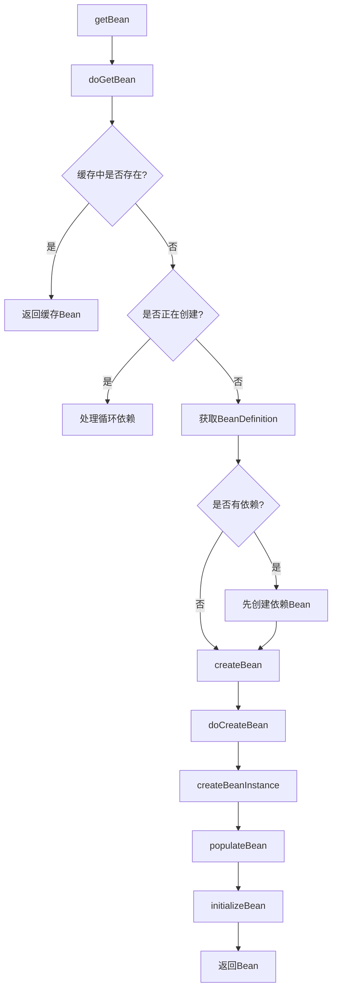

# IoC容器源码解析

> 💡 深入理解Spring IoC容器的核心实现原理

---

## 📋 目录

- [1. IoC容器概述](#1-ioc容器概述)
- [2. 核心接口体系](#2-核心接口体系)
- [3. Bean定义加载](#3-bean定义加载)
- [4. Bean实例化流程](#4-bean实例化流程)
- [5. 依赖注入实现](#5-依赖注入实现)
- [6. 循环依赖解决](#6-循环依赖解决)
- [7. Bean生命周期](#7-bean生命周期)

---

## 1. IoC容器概述

### 1.1 什么是IoC

#### 🎯 控制反转（Inversion of Control）
```
传统方式：
- 对象主动创建依赖对象
- 对象控制依赖对象的生命周期

IoC方式：
- 容器负责创建和管理对象
- 对象被动接收依赖注入
- 控制权从对象转移到容器
```

#### 📊 对比示例
```java
// 传统方式：主动创建依赖
public class UserService {
    private UserDao userDao = new UserDaoImpl(); // 主动创建
    
    public User getUser(Long id) {
        return userDao.findById(id);
    }
}

// IoC方式：被动接收依赖
public class UserService {
    private UserDao userDao; // 由容器注入
    
    public void setUserDao(UserDao userDao) {
        this.userDao = userDao;
    }
    
    public User getUser(Long id) {
        return userDao.findById(id);
    }
}
```

### 1.2 IoC容器的作用

```
1. Bean的创建和管理
   - 根据配置创建Bean实例
   - 管理Bean的生命周期
   - 维护Bean之间的依赖关系

2. 依赖注入（DI）
   - 构造器注入
   - Setter注入
   - 字段注入

3. 配置管理
   - XML配置
   - 注解配置
   - Java配置
```

---

## 2. 核心接口体系

### 2.1 BeanFactory接口体系

#### 📊 接口继承关系
```
BeanFactory（根接口）
├── HierarchicalBeanFactory（层级容器）
│   └── ConfigurableBeanFactory（可配置）
│       └── ConfigurableListableBeanFactory
├── ListableBeanFactory（可列举）
│   └── ConfigurableListableBeanFactory
└── AutowireCapableBeanFactory（自动装配）
    └── ConfigurableListableBeanFactory
    
DefaultListableBeanFactory（默认实现）
└── 实现了ConfigurableListableBeanFactory
```

#### 🔍 核心接口说明
```java
// BeanFactory：最基础的容器接口
public interface BeanFactory {
    Object getBean(String name);
    <T> T getBean(Class<T> requiredType);
    boolean containsBean(String name);
    boolean isSingleton(String name);
    boolean isPrototype(String name);
}

// ListableBeanFactory：可列举所有Bean
public interface ListableBeanFactory extends BeanFactory {
    String[] getBeanDefinitionNames();
    <T> Map<String, T> getBeansOfType(Class<T> type);
    String[] getBeanNamesForType(Class<?> type);
}

// ConfigurableBeanFactory：可配置的容器
public interface ConfigurableBeanFactory extends HierarchicalBeanFactory {
    void setParentBeanFactory(BeanFactory parentBeanFactory);
    void addBeanPostProcessor(BeanPostProcessor beanPostProcessor);
    void destroySingletons();
}
```

### 2.2 ApplicationContext接口体系

#### 📊 接口继承关系
```
ApplicationContext
├── ConfigurableApplicationContext
│   ├── AbstractApplicationContext
│   │   ├── AbstractRefreshableApplicationContext
│   │   │   └── ClassPathXmlApplicationContext
│   │   └── GenericApplicationContext
│   │       └── AnnotationConfigApplicationContext
│   └── WebApplicationContext
```

#### 🔍 ApplicationContext vs BeanFactory
```
BeanFactory：
- 延迟加载Bean
- 基础的IoC功能
- 资源消耗少

ApplicationContext：
- 预加载单例Bean
- 支持国际化
- 支持事件发布
- 支持AOP
- 更丰富的功能
```

### 2.3 BeanDefinition

#### 📊 Bean定义信息
```java
public interface BeanDefinition {
    // Bean类名
    String getBeanClassName();
    
    // 作用域
    String getScope();
    
    // 是否懒加载
    boolean isLazyInit();
    
    // 依赖的Bean
    String[] getDependsOn();
    
    // 是否自动装配候选
    boolean isAutowireCandidate();
    
    // 是否主要候选
    boolean isPrimary();
    
    // 初始化方法
    String getInitMethodName();
    
    // 销毁方法
    String getDestroyMethodName();
    
    // 构造参数
    ConstructorArgumentValues getConstructorArgumentValues();
    
    // 属性值
    MutablePropertyValues getPropertyValues();
}
```

---

## 3. Bean定义加载

### 3.1 XML配置加载

#### 🔄 加载流程
```java
// 入口
ClassPathXmlApplicationContext context = 
    new ClassPathXmlApplicationContext("spring.xml");

// 调用链
ClassPathXmlApplicationContext
  → AbstractApplicationContext.refresh()
    → obtainFreshBeanFactory()
      → refreshBeanFactory()
        → loadBeanDefinitions(beanFactory)
          → XmlBeanDefinitionReader.loadBeanDefinitions()
            → doLoadBeanDefinitions()
              → registerBeanDefinitions()
```

#### 📝 核心代码
```java
// AbstractXmlApplicationContext
@Override
protected void loadBeanDefinitions(DefaultListableBeanFactory beanFactory) {
    // 创建XML读取器
    XmlBeanDefinitionReader beanDefinitionReader = 
        new XmlBeanDefinitionReader(beanFactory);
    
    // 配置读取器
    beanDefinitionReader.setEnvironment(this.getEnvironment());
    beanDefinitionReader.setResourceLoader(this);
    beanDefinitionReader.setEntityResolver(new ResourceEntityResolver(this));
    
    // 加载Bean定义
    loadBeanDefinitions(beanDefinitionReader);
}

// XmlBeanDefinitionReader
protected int doLoadBeanDefinitions(InputSource inputSource, Resource resource) {
    // 解析XML文档
    Document doc = doLoadDocument(inputSource, resource);
    
    // 注册Bean定义
    int count = registerBeanDefinitions(doc, resource);
    return count;
}
```

### 3.2 注解配置加载

#### 🔄 加载流程
```java
// 入口
AnnotationConfigApplicationContext context = 
    new AnnotationConfigApplicationContext(AppConfig.class);

// 调用链
AnnotationConfigApplicationContext
  → register(componentClasses)
    → AnnotatedBeanDefinitionReader.register()
      → doRegisterBean()
  → refresh()
    → invokeBeanFactoryPostProcessors()
      → ConfigurationClassPostProcessor.postProcessBeanDefinitionRegistry()
        → processConfigBeanDefinitions()
          → ConfigurationClassParser.parse()
            → 解析@ComponentScan、@Import、@Bean等
```

#### 📝 核心代码
```java
// AnnotatedBeanDefinitionReader
private <T> void doRegisterBean(Class<T> beanClass, ...) {
    // 创建Bean定义
    AnnotatedGenericBeanDefinition abd = 
        new AnnotatedGenericBeanDefinition(beanClass);
    
    // 解析条件注解
    if (this.conditionEvaluator.shouldSkip(abd.getMetadata())) {
        return;
    }
    
    // 解析作用域
    ScopeMetadata scopeMetadata = 
        this.scopeMetadataResolver.resolveScopeMetadata(abd);
    abd.setScope(scopeMetadata.getScopeName());
    
    // 生成Bean名称
    String beanName = (name != null ? name : 
        this.beanNameGenerator.generateBeanName(abd, this.registry));
    
    // 处理通用注解
    AnnotationConfigUtils.processCommonDefinitionAnnotations(abd);
    
    // 注册Bean定义
    BeanDefinitionHolder definitionHolder = 
        new BeanDefinitionHolder(abd, beanName);
    BeanDefinitionReaderUtils.registerBeanDefinition(
        definitionHolder, this.registry);
}
```

---

## 4. Bean实例化流程

### 4.1 getBean流程

#### 🔄 完整流程图


#### 📝 核心代码
```java
// AbstractBeanFactory.doGetBean()
protected <T> T doGetBean(String name, Class<T> requiredType, 
        Object[] args, boolean typeCheckOnly) {
    
    String beanName = transformedBeanName(name);
    Object bean;
    
    // 1. 从缓存获取单例Bean
    Object sharedInstance = getSingleton(beanName);
    if (sharedInstance != null && args == null) {
        bean = getObjectForBeanInstance(sharedInstance, name, beanName, null);
    } else {
        // 2. 检查是否正在创建（循环依赖检测）
        if (isPrototypeCurrentlyInCreation(beanName)) {
            throw new BeanCurrentlyInCreationException(beanName);
        }
        
        // 3. 获取BeanDefinition
        RootBeanDefinition mbd = getMergedLocalBeanDefinition(beanName);
        
        // 4. 处理依赖
        String[] dependsOn = mbd.getDependsOn();
        if (dependsOn != null) {
            for (String dep : dependsOn) {
                registerDependentBean(dep, beanName);
                getBean(dep); // 递归创建依赖
            }
        }
        
        // 5. 创建Bean
        if (mbd.isSingleton()) {
            sharedInstance = getSingleton(beanName, () -> {
                return createBean(beanName, mbd, args);
            });
            bean = getObjectForBeanInstance(sharedInstance, name, beanName, mbd);
        } else if (mbd.isPrototype()) {
            Object prototypeInstance = createBean(beanName, mbd, args);
            bean = getObjectForBeanInstance(prototypeInstance, name, beanName, mbd);
        }
    }
    
    return (T) bean;
}
```

### 4.2 createBean流程

#### 📝 核心代码
```java
// AbstractAutowireCapableBeanFactory.createBean()
@Override
protected Object createBean(String beanName, RootBeanDefinition mbd, Object[] args) {
    
    RootBeanDefinition mbdToUse = mbd;
    
    // 1. 解析Bean类型
    Class<?> resolvedClass = resolveBeanClass(mbd, beanName);
    
    // 2. 准备方法覆盖
    mbdToUse.prepareMethodOverrides();
    
    // 3. 给BeanPostProcessor一个返回代理的机会
    Object bean = resolveBeforeInstantiation(beanName, mbdToUse);
    if (bean != null) {
        return bean;
    }
    
    // 4. 实际创建Bean
    Object beanInstance = doCreateBean(beanName, mbdToUse, args);
    return beanInstance;
}

// doCreateBean
protected Object doCreateBean(String beanName, RootBeanDefinition mbd, Object[] args) {
    
    BeanWrapper instanceWrapper = null;
    
    // 1. 创建Bean实例
    if (mbd.isSingleton()) {
        instanceWrapper = this.factoryBeanInstanceCache.remove(beanName);
    }
    if (instanceWrapper == null) {
        instanceWrapper = createBeanInstance(beanName, mbd, args);
    }
    
    Object bean = instanceWrapper.getWrappedInstance();
    Class<?> beanType = instanceWrapper.getWrappedClass();
    
    // 2. 允许修改BeanDefinition
    synchronized (mbd.postProcessingLock) {
        if (!mbd.postProcessed) {
            applyMergedBeanDefinitionPostProcessors(mbd, beanType, beanName);
            mbd.postProcessed = true;
        }
    }
    
    // 3. 提前暴露Bean（解决循环依赖）
    boolean earlySingletonExposure = (mbd.isSingleton() && 
        this.allowCircularReferences && isSingletonCurrentlyInCreation(beanName));
    if (earlySingletonExposure) {
        addSingletonFactory(beanName, () -> getEarlyBeanReference(beanName, mbd, bean));
    }
    
    Object exposedObject = bean;
    
    // 4. 填充属性
    populateBean(beanName, mbd, instanceWrapper);
    
    // 5. 初始化Bean
    exposedObject = initializeBean(beanName, exposedObject, mbd);
    
    // 6. 注册销毁回调
    registerDisposableBeanIfNecessary(beanName, bean, mbd);
    
    return exposedObject;
}
```

---

## 5. 依赖注入实现

### 5.1 属性填充（populateBean）

#### 📝 核心代码
```java
protected void populateBean(String beanName, RootBeanDefinition mbd, BeanWrapper bw) {
    
    // 1. 给InstantiationAwareBeanPostProcessor机会
    if (!mbd.isSynthetic() && hasInstantiationAwareBeanPostProcessors()) {
        for (BeanPostProcessor bp : getBeanPostProcessors()) {
            if (bp instanceof InstantiationAwareBeanPostProcessor) {
                InstantiationAwareBeanPostProcessor ibp = 
                    (InstantiationAwareBeanPostProcessor) bp;
                if (!ibp.postProcessAfterInstantiation(bw.getWrappedInstance(), beanName)) {
                    return;
                }
            }
        }
    }
    
    PropertyValues pvs = mbd.getPropertyValues();
    
    // 2. 自动装配
    int resolvedAutowireMode = mbd.getResolvedAutowireMode();
    if (resolvedAutowireMode == AUTOWIRE_BY_NAME || 
        resolvedAutowireMode == AUTOWIRE_BY_TYPE) {
        MutablePropertyValues newPvs = new MutablePropertyValues(pvs);
        if (resolvedAutowireMode == AUTOWIRE_BY_NAME) {
            autowireByName(beanName, mbd, bw, newPvs);
        }
        if (resolvedAutowireMode == AUTOWIRE_BY_TYPE) {
            autowireByType(beanName, mbd, bw, newPvs);
        }
        pvs = newPvs;
    }
    
    // 3. 处理@Autowired、@Value等注解
    for (BeanPostProcessor bp : getBeanPostProcessors()) {
        if (bp instanceof InstantiationAwareBeanPostProcessor) {
            InstantiationAwareBeanPostProcessor ibp = 
                (InstantiationAwareBeanPostProcessor) bp;
            PropertyValues pvsToUse = ibp.postProcessProperties(pvs, 
                bw.getWrappedInstance(), beanName);
            pvs = pvsToUse;
        }
    }
    
    // 4. 应用属性值
    if (pvs != null) {
        applyPropertyValues(beanName, mbd, bw, pvs);
    }
}
```

### 5.2 @Autowired注入原理

#### 📝 AutowiredAnnotationBeanPostProcessor
```java
// AutowiredAnnotationBeanPostProcessor.postProcessProperties()
@Override
public PropertyValues postProcessProperties(PropertyValues pvs, 
        Object bean, String beanName) {
    
    // 1. 获取注入元数据
    InjectionMetadata metadata = findAutowiringMetadata(beanName, 
        bean.getClass(), pvs);
    
    // 2. 执行注入
    metadata.inject(bean, beanName, pvs);
    
    return pvs;
}

// InjectionMetadata.inject()
public void inject(Object target, String beanName, PropertyValues pvs) {
    Collection<InjectedElement> checkedElements = this.checkedElements;
    for (InjectedElement element : checkedElements) {
        element.inject(target, beanName, pvs);
    }
}

// AutowiredFieldElement.inject()
@Override
protected void inject(Object bean, String beanName, PropertyValues pvs) {
    Field field = (Field) this.member;
    Object value;
    
    // 解析依赖
    DependencyDescriptor desc = new DependencyDescriptor(field, this.required);
    value = beanFactory.resolveDependency(desc, beanName, autowiredBeanNames, typeConverter);
    
    // 反射注入
    if (value != null) {
        ReflectionUtils.makeAccessible(field);
        field.set(bean, value);
    }
}
```

---

## 6. 循环依赖解决

### 6.1 三级缓存

#### 📊 缓存结构
```java
// DefaultSingletonBeanRegistry

// 一级缓存：存放完整的Bean
private final Map<String, Object> singletonObjects = new ConcurrentHashMap<>(256);

// 二级缓存：存放早期暴露的Bean（未完成属性填充）
private final Map<String, Object> earlySingletonObjects = new ConcurrentHashMap<>(16);

// 三级缓存：存放Bean工厂（用于创建代理）
private final Map<String, ObjectFactory<?>> singletonFactories = new HashMap<>(16);
```

### 6.2 解决流程

#### 🔄 流程图
```
A依赖B，B依赖A的解决流程：

1. 创建A
   - createBeanInstance(A) → A实例化
   - addSingletonFactory(A) → A放入三级缓存
   - populateBean(A) → 填充属性，发现依赖B

2. 创建B
   - createBeanInstance(B) → B实例化
   - addSingletonFactory(B) → B放入三级缓存
   - populateBean(B) → 填充属性，发现依赖A
   - getSingleton(A) → 从三级缓存获取A
     - 执行ObjectFactory.getObject()
     - A移到二级缓存
   - B完成属性填充
   - initializeBean(B) → B初始化完成
   - B放入一级缓存

3. 继续创建A
   - getSingleton(B) → 从一级缓存获取B
   - A完成属性填充
   - initializeBean(A) → A初始化完成
   - A放入一级缓存
```

#### 📝 核心代码
```java
// DefaultSingletonBeanRegistry.getSingleton()
protected Object getSingleton(String beanName, boolean allowEarlyReference) {
    // 1. 从一级缓存获取
    Object singletonObject = this.singletonObjects.get(beanName);
    
    if (singletonObject == null && isSingletonCurrentlyInCreation(beanName)) {
        // 2. 从二级缓存获取
        singletonObject = this.earlySingletonObjects.get(beanName);
        
        if (singletonObject == null && allowEarlyReference) {
            synchronized (this.singletonObjects) {
                // 双重检查
                singletonObject = this.singletonObjects.get(beanName);
                if (singletonObject == null) {
                    singletonObject = this.earlySingletonObjects.get(beanName);
                    if (singletonObject == null) {
                        // 3. 从三级缓存获取
                        ObjectFactory<?> singletonFactory = 
                            this.singletonFactories.get(beanName);
                        if (singletonFactory != null) {
                            // 执行工厂方法
                            singletonObject = singletonFactory.getObject();
                            // 移到二级缓存
                            this.earlySingletonObjects.put(beanName, singletonObject);
                            this.singletonFactories.remove(beanName);
                        }
                    }
                }
            }
        }
    }
    return singletonObject;
}

// 添加到三级缓存
protected void addSingletonFactory(String beanName, ObjectFactory<?> singletonFactory) {
    synchronized (this.singletonObjects) {
        if (!this.singletonObjects.containsKey(beanName)) {
            this.singletonFactories.put(beanName, singletonFactory);
            this.earlySingletonObjects.remove(beanName);
            this.registeredSingletons.add(beanName);
        }
    }
}
```

### 6.3 为什么需要三级缓存

#### 🤔 问题分析
```
Q: 为什么不能只用二级缓存？

A: 因为需要支持AOP代理

如果只用二级缓存：
- 早期暴露的是原始对象
- 但最终需要的可能是代理对象
- 会导致注入的对象不一致

三级缓存的作用：
- ObjectFactory可以在需要时创建代理
- 保证注入的是最终的代理对象
- 延迟代理创建，提高性能
```

#### 📝 代理创建代码
```java
// AbstractAutowireCapableBeanFactory.getEarlyBeanReference()
protected Object getEarlyBeanReference(String beanName, RootBeanDefinition mbd, Object bean) {
    Object exposedObject = bean;
    if (!mbd.isSynthetic() && hasInstantiationAwareBeanPostProcessors()) {
        for (BeanPostProcessor bp : getBeanPostProcessors()) {
            if (bp instanceof SmartInstantiationAwareBeanPostProcessor) {
                SmartInstantiationAwareBeanPostProcessor ibp = 
                    (SmartInstantiationAwareBeanPostProcessor) bp;
                // 这里可能创建代理
                exposedObject = ibp.getEarlyBeanReference(exposedObject, beanName);
            }
        }
    }
    return exposedObject;
}
```

---

## 7. Bean生命周期

### 7.1 完整生命周期

#### 📊 生命周期图
```
1. 实例化（Instantiation）
   └── createBeanInstance()

2. 属性填充（Populate Properties）
   └── populateBean()

3. Aware接口回调
   ├── BeanNameAware.setBeanName()
   ├── BeanClassLoaderAware.setBeanClassLoader()
   └── BeanFactoryAware.setBeanFactory()

4. BeanPostProcessor前置处理
   └── postProcessBeforeInitialization()

5. 初始化
   ├── InitializingBean.afterPropertiesSet()
   └── 自定义init-method

6. BeanPostProcessor后置处理
   └── postProcessAfterInitialization()

7. 使用Bean

8. 销毁
   ├── DisposableBean.destroy()
   └── 自定义destroy-method
```

#### 📝 initializeBean代码
```java
protected Object initializeBean(String beanName, Object bean, RootBeanDefinition mbd) {
    
    // 1. Aware接口回调
    invokeAwareMethods(beanName, bean);
    
    Object wrappedBean = bean;
    
    // 2. BeanPostProcessor前置处理
    if (mbd == null || !mbd.isSynthetic()) {
        wrappedBean = applyBeanPostProcessorsBeforeInitialization(wrappedBean, beanName);
    }
    
    // 3. 初始化方法
    invokeInitMethods(beanName, wrappedBean, mbd);
    
    // 4. BeanPostProcessor后置处理
    if (mbd == null || !mbd.isSynthetic()) {
        wrappedBean = applyBeanPostProcessorsAfterInitialization(wrappedBean, beanName);
    }
    
    return wrappedBean;
}

private void invokeAwareMethods(String beanName, Object bean) {
    if (bean instanceof Aware) {
        if (bean instanceof BeanNameAware) {
            ((BeanNameAware) bean).setBeanName(beanName);
        }
        if (bean instanceof BeanClassLoaderAware) {
            ((BeanClassLoaderAware) bean).setBeanClassLoader(getBeanClassLoader());
        }
        if (bean instanceof BeanFactoryAware) {
            ((BeanFactoryAware) bean).setBeanFactory(this);
        }
    }
}
```

### 7.2 生命周期示例

```java
@Component
public class LifecycleBean implements BeanNameAware, BeanFactoryAware, 
        InitializingBean, DisposableBean {
    
    private String beanName;
    private BeanFactory beanFactory;
    
    public LifecycleBean() {
        System.out.println("1. 构造方法");
    }
    
    @Autowired
    public void setDependency(SomeDependency dependency) {
        System.out.println("2. 属性注入");
    }
    
    @Override
    public void setBeanName(String name) {
        System.out.println("3. BeanNameAware.setBeanName()");
        this.beanName = name;
    }
    
    @Override
    public void setBeanFactory(BeanFactory beanFactory) {
        System.out.println("4. BeanFactoryAware.setBeanFactory()");
        this.beanFactory = beanFactory;
    }
    
    @PostConstruct
    public void postConstruct() {
        System.out.println("5. @PostConstruct");
    }
    
    @Override
    public void afterPropertiesSet() {
        System.out.println("6. InitializingBean.afterPropertiesSet()");
    }
    
    public void customInit() {
        System.out.println("7. 自定义init-method");
    }
    
    @PreDestroy
    public void preDestroy() {
        System.out.println("8. @PreDestroy");
    }
    
    @Override
    public void destroy() {
        System.out.println("9. DisposableBean.destroy()");
    }
    
    public void customDestroy() {
        System.out.println("10. 自定义destroy-method");
    }
}
```

---

## 📚 面试要点

### 高频问题

**Q1: Spring Bean的生命周期？**
```
1. 实例化：通过反射创建Bean实例
2. 属性填充：注入依赖
3. Aware回调：设置BeanName、BeanFactory等
4. BeanPostProcessor前置处理
5. 初始化：@PostConstruct、afterPropertiesSet、init-method
6. BeanPostProcessor后置处理（AOP代理在这里创建）
7. 使用
8. 销毁：@PreDestroy、destroy、destroy-method
```

**Q2: Spring如何解决循环依赖？**
```
通过三级缓存：
- 一级缓存：完整Bean
- 二级缓存：早期暴露的Bean
- 三级缓存：Bean工厂

流程：
1. A实例化后放入三级缓存
2. A填充属性需要B
3. B实例化后放入三级缓存
4. B填充属性需要A，从三级缓存获取A
5. B完成创建，放入一级缓存
6. A获取B，完成创建
```

**Q3: 为什么需要三级缓存？**
```
为了支持AOP代理：
- 三级缓存存储ObjectFactory
- 可以在需要时创建代理对象
- 保证注入的是最终的代理对象
```

---

**深入理解IoC，掌握Spring核心！** 🚀

*最后更新：2025-12-26*