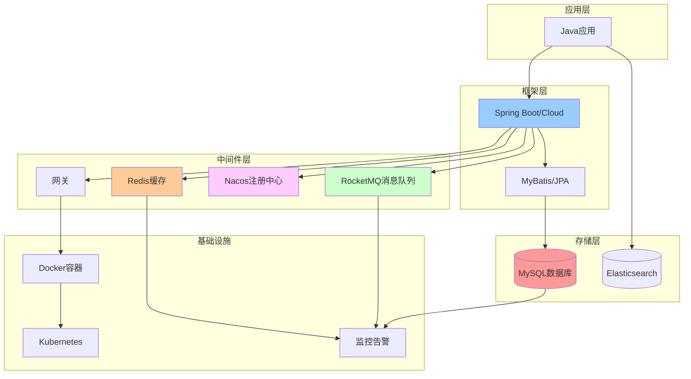

# 技术知识点汇总

> 💡 系统化整理的后端技术核心机制详解，涵盖数据库、缓存、消息队列、微服务等主流技术栈

---

## 📚 文档目录结构

```
知识点汇总/
├── 00_综合/                    # 综合技术资料
│   ├── Java高级工程师技术清单.md
│   ├── 归档/                   # 历史文档归档 🆕
│   │   ├── 2025-10-27_v2.0升级完成.md
│   │   ├── 2025-10-27_目录重新编号说明.md
│   │   ├── 2025-10-27_Java基础完成.md
│   │   └── README.md
│   └── README.md
├── 01_Java核心/                # Java核心技术 ⭐ 基础必学
│   ├── Java基础核心原理.md
│   ├── JVM虚拟机详解.md
│   ├── Java并发编程详解.md
│   └── README.md
├── 02_Spring生态/              # Spring框架 ⭐ 框架基础
│   ├── Spring核心源码解析.md
│   ├── Spring Boot核心原理.md
│   └── README.md
├── 03_数据库/                  # 数据库核心机制
│   ├── MySQL核心机制详解.md
│   ├── MySQL查询核心机制详解.md
│   └── README.md
├── 04_缓存/                    # 缓存核心机制
│   ├── Redis核心机制详解.md
│   └── README.md
├── 05_消息队列/                # 消息队列核心机制
│   ├── RocketMQ核心机制详解.md
│   └── README.md
├── 06_微服务/                  # 微服务架构（注册中心+RPC） 🆕
│   ├── Nacos核心机制详解.md
│   ├── Spring Cloud Alibaba全家桶.md
│   ├── Dubbo与gRPC详解.md
│   └── README.md
├── 07_分布式系统/              # 分布式核心
│   ├── 分布式事务详解.md
│   ├── 分布式锁详解.md
│   └── README.md
├── 08_网络通信/                # 网络与IO
│   ├── HTTP协议与网络编程.md
│   ├── Netty核心原理详解.md
│   └── README.md
├── 09_搜索引擎/                # 搜索引擎
│   ├── Elasticsearch核心原理.md
│   └── README.md
├── 10_容器化/                  # 容器与编排
│   ├── Docker与Kubernetes详解.md
│   └── README.md
├── 11_性能优化/                # 性能优化与调优
│   ├── JVM调优实战.md
│   ├── 性能监控与系统优化.md
│   └── README.md
├── 12_AI集成/                  # AI应用开发 🆕
│   ├── Java AI开发实战.md
│   └── README.md
├── 13_安全认证/                # 安全认证授权 🆕
│   ├── Spring Security与JWT实战.md
│   └── README.md
├── 14_架构设计/                # 架构设计与技术选型 🆕
│   ├── 架构设计与技术选型方法论.md
│   └── README.md
├── 15_MCP协议/                 # MCP协议详解 🆕
│   ├── MCP协议核心原理与实战.md
│   └── README.md
├── 生产环境问题排查/            # 生产环境问题排查实战 🆕
│   ├── README.md
│   ├── 01_性能问题排查.md
│   ├── 02_错误日志分析.md
│   ├── 03_系统故障排查.md
│   ├── 04_数据库问题排查.md
│   ├── 05_缓存问题排查.md
│   ├── 06_消息队列问题排查.md
│   ├── 07_网络问题排查.md
│   ├── 08_内存泄漏排查.md
│   ├── 09_CPU高负载排查.md
│   ├── 10_磁盘IO问题排查.md
│   ├── 11_分布式系统问题排查.md
│   └── 12_常见问题速查手册.md
└── README.md                   # 本文档
```

---

## 🎯 快速导航

### 📋 完整技术清单
**[Java高级工程师技术清单](./00_综合/Java高级工程师技术清单.md)** ⭐ 推荐

这份清单包含：
- ✅ 12大技术领域完整知识图谱
- ✅ JVM、并发、Spring、分布式等核心技术
- ✅ 技能矩阵和学习路线建议
- ✅ 面试高频考点总结
- ✅ 技能自检清单

**适合人群**：
- 想系统提升的Java开发者
- 准备面试的高级工程师
- 希望成为架构师的技术人员

---

## 🗂️ 技术领域分类

### 1️⃣ Java核心 ⭐ 基础必学
📂 [01_Java核心](./01_Java核心/)

**核心内容**：
- ✅ **Java基础核心原理**：面向对象、集合框架、字符串、IO、反射、泛型、注解
- ✅ **JVM虚拟机详解**：内存模型、GC算法、类加载机制
- ✅ **Java并发编程详解**：线程、锁、JUC工具类、线程池

**学习重点**：
- ⭐⭐⭐⭐⭐ HashMap核心原理（数组+链表+红黑树）
- ⭐⭐⭐⭐⭐ String不可变性与常量池
- ⭐⭐⭐⭐⭐ JVM内存模型与GC
- ⭐⭐⭐⭐⭐ 线程池原理与实践

**关键字**：`Java基础` `JVM` `GC` `并发` `线程池` `HashMap`

---

### 2️⃣ Spring生态 ⭐ 框架基础
📂 [02_Spring生态](./02_Spring生态/)

**核心内容**：
- ✅ **Spring核心原理**：IoC容器、AOP、事务管理
- ✅ **Spring Boot自动配置**：启动流程、自动配置原理

**关键字**：`Spring` `IoC` `AOP` `自动配置`

---

### 3️⃣ 数据库 
📂 [03_数据库](./03_数据库/)

#### MySQL核心机制详解
📄 [MySQL核心机制详解.md](./03_数据库/MySQL核心机制详解.md)

**核心内容**：
- ✅ 事务ACID、MVCC多版本并发控制
- ✅ Buffer Pool、Redo Log、Undo Log、Binlog
- ✅ commit前后数据流转机制
- ✅ ReadView可见性判断
- ✅ 完整流程图（Mermaid可视化）

**关键字**：`事务` `MVCC` `InnoDB` `日志系统`

---

#### MySQL查询核心机制详解 ⭐ NEW
📄 [MySQL查询核心机制详解.md](./03_数据库/MySQL查询核心机制详解.md)

**核心内容**：
- ✅ 查询执行全流程（连接器→解析器→优化器→执行器）
- ✅ 查询优化器原理（RBO + CBO）
- ✅ 索引选择机制与失效场景
- ✅ **IN()包含大量值（9万+）的9种优化方案**

**推荐方案对比**：

| 方案 | 性能 | 推荐度 | 适用场景 |
|------|------|--------|----------|
| 临时表+JOIN | 3.2秒 | ⭐⭐⭐⭐⭐ | 5万+数据，数据库层最优 |
| 内存表+JOIN | 1.8秒 | ⭐⭐⭐⭐⭐ | 高并发，性能要求高 |
| Redis缓存 | 0.02秒 | ⭐⭐⭐⭐⭐ | 终极方案，应用层最优 |
| 分批查询 | 45秒 | ⭐⭐⭐ | 1-5万数据，简单场景 |
| 范围查询 | 0.5秒 | ⭐⭐⭐⭐ | ID连续，最简单高效 |

**完整代码**：提供Spring Boot + MyBatis完整实现

**关键字**：`查询优化` `IN查询` `临时表` `性能调优`

---

### 4️⃣ 缓存
📂 [04_缓存](./04_缓存/)

#### Redis核心机制详解
📄 [Redis核心机制详解.md](./04_缓存/Redis核心机制详解.md)

**核心内容**：
- ✅ 数据结构底层实现（SDS、跳表、压缩列表等）
- ✅ 持久化机制（RDB、AOF、混合持久化）
- ✅ 高可用方案（主从复制、哨兵、集群）
- ✅ 缓存三大问题：穿透、击穿、雪崩解决方案
- ✅ 内存管理（过期策略、淘汰策略）

**核心特性**：
- ⚡ 单线程模型 + IO多路复用
- 📦 5种基础数据类型 + 3种特殊数据类型
- 💾 RDB快照 + AOF日志
- 🔄 集群分片 + 主从复制

**关键字**：`缓存` `高性能` `分布式锁` `排行榜`

---

### 5️⃣ 消息队列
📂 [05_消息队列](./05_消息队列/)

#### RocketMQ核心机制详解
📄 [RocketMQ核心机制详解.md](./05_消息队列/RocketMQ核心机制详解.md)

**核心内容**：
- ✅ 架构设计（NameServer、Broker、Producer、Consumer）
- ✅ 消息存储（CommitLog、ConsumeQueue）
- ✅ 高可用方案（主从复制、Dledger）
- ✅ 消息可靠性（零丢失保证）
- ✅ 顺序消息、延迟消息、事务消息

**核心特性**：
- 🚀 高性能：单机万级TPS
- 💯 高可靠：消息零丢失
- 📊 大容量：支持亿级消息堆积
- 🔄 分布式事务：事务消息支持

**适用场景**：异步处理、系统解耦、流量削峰、分布式事务

**关键字**：`消息队列` `异步` `解耦` `削峰`

---

### 6️⃣ 微服务架构
📂 [06_微服务](./06_微服务/)

**核心内容**：
- ✅ **Nacos**：服务注册发现 + 配置中心
- ✅ **Spring Cloud Alibaba全家桶**：Nacos、Sentinel、Gateway、OpenFeign
- ✅ **Dubbo与gRPC**：RPC框架、服务治理、负载均衡

**核心特性**：
- 🔍 动态服务发现
- ⚙️ 动态配置管理
- 🚀 高性能RPC
- 📊 服务治理（限流、熔断、降级）

**适用场景**：微服务架构、服务治理、配置中心、RPC通信

**关键字**：`微服务` `Nacos` `Dubbo` `gRPC` `Spring Cloud`

---

### 7️⃣ 分布式系统
📂 [07_分布式系统](./07_分布式系统/)

**核心内容**：
- ✅ **分布式事务详解**：2PC、3PC、TCC、Saga、Seata
- ✅ **分布式锁详解**：Redis锁、Redisson、Zookeeper锁

**关键字**：`分布式事务` `分布式锁` `Seata` `Redisson` `CAP`

---

### 8️⃣ 网络通信
📂 [08_网络通信](./08_网络通信/)

**核心内容**：
- ✅ **HTTP协议与网络编程**：HTTP/HTTPS原理、性能优化
- ✅ **Netty核心原理详解**：Reactor模型、EventLoop、Pipeline

**关键字**：`Netty` `NIO` `HTTP` `HTTPS`

---

### 9️⃣ 搜索引擎
📂 [09_搜索引擎](./09_搜索引擎/)

**核心内容**：
- ✅ **Elasticsearch核心原理**：倒排索引、分词器、DSL查询

**关键字**：`Elasticsearch` `全文检索` `倒排索引`

---

### 🔟 容器化
📂 [10_容器化](./10_容器化/)

**核心内容**：
- ✅ **Docker与Kubernetes详解**：容器原理、镜像构建、K8s编排

**关键字**：`Docker` `Kubernetes` `容器` `微服务`

---

### 1️⃣1️⃣ 性能优化
📂 [11_性能优化](./11_性能优化/)

#### JVM调优实战
📄 [JVM调优实战.md](./11_性能优化/JVM调优实战.md)

**核心内容**：
- ✅ **JVM参数配置**：堆内存、GC参数、日志参数
- ✅ **GC调优**：G1 GC、CMS GC、ZGC调优策略
- ✅ **内存分析**：Heap Dump、MAT工具、内存泄漏排查
- ✅ **故障排查**：CPU飙高、内存溢出、线程死锁
- ✅ **实战案例**：Full GC频繁、接口响应慢

#### 性能监控与系统优化
📄 [性能监控与系统优化.md](./11_性能优化/性能监控与系统优化.md)

**核心内容**：
- ✅ **APM监控**：Prometheus+Grafana、Skywalking、ELK
- ✅ **性能测试**：JMeter、Gatling、性能基线
- ✅ **数据库优化**：慢查询分析、索引优化、分库分表
- ✅ **缓存优化**：多级缓存、缓存穿透/击穿/雪崩
- ✅ **系统调优**：Linux内核参数、JVM参数

**关键字**：`JVM调优` `性能监控` `APM` `Prometheus` `Skywalking`

---

### 1️⃣2️⃣ AI集成 🆕
📂 [12_AI集成](./12_AI集成/)

#### Java AI开发实战
📄 [Java AI开发实战.md](./12_AI集成/Java%20AI开发实战.md)

**核心内容**：
- ✅ **LangChain4j框架**：快速集成LLM、Function Calling、对话记忆
- ✅ **向量数据库**：Milvus集成、向量检索、相似度搜索
- ✅ **RAG检索增强生成**：文档处理、向量化、混合检索
- ✅ **Prompt工程**：提示词模板、Chain of Thought、Few-shot学习
- ✅ **实战案例**：智能客服、文档问答、代码助手

**核心特性**：
- 🤖 LLM集成（OpenAI、Claude、通义千问）
- 🔍 向量检索与语义搜索
- 📚 RAG应用开发
- ⚡ Stream流式响应

**适用场景**：智能客服、知识库问答、代码辅助、文档分析

**关键字**：`AI` `LangChain4j` `RAG` `向量数据库` `LLM`

---

### 1️⃣3️⃣ 安全认证 🆕
📂 [13_安全认证](./13_安全认证/)

#### Spring Security与JWT实战
📄 [Spring Security与JWT实战.md](./13_安全认证/Spring%20Security与JWT实战.md)

**核心内容**：
- ✅ **认证授权基础**：Authentication vs Authorization、Session vs Token
- ✅ **Spring Security核心**：认证流程、SecurityContext、FilterChain
- ✅ **JWT完整实现**：Token生成验证、刷新机制、安全存储
- ✅ **RBAC权限模型**：用户-角色-权限、数据库设计、动态权限
- ✅ **OAuth2.0**：授权码模式、第三方登录（微信、GitHub）
- ✅ **安全最佳实践**：密码加密、XSS/CSRF防护、SQL注入防护
- ✅ **实战案例**：登录注册系统、权限管理、单点登录（SSO）

**核心特性**：
- 🔐 企业级认证授权
- 🎫 JWT无状态认证
- 👥 RBAC权限控制
- 🔒 安全加固方案

**适用场景**：前后端分离项目、微服务认证、权限管理系统、单点登录

**关键字**：`Spring Security` `JWT` `OAuth2.0` `RBAC` `SSO` `安全`

---

### 1️⃣4️⃣ 架构设计 🆕
📂 [14_架构设计](./14_架构设计/)

#### 架构设计与技术选型方法论 ⭐ 重要
📄 [架构设计与技术选型方法论.md](./14_架构设计/架构设计与技术选型方法论.md)

**核心内容**：
- ✅ **技术选型本质**：PCTS模型（性能、成本、团队、规模）
- ✅ **决策框架**：完整决策流程、评分卡、决策矩阵
- ✅ **核心组件选型**：数据库、缓存、MQ、注册中心、分库分表
- ✅ **架构设计原则**：SOLID、高内聚低耦合、CAP理论
- ✅ **架构演进路线**：从单体到微服务的5个阶段
- ✅ **实战案例**：秒杀系统、社交网络完整方案
- ✅ **常见误区**：过度设计、盲目追新、忽视成本
- ✅ **决策工具**：检查清单、决策模板

**架构演进路线**：
```
阶段1：单体应用（0-10万日活）→ Spring Boot + MySQL
阶段2：单体+缓存（10-50万）→ +Redis
阶段3：读写分离（50-100万）→ MySQL主从
阶段4：微服务（100-500万）→ Spring Cloud Alibaba
阶段5：分布式（500万+）→ 分库分表 + 中间件集群
```

**适用场景**：系统架构设计、技术选型决策、架构评审

**关键字**：`架构设计` `技术选型` `PCTS模型` `架构演进` `微服务`

---

### 1️⃣5️⃣ MCP协议 🆕
📂 [15_MCP协议](./15_MCP协议/)

#### MCP协议核心原理与实战 ⭐ 前沿技术
📄 [MCP协议核心原理与实战.md](./15_MCP协议/MCP协议核心原理与实战.md)

**核心内容**：
- ✅ **MCP简介**：协议定义、解决的问题、生态架构
- ✅ **核心概念**：Resources、Prompts、Tools三大组件
- ✅ **架构设计**：Client-Server架构、JSON-RPC 2.0协议、传输层
- ✅ **MCP Server开发**：TypeScript/Python完整实现
- ✅ **MCP Client集成**：Cursor配置、Claude Desktop配置
- ✅ **实战案例**：代码审查Server、SQL助手Server
- ✅ **最佳实践**：安全控制、性能优化、错误处理
- ✅ **MCP生态**：官方Server、社区Server、开发工具

**核心特性**：
- 🌐 **统一标准**：类似USB标准化，一次开发到处使用
- 🔗 **打通数据孤岛**：AI访问本地文件、数据库、内部API
- 🧩 **插件化架构**：AI Client ←→ MCP Server ←→ 外部系统
- 📦 **完整生态**：官方Filesystem、Git、GitHub等10+Server

**适用场景**：
- AI应用开发（打通私有数据）
- 代码编辑器AI增强（Cursor、VS Code）
- 企业AI集成（内部系统接入）
- 智能助手开发（Claude Desktop）

**三大核心组件**：
```
Resources（资源）：只读数据
- 文件内容、数据库记录、API响应

Prompts（提示词）：可复用模板
- 代码审查模板、文档生成模板

Tools（工具）：可执行操作
- 创建文件、执行SQL、调用API
```

**快速上手**：
```json
// Cursor配置（~/.cursor/mcp.json）
{
  "mcpServers": {
    "filesystem": {
      "command": "npx",
      "args": ["-y", "@modelcontextprotocol/server-filesystem", "/your/path"]
    }
  }
}
```

**关键字**：`MCP` `Model Context Protocol` `AI工具` `Cursor` `Claude`

---

## 📊 技术栈全景图



---

## 🎯 学习路径推荐

### 阶段1：Java基础（1-3个月）⭐ 最重要
```
目标：夯实Java基础和JVM原理

必学内容：
✅ Java基础核心原理（集合、字符串、IO、反射、泛型）
✅ JVM虚拟机详解（内存模型、GC算法、类加载）
✅ Java并发编程详解（线程、锁、JUC、线程池）

学习资源：
📄 01_Java核心/Java基础核心原理.md ⭐⭐⭐⭐⭐
📄 01_Java核心/JVM虚拟机详解.md ⭐⭐⭐⭐⭐
📄 01_Java核心/Java并发编程详解.md ⭐⭐⭐⭐⭐
📘 《深入理解Java虚拟机》
```

### 阶段2：Spring框架（1-2个月）⭐ 框架基础
```
目标：掌握Spring核心原理

必学内容：
✅ Spring核心原理（IoC容器、AOP、事务管理）
✅ Spring Boot核心原理（启动流程、自动配置）

学习资源：
📄 02_Spring生态/Spring核心源码解析.md ⭐⭐⭐⭐⭐
📄 02_Spring生态/Spring Boot核心原理.md ⭐⭐⭐⭐⭐
📘 《Spring揭秘》
```

### 阶段3：数据库与缓存（2-3个月）
```
目标：掌握存储层核心技术

必学内容：
✅ MySQL核心机制（MVCC、事务、索引）
✅ MySQL查询优化（执行流程、优化器、IN查询优化）
✅ Redis核心机制（数据结构、持久化、集群）

学习资源：
📄 03_数据库/MySQL核心机制详解.md ⭐⭐⭐⭐⭐
📄 03_数据库/MySQL查询核心机制详解.md ⭐⭐⭐⭐
📄 04_缓存/Redis核心机制详解.md ⭐⭐⭐⭐⭐
```

### 阶段4：消息队列（1-2个月）
```
目标：掌握异步通信技术

必学内容：
✅ RocketMQ核心机制（消息存储、可靠性、事务消息）

学习资源：
📄 05_消息队列/RocketMQ核心机制详解.md ⭐⭐⭐⭐
```

### 阶段5：微服务架构（3-6个月）
```
目标：理解微服务设计与治理

必学内容：
✅ Nacos（服务注册发现、配置中心）
✅ Spring Cloud Alibaba（Gateway、Sentinel、OpenFeign）
✅ Dubbo与gRPC（RPC框架、服务治理）

学习资源：
📄 06_微服务/Nacos核心机制详解.md ⭐⭐⭐⭐⭐
📄 06_微服务/Spring Cloud Alibaba全家桶.md ⭐⭐⭐⭐
📄 06_微服务/Dubbo与gRPC详解.md ⭐⭐⭐⭐
📘 《微服务架构设计模式》
```

### 阶段6：分布式系统（2-4个月）
```
目标：理解分布式系统设计

必学内容：
✅ 分布式理论（CAP、BASE、Paxos、Raft）
✅ 分布式事务（2PC、TCC、Saga、Seata）
✅ 分布式锁（Redis锁、Redisson、Zookeeper锁）

学习资源：
📄 07_分布式系统/分布式事务详解.md ⭐⭐⭐⭐
📄 07_分布式系统/分布式锁详解.md ⭐⭐⭐⭐
📘 《凤凰架构》
```

### 阶段7：安全认证（1-2个月）⭐ 企业必备
```
目标：掌握企业级安全认证授权

必学内容：
✅ Spring Security核心原理（认证流程、权限控制）
✅ JWT认证实战（Token生成、验证、刷新）
✅ RBAC权限模型（用户-角色-权限设计）
✅ OAuth2.0与第三方登录（微信、GitHub）

学习资源：
📄 13_安全认证/Spring Security与JWT实战.md ⭐⭐⭐⭐⭐
📘 《Spring Security实战》
```

### 阶段8：进阶提升（持续学习）
```
目标：成为全栈架构师

必学内容：
✅ 网络通信（HTTP/HTTPS、Netty）
✅ 搜索引擎（Elasticsearch）
✅ 容器化部署（Docker、K8s）
✅ 性能优化（JVM调优、APM监控、性能测试）
✅ AI集成（LangChain4j、RAG、向量数据库）

学习资源：
📄 08_网络通信/HTTP协议与网络编程.md
📄 08_网络通信/Netty核心原理详解.md
📄 09_搜索引擎/Elasticsearch核心原理.md
📄 10_容器化/Docker与Kubernetes详解.md
📄 11_性能优化/JVM调优实战.md
📄 11_性能优化/性能监控与系统优化.md
📄 12_AI集成/Java AI开发实战.md
📘 《大型网站技术架构》
📘 《亿级流量网站架构核心技术》
```

---

## 💡 使用建议

### 1️⃣ 作为学习参考
- 按照学习路径，循序渐进
- 每个知识点都有配套文档
- 结合实际项目巩固理解

### 2️⃣ 作为面试准备
- 重点复习核心机制
- 理解原理而非死记硬背
- 准备实际案例和解决方案

### 3️⃣ 作为工作手册
- 遇到问题快速查阅
- 技术选型参考
- 性能优化指南

### 4️⃣ 作为团队分享
- 团队技术培训材料
- 新人onboarding文档
- 技术沉淀和知识传承

---

## 🔍 快速查找

### 按问题场景查找

**Q: HashMap为什么线程不安全？**
- 📄 [Java基础核心原理.md](./01_Java核心/Java基础核心原理.md#54-hashmap核心原理)
- 查看HashMap扩容机制、JDK 7/8差异

**Q: JVM如何调优Full GC频繁问题？**
- 📄 [JVM调优实战.md](./11_性能优化/JVM调优实战.md)
- Heap Dump分析、GC日志分析、参数调整

**Q: 数据库查询慢怎么优化？**
- 📄 [MySQL查询核心机制详解.md](./03_数据库/MySQL查询核心机制详解.md#3-索引选择机制)
- 查看索引失效场景、优化器原理

**Q: IN()包含大量值如何优化？**
- 📄 [MySQL查询核心机制详解.md](./03_数据库/MySQL查询核心机制详解.md#5-in包含大量值问题与解决方案)
- 推荐：临时表+JOIN、内存表+JOIN、Redis缓存

**Q: 如何保证消息不丢失？**
- 📄 [RocketMQ核心机制详解.md](./05_消息队列/RocketMQ核心机制详解.md)
- 生产者重试、Broker同步刷盘、消费者手动ACK

**Q: 缓存穿透/击穿/雪崩怎么解决？**
- 📄 [Redis核心机制详解.md](./04_缓存/Redis核心机制详解.md)
- 布隆过滤器、互斥锁、过期时间加随机值

**Q: 微服务如何实现配置动态刷新？**
- 📄 [Nacos核心机制详解.md](./06_微服务/Nacos核心机制详解.md)
- 配置中心 + @RefreshScope注解

**Q: MySQL事务提交前数据在哪里？**
- 📄 [MySQL核心机制详解.md](./03_数据库/MySQL核心机制详解.md#1-mysql数据库commit提交前数据在哪)
- Buffer Pool（内存脏页）+ Redo Log Buffer + Undo Log（磁盘）

**Q: 如何实现JWT认证？**
- 📄 [Spring Security与JWT实战.md](./13_安全认证/Spring%20Security与JWT实战.md)
- Token生成验证、刷新机制、权限控制

**Q: 前后端分离项目如何做权限控制？**
- 📄 [Spring Security与JWT实战.md](./13_安全认证/Spring%20Security与JWT实战.md)
- RBAC权限模型、@PreAuthorize注解、动态菜单

---

## 📊 知识库规划与分析

### 🔍 全局分析文档（2025-10-28）🆕

为了更好地规划知识库发展，我们创建了全面的分析文档：

**核心分析文档**：
- 📊 **[知识库全局分析总结](./📊知识库全局分析总结.md)**：快速导航和总览
- 🔍 **[知识库全局分析与规划](./🔍知识库全局分析与规划.md)**：详细分析和建议
- 📋 **[知识库待补充清单](./📋知识库待补充清单.md)**：按优先级梳理待补充内容

**核心发现**：
- ✅ 现有17个领域框架完整
- ✅ 设计模式和算法框架完善（114个文件）
- 📝 建议新增7个维度（系统设计、DevOps、云原生等）
- 📝 现有目录待补充30-40个核心文档

**已完成优化**：
- ✅ 创建归档目录，整理历史文档
- ✅ 更新待补充清单（基于v3.0）
- ✅ 冗余文件清理完成（已归档）

---

## 📈 文档更新日志

### 2025-10-28 v3.2（全局分析与优化）🆕
**知识库整理与规划**

**新增分析文档**：
- ✅ 知识库全局分析总结.md
- ✅ 知识库全局分析与规划.md
- ✅ 更新待补充清单.md（基于v3.0）
- ✅ 知识库v3.2整理完成.md

**目录优化**：
- ✅ 创建 00_综合/归档/ 目录
- ✅ 移动3个历史文档到归档
- ✅ 清理根目录，结构更清晰

**规划成果**：
- 📊 明确7个新增维度建议（含优先级）
- 📋 梳理150+个待补充文档
- 🎯 制定四阶段补充计划
- 💡 提供详细的行动建议

### 2025-10-27 v3.1（P0级别文档框架）🆕
**新增4个P0级别核心文档框架**

**新增文档**：
- ✅ **Kafka核心机制详解**（05_消息队列/）：大厂标配消息队列
- ✅ **Sentinel流量控制详解**（06_微服务/）：Spring Cloud Alibaba限流降级
- ✅ **MySQL分库分表实战**（03_数据库/）：海量数据处理必备
- ✅ **Spring Security与JWT实战**（13_安全认证/）：企业级认证授权

**新增领域**：
- ✅ **13_安全认证**：Spring Security、JWT、OAuth2.0、RBAC权限模型

**文档状态**：
- 📝 框架已创建，内容丰富中（预计1000-1200行/篇）
- 🎯 优先级P0：面试高频、工作必备

### 2025-10-27 v3.0（学习路径优化）🎉
**重大调整：按学习难度重新编号，优化学习体验**

**目录调整**：
- ✅ **01_Java核心**（原05）：Java基础 + JVM + 并发 ⭐ 最基础
- ✅ **02_Spring生态**（原06）：Spring + Spring Boot ⭐ 框架基础
- ✅ **03_数据库**（原01）：MySQL核心机制
- ✅ **04_缓存**（原02）：Redis核心机制
- ✅ **05_消息队列**（原03）：RocketMQ
- ✅ **06_微服务**（原04+12合并）：Nacos + Spring Cloud Alibaba + Dubbo
- ✅ **07_分布式系统**（原11）：分布式事务 + 分布式锁
- ✅ **08_网络通信**（原07）：HTTP + Netty
- ✅ **09_搜索引擎**（原08）：Elasticsearch
- ✅ **10_容器化**（原09）：Docker + Kubernetes
- ✅ **11_性能优化**（原13）：JVM调优 + APM监控
- ✅ **12_AI集成**（原10）：Java AI开发实战

**优化亮点**：
- 🎯 目录编号即学习顺序，新手友好
- 📚 符合技术依赖关系（Java → Spring → 中间件 → 分布式）
- 🔧 合并微服务基础和进阶，知识更系统
- 🚀 新增Java基础核心原理文档（1894行）

### 2025-10-27 v2.0（大版本更新）🎉
**全面扩展：4大领域，40+篇深度技术文档**

**新增领域**：
- ✅ **AI集成**：Java AI开发实战、LangChain4j、RAG、向量数据库
- ✅ **分布式系统**：分布式事务（Seata）、分布式锁（Redisson）
- ✅ **微服务进阶**：Spring Cloud Alibaba、Dubbo、gRPC
- ✅ **性能优化**：JVM调优实战、APM监控、性能测试

**已有领域**：
- ✅ **Java核心**：Java基础、JVM虚拟机、Java并发编程
- ✅ **Spring生态**：Spring核心原理、Spring Boot自动配置
- ✅ **网络通信**：Netty核心原理、HTTP与HTTPS详解
- ✅ **搜索引擎**：Elasticsearch核心原理
- ✅ **容器化**：Docker与Kubernetes详解

**文档统计**：
- 📊 技术领域：从4个扩展到12个
- 📄 文档数量：约40篇深度技术文档
- 📖 总行数：约40,000行技术文档
- 🎯 覆盖率：Java后端全栈 + AI应用开发

### 2025-10-27 v1.0
- ✅ 重构目录结构，按技术领域分类
- ✅ 新增《MySQL查询核心机制详解》
- ✅ 新增各目录README导航文档
- ✅ 完善学习路径和快速导航

### 2025-10-25 v0.1
- ✅ 完成《Java高级工程师技术清单》
- ✅ 完成《MySQL核心机制详解》
- ✅ 完成《Redis核心机制详解》
- ✅ 完成《RocketMQ核心机制详解》
- ✅ 完成《Nacos核心机制详解》

---

## 🔄 持续更新计划

### P0级别（进行中）🔥
- [x] Kafka核心机制详解（框架已创建，内容丰富中）
- [x] Sentinel流量控制详解（框架已创建，内容丰富中）
- [x] MySQL分库分表实战（框架已创建，内容丰富中）
- [x] Spring Security与JWT实战（框架已创建，内容丰富中）

### P1级别（计划中）
- [ ] 系统设计案例集（秒杀、短链接、分布式ID、延迟任务等10个案例）
- [ ] 高并发架构实战（缓存架构、限流降级、异步解耦、压测优化）
- [ ] Elasticsearch深度实战（扩充现有文档）
- [ ] Docker与K8s实战（扩充现有文档）

### P2级别（规划中）
- [ ] DDD领域驱动设计
- [ ] RabbitMQ核心机制详解
- [ ] MyBatis核心原理
- [ ] Zookeeper核心原理

### 其他待补充
- [ ] PostgreSQL核心机制
- [ ] Memcached核心机制
- [ ] Caffeine本地缓存
- [ ] 多级缓存架构实战
- [ ] 消息队列选型对比

---

## 📞 反馈与建议

如果你在使用过程中：
- 发现文档有误
- 有更好的建议
- 希望补充某个技术领域
- 想要分享你的经验

欢迎通过以下方式联系：
- 提Issue
- 提Pull Request
- 发邮件交流

---

## 📜 版权说明

本仓库所有文档内容：
- ✅ 可自由学习使用
- ✅ 可用于团队内部分享
- ✅ 可用于技术博客（注明出处）
- ❌ 禁止商业售卖

---

## ⭐ Star历史

如果这个仓库对你有帮助，欢迎Star⭐支持！

---

**让技术学习更高效，让知识沉淀更系统！** 🚀

*最后更新：2025-10-27*
